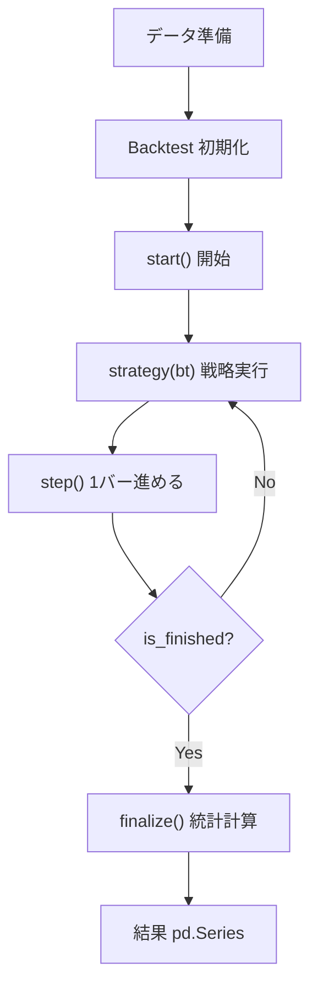

#  BackcastPro ドキュメント

BackcastProは、トレーディング戦略のためのPythonバックテストライブラリです。
**リプレイ型シミュレーター**で、1バーずつ時間を進めながらチャートと売買を可視化できます。

## ドキュメント一覧

### ユーザー向けドキュメント

- **[チュートリアル](tutorial.md)** - 基本的な使い方を学ぶ
- **[トラブルシューティング](troubleshooting.md)** - よくある問題と解決方法

### 開発者向けドキュメント

- **[開発者ガイド](developer-guide.md)** - 開発に参加するための情報
- **[約定ロジック分析レポート](execution-logic-report.md)** - 売買約定時の価格決定ロジック詳細
- **[PyPIへのデプロイ方法](how-to-deploy-to-PyPI.md)** - パッケージの配布方法

### サンプルコード

- **[サンプル集](examples/)** - 実用的な戦略の例
  - [marimoリプレイシミュレーター](examples/marimo_replay.py) - スライダーで時間操作
  - [SMAクロス戦略ユーティリティ](examples/SmaCross.py) - 移動平均計算

## クイックスタート

```python
import yfinance as yf
from BackcastPro import Backtest

# データを取得
code = '7203.T'  # トヨタ（東証）
df = yf.download(code, period='1y')

# バックテストを初期化
bt = Backtest(data={code: df}, cash=10000)

# 戦略関数を定義
def my_strategy(bt):
    if bt.position == 0:
        bt.buy(tag="entry")

# 一括実行
results = bt.run_with_strategy(my_strategy)
print(results)
```

## 主な機能

- **リプレイ型シミュレーター**: `step()` で1バーずつ進めながらチャート確認
- **シンプルな戦略実装**: 関数ベースで `buy()` / `sell()` を呼ぶだけ
- **統計の自動計算**: 代表的なパフォーマンス指標を同梱
- **リスク管理**: `sl` と `tp` に標準対応
- **可視化**: `chart()` で plotly ローソク足チャート生成
- **marimo連携**: スライダーで時間を操作しながらリアルタイム可視化



## API 概要

### メソッド

| メソッド | 説明 |
|---------|------|
| `start()` | バックテスト開始 |
| `step()` | 1バー進める |
| `reset()` | 最初からやり直し |
| `goto(step, strategy)` | 指定位置まで進める |
| `buy(code, size, tag, ...)` | 買い注文 |
| `sell(code, size, tag, ...)` | 売り注文 |
| `chart(code)` | チャート生成 |
| `finalize()` | 統計計算 |
| `run_with_strategy(func)` | 一括実行 |

### プロパティ

| プロパティ | 説明 |
|-----------|------|
| `data` | 現在時点までのデータ |
| `position` | ポジションサイズ（全銘柄合計） |
| `position_of(code)` | 指定銘柄のポジション |
| `equity` | 現在の資産 |
| `cash` | 現在の現金 |
| `current_time` | 現在の日時 |
| `progress` | 進捗率（0.0〜1.0） |
| `is_finished` | 完了フラグ |
| `trades` | アクティブな取引 |
| `closed_trades` | 決済済み取引 |
| `orders` | 未約定の注文 |

## サポート

- **GitHub Issues**: バグ報告や機能要求
- **Discord**: コミュニティでの質問
- **ドキュメント**: 詳細な使用方法の確認

## ライセンス

MIT License - 詳細は[LICENSE](../LICENSE)を参照してください。
