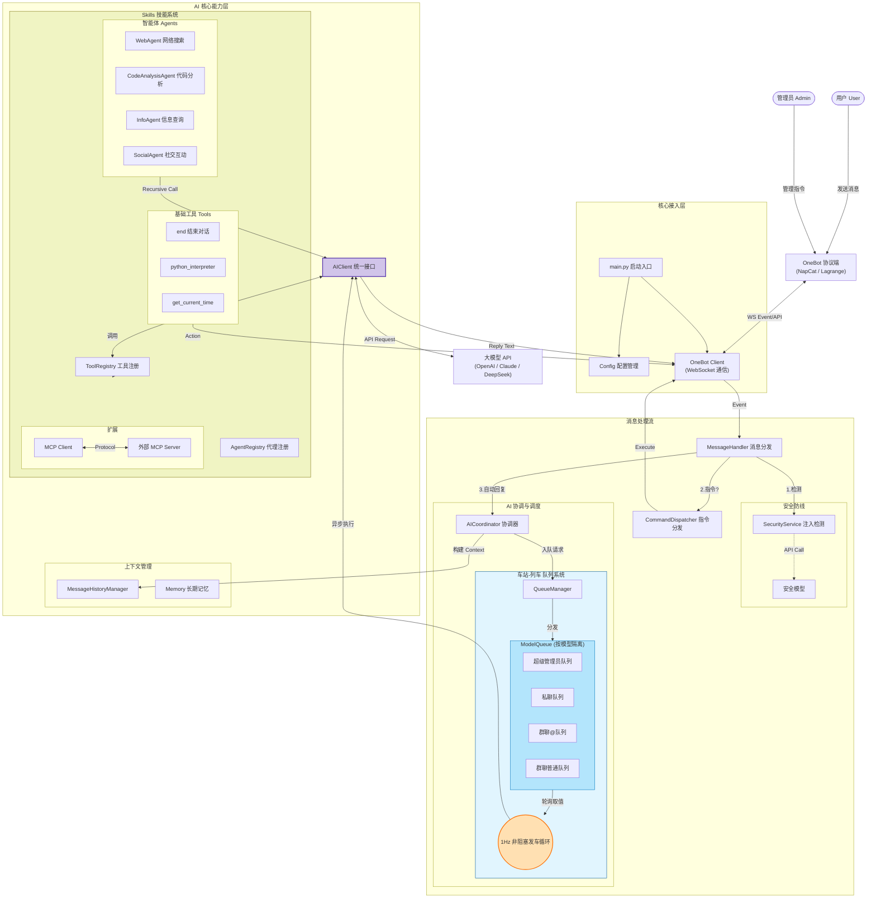

<table border="0">
  <tr>
    <td width="70%" valign="top">
      <div align="center">
        <h1>Undefined</h1>
        <em>A high-performance, highly scalable QQ group and private chat robot based on a self-developed architecture.</em>
        <br/><br/>
        <a href="https://www.python.org/"></a>
        <a href="LICENSE"></a>
        <a href="https://deepwiki.com/69gg/Undefined"></a>
        <br/><br/>
        <p>大鹏一日同风起，扶摇直上九万里。</p>
      </div>
      <h3>项目简介</h3>
      <p>
        <strong>Undefined</strong> 是一个功能强大的 QQ 机器人平台，采用全新的 <strong>自研 Skills</strong> 架构。基于现代 Python 异步技术栈构建，它不仅提供基础的对话能力，更通过内置的多个智能 Agent 实现代码分析、网络搜索、娱乐互动等多模态能力。
      </p>
    </td>
    <td width="30%">
      
    </td>
  </tr>
</table>

### _与 [NagaAgent](https://github.com/Xxiii8322766509/NagaAgent) 进行联动！_

---

<details>
<summary><b>目录</b></summary>

- [立即体验](#立即体验)
- [核心特性](#核心特性)
- [安装与部署](#安装与部署)
  - [源码部署（开发/使用）](#源码部署开发使用)
  - [配置说明](#配置说明)
  - [MCP 配置](#mcp-配置)
- [技术架构](#技术架构)
  - [Skills 插件系统](#skills-插件系统)
  - ["车站-列车" 队列模型](#车站-列车-队列模型)
- [使用说明](#使用说明)
  - [开始使用](#开始使用)
  - [Agent 能力展示](#agent-能力展示)
  - [管理员命令](#管理员命令)
- [扩展与开发](#扩展与开发)
- [致谢与友链](#致谢与友链)
- [开源协议](#开源协议)

</details>

---

## 立即体验

[点击添加官方实例QQ](https://qm.qq.com/q/cvjJoNysGA)

## 核心特性

- **Skills 架构**：全新设计的技能系统，将基础工具（Tools）与智能代理（Agents）分层管理，支持自动发现与注册。
- **Skills 热重载**：自动扫描 `skills/` 目录，检测到变更后即时重载工具与 Agent，无需重启服务。
- **并行工具执行**：无论是主 AI 还是子 Agent，均支持 `asyncio` 并发工具调用，大幅提升多任务处理速度（如同时读取多个文件或搜索多个关键词）。
- **智能 Agent 矩阵**：内置多个专业 Agent，分工协作处理复杂任务。
- **Agent 自我介绍自动生成**：启动时按 Agent 代码/配置 hash 生成 `intro.generated.md`（第一人称、结构化），与 `intro.md` 合并后作为描述；减少手动维护，保持能力说明与实现同步，有助于精准调度。
- **请求上下文管理**：基于 Python `contextvars` 的统一请求上下文系统，自动 UUID 追踪，零竞态条件，完全的并发隔离。
- **定时任务系统**：支持 Crontab 语法的强大定时任务系统，可自动执行各种操作（如定时提醒、定时搜索）。
- **MCP 协议支持**：支持通过 MCP (Model Context Protocol) 连接外部工具和数据源，扩展 AI 能力。
- **Agent 私有 MCP**：可为单个 agent 提供独立 MCP 配置，按调用即时加载并释放，工具仅对该 agent 可见。
- **思维链支持**：支持开启思维链，提升复杂逻辑推理能力。
- **高并发架构**：基于 `asyncio` 全异步设计，支持多队列消息处理与工具并发执行，轻松应对高并发场景。
- **异步安全 I/O**：建立统一 IO 层，通过线程池和文件锁（`flock`）确保底层磁盘操作永不阻塞主事件循环，彻底杜绝死锁。
- **安全防护**：内置独立的安全模型，实时检测注入攻击与恶意内容。
- **OneBot 协议**：完美兼容 OneBot V11 协议，支持多种前端实现（如 NapCat）。

## 安装与部署

我们将持续优化安装体验。目前推荐使用源码部署，方便进行个性化配置和二次开发。

### 源码部署（开发/使用）

#### 1. 克隆项目

由于项目中使用了 `NagaAgent` 作为子模块，请使用以下命令克隆项目：

```bash
git clone --recursive https://github.com/69gg/Undefined.git
cd Undefined
```

如果已经克隆了项目但没有初始化子模块：

```bash
git submodule update --init --recursive
```

#### 2. 安装依赖

推荐使用 `uv` 进行现代化的 Python 依赖管理（速度极快）：

```bash
# 安装 uv (如果尚未安装)
pip install uv

# 同步依赖
uv sync
```

同时需要安装 Playwright 浏览器内核（用于网页浏览功能）：

```bash
uv run playwright install
```

#### 3. 配置环境

复制示例配置文件 `.env.example` 为 `.env` 并填写你的配置信息。

```bash
cp .env.example .env
```

#### 4. 启动运行

```bash
uv run -m Undefined
```

### 配置说明

在 `.env` 文件中配置以下核心参数：

- **基础配置**：`BOT_QQ` (机器人QQ), `SUPERADMIN_QQ` (超级管理员QQ), `ONEBOT_WS_URL` (OneBot连接地址)
- **模型配置**：支持配置不同的模型服务商。
  - `CHAT_MODEL_*`：主对话模型（负责回复消息）
  - `VISION_MODEL_*`：视觉识别模型（负责识图）
  - `AGENT_MODEL_*`：Agent 专用模型（建议使用推理能力更强的模型）
  - `SECURITY_MODEL_*`：安全审核模型（负责防注入检测）
- **功能配置**：`LOG_LEVEL`, `LOG_FILE_PATH`, `LOG_MAX_SIZE_MB`, `LOG_BACKUP_COUNT`
- **Skills 热重载**：`SKILLS_HOT_RELOAD`, `SKILLS_HOT_RELOAD_INTERVAL`, `SKILLS_HOT_RELOAD_DEBOUNCE`
- **代理设置（可选）**：`USE_PROXY`, `http_proxy`, `https_proxy`（兼容 `HTTP_PROXY/HTTPS_PROXY`）

> 启动项目需要 OneBot 协议端，推荐使用 [NapCat](https://napneko.github.io/) 或 [Lagrange.Core](https://github.com/LagrangeDev/Lagrange.Core)。

### MCP 配置

Undefined 支持 **MCP (Model Context Protocol)** 协议，可以连接外部 MCP 服务器来无限扩展 AI 的能力（如访问文件系统、数据库、Git 等）。

1. 复制配置示例：`cp config/mcp.json.example config/mcp.json`
2. 编辑 `config/mcp.json`，添加你需要的 MCP 服务器。
3. 确保 `.env` 中指定了路径：`MCP_CONFIG_PATH=config/mcp.json`

**示例：文件系统访问**

```json
{
  "mcpServers": {
    "filesystem": {
      "command": "npx",
      "args": ["-y", "@modelcontextprotocol/server-filesystem", "/path/to/files"]
    }
  }
}
```

更多资源请访问 [MCP 官方文档](https://modelcontextprotocol.io/) 或 [mcp.so](https://mcp.so) 发现更多服务器。

#### Agent 私有 MCP（可选）

除了全局 MCP 配置外，每个 agent 也支持单独的 MCP 配置文件。若存在，将在调用该 agent 时**临时加载**，并在调用结束后释放，工具仅对该 agent 可见（工具名为 MCP 原始名称，无额外前缀）。此方式无需设置 `MCP_CONFIG_PATH`。

- 路径：`src/Undefined/skills/agents/<agent_name>/mcp.json`
- 示例：`web_agent` 已预置 Playwright MCP（用于网页浏览/截图类能力）

```json
{
  "mcpServers": {
    "playwright": {
      "command": "npx",
      "args": ["@playwright/mcp@latest"]
    }
  }
}
```

## 技术架构

以下是 Undefined 的系统架构全景图：



### Skills 插件系统

Undefined 的核心能力源自其强大的插件系统，位于 `src/Undefined/skills`：

- **Tools (基础工具)**：原子化的功能单元，如 `send_message`, `get_history`。
- **Agents (智能体)**：具有特定人设和任务的 AI 实体，如 `search_agent` (搜索), `code_agent` (代码)。
- **Toolsets (复合工具集)**：一组相关功能的集合，支持动态加载。

插件系统支持 **延迟加载 + 热重载**：`handler.py` 仅在首次调用时导入；当 `skills/` 下的 `config.json`/`handler.py` 发生变更时会自动重新加载。

热重载配置（可选）：

- `SKILLS_HOT_RELOAD`：`true/false`（默认 `true`）
- `SKILLS_HOT_RELOAD_INTERVAL`：扫描间隔（秒，默认 `2.0`）
- `SKILLS_HOT_RELOAD_DEBOUNCE`：去抖时间（秒，默认 `0.5`）

#### Agent 自我介绍自动生成

系统会在启动时检测 Agent 代码或配置的变更（hash 对比），自动生成 `intro.generated.md` 并与 `intro.md` 合并为最终描述：

- **稳定一致**：统一的结构化自我介绍格式，避免各 Agent 文档风格不一。
- **自动同步**：代码变更时自动更新说明，防止能力描述过期。
- **易于定制**：提示词位于 `res/prompts/agent_self_intro.txt`，可按需调整口径。

相关配置项（可选）：

- `AGENT_INTRO_AUTOGEN_ENABLED`：是否开启自动生成（默认 `true`）
- `AGENT_INTRO_AUTOGEN_QUEUE_INTERVAL`：队列处理间隔（秒，默认 `1.0`）
- `AGENT_INTRO_AUTOGEN_MAX_TOKENS`：生成最大 token（默认 `700`）
- `AGENT_INTRO_HASH_PATH`：hash 缓存路径（默认 `.cache/agent_intro_hashes.json`）

### "车站-列车" 队列模型

针对高并发消息处理，Undefined 实现了全新的 **ModelQueue** 调度机制：

*   **多模型隔离**：每个 AI 模型拥有独立的请求队列组（"站台"），互不干扰。
*   **非阻塞发车**：实现了 **1Hz** 的非阻塞调度循环（"列车"）。每秒钟列车都会准时出发，带走一个请求到后台异步处理。
*   **高可用性**：即使前一个请求仍在处理（如耗时的网络搜索），新的请求也会按时被分发，不会造成队列堵塞。
*   **优先级管理**：支持四级优先级，确保管理员指令和私聊消息优先响应。

### 统一 IO 层与异步存储

Undefined 采用严苛的异步安全策略来处理持久化数据：

-   **统一 IO 工具** (`src/Undefined/utils/io.py`)：任何涉及磁盘读写的操作（JSON 读写、行追加）都必须通过该层，内部使用 `asyncio.to_thread` 将阻塞调用移出主线程。
-   **内核级文件锁**：引入 `flock` 机制。在高并发写入 Token 记录或记忆时，系统会自动进行排队并保持原子性，避免文件损坏或主循环假死。
-   **存储组件异步化**：所有核心存储类（Memory, FAQ, Tasks）现已全面提供异步接口，确保机器人响应不受磁盘延迟影响。

## 使用说明

### 开始使用

1. 启动 OneBot 协议端（如 NapCat）并登录 QQ。
2. 配置好 `.env` 并启动 Undefined。
3. 连接成功后，机器人即可在群聊或私聊中响应。

### Agent 能力展示

机器人通过自然语言理解用户意图，自动调度相应的 Agent：

*   **网络搜索**："搜索一下 DeepSeek 的最新动态"
*   **代码分析**："分析 src/main.py 的代码逻辑"
*   **娱乐互动**："画一张赛博朋克风格的猫"
*   **定时任务**："每天早上 8 点提醒我看新闻"

### 管理员命令

在群聊或私聊中使用以下指令（需要管理员权限）：

```bash
/help               # 查看帮助菜单
/lsadmin            # 查看管理员列表
/addadmin <QQ>      # 添加管理员（仅超级管理员）
/rmadmin <QQ>       # 移除管理员
/bugfix <QQ>        # 生成指定用户的 Bug 修复报告
```

## 扩展与开发

Undefined 欢迎开发者参与共建！

*   **目录结构**:
    ```
    src/Undefined/
    ├── skills/        # 技能插件核心目录
    ├── services/      # 核心服务 (Queue, Command, Security)
    ├── utils/         # 通用工具
    ├── ai.py          # AI 交互层
    └── handlers.py    # 消息处理层
    ```

*   **开发指南**: 请参考 [src/Undefined/skills/README.md](src/Undefined/skills/README.md) 了解如何编写新的工具和 Agent。

## 致谢与友链

### NagaAgent

本项目集成 **NagaAgent** 子模块。Undefined 诞生于 NagaAgent 社区，感谢作者及社区的支持。

> [NagaAgent - A simple yet powerful agent framework.](https://github.com/Xxiii8322766509/NagaAgent)

## 开源协议

本项目遵循 [MIT License](LICENSE) 开源协议。

<div align="center">
  <strong>⭐ 如果这个项目对您有帮助，请考虑给我们一个 Star</strong>
</div>
