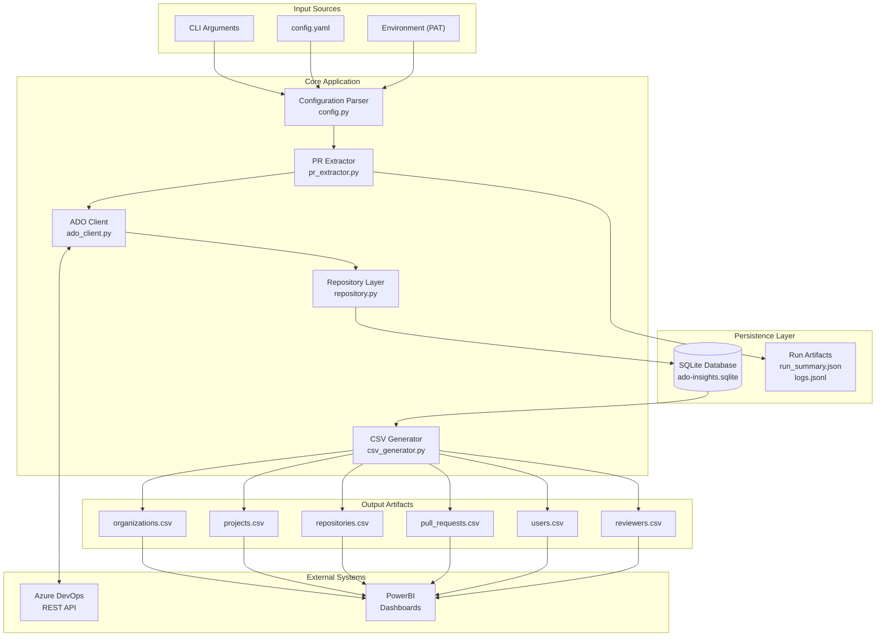
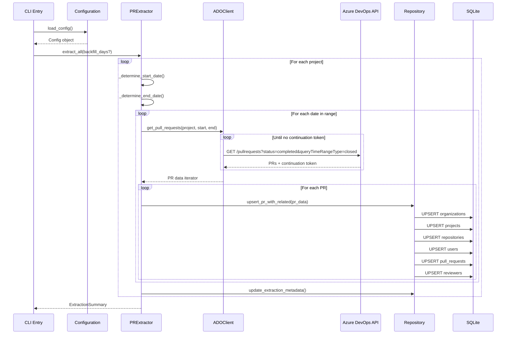
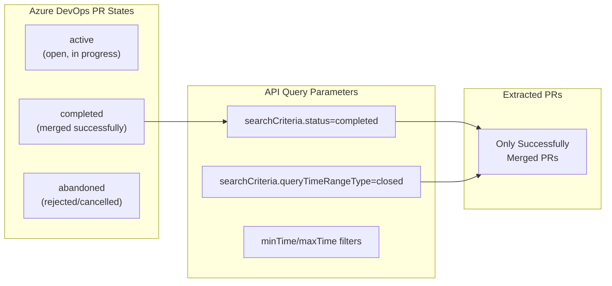
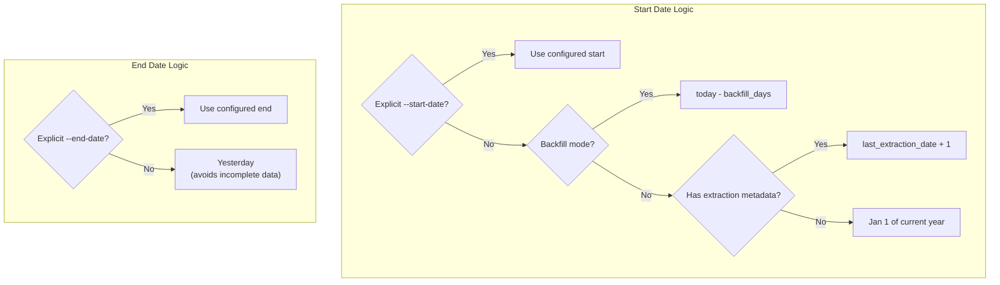
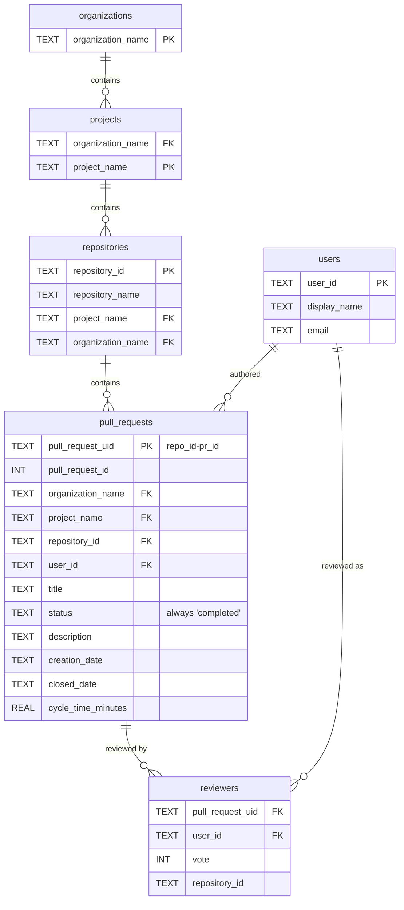
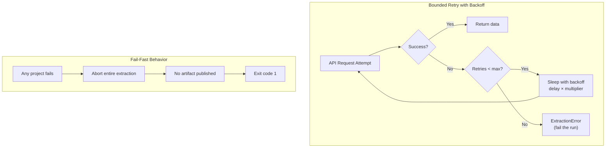
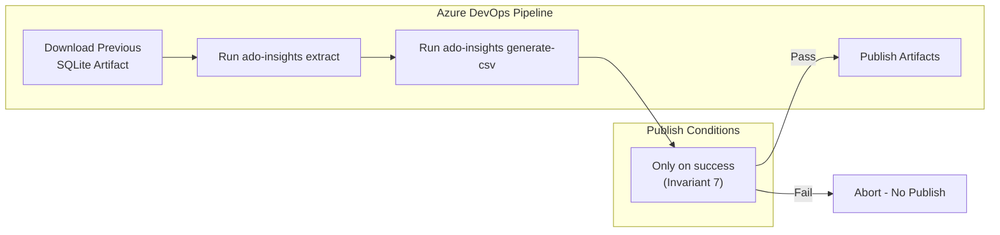

# Application Flow Diagram

This document visualizes the complete data flow and architecture of ado-git-repo-insights.

## High-Level Data Flow



## Extraction Pipeline Detail



## PR Status Filtering Logic

> **Critical Distinction: "Completed" vs "Closed"**



### Terminology Clarification

| Term | Meaning in Azure DevOps | Usage in This Tool |
|------|------------------------|-------------------|
| **status=completed** | PR was successfully merged into the target branch | ✅ **Primary filter** - Only fetches merged PRs |
| **status=abandoned** | PR was closed without merging | ❌ Not extracted |
| **status=active** | PR is still open | ❌ Not extracted |
| **queryTimeRangeType=closed** | Use `closedDate` field for date filtering | ✅ **Date range filter** - Queries by when PR was closed |
| **closedDate** | Timestamp when PR reached a terminal state (completed OR abandoned) | ✅ Used for date range and cycle time calculation |

**Key Insight**: The API URL in `ado_client.py` line 245-252 uses:
```
?searchCriteria.status=completed
&searchCriteria.queryTimeRangeType=closed
&searchCriteria.minTime={date}T00:00:00Z
&searchCriteria.maxTime={date}T23:59:59Z
```

This means:
1. **status=completed** → Only PRs that were merged (not abandoned)
2. **queryTimeRangeType=closed** → Filter by the `closedDate` timestamp
3. Combined: **Only merged PRs, filtered by their closure date**

## Date Range Defaults



## Data Model (SQLite → CSV)



## Retry and Error Handling



## Pipeline Integration



---

## Summary

This tool extracts **only successfully merged (completed) Pull Requests** from Azure DevOps, filtered by their **closure date**. The distinction between "completed" and "closed" is crucial:

- **Completed** = PR status (merged successfully) → This is what we filter for
- **Closed** = Temporal filter type (use closedDate for date range) → This is how we filter by date

The combination ensures we capture all merged PRs within a date range, enabling accurate cycle time calculations and PowerBI analytics.
