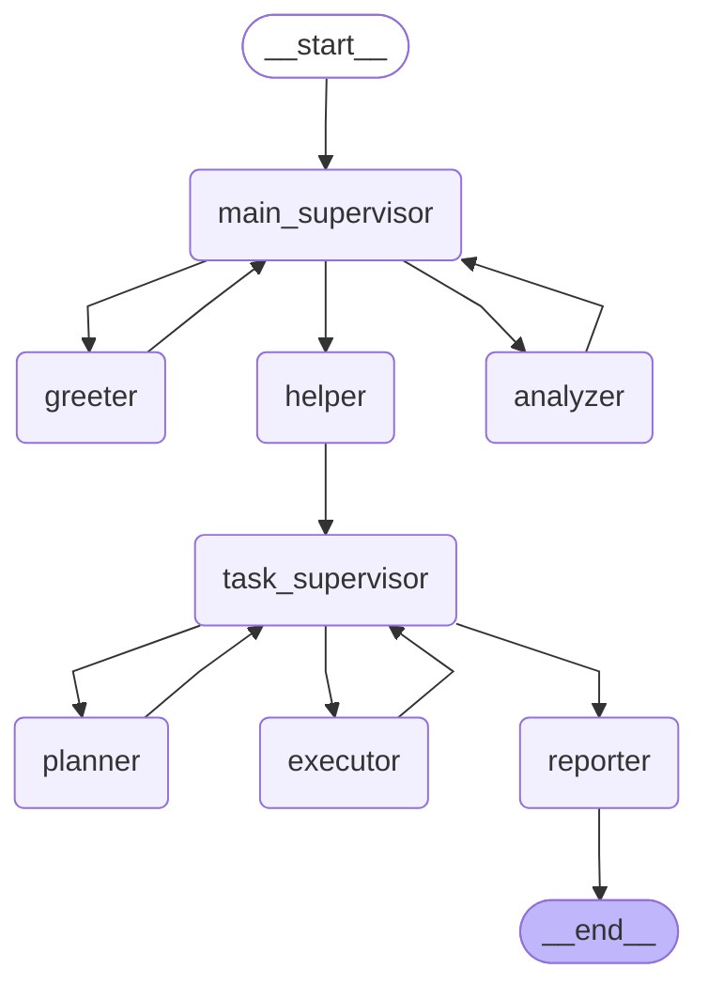
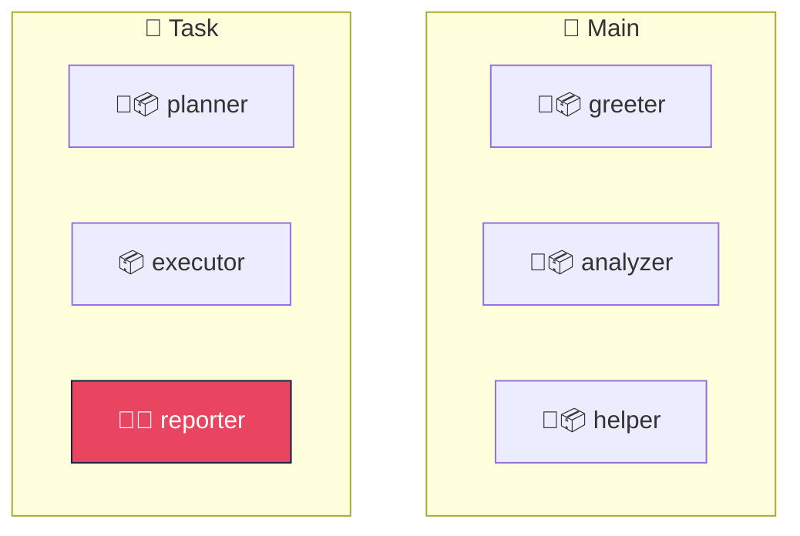
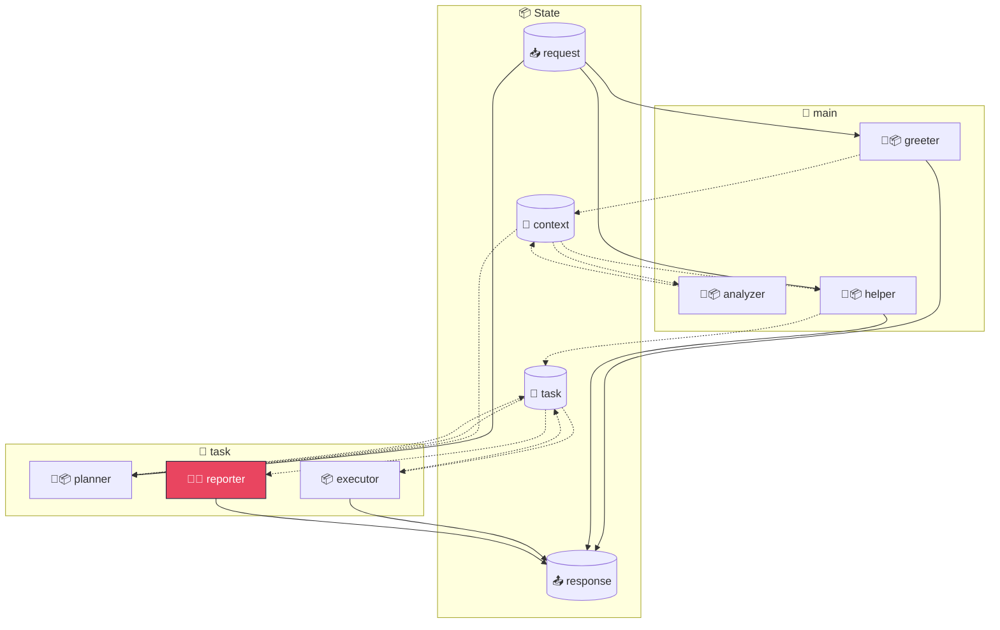
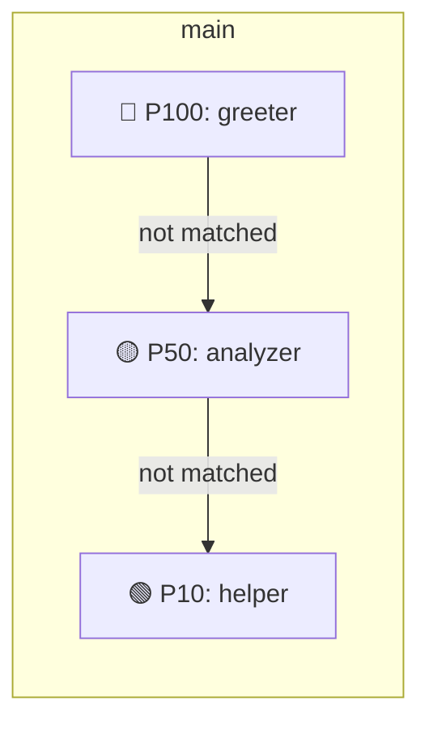
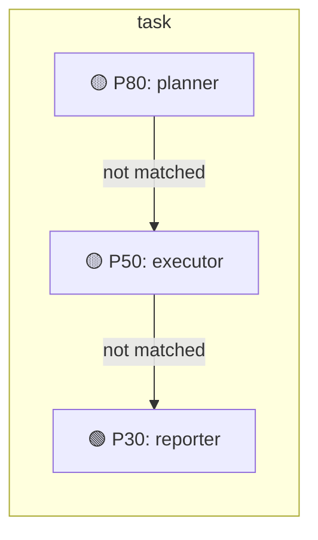

# 🏗️ Agent Architecture

> Auto-generated from `NodeRegistry` contracts

---

## 🔗 LangGraph Node Flow

> Auto-generated from compiled LangGraph

---

## 📦 State Slices

State is organized into isolated **slices** for separation of concerns.

| Slice | Read By | Written By |
|:------|:--------|:-----------|
| `context` | `analyzer`, `helper`, `planner` | `greeter`, `analyzer` |
| `request` | `greeter`, `helper`, `planner` | - |
| `response` | - | `greeter`, `helper`, `executor`, `reporter` |
| `task` | `planner`, `executor`, `reporter` | `helper`, `planner`, `executor` |

---

## 🎯 System Hierarchy

---

## 🔀 Data Flow

> Key data paths through the system

📊 Detailed Node Dependencies

**main**

| Node | Depends On (via shared slices) |
|:-----|:-------------------------------|
| `analyzer` | `greeter` (context) |
| `helper` | `greeter` (context), `analyzer` (context) |

**task**

| Node | Depends On (via shared slices) |
|:-----|:-------------------------------|
| `planner` | `greeter` (context), `analyzer` (context), `helper` (task), `executor` (task) |
| `executor` | `helper` (task), `planner` (task) |
| `reporter` | `helper` (task), `planner` (task), `executor` (task) |

---

## ⚡ Trigger Hierarchy

> Nodes are evaluated by **priority** (highest first)

### 🎯 Main

| Priority | Node | Condition | Hint |
|:--------:|:-----|:----------|:-----|
| 🔴 **100** | `greeter` | `request.action=greet` | Handle greeting |
| 🟡 **50** | `analyzer` | `context.needs_analysis=true` | Run analysis |
| 🟢 **10** | `helper` | _(always)_ | General assistance |

📊 main Priority Chain

### 🎯 Task

| Priority | Node | Condition | Hint |
|:--------:|:-----|:----------|:-----|
| 🟡 **80** | `planner` | `task.needs_planning=true` | Create plan |
| 🟡 **50** | `executor` | `task.plan_ready=true` | Execute tasks |
| 🟢 **30** | `reporter` | `task.execution_done=true` | Generate report |

📊 task Priority Chain

---

## 📚 Nodes Reference

| Node | Supervisor | Reads | Writes | LLM | Terminal |
|:-----|:-----------|:------|:-------|:---:|:--------:|
| `analyzer` | main | `context` | `context` | ✅ |  |
| `executor` | task | `task` | `task`, `response` |  |  |
| `greeter` | main | `request` | `context`, `response` | ✅ |  |
| `helper` | main | `request`, `context` | `task`, `response` | ✅ |  |
| `planner` | task | `request`, `context`, `task` | `task` | ✅ |  |
| `reporter` | task | `task` | `response` | ✅ | 🔚 |

🔍 Legend

- ✅ = Requires LLM
- 🔚 = Terminal node (exits to END)
- Reads/Writes = State slices accessed

---

Generated by `agent-contracts` visualizer