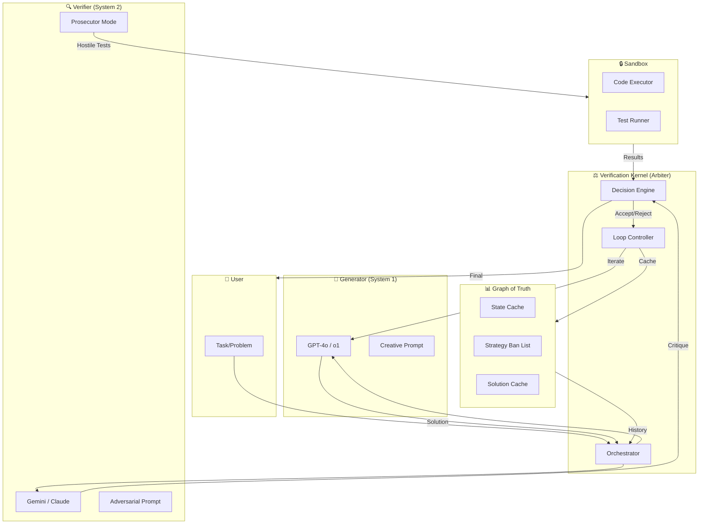
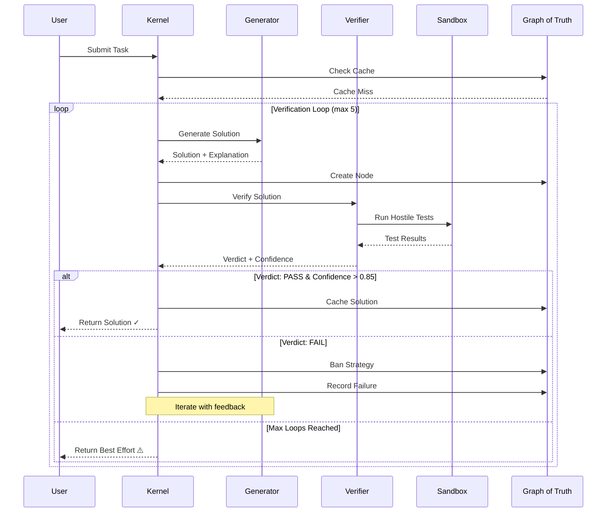
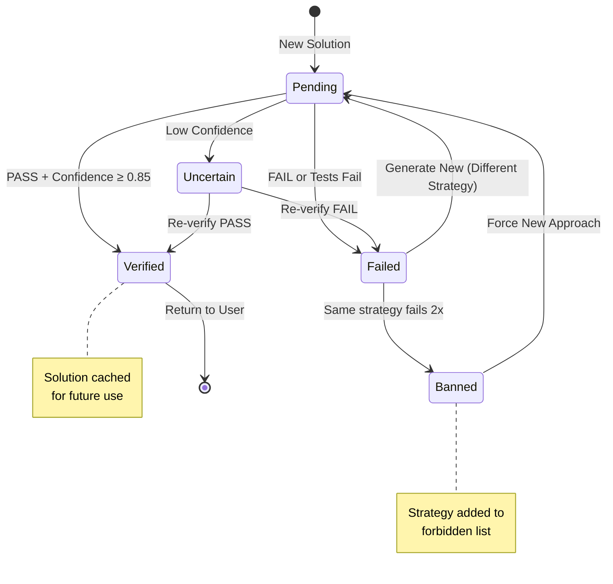

# CMVK Architecture Diagrams

This document contains diagrams for the Cross-Model Verification Kernel paper and documentation.
Diagrams are provided in multiple formats: Mermaid (for GitHub rendering), ASCII (for terminals), and descriptions for draw.io/Lucidchart export.

## 1. High-Level Architecture

### Mermaid Diagram



### ASCII Diagram (for terminals/plain text)

```
┌──────────────────────────────────────────────────────────────────────┐
│                        VERIFICATION KERNEL                            │
│                          (The Arbiter)                                │
│  ┌─────────────┐    ┌──────────────┐    ┌─────────────────┐          │
│  │ Orchestrator│───▶│Loop Controller│───▶│ Decision Engine │          │
│  └─────────────┘    └──────────────┘    └─────────────────┘          │
└────────┬─────────────────────┬───────────────────┬───────────────────┘
         │                     │                   │
         ▼                     ▼                   ▼
┌────────────────┐    ┌────────────────┐    ┌──────────────┐
│   GENERATOR    │    │    VERIFIER    │    │GRAPH OF TRUTH│
│   (System 1)   │    │   (System 2)   │    │              │
│                │    │                │    │ • State Cache│
│  ┌──────────┐  │    │  ┌──────────┐  │    │ • Ban List   │
│  │ GPT-4o   │  │◀──▶│  │ Gemini   │  │    │ • Solutions  │
│  │ o1       │  │    │  │ Claude   │  │    │              │
│  └──────────┘  │    │  └──────────┘  │    └──────────────┘
│                │    │                │           │
│  High Creativity    │  High Logic    │           │
│  Fast Builder  │    │  Cynical Judge │           │
└────────────────┘    └───────┬────────┘           │
                              │                    │
                              ▼                    │
                     ┌────────────────┐            │
                     │    SANDBOX     │◀───────────┘
                     │                │
                     │ • Code Exec    │
                     │ • Test Runner  │
                     │ • Isolation    │
                     └────────────────┘
```

## 2. Verification Loop Sequence

### Mermaid Sequence Diagram



### ASCII Sequence

```
User          Kernel        Generator      Verifier       Sandbox        Graph
  │             │              │              │              │              │
  │──Task──────▶│              │              │              │              │
  │             │──────────────────────────────────────────▶│ Check Cache  │
  │             │◀─────────────────────────────────────────── Cache Miss   │
  │             │                                                          │
  │             │ ╔══════════════════════════════════════════════════════╗ │
  │             │ ║              VERIFICATION LOOP (1..5)                ║ │
  │             │ ╚══════════════════════════════════════════════════════╝ │
  │             │              │              │              │              │
  │             │──Generate───▶│              │              │              │
  │             │◀──Solution───│              │              │              │
  │             │──────────────────────────────────────────▶│ Create Node  │
  │             │──────────────────Verify────▶│              │              │
  │             │              │              │──Tests──────▶│              │
  │             │              │              │◀──Results────│              │
  │             │◀─────────────────Verdict────│              │              │
  │             │              │              │              │              │
  │             │  [PASS + High Confidence]   │              │              │
  │             │──────────────────────────────────────────▶│ Cache        │
  │◀──Solution──│              │              │              │              │
  │             │              │              │              │              │
  │             │  [FAIL]      │              │              │              │
  │             │──────────────────────────────────────────▶│ Ban Strategy │
  │             │──Feedback───▶│ (Iterate)    │              │              │
  │             │              │              │              │              │
```

## 3. Graph of Truth State Machine

### Mermaid State Diagram



### ASCII State Diagram

```
                              ┌─────────────────┐
                              │    [START]      │
                              └────────┬────────┘
                                       │
                                       ▼
                              ┌─────────────────┐
              ┌──────────────▶│    PENDING      │◀──────────────┐
              │               │  (New Solution) │               │
              │               └────────┬────────┘               │
              │                        │                        │
              │         ┌──────────────┼──────────────┐         │
              │         ▼              ▼              ▼         │
              │  ┌───────────┐  ┌───────────┐  ┌───────────┐   │
              │  │  VERIFIED │  │ UNCERTAIN │  │  FAILED   │   │
              │  │   ✓       │  │    ?      │  │    ✗      │   │
              │  └─────┬─────┘  └─────┬─────┘  └─────┬─────┘   │
              │        │              │              │          │
              │        ▼              │              ▼          │
              │  ┌───────────┐        │       ┌───────────┐    │
              │  │  CACHED   │        │       │  BANNED   │    │
              │  │  (Done)   │        │       │ (Strategy)│    │
              │  └───────────┘        │       └─────┬─────┘    │
              │                       │             │          │
              │                       └─────────────┼──────────┘
              │                                     │
              └─────────────────────────────────────┘
                        (New attempt with different strategy)
```

## 4. Blind Spot Reduction Mathematics

### Probability Diagram

```
┌────────────────────────────────────────────────────────────────────────┐
│                    BLIND SPOT PROBABILITY MODEL                        │
├────────────────────────────────────────────────────────────────────────┤
│                                                                        │
│  Single Model Self-Verification:                                       │
│  ┌──────────────────────────────────────┐                              │
│  │  P(miss) = P(Generator error)        │                              │
│  │          × P(Verifier misses | same) │                              │
│  │          ≈ ε × (1 - α)               │  where α ≈ 0.3 (correlated) │
│  │          ≈ 0.15 × 0.7 = 0.105        │                              │
│  └──────────────────────────────────────┘                              │
│                                                                        │
│  Cross-Model Verification (CMVK):                                      │
│  ┌──────────────────────────────────────┐                              │
│  │  P(miss) = P(Generator error)        │                              │
│  │          × P(Verifier misses | diff) │                              │
│  │          ≈ ε × (1 - β)               │  where β ≈ 0.7 (independent)│
│  │          ≈ 0.15 × 0.3 = 0.045        │                              │
│  └──────────────────────────────────────┘                              │
│                                                                        │
│  Risk Reduction Factor: 0.105 / 0.045 ≈ 2.3x                          │
│                                                                        │
│  ┌─────────────────────────────────────────────────────────────────┐  │
│  │                                                                 │  │
│  │   Same Model:     ████████████████████░░░░░░░  (70% miss rate) │  │
│  │   Cross Model:    ████████░░░░░░░░░░░░░░░░░░░  (30% miss rate) │  │
│  │                                                                 │  │
│  └─────────────────────────────────────────────────────────────────┘  │
│                                                                        │
└────────────────────────────────────────────────────────────────────────┘
```

## 5. Results Comparison Chart (Template)

```
┌────────────────────────────────────────────────────────────────────────┐
│                    HumanEval Pass@1 Results                            │
├────────────────────────────────────────────────────────────────────────┤
│                                                                        │
│  100% ┤                                                                │
│       │                                          ┌───┐                 │
│   95% ┤                              ┌───┐       │███│ 93.1%           │
│       │                  ┌───┐       │███│ 92.4% │███│                 │
│   90% ┤                  │███│ 92.0% │███│       │███│                 │
│       │      ┌───┐       │███│       │███│       │███│                 │
│   85% ┤      │░░░│ 85.2% │███│       │███│       │███│                 │
│       │ ┌───┐│░░░│       │███│       │███│       │███│                 │
│   80% ┤ │░░░││░░░│ 84.1% │███│       │███│       │███│                 │
│       │ │░░░││░░░│       │███│       │███│       │███│                 │
│   75% ┼─┴───┴┴───┴───────┴───┴───────┴───┴───────┴───┴─────────────────│
│         GPT-4o Claude   CMVK       CMVK         CMVK                   │
│         alone  alone   (GPT+Gem)  (GPT+Claude) (o1+Gem)                │
│                                                                        │
│       ░░░ = Baseline (single model)                                    │
│       ███ = CMVK (cross-model verification)                            │
│                                                                        │
└────────────────────────────────────────────────────────────────────────┘
```

## 6. Export Instructions

### For draw.io / diagrams.net

1. Go to [draw.io](https://app.diagrams.net/)
2. Create new diagram
3. Import Mermaid: Arrange → Insert → Advanced → Mermaid
4. Paste the Mermaid code
5. Export as PNG (300 DPI for papers) or SVG

### For Lucidchart

1. Use the ASCII diagrams as reference
2. Recreate using Lucidchart shapes
3. Export as PNG or PDF

### For LaTeX (TikZ)

See `figures/tikz/` directory for TikZ versions of these diagrams.

---

## Color Scheme (for consistent branding)

| Element | Color | Hex |
|---------|-------|-----|
| Generator | Blue | #4A90D9 |
| Verifier | Red/Orange | #E57373 |
| Kernel | Green | #81C784 |
| Graph of Truth | Purple | #9575CD |
| Sandbox | Gray | #90A4AE |
| Success | Green | #4CAF50 |
| Failure | Red | #F44336 |
| Warning | Yellow | #FFC107 |
