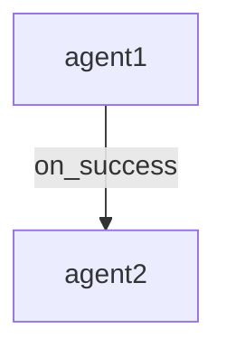

# FSM-Based Agent Crew Implementation

A sophisticated agent orchestration system using **Finite State Machines** for complex workflow management with conditional transitions, error handling, and automatic parallelization.

## 📋 Overview

This implementation extends your existing `AgentCrew` with state machine-based orchestration using [python-statemachine](https://github.com/fgmacedo/python-statemachine), providing:

- ✅ **State-based lifecycle management** for each agent
- ✅ **Conditional transitions** (on_success, on_error, custom predicates)
- ✅ **Automatic retry logic** with configurable limits
- ✅ **Dynamic prompt building** with context-aware templates
- ✅ **Error recovery workflows** with fallback agents
- ✅ **Automatic parallelization** based on dependencies
- ✅ **Workflow visualization** using Mermaid diagrams
- ✅ **Priority-based routing** for complex decision trees

## 📁 Files Included

### Core Implementation
- **`orchestation/fsm.py`** - Main FSM-based AgentCrew implementation
  - `AgentTaskMachine` - Finite state machine for agent lifecycle
  - `FlowNode` - Agent wrapper with state and transitions
  - `FlowTransition` - Transition definition with conditions
  - `AgentCrewFSM` - Main orchestration class

### Examples & Documentation
- **`crew_fsm_examples.py`** - Comprehensive usage examples
  - Sequential workflows with error handling
  - Parallel processing with conditional branching
  - Dynamic prompt building
  - Complex multi-stage pipelines
  - Retry and recovery patterns

- **`test_crew_fsm.py`** - Comprehensive test suite
  - Unit tests for all components
  - Integration tests for workflows
  - Edge case testing
  - Mock agents for testing

## 🚀 Quick Start

### Basic Sequential Workflow

```python
from parrot.bots.orchestration.fsm import AgentCrewFSM

# Create crew
crew = AgentCrewFSM(name="MyWorkflow")

# Add agents
crew.add_agent(researcher)
crew.add_agent(analyzer)
crew.add_agent(writer)

# Define flow
crew.task_flow(researcher, analyzer)
crew.task_flow(analyzer, writer)

# Execute
result = await crew.run_flow("Research AI trends in 2025")
```

### Conditional Branching

```python
# Route based on classification
crew.on_condition(
    source=classifier,
    targets=tech_processor,
    predicate=lambda result: "technical" in result.lower()
)

crew.on_condition(
    source=classifier,
    targets=business_processor,
    predicate=lambda result: "business" in result.lower()
)
```

### Error Handling

```python
# Define main flow
crew.task_flow(processor, analyzer)

# Add error recovery
crew.on_error(
    source=analyzer,
    targets=error_handler,
    instruction="Handle the error and suggest fixes"
)

# Retry after recovery
crew.task_flow(error_handler, analyzer)
```

### Dynamic Prompt Building

```python
def build_custom_prompt(ctx, deps):
    research = deps.get('researcher', '')
    data = deps.get('data_collector', '')

    return f"""Analyze this research with the data:

Research: {research}
Data: {data}

Requirements: {ctx.original_query}"""

crew.task_flow(
    source=[researcher, data_collector],
    targets=analyzer,
    prompt_builder=build_custom_prompt
)
```

## 🔄 Agent Lifecycle States

Each agent progresses through these states:

```
idle → ready → running → completed
                ↓           ↓
              blocked     failed
                           ↓
                         ready (retry)
```

- **idle**: Agent created but not scheduled
- **ready**: Dependencies satisfied, ready to execute
- **running**: Currently executing
- **completed**: Successfully finished
- **failed**: Execution failed
- **blocked**: Cannot proceed (missing dependencies)

## 🎯 Key Features

### 1. Conditional Transitions

Define when transitions should activate:

```python
# Execute on success
crew.on_success(source, target)

# Execute on error
crew.on_error(source, error_handler)

# Execute on custom condition
crew.on_condition(
    source,
    target,
    predicate=lambda result: "keyword" in result
)
```

### 2. Automatic Parallelization

Agents with no dependencies execute in parallel automatically:

```python
# These agents run in parallel (no dependencies)
crew.add_agent(agent1)
crew.add_agent(agent2)
crew.add_agent(agent3)

# All converge to synthesizer
crew.task_flow([agent1, agent2, agent3], synthesizer)
```

### 3. Retry Logic

Configure automatic retries per agent:

```python
crew.add_agent(
    flaky_agent,
    max_retries=3  # Retry up to 3 times on failure
)
```

### 4. Workflow Visualization

Generate Mermaid diagrams of your workflow:

```python
print(crew.visualize_workflow())
```

Output:


### 5. Priority-Based Routing

Control transition evaluation order:

```python
crew.task_flow(source, fast_path, priority=10)    # Evaluated first
crew.task_flow(source, thorough_path, priority=5)  # Evaluated second
crew.task_flow(source, default_path, priority=1)   # Fallback
```

## 📊 Common Workflow Patterns

### Pattern 1: Fan-Out / Fan-In

One agent distributes work to multiple processors:

```python
crew.task_flow(collector, [processor1, processor2, processor3])
crew.task_flow([processor1, processor2, processor3], synthesizer)
```

### Pattern 2: Cascading Error Handlers

Multiple levels of error recovery:

```python
crew.task_flow(primary, final)
crew.on_error(primary, fallback1)
crew.on_error(fallback1, fallback2)
crew.on_error(fallback2, final)
```

### Pattern 3: Multi-Stage Pipeline

Complex processing with validation:

```python
crew.task_flow(stage1, validator1)
crew.on_success(validator1, stage2, instruction="Validation passed")
crew.on_error(validator1, stage1, instruction="Fix validation errors")
```

### Pattern 4: Conditional Routing

Route to different processors based on content type:

```python
crew.on_condition(
    classifier,
    [tech_processor, code_reviewer],
    predicate=lambda r: "technical" in r.lower()
)

crew.on_condition(
    classifier,
    business_analyzer,
    predicate=lambda r: "business" in r.lower()
)
```

## 🔧 Configuration Options

### AgentCrewFSM Constructor

```python
crew = AgentCrewFSM(
    name="MyWorkflow",              # Workflow name
    max_parallel_tasks=10,          # Max concurrent agents
    default_max_retries=3,          # Default retry limit
    execution_timeout=300,          # Timeout in seconds (optional)
    shared_tool_manager=None        # Shared tools (optional)
)
```

### task_flow() Parameters

```python
crew.task_flow(
    source=agent1,                  # Source agent(s)
    targets=agent2,                 # Target agent(s)
    condition=TransitionCondition.ON_SUCCESS,  # When to activate
    instruction="Custom prompt",    # Static instruction
    prompt_builder=my_builder,      # Dynamic prompt function
    predicate=my_condition,         # Custom condition
    priority=5,                     # Evaluation priority
    **metadata                      # Additional metadata
)
```

## 📈 Performance Considerations

### Parallel Execution Tuning

```python
# CPU-bound agents
crew = AgentCrewFSM(max_parallel_tasks=cpu_count())

# I/O-bound agents
crew = AgentCrewFSM(max_parallel_tasks=20-50)
```

### Prompt Builder Performance

Keep prompt builders fast:
- Avoid expensive computations
- Cache results when possible
- Use async only when necessary

### Memory Usage

For large workflows (100+ agents):
- Consider clearing old results periodically
- Use streaming for large data
- Implement custom cleanup logic

## 🧪 Testing

Run the test suite:

```bash
pytest test_crew_fsm.py -v
```

Run specific test:

```bash
pytest test_crew_fsm.py::test_simple_sequential_execution -v
```

## 📚 Examples

See `crew_fsm_examples.py` for comprehensive examples:

1. **Sequential with Error Handling** - Basic workflow with recovery
2. **Parallel Conditional** - Conditional branching with parallel processing
3. **Dynamic Prompts** - Context-aware prompt building
4. **Complex Pipeline** - Multi-stage workflow with validation
5. **Retry and Recovery** - Automatic retry logic demonstration

Run all examples:

```bash
python crew_fsm_examples.py
```

## 🔍 Debugging and Monitoring

### Validate Workflow

Check for circular dependencies before execution:

```python
await crew.validate_workflow()
```

### Visualize Workflow

Generate and view workflow diagram:

```python
mermaid_diagram = crew.visualize_workflow()
print(mermaid_diagram)
```

### Get Statistics

Monitor execution metrics:

```python
stats = crew.get_workflow_stats()
print(f"Completed: {stats['states']['completed']}")
print(f"Failed: {stats['states']['failed']}")
```

### Execution Log

Review detailed execution log:

```python
result = await crew.run_flow(task)

for log in result['execution_log']:
    print(f"{log['agent_name']}: {log['execution_time']:.2f}s")
```

## 🆚 Comparison with AgentCrew

| Feature | AgentCrew | AgentCrewFSM |
|---------|-----------|--------------|
| Sequential execution | ✓ | ✓ |
| Parallel execution | ✓ | ✓ |
| DAG-based flow | ✓ | ✓ |
| State machine lifecycle | ✗ | ✓ |
| Conditional transitions | ✗ | ✓ |
| Error recovery | ✗ | ✓ |
| Automatic retries | ✗ | ✓ |
| Custom prompt builders | ✗ | ✓ |
| Workflow visualization | ✗ | ✓ |
| Priority-based routing | ✗ | ✓ |

## 🎓 Best Practices

1. **Use descriptive agent names** - Makes debugging easier
2. **Validate workflows** - Call `validate_workflow()` before production
3. **Set appropriate retry limits** - Balance cost vs. reliability
4. **Monitor execution** - Use logs and stats for optimization
5. **Keep prompt builders simple** - Extract complex logic to separate agents
6. **Test workflows thoroughly** - Use the provided test suite as a template
7. **Visualize before deploying** - Review workflow diagrams for logic errors

## 🐛 Troubleshooting

### Workflow Gets Stuck

**Symptom**: RuntimeError about stuck workflow

**Solutions**:
- Check for missing transitions
- Verify dependencies are satisfiable
- Look for agents with no outgoing transitions
- Run `validate_workflow()` to check for cycles

### Agents Not Parallel

**Symptom**: Sequential execution when expecting parallel

**Solutions**:
- Check for unintended dependencies
- Verify `max_parallel_tasks` setting
- Review `task_flow()` calls

### Error Handlers Not Triggering

**Symptom**: `on_error()` transitions not activating

**Solutions**:
- Verify agent is actually failing
- Check error transition priority
- Review execution log for details

## 📄 License

This implementation is part of the AI-parrot library. See your existing license.

## 🤝 Contributing

When extending this implementation:

1. Add tests to `test_crew_fsm.py`
2. Update examples in `crew_fsm_examples.py`
3. Document new features in this README
4. Update the migration guide if needed

## 📞 Support

For issues or questions:
1. Check the migration guide
2. Review the examples
3. Run the test suite
4. Check execution logs and visualization

---

**Built with ❤️ for sophisticated agent orchestration**
