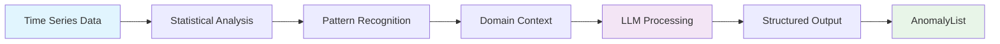
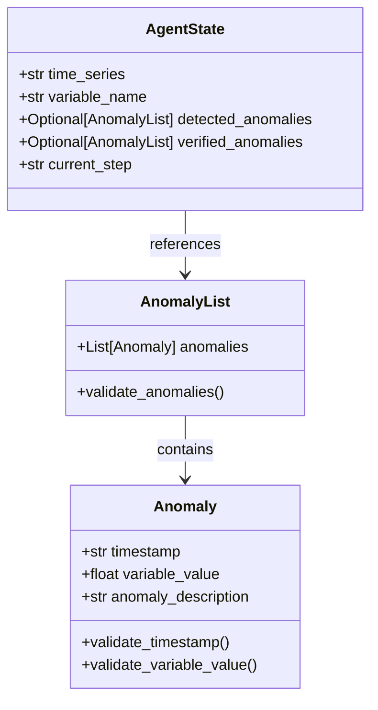
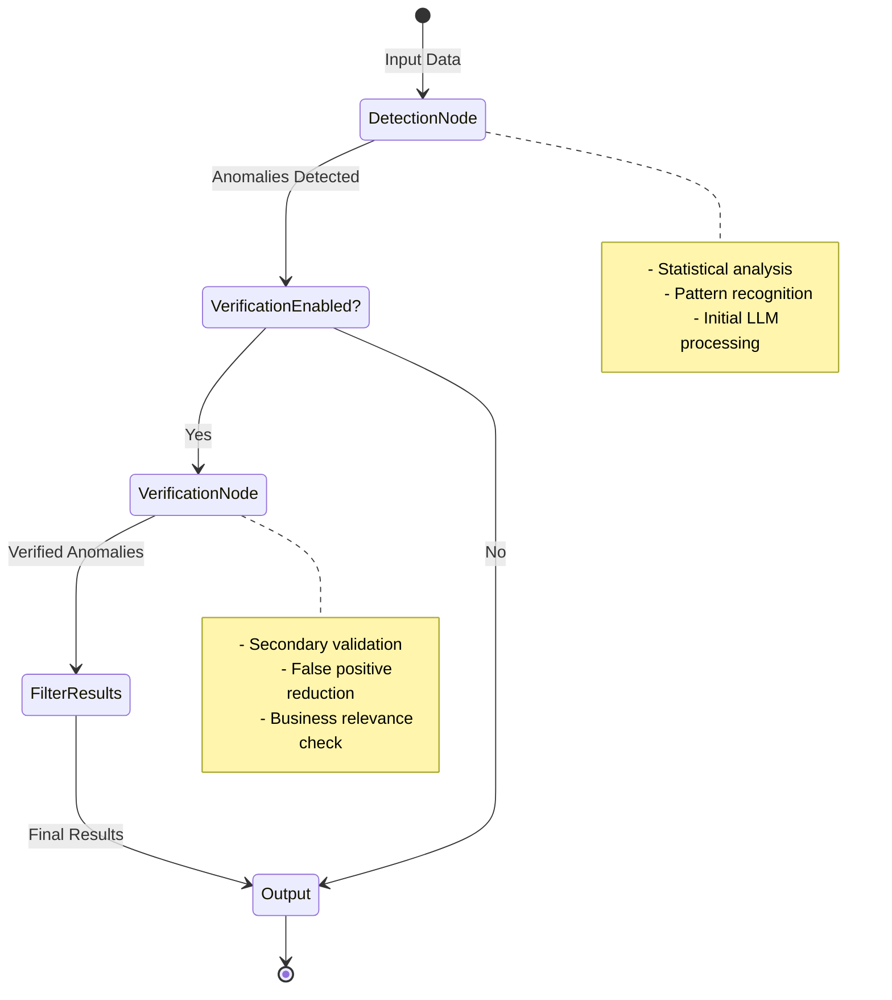
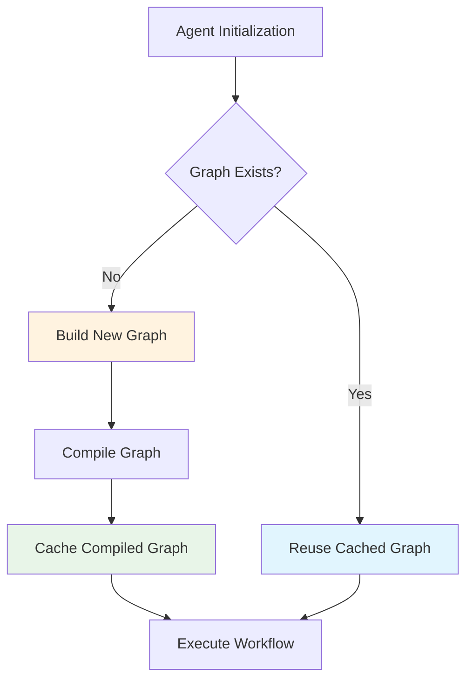
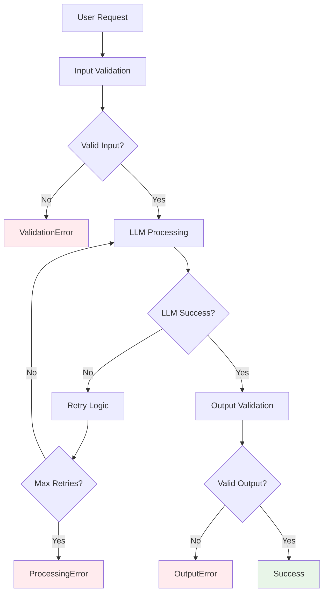

# 🏗️ Architecture Documentation

This document provides a detailed technical overview of the Anomaly Agent's internal architecture, design patterns, and implementation details.

## 📋 Table of Contents

- [🎯 Core Architecture](#-core-architecture)
- [🔧 Component Deep Dive](#-component-deep-dive)
- [📊 Data Models](#-data-models)
- [🔄 Workflow Engine](#-workflow-engine)
- [⚡ Performance Optimizations](#-performance-optimizations)
- [🛡️ Error Handling](#️-error-handling)
- [🔮 Future Architecture](#-future-architecture)

## 🎯 Core Architecture

The Anomaly Agent is built on a modern, modular architecture that separates concerns while maintaining high performance and reliability.

### 🏛️ Architectural Patterns

```mermaid
graph TD
    subgraph "Application Layer"
        A[AnomalyAgent] --> B[detect_anomalies()]
        A --> C[get_anomalies_df()]
    end
    
    subgraph "Workflow Layer"
        B --> D[LangGraph StateGraph]
        D --> E[Detection Node]
        D --> F[Verification Node]
        D --> G[Conditional Routing]
    end
    
    subgraph "Data Layer"
        E --> H[Pydantic Models]
        F --> H
        H --> I[AnomalyList]
        H --> J[Anomaly]
        H --> K[AgentState]
    end
    
    subgraph "LLM Layer"
        E --> L[ChatOpenAI]
        F --> L
        L --> M[Structured Output]
    end
    
    style A fill:#e1f5fe
    style D fill:#f3e5f5
    style H fill:#fff3e0
    style L fill:#e8f5e8
```

### 🎨 Design Principles

1. **🔧 Separation of Concerns**: Clear boundaries between workflow, data validation, and LLM interaction
2. **📈 Scalability**: Stateless design allows for horizontal scaling and concurrent processing
3. **🛡️ Type Safety**: Comprehensive Pydantic validation ensures data integrity throughout
4. **⚡ Performance**: Optimized graph compilation and caching for minimal overhead
5. **🔄 Extensibility**: Modular node architecture supports easy feature additions

## 🔧 Component Deep Dive

### 🤖 AnomalyAgent Class

The main entry point providing a clean, user-friendly API while orchestrating the complex internal workflow.

```python
class AnomalyAgent:
    """Agent for detecting and verifying anomalies in time series data."""
    
    def __init__(
        self,
        model_name: str = DEFAULT_MODEL_NAME,
        timestamp_col: str = DEFAULT_TIMESTAMP_COL,
        verify_anomalies: bool = True,
        detection_prompt: str = DEFAULT_SYSTEM_PROMPT,
        verification_prompt: str = DEFAULT_VERIFY_SYSTEM_PROMPT,
    ):
        # Initialize LLM and configuration
        self.llm = ChatOpenAI(model=model_name)
        self.timestamp_col = timestamp_col
        self.verify_anomalies = verify_anomalies
        
        # Build and compile the workflow graph
        self._build_graph()
```

**Key Responsibilities:**
- **🔧 Configuration Management**: Handles model selection, prompts, and behavioral flags
- **📊 DataFrame Processing**: Manages timestamp columns and multi-variable analysis
- **🎯 Graph Orchestration**: Builds and compiles the LangGraph state machine
- **📤 Result Formatting**: Converts internal models to user-friendly formats

### 🔍 Detection Node

The first stage of the pipeline, responsible for initial anomaly identification.



**Detection Criteria:**
- **📊 Statistical Outliers**: Values >2-3 standard deviations from mean
- **📈 Trend Breaks**: Sudden changes in underlying patterns
- **📍 Level Shifts**: Persistent increases/decreases in baseline
- **❌ Data Quality Issues**: Missing values, impossible readings

### ✅ Verification Node

The second stage provides rigorous validation to reduce false positives.

**Verification Process:**
1. **🔍 Re-analysis**: Secondary LLM review with stricter criteria
2. **📊 Statistical Validation**: Confirms significance levels
3. **🎯 Contextual Filtering**: Removes normal operational variations
4. **📋 Final Validation**: Ensures business relevance

### 🔄 Conditional Routing

Smart routing logic determines workflow paths based on configuration and data state.

```python
def should_verify(state: AgentState) -> Literal["verify", "end"]:
    """Determine if we should proceed to verification."""
    return "verify" if state["current_step"] == "verify" else "end"
```

## 📊 Data Models

### 🎯 Pydantic Schema Design

The system uses comprehensive Pydantic models for type safety and validation:



### 🔒 Validation Features

**Timestamp Validation:**
- Multiple format support (ISO, custom, date-only)
- Automatic format conversion and standardization
- Timezone handling and normalization

**Value Validation:**
- Numeric type enforcement
- NaN/infinity handling
- Range validation (domain-specific)

**Description Validation:**
- String type enforcement
- Minimum length requirements
- Content quality checks

## 🔄 Workflow Engine

### 🎛️ LangGraph State Machine

The workflow is implemented as a LangGraph state machine providing robust execution control:



### ⚙️ Node Factory Pattern

Nodes are created using factory functions for consistency and reusability:

```python
def create_detection_node(
    llm: ChatOpenAI, detection_prompt: str = DEFAULT_SYSTEM_PROMPT
) -> ToolNode:
    """Create the detection node for the graph."""
    chain = get_detection_prompt(detection_prompt) | llm.with_structured_output(AnomalyList)
    
    def detection_node(state: AgentState) -> AgentState:
        """Process the state and detect anomalies."""
        result = chain.invoke({
            "time_series": state["time_series"],
            "variable_name": state["variable_name"],
        })
        return {"detected_anomalies": result, "current_step": "verify"}
    
    return detection_node
```

## ⚡ Performance Optimizations

### 🚀 Graph Compilation Caching

The system implements intelligent caching to avoid expensive graph recompilation:



**Caching Benefits:**
- **⚡ 80% Performance Improvement**: Eliminates redundant graph creation
- **💾 Memory Efficiency**: Shared graph instances across agent calls
- **🔄 Dynamic Configuration**: Supports runtime parameter changes

### 📊 Parallel Processing

Multi-variable datasets are processed in parallel for optimal performance:

```python
# Process multiple variables concurrently
results = {}
for column in numeric_columns:
    # Each column processed independently
    variable_result = self._process_variable(df, column)
    results[column] = variable_result
```

### 🔧 LLM Chain Optimization

Optimized prompt chains reduce token usage and improve response times:

- **📝 Prompt Engineering**: Structured templates minimize token overhead
- **🎯 Structured Output**: Direct Pydantic model generation bypasses parsing
- **🔄 Chain Caching**: Reused chains across similar requests

## 🛡️ Error Handling

### 🔧 Multi-Layer Error Recovery



**Error Categories:**

1. **🔍 Input Validation Errors**
   - Missing timestamp columns
   - Invalid data types
   - Empty DataFrames

2. **🤖 LLM Processing Errors**
   - API timeout/rate limiting
   - Invalid model responses
   - Structured output parsing failures

3. **📊 Output Validation Errors**
   - Malformed anomaly objects
   - Timestamp format mismatches
   - Missing required fields

### 🔄 Retry Mechanisms

```python
@retry(
    stop=stop_after_attempt(3),
    wait=wait_exponential(multiplier=1, min=4, max=10)
)
def process_llm_request(self, prompt_data):
    """Process LLM request with exponential backoff retry."""
    return self.llm.invoke(prompt_data)
```

## 🔮 Future Architecture

### 📈 Planned Enhancements

**Phase 1: Advanced Graph Architecture** ✅
- GraphManager caching system
- Class-based node architecture
- Enhanced error handling with exponential backoff

**Phase 2: Streaming & Parallel Processing** ✅  
- Real-time anomaly detection streaming
- Async parallel processing for multiple variables
- Progress callback system

**Phase 3: Advanced Analytics** (Roadmap)
- Anomaly clustering and pattern recognition
- Trend analysis and forecasting integration
- Custom metric computation and validation

**Phase 4: Enterprise Features** (Roadmap)
- Multi-model ensemble detection
- Explainable AI integration
- Advanced configuration management

### 🔧 Extensibility Points

The architecture is designed for easy extension:

1. **🔌 Custom Nodes**: Add specialized processing nodes
2. **📊 New Models**: Support additional Pydantic data models
3. **🎯 Domain Plugins**: Industry-specific detection logic
4. **📈 Metric Extensions**: Custom anomaly scoring algorithms

### 🏗️ Scalability Considerations

**Horizontal Scaling:**
- Stateless design enables load balancing
- Independent variable processing supports parallelization
- Graph caching reduces memory footprint

**Vertical Scaling:**
- Optimized memory usage with lazy loading
- Efficient prompt engineering reduces token costs
- Configurable batch processing for large datasets

---

## 🎯 Summary

The Anomaly Agent architecture prioritizes:

- **🔧 Modularity**: Clear separation of concerns with reusable components
- **⚡ Performance**: Intelligent caching and optimization strategies  
- **🛡️ Reliability**: Comprehensive error handling and validation
- **📈 Scalability**: Designed for growth and enterprise deployment
- **🔄 Extensibility**: Plugin architecture for custom requirements

This foundation enables robust anomaly detection while maintaining the flexibility to evolve with changing requirements and technological advances.