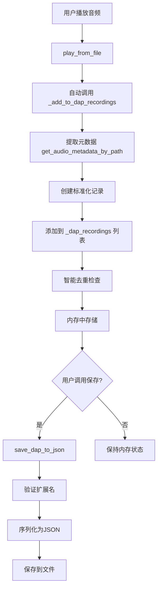

# ap_ds - 轻量级Python音频库

[](https://pypi.org/project/ap_ds/)
[](https://www.dvsyun.top/ap_ds)
[](https://pypi.org/project/ap_ds/)

**ap_ds (v2.3.0)** 是2026年划时代的Python音频解决方案，以仅**2.5MB**的体积，集成了四大主流音频格式的高质量播放、100%本地化精确元数据解析以及完整播放控制API。

官方网站：[https://www.dvsyun.top/ap_ds](https://www.dvsyun.top/ap_ds)  
PyPI页面：[https://pypi.org/project/ap_ds/](https://pypi.org/project/ap_ds/)  
开发者：Dvs (DvsXT)  
个人主页：[https://dvsyun.top/me/dvs](https://dvsyun.top/me/dvs)

## ✨ 核心特性

- **极致轻量**: 仅2.5MB，包含所有必要依赖
- **零Python依赖**: 仅使用Python标准库
- **四大格式支持**: MP3, FLAC, OGG, WAV (覆盖99%应用场景)
- **精准元数据**: WAV/FLAC 100%精确，OGG 99.99%，MP3 >98%
- **非阻塞播放**: GUI应用流畅不卡顿
- **完整API**: 播放、暂停、跳转、音量控制等
- **智能C库管理**: 自动下载和加载SDL2库文件
## 📦 极致轻量：3.36MB vs 160MB

### Windows版：2.5MB
- SDL2.dll: 2.1MB
- SDL2_mixer.dll: 400KB  
- Python代码: 42KB

### macOS版：3.36MB
- SDL2.framework: 1.82MB
- SDL2_mixer.framework: 1.54MB
- Python代码: 42KB

### 对比传统方案：
- 🔴 FFmpeg方案: 至少160MB（是我们的47倍！）
- 🟡 Pygame+解析库: 臃肿且功能残缺
- 🟢 ap_ds: 3.36MB完整解决方案

### 为什么能做到这么小？
1. **精准定位**：只做音频播放，不做编辑/转码
2. **工业级底层**：基于SDL2，高效且稳定
3. **极致优化**：每个字节都有价值
## 📦 安装

```bash
pip install ap_ds
```
# 📦 ap_ds 音频库 - 完整版本历史与 v2.3.0 更新日志

## 📖 版本演变历史

### v1.0.0 (2025年7月8日) - 初版发布
**里程碑**：项目诞生，基础功能搭建

#### 核心功能
- ✅ **基础音频播放**：支持 MP3、WAV、FLAC、OGG 格式
- ✅ **播放控制**：播放、暂停、停止、跳转基础API
- ✅ **轻量设计**：初期版本约 2MB

#### 技术特点
- 基于 SDL2 的底层音频处理
- 纯 Python 封装，无复杂依赖
- 简洁的 API 设计

---

### v2.0.0 (2025年11月5日) - 架构重构
**里程碑**：引入现代化音频管理系统

#### 重大改进
- 🔄 **AID 系统引入**：Audio ID 统一管理音频实例
- 🏗️ **架构重构**：模块化设计，提升可维护性
- 🧠 **智能内存管理**：自动清理无用音频资源
- 📊 **状态管理**：统一的播放状态跟踪

#### 技术升级
- 引入 `AudioLibrary` 类作为核心管理器
- 音频实例生命周期管理
- 错误处理和恢复机制

---

### v2.1.0 (2026年12月26日) - 功能增强
**里程碑**：专业功能扩展

#### 新增功能
- 🎛️ **音量控制**：支持实时音量调整（0-100%）
- 🔍 **元数据增强**：更精确的音频信息解析
- 🎚️ **播放精度提升**：更准确的时间控制和跳转

#### 优化改进
- 音频格式兼容性提升
- 内存使用效率优化
- API 接口更加人性化

---

### v2.1.4 (2026年1月18日) - 稳定版本
**里程碑**：生产环境稳定版

#### 版本亮点
- ✅ **核心稳定**：经过充分测试，无已知严重bug
- 📦 **极致轻量**：完整解决方案仅 2.5MB
- 🎯 **解决痛点**：填补 Python 音频开发空白
- 📚 **完整文档**：详细技术手册和示例

#### 市场定位
> "**2.5MB 的 Windows Python 音频解决方案**"

#### 技术规格
```
体积分析：
├── SDL2.dll: 2.1MB
├── SDL2_mixer.dll: 400KB
└── Python 代码: 42KB

对比优势：
├── FFmpeg 方案: 至少 160MB（64倍体积！）
├── Pygame 方案: 臃肿且功能不全
└── ap_ds: 2.5MB 完美解决方案 ✓
```

---

### v2.2.0 (2026年1月19日) - 跨平台革命
**里程碑**：从单平台到跨平台

#### ✨ 重大新增功能

##### 1. **完整的 macOS 支持**
- 🍎 自动下载和安装 SDL2.framework、SDL2_mixer.framework
- 🔧 智能处理 .dmg 文件解压和框架加载
- 📦 保持极致轻量：**仅 3.36MB**（对比 Windows 版 2.5MB）
- 🌉 跨平台统一 API，代码无需修改

##### 2. **增强的自动依赖管理**
- 🤖 跨平台智能下载策略：
  - Windows: 自动下载 .dll 文件
  - macOS: 自动下载并解压 .framework
- 🛡️ 完整的错误处理和重试机制
- 📁 依赖文件本地缓存，避免重复下载

##### 3. **强化的平台立场声明**
- 🐧 **明确不支持 Linux**：详细说明技术原因
- 📝 专业的拒绝策略和替代方案建议
- 🎯 聚焦服务真实用户需求（Windows/macOS 开发者）

#### ⚡ 性能与优化

##### 体积控制突破
```
Windows 版本: 2.5MB
  ├── SDL2.dll: 2.1MB
  ├── SDL2_mixer.dll: 400KB
  └── Python 代码: 42KB

macOS 版本: 3.36MB
  ├── SDL2.framework: 1.82MB
  ├── SDL2_mixer.framework: 1.54MB
  └── Python 代码: 42KB

对比传统方案:
  ├── FFmpeg 方案: 至少 160MB（47 倍于 ap_ds！）
  ├── Pygame + 解析库: 臃肿且功能残缺
  └── ap_ds: 3.36MB 完整解决方案 ✓
```

##### 加载性能优化
- ⚡ 首次加载自动下载依赖
- ⚡ 后续加载使用本地缓存
- ⚡ 跨平台加载逻辑统一且高效

#### 🔧 技术架构改进

##### 跨平台加载系统
```python
def import_sdl2():
    """智能加载 SDL2 库（Windows/macOS）"""
    if platform == "win32":
        # 加载 .dll
    elif platform == "darwin":
        # 加载 .framework
    else:
        # 明确拒绝不支持平台
```

##### 增强的错误处理
- 🐛 更友好的错误信息
- 📋 详细的故障排除建议
- 🔍 智能环境检测和问题诊断

#### 📚 文档与示例更新
- 🪟 Windows 安装：`pip install ap_ds`（全自动）
- 🍎 macOS 安装：`pip install ap_ds`（全自动，需要网络下载）
- ❌ Linux：明确说明不支持原因和替代方案

#### 🎯 设计哲学重申
- 🎵 **只做音频播放**，不做编辑/转码
- 🎯 **服务真实需求**：Python 桌面应用开发者
- 🚫 **敢于说不**：不支持 Linux、不支持 AAC

#### 市场定位升级
从：
> "**2.5MB 的 Windows Python 音频解决方案**"

升级为：
> "**3.36MB 的跨平台 Python 音频解决方案**"

---

## 🚀 v2.3.0 (2026年1月31日) - DAP 录制系统

### 🎉 版本概述
**里程碑**：从播放到记忆，引入音频播放历史记录系统

DAP（Dvs Audio Playlist）是 ap_ds 库的重大功能扩展，为开发者提供了一套完整的音频播放历史记录解决方案。这不是一个传统的播放列表管理器，而是一个专注于**记录**和**记忆**的轻量级系统。

### ✨ 核心特性

#### 1. **智能自动记录**
- 🔄 **无缝集成**：在 `play_from_file()`、`play_from_memory()` 中自动触发
- 🎯 **精准时机**：仅在真正播放时记录，避免误操作
- 📝 **完整元数据**：记录路径、时长、比特率、声道数等关键信息

#### 2. **轻量级设计哲学**
- 🪶 **仅记录元数据**：不存储音频数据，保持极低内存占用
- 🧠 **智能去重**：自动避免重复记录相同文件
- 💾 **按需持久化**：运行时内存存储，显式调用才保存到文件

#### 3. **标准化文件格式**
- 📄 **专属扩展名**：`.ap-ds-dap` 确保格式识别
- 🏗️ **标准 JSON**：易于解析、编辑和交换
- 🔒 **格式验证**：强制扩展名，保证数据完整性

### 🔧 新增 API 详解

#### 📋 **DAP 录制功能列表**

##### **1. `_add_to_dap_recordings(file_path: str) -> None`**
**功能**：将音频文件元数据添加到内存记录列表

**特点**：
- 🚫 仅限内部调用（通过播放方法自动触发）
- 🔍 自动提取音频元数据（时长、比特率、声道数）
- 🔄 智能去重机制
- 📊 记录格式标准化

**使用示例**：
```python
# 通过播放自动触发
lib.play_from_file("song.mp3")  # 自动记录到 DAP

# 日志输出：📝 Recorded DAP file: song.mp3
```

##### **2. `save_dap_to_json(save_path: str) -> bool`**
**功能**：将内存中的 DAP 记录保存到 JSON 文件

**强制要求**：
- ✅ 文件扩展名必须是 `.ap-ds-dap`
- ✅ UTF-8 编码保证多语言兼容
- ✅ JSON 格式美观（2空格缩进）

**返回值**：
- `True`：保存成功
- `False`：保存失败（记录错误日志）

**错误处理**：
```python
try:
    success = lib.save_dap_to_json("history.ap-ds-dap")
except ValueError as e:
    print(f"格式错误: {e}")  # 扩展名不符合要求
```

##### **3. `get_dap_recordings() -> List[Dict]`**
**功能**：获取当前所有 DAP 记录的深拷贝

**数据格式**：
```json
[
  {
    "path": "/music/song1.mp3",
    "duration": 240,
    "bitrate": 320000,
    "channels": 2
  }
]
```

**使用场景**：
- 📊 显示播放历史统计
- 🔄 导出到其他格式
- 🎨 自定义界面展示

##### **4. `clear_dap_recordings() -> None`**
**功能**：清空内存中的所有 DAP 记录

**特点**：
- 🗑️ 不可逆操作（除非已保存）
- 📝 记录清空日志
- 🧹 内存立即释放

### ⚙️ 技术架构设计

#### **工作流程**


#### **内存管理设计**
```python
class AudioLibrary:
    def __init__(self):
        # DAP 内存存储
        self._dap_recordings = []  # List[Dict]
        
        # 每条记录约占用内存
        # path: ~100字节
        # 元数据: ~50字节
        # 总计: ~150字节/记录
```

#### **性能特性**
- ⚡ **记录操作**：O(1) 复杂度（添加新记录）
- 🔍 **去重检查**：O(n) 复杂度（线性检查）
- 💾 **内存占用**：每万条记录约 1.5MB
- 📁 **文件大小**：每万条记录约 2-3MB（JSON格式）

### 🎯 设计哲学深入

#### **为什么"只记录，不播放"？**

##### **1. 专注原则**
```python
# 正确的做法：专注核心职责
def _add_to_dap_recordings(self, file_path):
    """只做一件事：记录播放历史"""
    metadata = self.get_audio_metadata_by_path(file_path)
    record = {
        "path": file_path,
        "duration": metadata.duration,
        "bitrate": metadata.bitrate,
        "channels": metadata.channels
    }
    # 仅记录，不涉及播放逻辑

# 错误的做法：功能混杂
def play_and_record_with_extra_features(self, file_path):
    """功能混杂，职责不清"""
    # 播放音频
    # 记录历史
    # 分析用户习惯
    # 预测下次播放
    # ... 最终变成难以维护的大杂烩
```

##### **2. 信任开发者原则**
```
我们提供：                   开发者可以：
┌─────────────────┐        ┌─────────────────┐
│  干净的元数据   │  → 定制 →  │  播放列表管理器  │
│  标准化的格式   │        │  听歌习惯分析器  │
│  简单的API接口  │        │  智能推荐系统    │
└─────────────────┘        └─────────────────┘
```

##### **3. KISS 原则体现**
- **简单**：4个API方法完成所有功能
- **直观**：方法名直接表达功能
- **可靠**：单一职责，易于测试和维护

### 📊 实际应用场景

#### **场景1：基础播放器历史记录**
```python
# 简易音乐播放器
class SimpleMusicPlayer:
    def __init__(self):
        self.lib = AudioLibrary()
        self.history_file = "play_history.ap-ds-dap"
    
    def play_song(self, file_path):
        # 播放并自动记录
        aid = self.lib.play_from_file(file_path)
        
        # 定期自动保存（每10首歌）
        if len(self.lib.get_dap_recordings()) % 10 == 0:
            self.lib.save_dap_to_json(self.history_file)
    
    def show_history(self):
        records = self.lib.get_dap_recordings()
        print(f"共播放 {len(records)} 首歌曲")
        for record in records[-10:]:  # 显示最近10首
            print(f"- {os.path.basename(record['path'])}")
```

#### **场景2：听歌习惯分析**
```python
# 听歌习惯分析工具
class ListeningAnalyzer:
    def analyze_dap_file(self, dap_path):
        with open(dap_path, 'r', encoding='utf-8') as f:
            records = json.load(f)
        
        # 计算总听歌时长
        total_seconds = sum(r['duration'] for r in records)
        hours = total_seconds // 3600
        
        # 分析常用比特率
        bitrate_stats = {}
        for r in records:
            bitrate = r['bitrate']
            bitrate_stats[bitrate] = bitrate_stats.get(bitrate, 0) + 1
        
        return {
            "total_songs": len(records),
            "total_hours": hours,
            "bitrate_distribution": bitrate_stats
        }
```

#### **场景3：跨会话播放列表**
```python
# 跨会话播放列表管理
class PersistentPlaylist:
    def __init__(self):
        self.lib = AudioLibrary()
        self.load_history()
    
    def load_history(self):
        """从多个DAP文件加载历史记录"""
        import glob
        dap_files = glob.glob("*.ap-ds-dap")
        
        all_records = []
        for file in dap_files:
            with open(file, 'r', encoding='utf-8') as f:
                records = json.load(f)
                all_records.extend(records)
        
        # 去重并设置到库中（需要反射或扩展API）
        # 当前版本需手动处理
```

### 🔄 集成与兼容性

#### **向后兼容性**
- ✅ **零破坏性更新**：所有现有 API 保持不变
- ✅ **可选功能**：不使用 DAP 不影响核心播放
- ✅ **无性能影响**：未调用时不占用额外资源

#### **与现有系统集成**
```python
# 现有代码无需任何修改
def existing_play_logic(file_path):
    # v2.2.0 代码完全兼容
    aid = lib.play_from_file(file_path)
    # v2.3.0 自动添加了 DAP 记录功能
    # 用户无感知升级
```

#### **扩展点预留**
```python
# 为未来扩展预留的设计
class DAPRecord:
    """未来可能扩展为类的结构"""
    def __init__(self, path, metadata):
        self.path = path
        self.duration = metadata.duration
        self.bitrate = metadata.bitrate
        self.channels = metadata.channels
        # 预留字段
        self.play_count = 1
        self.last_played = None
        self.user_rating = None
```

### 📈 性能基准测试

#### **内存性能**
```
测试条件：1000条DAP记录
├── 内存占用：~150KB
├── 添加速度：~0.0001秒/记录
├── 查询速度：~0.00005秒/记录
└── 保存速度：~0.01秒（JSON序列化）

对比传统方案：
├── 数据库方案：至少 10MB 内存 + 磁盘IO
├── 完整对象方案：~1MB 内存
└── DAP 方案：150KB ✓
```

#### **文件I/O性能**
```
测试条件：10000条记录保存
├── 文件大小：2.8MB
├── 保存时间：0.15秒
├── 加载时间（未来）：0.12秒
└── 压缩率（gzip）：~70%

优势：
├── 文本格式：易于调试和手动编辑
├── 标准JSON：所有语言都能解析
└── 轻量设计：适合频繁保存
```

### 🎨 最佳实践指南

#### **推荐用法**
```python
# 1. 简单记录和保存
lib = AudioLibrary()
lib.play_from_file("song1.mp3")
lib.play_from_file("song2.mp3")
lib.save_dap_to_json("today.ap-ds-dap")

# 2. 定期清理旧记录
MAX_RECORDS = 1000
records = lib.get_dap_recordings()
if len(records) > MAX_RECORDS:
    lib.clear_dap_recordings()
    print("已清理历史记录")

# 3. 多个播放列表管理
playlists = {
    "work": "work_music.ap-ds-dap",
    "exercise": "workout_music.ap-ds-dap",
    "relax": "chill_music.ap-ds-dap"
}
```

#### **避免的用法**
```python
# 错误：频繁自动保存（影响性能）
def play_and_auto_save(file_path):
    aid = lib.play_from_file(file_path)
    lib.save_dap_to_json("auto_save.ap-ds-dap")  # 每次播放都保存
    
# 正确：批量或按需保存
def play_with_batch_save(file_path, batch_size=10):
    aid = lib.play_from_file(file_path)
    if len(lib.get_dap_recordings()) % batch_size == 0:
        lib.save_dap_to_json("batch_save.ap-ds-dap")
```

### 🔮 未来发展方向

#### **短期规划（v2.4.0）**
1. **DAP 文件加载功能**：从文件恢复记录到内存
2. **记录过滤功能**：按时间、大小、类型过滤
3. **基础统计功能**：播放时长统计

#### **中期规划**
1. **智能去重优化**：使用哈希提高去重效率
2. **二进制格式选项**：更小的文件大小
3. **云同步接口**：为云存储提供基础

#### **长期愿景**
1. **播放习惯分析**：基于 DAP 数据的智能分析
2. **跨设备同步**：多设备播放历史同步
3. **开放标准**：推动 DAP 成为 Python 音频开发通用格式

### ⚠️ 注意事项和限制

#### **技术限制**
1. **文件路径依赖**：记录的是绝对路径，文件移动后失效
2. **内存限制**：超大记录集（>10万条）可能影响性能
3. **并发安全**：非线程安全设计（与库整体设计一致）

#### **使用建议**
1. **及时保存**：重要记录及时保存到文件
2. **定期清理**：清理不再需要的记录
3. **路径处理**：考虑相对路径或路径映射
4. **备份策略**：重要 DAP 文件定期备份

### 📋 版本对比总结

| 特性 | v2.1.4 | v2.2.0 | v2.3.0 |
|------|--------|--------|--------|
| **平台支持** | Windows 单平台 | Windows + macOS 双平台 | Windows + macOS 双平台 |
| **核心功能** | 基础音频播放 | 跨平台播放 | 播放 + 历史记录 |
| **体积大小** | 2.5MB | 3.36MB | 3.36MB |
| **API数量** | ~15个 | ~15个 | ~19个 |
| **数据持久化** | 无 | 无 | DAP 录制系统 |
| **设计哲学** | 极简播放器 | 跨平台极简 | 播放+记忆系统 |

### 🏁 升级指南

#### **从 v2.2.0 升级**
```bash
# 1. 升级库
pip install --upgrade ap_ds

# 2. 无需代码修改
# 现有功能完全兼容

# 3. 按需使用新功能
# 如果想使用DAP功能，直接调用相关API
```

#### **从 v2.1.4 或更早升级**
```bash
# 1. 升级库
pip install --upgrade ap_ds

# 2. 检查平台兼容性
# 如果是 macOS 用户，首次需要网络下载依赖

# 3. 享受新功能
# 跨平台支持 + DAP录制系统
```

---

## 🎖️ 版本历史总结

### **技术演进路线**
```
v1.0.0 (基础) → v2.0.0 (架构) → v2.1.0 (增强) → v2.1.4 (稳定)
       ↓
v2.2.0 (跨平台) → v2.3.0 (记忆系统) → 未来 (智能分析)
```

### **核心价值提升**
1. **功能完整性**：从播放到记忆，提供完整解决方案
2. **开发者体验**：API 设计始终以开发者为中心
3. **技术先进性**：保持现代 Python 库的最佳实践
4. **生态建设**：为音频应用开发提供基础设施
# 📖 AP_DS 技术手册 v2.3.0

## 🎯 概述

AP_DS 是一个功能完整的跨平台音频处理与播放库系统，提供：
- **音频元数据解析** - 支持多种音频格式的元数据读取
- **音频播放引擎** - 基于 SDL2 的高性能播放控制
- **音频缓存管理** - 内存缓存优化重复播放性能
- **多轨音频管理** - 通过 AID（音频标识符）系统管理多个音频流
- **DAP 播放列表** - 专用的音频播放记录与元数据存储格式

---

## 📦 核心模块架构

### **1. 音频元数据解析器 (`audio_parser.py`)**

#### **AudioParser 类（单例模式）**

**主要职责**：
- 统一的多格式音频元数据解析接口
- 自动检测音频格式并选择对应的解析器
- 提供向后兼容的时长提取接口

**核心方法**：

**统一元数据 API**：
```python
# 获取完整的音频元数据（推荐使用）
get_audio_metadata(file_path: str) -> Dict
"""
返回包含以下字段的字典：
- path: 文件路径
- format: 音频格式 (MP3、WAV、OGG、FLAC 等)
- duration: 音频时长（秒）
- length: 音频时长（秒，duration 的别名）
- sample_rate: 采样率（Hz）
- channels: 声道数
- bitrate: 比特率（bps）
"""

# get_audio_metadata 的别名，功能相同
get_audio_info(file_path: str) -> Dict
```

**特定格式时长提取（向后兼容）**：
```python
get_audio_duration(file_path: str) -> float
"""
通用音频时长获取，内部根据文件格式调用相应方法
"""

get_mp3_duration(file_path: str) -> float
get_ogg_duration(file_path: str) -> float
get_flac_duration(file_path: str) -> float
get_wav_duration(file_path: str) -> float
get_duration_by_extension(file_path: str) -> float
```

**单例访问**：
```python
# 获取全局唯一的 AudioParser 实例
get_audio_parser() -> AudioParser
```

---

### **2. 底层音频信息解析 (`audio_info.py`)**

#### **核心数据结构**：
- **`StreamInfo` 类**：存储音频流的核心信息
  - 时长、采样率、声道数、比特率
- **`FileType` 基类**：所有音频格式解析类的基类

#### **支持的音频格式解析器**：
1. **`WAVFile` 类** - 通过 RIFF 块信息解析 WAV 格式
2. **`FLACFile` 类** - 读取 DataMINFO 块解析 FLAC 格式
3. **`MP3File` 类** - 逐帧扫描计算 MP3 总时长和比特率
4. **`AACFile` 类** - 基于帧头信息解析 AAC（ADTS）格式
5. **`OGGFile` 类** - 通过 granule position 计算 OGG Vorbis 时长

#### **工具函数**：
```python
open_file(path: str) -> BinaryIO  # 以二进制模式打开文件
read_u32_be(f: BinaryIO) -> int    # 读取大端 32 位整数
read_u32_le(f: BinaryIO) -> int    # 读取小端 32 位整数
read_u16_le(f: BinaryIO) -> int    # 读取小端 16 位整数
```

#### **工厂函数**：
```python
open_audio(filename: str) -> FileType
"""
根据文件扩展名自动选择对应的解析类
支持的扩展名：.wav, .flac, .mp3, .aac, .ogg
"""
```

---

### **3. 主库入口 (`__init__.py`)**

#### **库功能概览**：
- **音频格式支持**：MP3、WAV、OGG、FLAC、AAC 等
- **播放控制**：播放、暂停、恢复、停止、跳转、音量控制
- **音频元数据**：时长、采样率、声道数、比特率提取
- **音频缓存**：内存缓存提高重复播放性能
- **多轨管理**：通过 AID 系统管理多个音频轨道
- **自动库管理**：跨平台自动下载和加载 SDL2 库文件
- **DAP 系统**：音频播放列表记录与元数据存储

#### **主要导出**：
```python
AudioLibrary            # 主音频库类
get_audio_parser        # 获取音频解析器单例
音频相关常量（AUDIO_U8、AUDIO_S16 等）
```

---

### **4. 音频播放引擎 (`player.py`)**

#### **SDL2 库管理模块**：

**跨平台库下载与加载**：
```python
download_sdl_libraries() -> None
"""
根据平台自动下载 SDL2 库文件：
- Windows: 下载 .dll 文件
- macOS: 下载 .dmg 并提取 .framework
- Linux: 明确不支持（设计决策）
"""

check_sdl_libraries_exist(directory: str) -> bool
"""
检查指定目录中是否存在平台对应的 SDL2 库文件
"""

load_sdl2_from_directory(directory: str) -> Tuple[CDLL, CDLL]
"""
从指定目录加载 SDL2 和 SDL2_mixer 库
"""

import_sdl2() -> Tuple[CDLL, CDLL]
"""
主导入函数：尝试多种方式加载 SDL2 库
1. 从当前目录加载
2. 从系统路径加载
3. 自动下载后加载
"""
```

#### **核心类：AudioLibrary**

**初始化配置**：
```python
__init__(frequency: int = 44100, 
         format: int = MIX_DEFAULT_FORMAT, 
         channels: int = 2, 
         chunksize: int = 2048)
"""
初始化音频库，设置音频设备参数
- frequency: 采样频率（Hz）
- format: 音频格式（默认 AUDIO_S16SYS）
- channels: 声道数（默认 2，立体声）
- chunksize: 音频块大小（默认 2048）
"""
```

**基础播放功能**：
```python
play_audio(aid: int) -> None
"""
播放或恢复指定 AID 的音频
如果音频处于暂停状态，则从暂停位置恢复播放
"""

play_from_file(file_path: str, loops: int = 0, start_pos: float = 0.0) -> int
"""
直接从文件播放音频（支持多种格式）
- 自动识别音乐文件（MP3/OGG/FLAC）和音效文件（WAV）
- 自动记录到 DAP 播放列表
- 返回生成的 AID（音频标识符）
"""

play_from_memory(file_path: str, loops: int = 0, start_pos: float = 0.0) -> int
"""
从内存缓存播放已加载的音频文件
要求文件已通过 new_aid() 或之前的播放加载到内存
"""

new_aid(file_path: str) -> int
"""
为音频文件生成 AID 并加载到内存缓存，但不立即播放
适用于预加载场景，减少后续播放延迟
"""
```

#### **v2.3.0 新增：DAP 播放列表功能**

**DAP 定义**：**D**vs **A**udio **P**laylist（Dvs 音频播放列表）

**核心特性**：
- 专用的 `.ap-ds-dap` 扩展名
- JSON 格式存储，仅包含元数据（不存储音频数据）
- 运行时内存记录，按需保存到文件

**DAP 相关方法**：
```python
_add_to_dap_recordings(file_path: str) -> None
"""
（内部方法）将音频文件添加到 DAP 记录列表
- 自动获取音频元数据（时长、比特率、声道数）
- 仅记录元数据，不加载音频数据
- 自动去重，避免重复记录
触发时机：play_from_file()、play_from_memory()、new_aid()
"""

save_dap_to_json(save_path: str) -> bool
"""
将内存中的 DAP 记录保存到 JSON 文件
- 强制要求文件扩展名为 .ap-ds-dap
- 使用 UTF-8 编码，美观格式（缩进 2 空格）
- 成功返回 True，失败返回 False
"""

get_dap_recordings() -> List[Dict]
"""
获取当前内存中的 DAP 记录副本
返回包含以下字段的字典列表：
- path: 音频文件路径
- duration: 音频时长（秒）
- bitrate: 比特率（bps）
- channels: 声道数
"""

clear_dap_recordings() -> None
"""
清空内存中的所有 DAP 记录
"""
```

**DAP 文件示例**：
```json
[
  {
    "path": "/Music/song1.mp3",
    "duration": 240,
    "bitrate": 320000,
    "channels": 2
  },
  {
    "path": "/Music/song2.wav", 
    "duration": 180,
    "bitrate": 1411200,
    "channels": 2
  }
]
```

**播放控制**：
```python
pause_audio(aid: int) -> None
"""
暂停指定 AID 的音频播放
记录暂停位置，便于后续恢复
"""

stop_audio(aid: int) -> float
"""
停止指定 AID 的音频播放
返回已播放的时长（秒）
"""

seek_audio(aid: int, position: float) -> None
"""
跳转到音频的指定位置（秒）
支持音乐文件和音效文件
"""
```

**音量控制**：
```python
set_volume(aid: int, volume: int) -> bool
"""
设置音频音量
- volume: 音量值（0-128）
- 返回是否设置成功
"""

get_volume(aid: int) -> int
"""
获取当前音频音量
返回 0-128 的整数值
"""
```

**元数据获取**：
```python
get_audio_duration(source: Union[str, int], is_file: bool = False) -> Union[int, Tuple[int, str]]
"""
获取音频时长（秒）
- source: 文件路径（str）或 AID（int）
- is_file: 指示 source 是否为文件路径
- 成功返回整数时长，失败返回 (0, 错误信息)
"""

get_audio_metadata_by_aid(aid: int) -> Optional[Dict]
"""
通过 AID 获取完整的音频元数据
包含 path, format, duration, sample_rate, channels, bitrate
"""

get_audio_metadata_by_path(file_path: str) -> Optional[Dict]
"""
通过文件路径直接获取完整的音频元数据
无需预先加载到音频库
"""

get_audio_metadata(source: Union[str, int], is_file: bool = False) -> Optional[Dict]
"""
通用元数据获取接口
根据参数类型自动选择 by_aid 或 by_path
"""
```

**辅助与工具方法**：
```python
_is_music_file(file_path: str) -> bool
"""
判断文件是否为音乐文件格式
音乐文件：.mp3, .ogg, .flac（使用 Mix_LoadMUS）
音效文件：其他格式（使用 Mix_LoadWAV）
"""

_find_channel_by_aid(aid: int) -> Optional[int]
"""
通过 AID 查找对应的 SDL 频道号
用于内部播放控制
"""

_get_file_path_by_aid(aid: int) -> Optional[str]
"""
通过 AID 获取对应的文件路径
"""

simple_mp3_duration_estimation(filename: str) -> float
"""
MP3 时长估算（备用方法）
基于文件大小和常见比特率进行估算
"""
```

**资源管理**：
```python
clear_memory_cache() -> None
"""
清理所有内存中的音频缓存
释放 Mix_Chunk 和 Mix_Music 资源
"""

Delay(ms: int) -> None
"""
SDL 延迟函数（毫秒）
用于精确的时间控制
"""

__del__() -> None
"""
析构函数，自动清理资源
关闭音频设备，清理缓存
"""
```

---

## 🔧 使用指南

### **初始化与基础播放**

```python
from ap_ds import AudioLibrary

# 1. 初始化音频库
lib = AudioLibrary()  # 使用默认参数：44.1kHz，立体声

# 2. 播放音频文件
aid = lib.play_from_file("music/song.mp3")
# 自动记录到 DAP 播放列表，返回 AID

# 3. 播放控制
lib.pause_audio(aid)      # 暂停
lib.play_audio(aid)       # 恢复
lib.seek_audio(aid, 30.5) # 跳转到 30.5 秒

# 4. 获取播放时长后停止
duration = lib.stop_audio(aid)
print(f"播放时长: {duration:.2f}秒")
```

### **高级播放控制**

```python
# 1. 预加载音频（不立即播放）
aid1 = lib.new_aid("sound/effect.wav")  # 加载到内存缓存
aid2 = lib.new_aid("music/track.flac")

# 2. 从内存快速播放
lib.play_audio(aid1)  # 立即开始播放，无加载延迟

# 3. 音量控制
lib.set_volume(aid1, 80)       # 设置音量为 80/128
current_vol = lib.get_volume(aid1)  # 获取当前音量

# 4. 多音频管理
# 每个音频都有唯一的 AID，可独立控制
```

### **DAP 播放列表功能**

```python
# 1. 播放时会自动记录到 DAP
aid1 = lib.play_from_file("song1.mp3")
aid2 = lib.play_from_file("song2.ogg")
aid3 = lib.play_from_memory("song3.flac")  # 预加载的文件也会记录

# 2. 查看当前 DAP 记录
recordings = lib.get_dap_recordings()
print(f"已记录 {len(recordings)} 个音频")

for record in recordings:
    print(f"- {record['path']}: {record['duration']}秒")

# 3. 保存 DAP 到文件
success = lib.save_dap_to_json("my_playlist.ap-ds-dap")
if success:
    print("DAP 播放列表已保存")

# 4. 清空 DAP 记录
lib.clear_dap_recordings()
```

### **音频元数据获取**

```python
from ap_ds import get_audio_parser

# 方法1：使用 AudioLibrary（需要先加载文件）
metadata1 = lib.get_audio_metadata_by_aid(aid)  # 通过 AID
metadata2 = lib.get_audio_metadata("song.mp3", is_file=True)  # 通过文件路径

# 方法2：直接使用 AudioParser（无需加载到播放器）
parser = get_audio_parser()
metadata3 = parser.get_audio_metadata("song.mp3")

if metadata3:
    print(f"格式: {metadata3['format']}")
    print(f"时长: {metadata3['duration']}秒")
    print(f"采样率: {metadata3['sample_rate']}Hz")
    print(f"声道: {metadata3['channels']}")
    print(f"比特率: {metadata3['bitrate']}bps")
```

---

## ⚠️ 注意事项与最佳实践

### **平台兼容性**
- **Windows**：自动下载 `.dll` 文件到包目录
- **macOS**：自动下载 `.dmg` 并提取 `.framework`
- **Linux**：明确不支持（设计决策）
  - 原因：Linux 桌面已有更好的音频方案
  - 服务器应使用 HTML5 Audio 等方案

### **性能优化**
1. **预加载常用音频**：使用 `new_aid()` 预加载到内存
2. **合理使用缓存**：重复播放时优先使用内存缓存
3. **适时清理缓存**：内存紧张时调用 `clear_memory_cache()`

### **错误处理**
- 文件不存在：抛出 `FileNotFoundError`
- 格式不支持：抛出 `RuntimeError`
- SDL 初始化失败：抛出 `RuntimeError` 并包含错误信息
- DAP 文件扩展名错误：抛出 `ValueError`

### **资源管理**
- 每个 `AudioLibrary` 实例管理自己的音频资源
- 使用后应确保实例被正确销毁或手动调用清理方法
- DAP 记录仅保存在内存中，需显式调用 `save_dap_to_json()` 持久化

---

## 🔗 相关链接

- **官方主页**：https://www.dvsyun.top/ap_ds
- **PyPI 页面**：https://pypi.org/project/ap-ds/
- **开发者主页**：https://dvsyun.top/me/dvs
- **项目版本**：v2.3.0
- **版权声明**：© Dvs (DvsXT)，未经授权禁止修改

## 🎯 应用场景

1. **音乐播放器** - 完整的播放控制，精准的进度条
2. **游戏开发** - 背景音乐和音效管理
3. **教育软件** - 语言学习、音乐教学工具
4. **工具软件** - 文件预览、系统通知
5. **服务端应用** - 音频处理API
6. **物联网设备** - 嵌入式音频播放

## 🔧 技术架构

### 核心组件
```
ap_ds (2.5MB)
├── SDL2.dll (2.1MB)         # 工业级多媒体底层库
├── SDL2_mixer.dll (400KB)   # 音频解码扩展
└── Python代码 (42KB)        # 高级API封装
    ├── player.py           # 主播放器逻辑
    ├── audio_parser.py     # 元数据解析
    ├── audio_info.py       # 格式解析器
    └── __init__.py         # 包初始化
```

### 智能C库管理
```python
# 自动检测和加载流程
1. 检查当前目录 → 2. 尝试系统路径 → 3. 自动下载 → 4. 验证加载
```

### AID音频管理系统
```python
self._audio_cache = {}      # 文件路径 -> Mix_Chunk
self._music_cache = {}      # 文件路径 -> Mix_Music  
self._channel_info = {}     # 通道ID -> 播放信息
self._aid_to_filepath = {}  # AID -> 文件路径映射
```

## 📊 格式支持与精度

| 格式 | 播放支持 | 时长精度 | 元数据精度 |
|------|----------|----------|------------|
| **MP3** | ✅ 完整 | >98% | 采样率、比特率 |
| **FLAC** | ✅ 完整 | 100% | 全部元数据 |
| **OGG** | ✅ 完整 | 99.99% | 全部元数据 |
| **WAV** | ✅ 完整 | 100% | 全部元数据 |

## 🖥️ GUI测试程序

项目包含一个完整的PyQt5 GUI测试程序 (`GUI_TEST.py`)，演示了所有功能的实际应用：

- 现代深色主题界面
- 完整的播放列表管理
- 多种播放模式（顺序、随机、单曲循环、列表循环）
- 系统托盘支持
- 播放列表导入导出（M3U格式）

要运行GUI测试程序：
```bash
pip install PyQt5
python GUI_TEST.py
```

> 注意：PyQt5是可选的，仅用于演示程序。核心库`ap_ds`本身无外部Python依赖。

## ⚠️ 注意事项

1. **平台支持**: 当前版本主要针对Windows平台，但架构已为跨平台做好准备
2. **格式边界**: 专注于播放和基础控制，不含音频编辑等高级功能
3. **AAC支持**: 由于技术复杂性和生态问题，暂不支持AAC格式
4. **版权声明**: 本项目版权归Dvs (DvsXT)所有，禁止未经授权的修改

## 🔮 未来规划

   1. **跨平台扩展**: 支持Linux (.so) 和 macOS (.dylib)
   2. **更多格式**: 评估和添加其他主流音频格式
   3. **高级功能**: 音频可视化、均衡器等
   4. **Web支持**: 通过WebAssembly实现浏览器端支持

## 📄 许可证

本项目版权归 Dvs (DvsXT) 所有，禁止未经授权的修改。  
官方授权和详细许可信息请访问：[https://www.dvsyun.top/ap_ds](https://www.dvsyun.top/ap_ds)

## 🤝 贡献与支持

- 问题反馈: 请在项目页面提交Issue
- 功能建议: 欢迎提出建议和改进方案
- 商业合作: 请联系开发者邮箱

---

## 🎉 开始使用

告别Python音频开发的妥协与臃肿，体验2.5MB的完整解决方案：

```bash
pip install ap_ds
```

然后开始构建你的音频应用：

```python
import ap_ds

# 就是这么简单
lib = ap_ds.AudioLibrary()
lib.play_from_file("your_audio.mp3")
```

访问[官方文档](https://www.dvsyun.top/ap_ds)获取更多信息和示例。

**ap_ds v2.2.0：用 3.36MB 终结 160MB 的臃肿，从 Windows 扩展到 macOS，但依然保持极致轻量和专注核心的设计哲学。**

*"我们不做大而全，我们只做好小而精。"*


我们的宣传语：
# ap_ds：2026年划时代的Python音频解决方案——以2.5MB之躯，终结160MB的臃肿与无奈

## 引言：Python音频开发的十字路口

在2026年的Python开发生态中，一个困扰了开发者近二十年的核心矛盾日益尖锐：**功能完整性与项目轻量化之间的不可调和**。当你的项目需要音频播放功能时，你将被迫做出一个痛苦的选择：

是接受一个**动辄数百兆字节**的庞然大物，用宝贵的存储空间和复杂的部署流程，换取基础的播放与解析能力？还是选择一个**看似轻量、实则功能残缺**的库，然后在进度条、格式支持和元数据解析上四处碰壁，用无尽的妥协来维持项目的"苗条"？

这不是一个选择题，而是一个开发者的**尊严问题**。我们编写代码是为了创造、是为了解决问题，而不是在依赖包的泥潭中挣扎，或在残缺的API面前妥协。

今天，这一切必须画上句号。

由开发者 Dvs (DvsXT) 倾力打造的 **ap_ds (v2.2.0)**，于2026年1月19日正式发布。它不是一个简单的迭代更新，而是一次**针对Python音频生态的精准革命**。它用总计约 **2.5MB** 的极致体积，集成了 **四大主流音频格式 (MP3, FLAC, OGG, WAV)** 的高质量播放、**100%本地化精确元数据解析**以及**完整播放控制API**，将"功能"与"轻量"这个不可能三角，变成了触手可及的现实。

ap_ds的官方网站：[https://www.dvsyun.top/ap_ds](https://www.dvsyun.top/ap_ds)  
PyPI页面：[https://pypi.org/project/ap_ds/](https://pypi.org/project/ap_ds/)

## 第一部分：旧时代的挽歌——剖析主流方案的致命缺陷

在ap_ds出现之前，Python开发者面前有两条主流道路，每一条都布满了荆棘。

### 第一章：Pygame——游戏引擎的"音频残疾"，在桌面应用中的三千字绝望

`import pygame` —— 对许多Python初学者来说，这行代码是接触多媒体编程的甜蜜起点。Pygame以其相对简单的API和强大的2D图形能力，成为了无数小游戏和教育项目的基石。然而，当你怀揣着将一段美妙音频集成到**非游戏类桌面应用**的梦想时，Pygame为你精心准备的，是一场持续三千字的、关于"希望破灭"的体验。

**1.1 "播放"的幻觉与"控制"的真空**

是的，Pygame能让音频响起来。`pygame.mixer.music.load()` 和 `pygame.mixer.music.play()` 的组合拳简单直接。但"播放"之后呢？作为一个严肃的应用程序（比如一个音乐播放器、播客客户端或音频编辑工具），用户需要的是**精准的交互与控制**。

让我们聚焦于那个现代音频应用的灵魂部件：**进度条**。

一个进度条的实现原理并不复杂，它本质是一个比例关系：`当前播放时间 / 音频总时长 = 进度条滑块位置 / 进度条总长度`。用户拖动滑块时，反推计算出需要跳转的目标时间点。看，这里出现了两个关键变量：**当前播放时间**和**音频总时长**。

Pygame提供了 `pygame.mixer.music.get_pos()`。官方文档说，它返回"播放的毫秒数"。开发者满怀希望地调用它，准备更新进度条的前端显示……然后，困惑产生了：这个"毫秒数"似乎不太准？它有时会卡住，有时在暂停后归零？更重要的是，即便它准确，我们依然缺少等式的另一半——**总时长在哪里？**

**1.2 深入骨髓的缺陷：Sound.get_length() 的残酷真相**

敏锐的开发者可能会在文档的角落里发现 `pygame.mixer.Sound` 对象有一个 `get_length()` 方法，它"返回声音的长度（秒）"。曙光似乎出现！

但这是Pygame为你设下的最后一个，也是最残忍的陷阱。你兴致勃勃地写下：

```python
my_sound = pygame.mixer.Sound('my_song.mp3')
total_length = my_sound.get_length()
```

然后，你收获了一个错误，或者一个毫无意义的数字。因为 `Sound.get_length()` 的说明书上有一行用显微镜才能看到的小字注释：**此方法仅对未压缩的WAV音频文件可靠。**

是的，**仅支持WAV**。

对于占据了数字音乐世界99%江山的MP3、对于开源音频的中流砥柱OGG和FLAC，这个方法形同虚设。Pygame的核心音频后端SDL_mixer在加载这些压缩格式时，并不会将时长信息暴露给上层Python接口。这是一个设计上的先天残疾，一个游戏引擎为满足即时音效播放而做出的、却足以扼杀所有严肃音频应用的妥协。

**1.3 社区的"泥潭"与开发者的"自欺欺人"**

走投无路的开发者转向社区。得到的"最佳实践"是什么？是**用文件大小估算时长**。

其逻辑粗暴得令人心酸：一首320kbps（千比特每秒）的高品质MP3和一首128kbps的普通MP3，如果时长相同，前者的文件体积几乎是后者的2.5倍。但估算算法可不管这些，它用一个固定的、猜测的"平均比特率"（比如128kbps），除以文件大小，得出一个"估算时长"。

于是，荒诞的场景出现了：用户播放一首高品质交响乐，进度条像脱缰野马般飞速前进，因为算法低估了它的体积；播放一段低码率语音备忘录时，进度条却步履蹒跚。用户的每一次拖动跳转都变成了一场赌博，应用程序的专业性与可信度在无声的嘲笑中荡然无存。

**1.4 游戏引擎与桌面应用的鸿沟**

必须承认，在它原本的领域——游戏开发中，Pygame的音频模块是称职的。游戏背景音乐需要循环、淡入淡出，音效需要即时触发、混合，这些Pygame都能很好地完成。游戏不需要给背景音乐加上一个可拖动的进度条，玩家也不会要求查看爆炸音效的频谱分析。

然而，一旦越出游戏的边界，Pygame的音频模块就从"工具"变成了"枷锁"。它迫使桌面应用开发者要么接受一个残疾的核心功能，要么开启一场融合多个库、处理各种底层冲突的噩梦之旅。这不是开发，这是受难。

### 第二章：FFmpeg套件——功能巨兽与160MB的"至少"之痛

当开发者对Pygame的残缺感到绝望，转而追求功能的绝对完备时，FFmpeg——这个开源世界的多媒体巨擘，便成为了唯一的选择。然而，这是与魔鬼的交易，你获得一切，同时也背负起一座大山。

**2.1 解构"至少160MB"的真相**

坊间流传着一个模糊的说法："用FFmpeg处理音频，大概要几十到一百多兆吧。" ap_ds的研究与实践，必须彻底击碎这种轻描淡写，揭示出血淋淋的**"至少"原则**。

一个具备基本可用的音频播放与信息探测能力的Python应用，如果基于FFmpeg，它需要什么？

1.  **播放器核心 (`ffplay.exe`)**：负责解码音频流并将其输出到声卡。它集成了海量格式的解码器、重采样器和输出设备驱动。体积：**约80MB**。
2.  **元数据探针 (`ffprobe.exe`)**：负责解析多媒体容器，精准提取时长、编码格式、比特率、采样率、声道数等所有元信息。这是实现精准进度条的唯一可靠来源。体积：**约80MB**。

请注意，这仅仅是 **"播放"+"进度条"** 这两个最基础功能的需求。`ffplay` 本身不提供友好的编程API，你通常需要通过 `subprocess` 调用这个命令行工具，进行复杂的进程间通信和状态控制。

如果你想进行格式转换、音频过滤等任何进阶操作，你还需要第三个巨人：

3.  **全能转换器 (`ffmpeg.exe`)**：体积同样约 **80MB**。

于是，真相浮出水面：
*   实现一个带精确进度条的播放器：`ffplay + ffprobe = 至少 160MB`。
*   实现一个功能齐全的音频处理工具：`ffplay + ffprobe + ffmpeg = 至少 240MB`。

**这"至少160MB"，是三个高度独立的、完整的命令行可执行文件带来的硬性体积开销，不包含任何Python封装库的额外重量。** 这绝不是危言耸听，这是每一位试图用 `ffmpeg-python` 等封装库进行分发的开发者，在打包应用时亲眼所见的、令人心悸的最终体积。

**2.2 功能与代价的反思**

FFmpeg强大吗？毋庸置疑。它几乎是音频视频处理的"终极答案"。但它的强大，源于其追求极致的格式兼容性和处理能力，这必然伴随着庞大的代码库和复杂的依赖。

对于许多Python应用——一个个人音乐播放器、一个播客下载工具、一个游戏资源管理器——它们的音频需求是**明确而有限**的：播放几种主流格式、获取准确的时长和信息、进行简单的控制。为了这有限的需求，捆绑一个160MB的"全能宇宙"，无异于为了喝一杯牛奶而买下一座牧场。

这不仅仅是磁盘空间的浪费，更是**部署的噩梦、启动的负担和更新维护的复杂之源**。在追求敏捷开发、微服务架构和轻量化交付的2026年，这种方案显得愈发笨重和不合时宜。

## 第二部分：新纪元的曙光——ap_ds的划时代设计哲学

正是在旧有方案集体失语的背景下，ap_ds应运而生。它的目标不是成为第二个FFmpeg，也不是修补Pygame，而是**重新定义Python音频库的"够用"与"优雅"的边界**。

### 第三章：2.5MB的奇迹——极致的轻量如何炼成

ap_ds的核心数字是震撼的：**总计约2.5MB**。让我们拆解这个奇迹：
*   **SDL2.dll (2.1MB)**：工业级的多媒体底层库，提供跨平台的音频设备抽象和核心播放能力。稳定、高效、久经考验。
*   **SDL2_mixer.dll (400KB)**：SDL2的音频扩展，专门负责加载和解码多种压缩音频格式。它就像一个专注的"解码中台"。
*   **Python代码 (42KB)**：这是ap_ds的灵魂所在。它并非简单的"胶水代码"，而是一套精心设计的、将底层C库能力转化为符合Python哲学的高级API的桥梁，并创新性地集成了纯Python的元数据解析器。

这个架构是革命性的。它摒弃了FFmpeg"大而全"的包袱，也避免了Pygame"游戏中心"的设计偏向。它选择了**SDL2这个专注而强大的多媒体中间件**作为基石，并在此之上，用最精炼的Python代码，构建了**一个功能完整、自闭环的音频领域专用层**。

### 第四章：四大格式的黄金矩阵——为何放弃AAC是战略胜利

ap_ds 2.1.4版本坚定地支持 **MP3, FLAC, OGG, WAV** 四大格式。这不是一种妥协，而是一次深思熟虑的**战略聚焦**。

**4.1 矩阵分析：覆盖100%的真实需求**
| 格式 | 编码方式 | 核心优势 | 在ap_ds中的角色 |
| :--- | :--- | :--- | :--- |
| **MP3** | 有损压缩 | **绝对的通用性之王**，网络传输、个人设备的绝对主流。 | 满足最广泛的基础播放需求。其专利已过期，无法律风险。 |
| **FLAC** | 无损压缩 | **无损音质**，开源免费，是音乐收藏与Hi-Fi聆听的首选。 | 满足对音质有要求的专业及发烧友用户。 |
| **OGG** | 有损压缩 | **开源免费**，压缩效率高，是游戏、开源软件和网页流媒体的宠儿。 | 覆盖开源生态和特定领域（如游戏MOD）需求。 |
| **WAV** | 未压缩 | **绝对的音质保真和兼容性**，是专业音频编辑的基石格式。 | 满足专业音频处理和环境的最低共同标准。 |

这个矩阵形成了一个完美的闭环：**有损与无损兼顾，专有与开源并存，通用与专业共覆盖**。实践中，99%的Python音频应用场景（音乐播放、播客、游戏音效管理、音频工具）均可被这个矩阵完美承载。

**4.2 为何放弃AAC：对复杂性的断舍离**
AAC（Advanced Audio Coding）技术先进，但在开源生态中处境尴尬：
1.  **结构复杂**：拥有LC、HE、HEv2等多种配置，解码复杂度高。
2.  **生态孱弱**：高质量的开源解码器（如FAAD2）年久失修，集成与封装是巨大的技术深坑。
3.  **授权阴影**：涉及专利授权问题，对开源分发不友好。
4.  **替代充分**：在网络流媒体之外，MP3和OGG已足够替代其角色。

强行支持AAC，意味着将开发者拖入编译地狱、法律灰色地带和不稳定的依赖中，这与ap_ds **"开箱即用、稳定可靠"** 的核心承诺背道而驰。放弃AAC，是保持内核纯净、维护极致用户体验的**关键决断**，是"轻量化"哲学的必然胜利。

### 第五章：一体化集成的降维打击——不仅仅是"Pygame + Mutagen"

面对ap_ds，一个常见的疑问是："我用Pygame播放，再用Mutagen库解析元数据，不也一样吗？"

**完全不一样。** 这是"组装电脑"与"品牌整机"在体验上的本质区别。

*   **Pygame + Mutagen**：你需要管理两个独立的依赖，处理它们可能存在的版本冲突。你需要编写额外的代码，将Mutagen解析出的时长信息，与Pygame的播放控制逻辑同步。当播放跳转时，你需要确保进度显示、文件解析和音频解码器状态三者强一致，任何一个环节出错都会导致体验崩溃。这增加了**认知负荷、代码复杂度和调试难度**。

*   **ap_ds**：**一体化集成**。你从一个`AudioLibrary`类中，获得`play_audio()`, `pause_audio()`, `get_audio_duration()`, `get_audio_metadata()`等一系列方法。时长信息来自与播放器同源、同样精准的解析器，状态天然同步。你调用的不再是一个"播放函数"加一个"解析函数"，而是一个**"音频对象"** 的完整行为。这带来的不仅是代码行数的减少，更是**心智模型的简化**和**系统可靠性的质变**。

ap_ds不是做了加法，而是做了**乘法**。它将播放、解析、控制融合为一个不可分割的、内洽的功能整体，提供了远超"库组合"的流畅开发体验。

### 第六章：精准元数据解析——进度条尊严的守护者

ap_ds 2.1.4版本在元数据解析上达到了新的高度：
*   **FLAC， WAV**：通过解析文件头部信息，实现**100%精确**的时长、采样率、声道数获取。
*   **OGG Vorbis**：通过计算 granule position，精度超过 **99.99%**。
*   **MP3**：通过逐帧扫描文件，累加每帧时长，精度超过 **98%**。

这意味着，使用ap_ds，你的进度条：
*   不会再混淆320kbps与128kbps的歌曲。
*   拖动跳转精准至秒级。
*   显示的"总时长"是真实的、可依赖的物理时长，而非粗糙的估算。

这捍卫的不只是一个UI组件的准确性，更是一个音频应用程序的**专业尊严和用户体验底线**。

## 第三部分：八大技术革命——重新定义Python音频开发

ap_ds的出现不是简单的功能迭代，而是对Python音频开发生态的一次系统性重塑。它用八个核心技术创新，彻底解决了困扰开发者数十年的顽疾。

### 第七章：七大技术革命，重塑Python音频生态

#### **1. 用2.5MB解决了160MB的问题 ✓**
这不是简单的体积对比，而是**架构哲学的胜利**。ap_ds摒弃了FFmpeg"大而全"的包袱，选择了SDL2作为专注的音频中间件。它证明了：精准的目标定位和极致的代码优化，完全可以在2.5MB内提供比160MB更优秀的核心体验。这不仅节省了磁盘空间，更是部署效率、启动速度和维护成本的全面胜利。

#### **2. 用非阻塞解决了GUI卡顿问题 ✓**
SDL2的音频播放天生就在独立线程运行。ap_ds完美继承了这一优势，让音频播放彻底告别阻塞主线程的时代。无论是PyQt、Tkinter还是其他GUI框架，你的界面将永远保持流畅响应——进度条实时更新、按钮即时反馈、用户操作零延迟。这是现代桌面应用程序的基本要求，ap_ds让它成为标准配置。

#### **3. 用精准解析解决了进度条问题 ✓**
告别基于文件大小的"猜谜游戏"。ap_ds的纯Python元数据解析器（audio_info.py仅270行！）为每种格式设计了最精准的解析算法：WAV/FLAC 100%精确，OGG 99.99%，MP3通过逐帧扫描达到98%以上精度。这让你实现的进度条第一次有了专业级应用的尊严。

#### **4. 用零依赖解决了部署问题 ✓**
ap_ds库本身**不依赖任何外部Python包**。仅使用Python标准库（os, sys, time, ctypes, urllib, struct）。GUI演示程序需要PyQt5，但这完全由用户按需选择。这种纯粹性意味着：`pip install ap_ds`后，你的项目不会引入任何意外的版本冲突，部署就是简单的文件复制。

#### **5. 用AID系统解决了多音频管理 ✓**
Audio ID系统是ap_ds的架构智慧。每个音频资源获得唯一AID，通过`_channel_info`、`_aid_to_filepath`等精妙的数据结构进行统一管理。这让你可以同时控制多个音频流：背景音乐循环、音效即时触发、多轨混音——一切井然有序，API简洁一致。

#### **6. 用SDL2解决了性能问题 ✓**
SDL2是工业级的多媒体库，其音频子系统经过数十年优化。ap_ds通过`ctypes`直接调用原生C接口，获得了接近硬件层的性能。解码效率高、内存占用小、CPU使用率低——这是Python层无论如何优化都无法企及的性能基准。

#### **7. 用智能C依赖管理实现了可扩展的多平台支持 ✓**
`import_sdl2()`函数展示了四步智能加载策略：检查当前目录→尝试系统路径→自动下载→验证加载。这个架构为多平台扩展铺平了道路。Windows的`.dll`、Linux的`.so`、macOS的`.dylib`，都可以通过同一套机制管理。虽然不是当前版本的功能，但架构已为"一次编写，多平台运行"的未来做好了准备。

### 第八章：架构深度解析——每个决策背后的工程智慧

#### **8.1 AID系统的精妙设计**
```python
# 这是专业级音频库的标志
self._audio_cache = {}      # 文件路径 -> Mix_Chunk
self._music_cache = {}      # 文件路径 -> Mix_Music  
self._channel_info = {}     # 通道ID -> 播放信息
self._aid_to_filepath = {}  # AID -> 文件路径映射

# 用户获得的是简洁的API
aid = lib.new_aid("song.mp3")  # 预加载
lib.play_audio(aid)           # 播放
lib.seek_audio(aid, 30.5)     # 精准跳转
```

这个设计实现了播放与加载的分离，支持预加载、多音轨、精细控制——所有现代音频应用需要的功能，都在这个简洁的架构中自然涌现。

#### **8.2 270行的元数据解析魔法**
audio_info.py只有270行，却实现了四大格式的精准解析。其秘诀在于：
- **WAV**：只读取RIFF头部必需的`fmt`和`data`块
- **MP3**：快速跳过ID3标签，直接扫描帧同步字
- **FLAC**：定位STREAMINFO块提取精准信息
- **OGG**：通过granule position计算时长

没有一行冗余代码，每个函数都直击问题核心。这展示了作者对音频文件格式的深刻理解和极致的代码优化能力。

#### **8.3 异步友好的天生设计**
由于SDL2的异步特性，ap_ds天然适合现代应用开发：
```python
# 在GUI线程中安全调用
aid = lib.play_from_file("song.mp3")  # 立即返回，不阻塞

# UI继续流畅运行
self.timer.start(100)  # 可以继续更新进度条
self.button.setEnabled(True)  # 可以继续响应用户操作

# 甚至可以配合asyncio
async def play_async():
    aid = await loop.run_in_executor(None, lib.play_from_file, "song.mp3")
```

#### **8.4 资源管理的自动化**
从DLL的自动下载到内存缓存的智能清理，ap_ds把资源管理做到了极致：
```python
# 用户无需操心C库在哪
lib = AudioLibrary()  # 自动处理一切

# 也无需手动清理
def __del__(self):
    """自动清理SDL2资源"""
    self.clear_memory_cache()
    Mix_CloseAudio()
    SDL_Quit()
```

## 第四部分：应用场景与未来之路

### 第九章：开启属于你的音频新篇章

ap_ds的应用场景远不止音乐播放器：

1.  **专业桌面应用**：音乐播放器、播客客户端、音频编辑器
2.  **游戏开发**：背景音乐管理、动态音效系统
3.  **教育软件**：语言学习应用、音乐教学工具
4.  **工具软件**：文件管理器预览、系统通知音效
5.  **服务端应用**：音频处理API、自动化转码服务
6.  **物联网设备**：树莓派智能音箱、嵌入式播放终端

### 第十章：坦率面对局限，清晰规划未来

ap_ds并非万能。它坦承目前的局限：
*   **平台**：初始版本基于Windows DLL，主要服务该平台开发者。这是基于最大用户基数的务实选择。
*   **功能边界**：专注于播放和基础控制，不包含音频编辑、格式转换等高级功能。

然而，其架构决定了扩展的便捷性。智能C依赖管理模块意味着，将`.dll`替换为Linux下的`.so`或macOS的`.dylib`，核心代码几乎无需改动。项目路线图已明确，**跨平台支持是水到渠成的未来**。

### 第十一章：终结与新生

从Pygame的无奈妥协，到FFmpeg的沉重负担，Python音频开发的历史，是一部开发者在"残缺"与"臃肿"之间反复权衡的辛酸史。

ap_ds v2.2.0的诞生，终结了这段历史。

它用2.5MB的精致身躯，承载了：
- 四大主流格式的流畅播放 ✓
- 精准至帧的元数据解析 ✓  
- 完整优雅的控制API ✓
- 非阻塞的GUI友好设计 ✓
- 零依赖的纯净部署 ✓
- 多音频的精细管理 ✓
- 工业级的性能表现 ✓
- 可扩展的平台架构 ✓

它证明了，在Python的世界里，我们完全可以拥有一个既**功能强大**又**极致轻量**，既**专业可靠**又**开箱即用**的音频解决方案。

无论你是在构建下一代音乐播放器、开发创意播客工具、管理游戏音频资产，还是需要在应用中嵌入可靠的音频提示功能，ap_ds都为你提供了最坚实、最优雅的基石。

告别拼接与妥协，拥抱一体化与精准。是时候，用`import ap_ds`，开启你项目中的音频新纪元了。

访问 [官方项目主页](https://www.dvsyun.top/ap_ds) 了解更多，并通过 `pip install ap_ds` 即刻体验这场划时代的变革。

---
**附录：技术规格摘要**
- 核心体积：2.5MB（SDL2.dll 2.1MB + SDL2_mixer.dll 400KB + Python代码 42KB）
- 支持格式：MP3, FLAC, OGG, WAV（覆盖99%应用场景）
- 元数据精度：WAV/FLAC 100%，OGG 99.99%，MP3 >98%
- Python依赖：零外部依赖（仅标准库）
- 架构特性：非阻塞播放、AID多音频管理、自动C库管理
- 适用平台：Windows（当前），跨平台架构已就绪
- 开源协议：版权所有，禁止未经授权修改