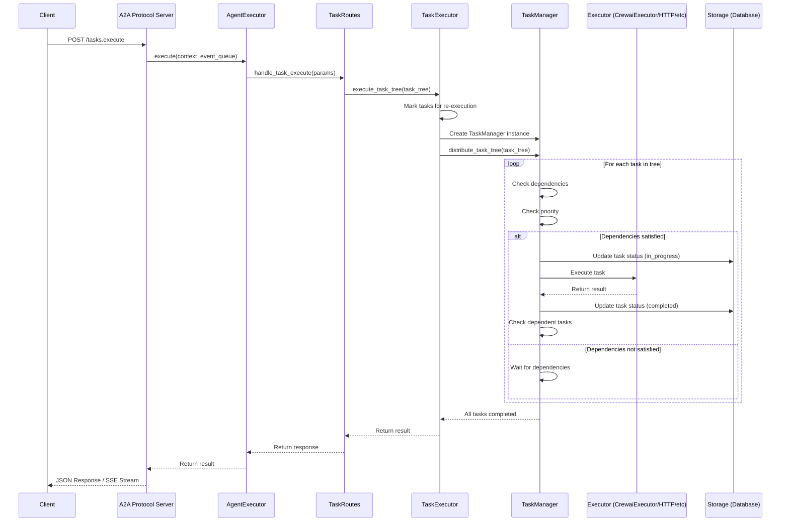
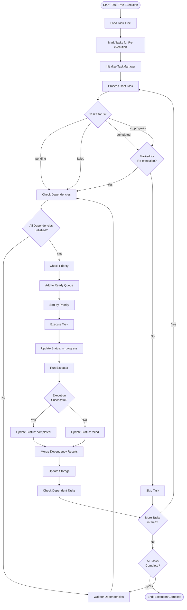
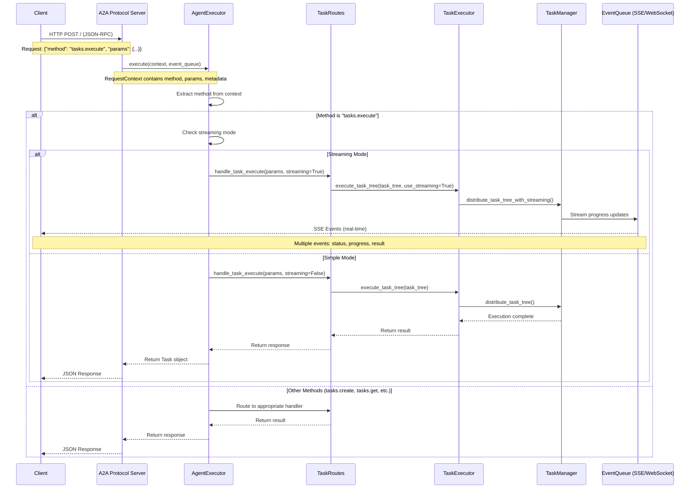
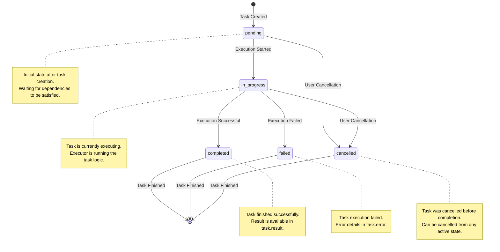
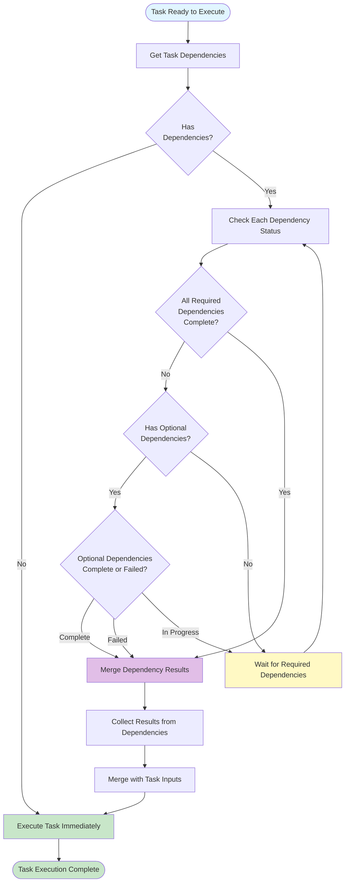
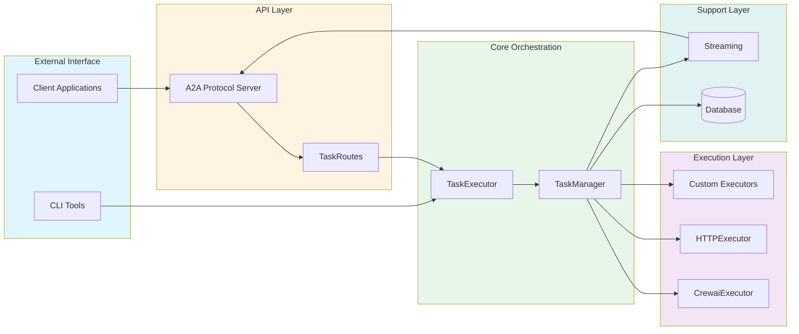

# Architecture Diagrams

This document contains visual diagrams that illustrate the architecture, execution flows, and key processes of apflow.

## Table of Contents

1. [Task Execution Sequence Diagram](#task-execution-sequence-diagram)
2. [Task Orchestration Flow Diagram](#task-orchestration-flow-diagram)
3. [A2A Protocol Interaction Sequence Diagram](#a2a-protocol-interaction-sequence-diagram)
4. [Task Lifecycle State Diagram](#task-lifecycle-state-diagram)
5. [Dependency Resolution Flow Diagram](#dependency-resolution-flow-diagram)

## Task Execution Sequence Diagram

This diagram shows the complete flow from API request to task completion, including all major components involved in task execution.

## Task Orchestration Flow Diagram

This diagram illustrates how TaskManager orchestrates task execution, including dependency resolution, priority scheduling, and state management.

## A2A Protocol Interaction Sequence Diagram

This diagram shows how the A2A Protocol Server handles requests, from client request to task execution and response.

## Task Lifecycle State Diagram

This diagram shows all possible state transitions for a task during its lifecycle.

## Dependency Resolution Flow Diagram

This diagram illustrates how the system resolves task dependencies, waits for dependencies to complete, and merges dependency results into task inputs.

## Component Interaction Overview

This diagram provides a high-level view of how major components interact in the system.

## Notes on Diagram Usage

These diagrams are designed to:

1. **Help developers understand** the system architecture and data flow
2. **Guide implementation** by showing the sequence of operations
3. **Aid debugging** by visualizing the execution path
4. **Support documentation** for new contributors

All diagrams use Mermaid syntax and should render correctly in MkDocs when using:
- `mkdocs-mermaid2-plugin`, or
- Material for MkDocs theme with Mermaid support

For more details on specific components, see:
- [Architecture Overview](overview.md) - Detailed component descriptions
- [Task Orchestration Guide](../guides/task-orchestration.md) - Task orchestration patterns
- [Core Concepts](../getting-started/concepts.md) - Fundamental concepts

