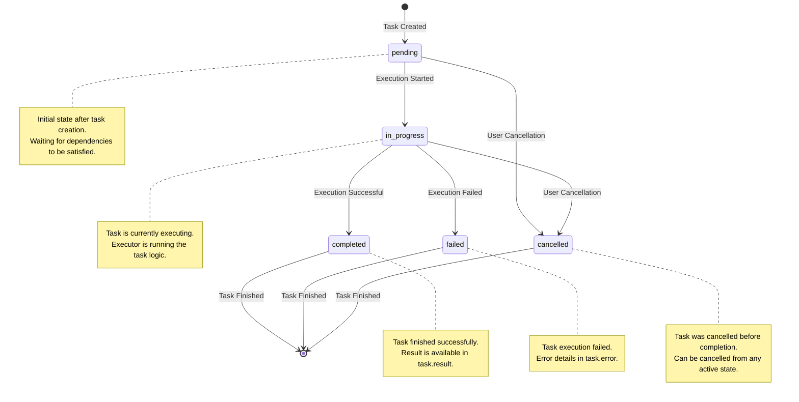
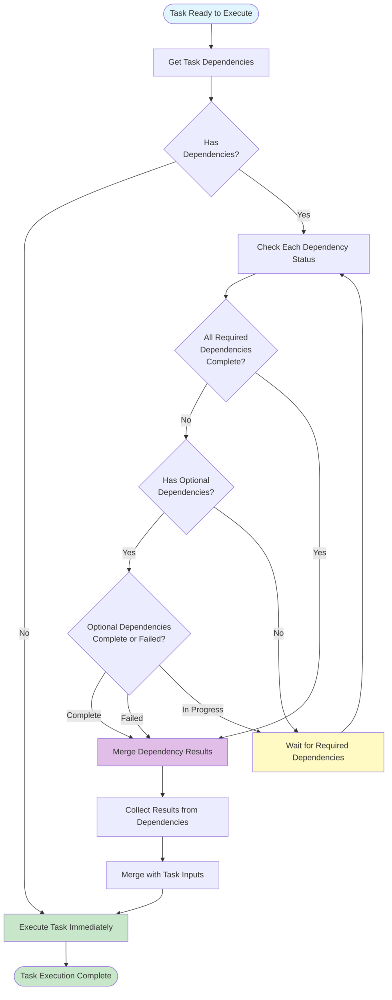

# Task Orchestration Guide

Master task orchestration in apflow. Learn how to create complex workflows, manage dependencies, and optimize execution.

## What You'll Learn

- ✅ How to build task trees and hierarchies
- ✅ How dependencies control execution order
- ✅ How priorities affect scheduling
- ✅ Common patterns and best practices
- ✅ Advanced orchestration techniques

## Table of Contents

1. [Core Concepts](#core-concepts)
2. [Creating Task Trees](#creating-task-trees)
3. [Dependencies](#dependencies)
4. [Priorities](#priorities)
5. [Common Patterns](#common-patterns)
6. [Best Practices](#best-practices)
7. [Advanced Topics](#advanced-topics)
   - [Task Copy and Re-execution](#task-copy-and-re-execution)
   - [Task Re-execution](#task-re-execution)

## Core Concepts

### What is Task Orchestration?

Task orchestration is the process of coordinating multiple tasks to work together. Think of it like conducting an orchestra - each musician (task) plays their part, but the conductor (TaskManager) ensures they play in harmony.

### Key Components

**TaskManager**: The orchestrator that coordinates everything
- Manages task execution
- Resolves dependencies
- Handles priorities
- Tracks status

**Task**: A unit of work
- Has an executor (the code that runs)
- Has inputs (parameters)
- Has a status (pending → in_progress → completed)

**Task Tree**: The structure that organizes tasks
- Hierarchical (parent-child relationships)
- Can have dependencies (execution order)
- Can have priorities (scheduling)

### Task Tree Structure

```
Root Task
│
├── Child Task 1 (depends on nothing)
│   │
│   └── Grandchild Task 1.1 (depends on Child Task 1)
│
├── Child Task 2 (depends on nothing, runs in parallel with Child Task 1)
│
└── Child Task 3 (depends on Child Task 1 and Child Task 2)
```

### Critical Distinction: Parent-Child vs Dependencies

**⚠️ This is the most important concept to understand!**

#### Parent-Child Relationship (`parent_id`)

**Purpose**: Organization only - like folders in a file system

- Used to **organize** the task tree structure
- Helps visualize the hierarchy
- **Does NOT affect execution order**
- Purely organizational

**Example:**
```python
# Task B is a child of Task A (organizational)
task_a = create_task(name="task_a")
task_b = create_task(name="task_b", parent_id=task_a.id)  # Child of A
```

#### Dependencies (`dependencies`)

**Purpose**: Execution control - determines when tasks run

- **Determines execution order**
- A task waits for its dependencies to complete
- Controls the actual execution sequence
- **This is what makes tasks wait for each other**

**Example:**
```python
# Task B depends on Task C (execution order)
task_c = create_task(name="task_c")
task_b = create_task(
    name="task_b",
    dependencies=[{"id": task_c.id, "required": True}]  # Waits for C
)
# Execution order: C runs first, then B
```

#### Combined Example

```python
# Task B is a child of Task A (organizational)
# But Task B depends on Task C (execution order)
task_a = create_task(name="task_a")
task_c = create_task(name="task_c")
task_b = create_task(
    name="task_b",
    parent_id=task_a.id,  # Organizational: B is child of A
    dependencies=[{"id": task_c.id, "required": True}]  # Execution: B waits for C
)
# Execution order: C executes first, then B (regardless of parent-child)
```

**Visual Representation:**
```
Task A (root)
│
└── Task B (child of A, but depends on C)
    │
    └── (depends on) Task C (not a child, but must run first!)
```

**Key Takeaway**: 
- Use `parent_id` for **organization** (like folders)
- Use `dependencies` for **execution order** (when tasks run)

### Task Lifecycle

Tasks go through these states:



**Status Meanings:**
- **pending**: Created but not executed yet
- **in_progress**: Currently executing
- **completed**: Finished successfully
- **failed**: Execution failed (check `task.error`)
- **cancelled**: Was cancelled (check `task.error`)

## Creating Task Trees

### Basic Task Tree

The simplest possible tree - a single task:

```python
import asyncio
from apflow import TaskManager, TaskTreeNode, create_session

async def main():
    db = create_session()
    task_manager = TaskManager(db)
    
    # Create a task
    task = await task_manager.task_repository.create_task(
        name="system_info_executor",  # Executor ID
        user_id="user123",
        priority=2,
        inputs={"resource": "cpu"}
    )
    
    # Build task tree (even single tasks need a tree)
    task_tree = TaskTreeNode(task)
    
    # Execute
    await task_manager.distribute_task_tree(task_tree)
    
    # Get result
    result = await task_manager.task_repository.get_task_by_id(task.id)
    print(f"Status: {result.status}")
    print(f"Result: {result.result}")

if __name__ == "__main__":
    asyncio.run(main())
```

### Hierarchical Task Tree

Create a tree with parent-child relationships:

```python
# Create root task
root_task = await task_manager.task_repository.create_task(
    name="root_task",
    user_id="user123",
    priority=1
)

# Create child tasks
child1 = await task_manager.task_repository.create_task(
    name="child_task_1",
    user_id="user123",
    parent_id=root_task.id,  # Child of root
    priority=2,
    inputs={"step": 1}
)

child2 = await task_manager.task_repository.create_task(
    name="child_task_2",
    user_id="user123",
    parent_id=root_task.id,  # Also child of root
    priority=2,
    inputs={"step": 2}
)

# Build tree
root = TaskTreeNode(root_task)
root.add_child(TaskTreeNode(child1))
root.add_child(TaskTreeNode(child2))

# Execute
await task_manager.distribute_task_tree(root)
```

**Visual Structure:**
```
Root Task
│
├── Child Task 1
└── Child Task 2
```

## Dependencies

Dependencies are the mechanism that controls execution order. They ensure tasks run in the correct sequence.

### Dependency Resolution Flow

The following diagram illustrates how the system resolves task dependencies:



### Basic Dependency

```python
# Task 1: Fetch data
fetch_task = await task_manager.task_repository.create_task(
    name="fetch_data",
    user_id="user123",
    priority=1,
    inputs={"url": "https://api.example.com/data"}
)

# Task 2: Process data (depends on Task 1)
process_task = await task_manager.task_repository.create_task(
    name="process_data",
    user_id="user123",
    parent_id=fetch_task.id,
    dependencies=[{"id": fetch_task.id, "required": True}],  # Waits for fetch_task
    priority=2,
    inputs={"operation": "analyze"}
)

# Build tree
task_tree = TaskTreeNode(fetch_task)
task_tree.add_child(TaskTreeNode(process_task))

# Execute
# Execution order: fetch_task → process_task (automatic!)
await task_manager.distribute_task_tree(task_tree)
```

**Execution Flow:**
```
Fetch Task (runs first)
    ↓
Process Task (waits for Fetch, then runs)
```

### Sequential Pipeline

Create a pipeline where each task depends on the previous:

```python
# Step 1: Fetch
fetch = await task_manager.task_repository.create_task(
    name="fetch_data",
    user_id="user123",
    priority=1
)

# Step 2: Process (depends on fetch)
process = await task_manager.task_repository.create_task(
    name="process_data",
    user_id="user123",
    parent_id=fetch.id,
    dependencies=[{"id": fetch.id, "required": True}],
    priority=2
)

# Step 3: Save (depends on process)
save = await task_manager.task_repository.create_task(
    name="save_results",
    user_id="user123",
    parent_id=fetch.id,
    dependencies=[{"id": process.id, "required": True}],
    priority=3
)

# Build pipeline
root = TaskTreeNode(fetch)
root.add_child(TaskTreeNode(process))
root.add_child(TaskTreeNode(save))

# Execute
# Order: Fetch → Process → Save (automatic!)
await task_manager.distribute_task_tree(root)
```

**Execution Flow:**
```
Fetch → Process → Save
```

### Multiple Dependencies

A task can depend on multiple other tasks:

```python
# Task 1
task1 = await task_manager.task_repository.create_task(
    name="task1",
    user_id="user123",
    priority=1
)

# Task 2
task2 = await task_manager.task_repository.create_task(
    name="task2",
    user_id="user123",
    priority=1
)

# Task 3 depends on BOTH Task 1 and Task 2
task3 = await task_manager.task_repository.create_task(
    name="task3",
    user_id="user123",
    parent_id=root_task.id,
    dependencies=[
        {"id": task1.id, "required": True},
        {"id": task2.id, "required": True}
    ],
    priority=2
)
```

**Execution Flow:**
```
Task 1 ──┐
         ├──→ Task 3 (waits for both)
Task 2 ──┘
```

Task 3 will only execute after **both** Task 1 and Task 2 complete.

### Dependency Types

#### Required Dependencies

Required dependencies must complete successfully:

```python
dependencies=[
    {"id": task1.id, "required": True}  # Must complete successfully
]
```

**Behavior:**
- Task waits for dependency to complete
- If dependency fails, dependent task does NOT execute
- This is the default behavior

#### Optional Dependencies

Optional dependencies allow execution even if dependency fails:

```python
dependencies=[
    {"id": task1.id, "required": False}  # Can execute even if task1 fails
]
```

**Behavior:**
- Task waits for dependency to complete (or fail)
- If dependency fails, dependent task still executes
- Useful for fallback scenarios

**Example:**
```python
# Primary task
primary = await task_manager.task_repository.create_task(
    name="primary_task",
    user_id="user123",
    priority=1
)

# Fallback task (runs even if primary fails)
fallback = await task_manager.task_repository.create_task(
    name="fallback_task",
    user_id="user123",
    dependencies=[{"id": primary.id, "required": False}],  # Optional
    priority=2
)
```

## Priorities

Priorities control execution order when multiple tasks are ready to run.

### Priority Levels

```
0 = Urgent (highest priority)
1 = High
2 = Normal (default)
3 = Low (lowest priority)
```

**Rule**: Lower numbers = higher priority = execute first

### Basic Priority

```python
# Urgent task (executes first)
urgent = await task_manager.task_repository.create_task(
    name="urgent_task",
    user_id="user123",
    priority=0  # Highest priority
)

# Normal task (executes after urgent)
normal = await task_manager.task_repository.create_task(
    name="normal_task",
    user_id="user123",
    priority=2  # Normal priority
)
```

**Execution Order:**
1. Urgent task (priority 0)
2. Normal task (priority 2)

### Priority with Dependencies

**Important**: Dependencies take precedence over priorities!

```python
# Task 1 (priority 2, no dependencies)
task1 = await task_manager.task_repository.create_task(
    name="task1",
    user_id="user123",
    priority=2
)

# Task 2 (priority 0, depends on Task 1)
task2 = await task_manager.task_repository.create_task(
    name="task2",
    user_id="user123",
    dependencies=[{"id": task1.id, "required": True}],
    priority=0  # Higher priority, but still waits for Task 1!
)
```

**Execution Order:**
1. Task 1 (priority 2, but no dependencies - runs first)
2. Task 2 (priority 0, but waits for Task 1 - runs second)

**Key Point**: Even though Task 2 has higher priority, it waits for Task 1 because of the dependency!

### Priority Best Practices

1. **Use consistently**: Establish priority conventions in your project
2. **Don't overuse**: Most tasks should use priority 2 (normal)
3. **Reserve 0 for emergencies**: Only use priority 0 for critical tasks
4. **Remember dependencies**: Priorities only matter when tasks are ready to run

## Common Patterns

### Pattern 1: Sequential Pipeline

**Use Case**: Steps that must happen in order

```
Task 1 → Task 2 → Task 3
```

**Implementation:**
```python
task1 = create_task(name="step1")
task2 = create_task(
    name="step2",
    dependencies=[{"id": task1.id, "required": True}]
)
task3 = create_task(
    name="step3",
    dependencies=[{"id": task2.id, "required": True}]
)
```

**Examples:**
- Data pipeline: Fetch → Process → Save
- Build process: Compile → Test → Deploy
- ETL: Extract → Transform → Load

### Pattern 2: Fan-Out (Parallel)

**Use Case**: One task spawns multiple independent tasks

```
Root Task
│
├── Task 1 (parallel)
├── Task 2 (parallel)
└── Task 3 (parallel)
```

**Implementation:**
```python
root = create_task(name="root")
task1 = create_task(name="task1", parent_id=root.id)  # No dependencies
task2 = create_task(name="task2", parent_id=root.id)  # No dependencies
task3 = create_task(name="task3", parent_id=root.id)  # No dependencies
```

**Examples:**
- Process multiple files in parallel
- Call multiple APIs simultaneously
- Run independent analyses

### Pattern 3: Fan-In (Converge)

**Use Case**: Multiple tasks converge to one final task

```
Task 1 ──┐
Task 2 ──├──→ Final Task
Task 3 ──┘
```

**Implementation:**
```python
task1 = create_task(name="task1")
task2 = create_task(name="task2")
task3 = create_task(name="task3")

final = create_task(
    name="final",
    dependencies=[
        {"id": task1.id, "required": True},
        {"id": task2.id, "required": True},
        {"id": task3.id, "required": True}
    ]
)
```

**Examples:**
- Aggregate results from multiple sources
- Combine data from parallel processing
- Merge multiple analyses

### Pattern 4: Complex Workflow

**Use Case**: Combination of patterns

```
Root
│
├── Task 1 ──┐
│           │
├── Task 2 ─┼──→ Task 4 ──┐
│           │              │
└── Task 3 ─┘              ├──→ Final
                            │
                            └──→ Task 5
```

**Implementation:**
```python
root = create_task(name="root")
task1 = create_task(name="task1", parent_id=root.id)
task2 = create_task(name="task2", parent_id=root.id)
task3 = create_task(name="task3", parent_id=root.id)

task4 = create_task(
    name="task4",
    parent_id=root.id,
    dependencies=[
        {"id": task1.id, "required": True},
        {"id": task2.id, "required": True},
        {"id": task3.id, "required": True}
    ]
)

task5 = create_task(name="task5", parent_id=root.id)

final = create_task(
    name="final",
    parent_id=root.id,
    dependencies=[
        {"id": task4.id, "required": True},
        {"id": task5.id, "required": True}
    ]
)
```

### Pattern 5: Conditional Execution

**Use Case**: Fallback or alternative paths

```
Primary Task ──┐
               ├──→ Success Task
               │
Fallback Task ─┘
```

**Implementation:**
```python
primary = create_task(name="primary")
fallback = create_task(name="fallback")

success = create_task(
    name="success",
    dependencies=[
        {"id": primary.id, "required": False},  # Optional
        {"id": fallback.id, "required": False}  # Optional
    ]
)
```

## Best Practices

### 1. Use Meaningful Task Names

**Good:**
```python
name="fetch_user_data"
name="process_payment"
name="send_notification_email"
```

**Bad:**
```python
name="task1"
name="do_stuff"
name="x"
```

### 2. Set Appropriate Priorities

**Convention:**
- `0`: Critical/emergency tasks only
- `1`: High priority business tasks
- `2`: Normal tasks (default)
- `3`: Low priority/background tasks

**Example:**
```python
# Critical payment processing
payment = create_task(name="process_payment", priority=0)

# Normal data processing
data = create_task(name="process_data", priority=2)

# Background cleanup
cleanup = create_task(name="cleanup", priority=3)
```

### 3. Handle Dependencies Explicitly

**Always specify dependencies explicitly:**

**Good:**
```python
task2 = create_task(
    name="task2",
    dependencies=[{"id": task1.id, "required": True}]  # Explicit
)
```

**Bad:**
```python
# Relying on implicit order - don't do this!
task1 = create_task(...)
task2 = create_task(...)  # No dependency, but hoping task1 runs first
```

### 4. Use Parent-Child for Organization, Dependencies for Execution

**Remember:**
- `parent_id`: Organization (like folders)
- `dependencies`: Execution order (when tasks run)

**Good:**
```python
root = create_task(name="root")
child = create_task(
    name="child",
    parent_id=root.id,  # Organizational
    dependencies=[{"id": "other_task", "required": True}]  # Execution
)
```

**Bad:**
```python
# Don't rely on parent-child for execution order!
child = create_task(
    name="child",
    parent_id=root.id  # This doesn't guarantee execution order!
)
```

### 5. Handle Errors Gracefully

**Always check task status:**

```python
await task_manager.distribute_task_tree(task_tree)

# Check all tasks
for task in tasks:
    result = await task_manager.task_repository.get_task_by_id(task.id)
    if result.status == "failed":
        print(f"Task {task.id} failed: {result.error}")
        # Handle failure appropriately
```

### 6. Keep Task Trees Manageable

**Good:**
- Break complex workflows into smaller trees
- Use clear naming conventions
- Document complex dependencies

**Bad:**
- Creating massive trees with hundreds of tasks
- Unclear dependency chains
- No documentation

### Task Cancellation

Cancel a running task:

```python
result = await task_manager.cancel_task(
    task_id="task_123",
    error_message="User requested cancellation"
)
```

**Note**: Not all executors support cancellation. Check `executor.cancelable` property.

### Task Re-execution

Tasks can be marked for re-execution if dependencies fail:

```python
# If a dependency fails, dependent tasks are marked for re-execution
# This allows retrying failed workflows
```

### Streaming Execution

Get real-time updates during execution:

```python
# Execute with streaming
await task_manager.distribute_task_tree_with_streaming(
    task_tree,
    use_callback=True
)
```

### Dependency Resolution

Dependency results are automatically merged into task inputs:

```python
#### Copy, Link, and Snapshot Behavior

**from_copy:**
- Deep copy of a task or tree (optionally with children and dependencies)
- All copied tasks get new IDs and are independent from the original
- Useful for retries, A/B testing, and templating

**from_link:**
- Creates a reference to an existing task (no data duplication)
- Linked tasks share results with the original
- Useful for deduplication and sharing computation
**Note:** If `user_id` is specified, the linked task's `user_id` must match. Linking to a task with a different `user_id` is not allowed for security and data isolation reasons.

**from_archive:**
- Creates a frozen, read-only copy of a task or tree
- Preserves the state at the time of archive
- Useful for audit, compliance, and reproducibility

**from_mixed:**
- Advanced: mix links and copies in a new tree
- Enables hybrid workflows (e.g., copy some tasks, link others)
**Note:** When using links in a mixed tree, if `user_id` is specified, all linked tasks must have the same `user_id`. Linking to tasks with a different `user_id` is not permitted.

**What Gets Copied or Linked:**
- Task definition (name, schemas, inputs, params, etc.)
- Task hierarchy (parent-child relationships)
- Dependencies (when copying recursively)
- Task metadata (user_id, priority, etc.)

**What Gets Reset (for copies):**
- `status`: Set to `"pending"`
- `result`: Set to `None`
- `progress`: Set to `0.0`
- Execution timestamps

**What Gets Preserved:**
- Original task remains unchanged
- Execution history and results are preserved in the original

**Deduplication:**
- When copying with children, dependencies are only copied once
- The copied tree maintains the same structure as the original
**Problem**: Task never completes

**Solutions**:
1. Check if executor is hanging
2. Verify executor supports cancellation
3. Check for deadlocks in dependencies
4. Review executor implementation

## Next Steps

- **[Custom Tasks Guide](custom-tasks.md)** - Create your own executors
- **[Basic Examples](../examples/basic_task.md)** - More practical examples
- **[Best Practices Guide](best-practices.md)** - Advanced techniques
- **[API Reference](../api/python.md)** - Complete API documentation

---

**Need help?** Check the [FAQ](faq.md) or [Quick Start Guide](../getting-started/quick-start.md)

## Task Data Fields: inputs, params, and result

To ensure clean, composable, and predictable task orchestration, apflow enforces a strict separation of concerns for task data fields:

- **inputs**: Only business input data for the task. This is the data the executor will process (e.g., text to summarize, file to process, etc.). It should never include configuration, credentials, or executor-specific settings.
- **params**: Only executor configuration and setup parameters (e.g., API keys, model names, connection info). These are used to initialize the executor and are not passed as business data.
- **result**: Only the pure business output of the task. This is the value that downstream tasks will consume as their `inputs`. The `result` should not include logs, token usage, internal metadata, or any executor-specific structure—just the output relevant to the user or next task.

**Why this matters:**
This separation ensures that:
- Task data flows are clean and composable in a task tree.
- Executors are reusable and predictable.
- Downstream tasks can directly use upstream results as their inputs, without worrying about mixed-in configuration or irrelevant metadata.

**Best Practice:**
- Executors should only use `params` for initialization, process `inputs` as business data, and return a clean `result`.
- Never mix configuration into `inputs` or `result`.

For detailed field definitions and examples, see the [Data Model Protocol documentation](https://flow-docs.aipartnerup.com/protocol/03-data-model/).
