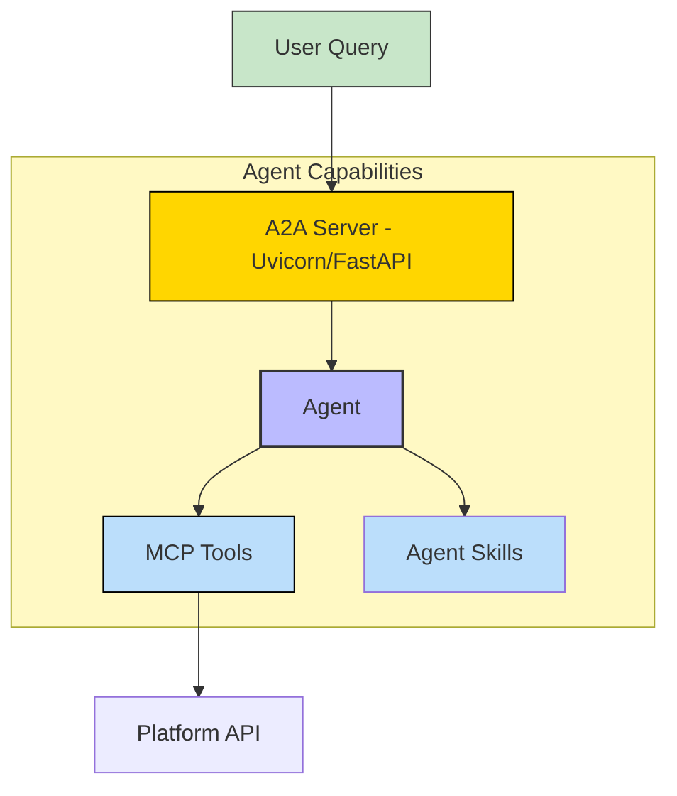
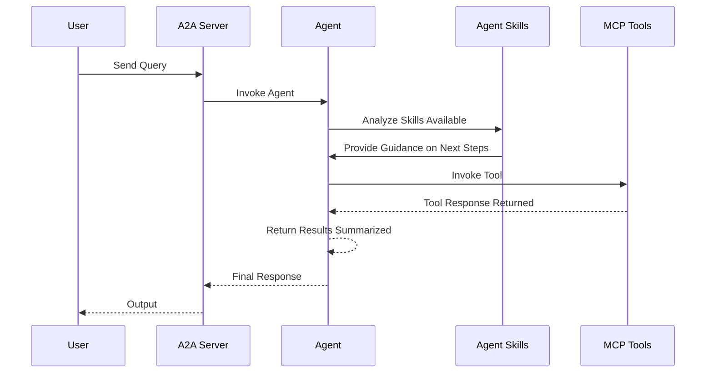

# ArchiveBox API - A2A | AG-UI | MCP


*Version: 0.0.19*

## Overview

ArchiveBox API Python Wrapper & Fast MCP Server!

This repository provides a Python wrapper for interacting with the ArchiveBox API, enabling programmatic access to web archiving functionality. It includes a Model Context Protocol (MCP) server for Agentic AI, enhanced with various authentication mechanisms, middleware for observability and control, and optional Eunomia authorization for policy-based access control.

Contributions are welcome!

All API Response objects are customized for the response call. You can access return values in a `parent.value.nested_value` format, or use `parent.json()` to get the response as a dictionary.

#### Features:
- **Authentication**: Supports multiple authentication types including none (disabled), static (internal tokens), JWT, OAuth Proxy, OIDC Proxy, and Remote OAuth for external identity providers.
- **Middleware**: Includes logging, timing, rate limiting, and error handling for robust server operation.
- **Eunomia Authorization**: Optional policy-based authorization with embedded or remote Eunomia server integration.
- **Resources**: Provides `instance_config` for ArchiveBox configuration.
- **Prompts**: Includes `cli_add_prompt` for AI-driven interactions.


## API

### API Calls:
- Authentication
- Core Model (Snapshots, ArchiveResults, Tags)
- CLI Commands (add, update, schedule, list, remove)

If your API call isn't supported, you can extend the functionality by adding custom endpoints or modifying the existing wrapper.

[These are the API endpoints currently supported](https://demo.archivebox.io/api/v1/docs)

## MCP

All the available API Calls above are wrapped in MCP Tools. You can find those below with their tool descriptions and associated tag.

### MCP Tools

| Function Name        | Description                                                    | Tag(s)           |
|:---------------------|:---------------------------------------------------------------|:-----------------|
| `get_api_token`      | Generate an API token for a given username & password.         | `authentication` |
| `check_api_token`    | Validate an API token to make sure it's valid and non-expired. | `authentication` |
| `get_snapshots`      | Retrieve list of snapshots.                                    | `core`           |
| `get_snapshot`       | Get a specific Snapshot by abid or id.                         | `core`           |
| `get_archiveresults` | List all ArchiveResult entries matching these filters.         | `core`           |
| `get_tag`            | Get a specific Tag by id or abid.                              | `core`           |
| `get_any`            | Get a specific Snapshot, ArchiveResult, or Tag by abid.        | `core`           |
| `cli_add`            | Execute archivebox add command.                                | `cli`            |
| `cli_update`         | Execute archivebox update command.                             | `cli`            |
| `cli_schedule`       | Execute archivebox schedule command.                           | `cli`            |
| `cli_list`           | Execute archivebox list command.                               | `cli`            |
| `cli_remove`         | Execute archivebox remove command.                             | `cli`            |

## A2A Agent


### Architecture:



### Component Interaction Diagram



## Usage

### MCP

#### MCP CLI

| Short Flag | Long Flag                          | Description                                                                 |
|------------|------------------------------------|-----------------------------------------------------------------------------|
| -h         | --help                             | Display help information                                                    |
| -t         | --transport                        | Transport method: 'stdio', 'http', or 'sse' [legacy] (default: stdio)       |
| -s         | --host                             | Host address for HTTP transport (default: 0.0.0.0)                          |
| -p         | --port                             | Port number for HTTP transport (default: 8000)                              |
|            | --auth-type                        | Authentication type: 'none', 'static', 'jwt', 'oauth-proxy', 'oidc-proxy', 'remote-oauth' (default: none) |
|            | --token-jwks-uri                   | JWKS URI for JWT verification                                              |
|            | --token-issuer                     | Issuer for JWT verification                                                |
|            | --token-audience                   | Audience for JWT verification                                              |
|            | --oauth-upstream-auth-endpoint     | Upstream authorization endpoint for OAuth Proxy                             |
|            | --oauth-upstream-token-endpoint    | Upstream token endpoint for OAuth Proxy                                    |
|            | --oauth-upstream-client-id         | Upstream client ID for OAuth Proxy                                         |
|            | --oauth-upstream-client-secret     | Upstream client secret for OAuth Proxy                                     |
|            | --oauth-base-url                   | Base URL for OAuth Proxy                                                   |
|            | --oidc-config-url                  | OIDC configuration URL                                                     |
|            | --oidc-client-id                   | OIDC client ID                                                             |
|            | --oidc-client-secret               | OIDC client secret                                                         |
|            | --oidc-base-url                    | Base URL for OIDC Proxy                                                    |
|            | --remote-auth-servers              | Comma-separated list of authorization servers for Remote OAuth             |
|            | --remote-base-url                  | Base URL for Remote OAuth                                                  |
|            | --allowed-client-redirect-uris     | Comma-separated list of allowed client redirect URIs                       |
|            | --eunomia-type                     | Eunomia authorization type: 'none', 'embedded', 'remote' (default: none)   |
|            | --eunomia-policy-file              | Policy file for embedded Eunomia (default: mcp_policies.json)              |
|            | --eunomia-remote-url               | URL for remote Eunomia server                                              |

#### Using as an MCP Server

The MCP Server can be run in two modes: `stdio` (for local testing) or `http` (for networked access). To start the server, use the following commands:

#### Run in stdio mode (default):
```bash
archivebox-mcp --transport "stdio"
```

#### Run in HTTP mode:
```bash
archivebox-mcp --transport "http" --host "0.0.0.0" --port "8000"
```

### Basic API Usage

**Token Authentication**

```python
#!/usr/bin/python
# coding: utf-8
import archivebox_api

archivebox_url = "<ARCHIVEBOX_URL>"
token = "<ARCHIVEBOX_TOKEN>"

client = archivebox_api.Api(
    url=archivebox_url,
    token=token
)

snapshots = client.get_snapshots()
print(f"Snapshots: {snapshots.json()}")
```

**Basic Authentication**

```python
#!/usr/bin/python
# coding: utf-8
import archivebox_api

username = "<ARCHIVEBOX_USERNAME>"
password = "<ARCHIVEBOX_PASSWORD>"
archivebox_url = "<ARCHIVEBOX_URL>"

client = archivebox_api.Api(
    url=archivebox_url,
    username=username,
    password=password
)

snapshots = client.get_snapshots()
print(f"Snapshots: {snapshots.json()}")
```

**API Key Authentication**

```python
#!/usr/bin/python
# coding: utf-8
import archivebox_api

archivebox_url = "<ARCHIVEBOX_URL>"
api_key = "<ARCHIVEBOX_API_KEY>"

client = archivebox_api.Api(
    url=archivebox_url,
    api_key=api_key
)

snapshots = client.get_snapshots()
print(f"Snapshots: {snapshots.json()}")
```

**SSL Verify**

```python
#!/usr/bin/python
# coding: utf-8
import archivebox_api

username = "<ARCHIVEBOX_USERNAME>"
password = "<ARCHIVEBOX_PASSWORD>"
archivebox_url = "<ARCHIVEBOX_URL>"

client = archivebox_api.Api(
    url=archivebox_url,
    username=username,
    password=password,
    verify=False
)

snapshots = client.get_snapshots()
print(f"Snapshots: {snapshots.json()}")
```

### Deploy MCP Server as a Service

The ArchiveBox MCP server can be deployed using Docker, with configurable authentication, middleware, and Eunomia authorization.

#### Using Docker Run

```bash
docker pull archivebox/archivebox:latest

docker run -d \
  --name archivebox-mcp \
  -p 8004:8004 \
  -e HOST=0.0.0.0 \
  -e PORT=8004 \
  -e TRANSPORT=http \
  -e AUTH_TYPE=none \
  -e EUNOMIA_TYPE=none \
  -e ARCHIVEBOX_URL=https://yourinstance.archivebox.com \
  -e ARCHIVEBOX_USERNAME=user \
  -e ARCHIVEBOX_PASSWORD=pass \
  -e ARCHIVEBOX_TOKEN=token \
  -e ARCHIVEBOX_API_KEY=api_key \
  -e ARCHIVEBOX_VERIFY=False \
  archivebox/archivebox:latest
```

For advanced authentication (e.g., JWT, OAuth Proxy, OIDC Proxy, Remote OAuth) or Eunomia, add the relevant environment variables:

```bash
docker run -d \
  --name archivebox-mcp \
  -p 8004:8004 \
  -e HOST=0.0.0.0 \
  -e PORT=8004 \
  -e TRANSPORT=http \
  -e AUTH_TYPE=oidc-proxy \
  -e OIDC_CONFIG_URL=https://provider.com/.well-known/openid-configuration \
  -e OIDC_CLIENT_ID=your-client-id \
  -e OIDC_CLIENT_SECRET=your-client-secret \
  -e OIDC_BASE_URL=https://your-server.com \
  -e ALLOWED_CLIENT_REDIRECT_URIS=http://localhost:*,https://*.example.com/* \
  -e EUNOMIA_TYPE=embedded \
  -e EUNOMIA_POLICY_FILE=/app/mcp_policies.json \
  -e ARCHIVEBOX_URL=https://yourinstance.archivebox.com \
  -e ARCHIVEBOX_USERNAME=user \
  -e ARCHIVEBOX_PASSWORD=pass \
  -e ARCHIVEBOX_TOKEN=token \
  -e ARCHIVEBOX_API_KEY=api_key \
  -e ARCHIVEBOX_VERIFY=False \
  archivebox/archivebox:latest
```

#### Using Docker Compose

Create a `docker-compose.yml` file:

```yaml
services:
  archivebox-mcp:
    image: archivebox/archivebox:latest
    environment:
      - HOST=0.0.0.0
      - PORT=8004
      - TRANSPORT=http
      - AUTH_TYPE=none
      - EUNOMIA_TYPE=none
      - ARCHIVEBOX_URL=https://yourinstance.archivebox.com
      - ARCHIVEBOX_USERNAME=user
      - ARCHIVEBOX_PASSWORD=pass
      - ARCHIVEBOX_TOKEN=token
      - ARCHIVEBOX_API_KEY=api_key
      - ARCHIVEBOX_VERIFY=False
    ports:
      - 8004:8004
```

For advanced setups with authentication and Eunomia:

```yaml
services:
  archivebox-mcp:
    image: archivebox/archivebox:latest
    environment:
      - HOST=0.0.0.0
      - PORT=8004
      - TRANSPORT=http
      - AUTH_TYPE=oidc-proxy
      - OIDC_CONFIG_URL=https://provider.com/.well-known/openid-configuration
      - OIDC_CLIENT_ID=your-client-id
      - OIDC_CLIENT_SECRET=your-client-secret
      - OIDC_BASE_URL=https://your-server.com
      - ALLOWED_CLIENT_REDIRECT_URIS=http://localhost:*,https://*.example.com/*
      - EUNOMIA_TYPE=embedded
      - EUNOMIA_POLICY_FILE=/app/mcp_policies.json
      - ARCHIVEBOX_URL=https://yourinstance.archivebox.com
      - ARCHIVEBOX_USERNAME=user
      - ARCHIVEBOX_PASSWORD=pass
      - ARCHIVEBOX_TOKEN=token
      - ARCHIVEBOX_API_KEY=api_key
      - ARCHIVEBOX_VERIFY=False
    ports:
      - 8004:8004
    volumes:
      - ./mcp_policies.json:/app/mcp_policies.json
```

Run the service:

```bash
docker-compose up -d
```

#### Configure `mcp.json` for AI Integration

Recommended: Store secrets in environment variables with lookup in the JSON file.

For Testing Only: Plain text storage will also work, although **not** recommended.

```json
{
  "mcpServers": {
    "archivebox": {
      "command": "uv",
      "args": [
        "run",
        "--with",
        "archivebox-api",
        "archivebox-mcp",
        "--transport",
        "${TRANSPORT}",
        "--host",
        "${HOST}",
        "--port",
        "${PORT}",
        "--auth-type",
        "${AUTH_TYPE}",
        "--eunomia-type",
        "${EUNOMIA_TYPE}"
      ],
      "env": {
        "ARCHIVEBOX_URL": "https://yourinstance.archivebox.com",
        "ARCHIVEBOX_USERNAME": "user",
        "ARCHIVEBOX_PASSWORD": "pass",
        "ARCHIVEBOX_TOKEN": "token",
        "ARCHIVEBOX_API_KEY": "api_key",
        "ARCHIVEBOX_VERIFY": "False",
        "TOKEN_JWKS_URI": "${TOKEN_JWKS_URI}",
        "TOKEN_ISSUER": "${TOKEN_ISSUER}",
        "TOKEN_AUDIENCE": "${TOKEN_AUDIENCE}",
        "OAUTH_UPSTREAM_AUTH_ENDPOINT": "${OAUTH_UPSTREAM_AUTH_ENDPOINT}",
        "OAUTH_UPSTREAM_TOKEN_ENDPOINT": "${OAUTH_UPSTREAM_TOKEN_ENDPOINT}",
        "OAUTH_UPSTREAM_CLIENT_ID": "${OAUTH_UPSTREAM_CLIENT_ID}",
        "OAUTH_UPSTREAM_CLIENT_SECRET": "${OAUTH_UPSTREAM_CLIENT_SECRET}",
        "OAUTH_BASE_URL": "${OAUTH_BASE_URL}",
        "OIDC_CONFIG_URL": "${OIDC_CONFIG_URL}",
        "OIDC_CLIENT_ID": "${OIDC_CLIENT_ID}",
        "OIDC_CLIENT_SECRET": "${OIDC_CLIENT_SECRET}",
        "OIDC_BASE_URL": "${OIDC_BASE_URL}",
        "REMOTE_AUTH_SERVERS": "${REMOTE_AUTH_SERVERS}",
        "REMOTE_BASE_URL": "${REMOTE_BASE_URL}",
        "ALLOWED_CLIENT_REDIRECT_URIS": "${ALLOWED_CLIENT_REDIRECT_URIS}",
        "EUNOMIA_TYPE": "${EUNOMIA_TYPE}",
        "EUNOMIA_POLICY_FILE": "${EUNOMIA_POLICY_FILE}",
        "EUNOMIA_REMOTE_URL": "${EUNOMIA_REMOTE_URL}"
      },
      "timeout": 200000
    }
  }
}
```

#### CLI Parameters

The `archivebox-mcp` command supports the following CLI options for configuration:

- `--transport`: Transport method (`stdio`, `http`, `sse`) [default: `http`]
- `--host`: Host address for HTTP transport [default: `0.0.0.0`]
- `--port`: Port number for HTTP transport [default: `8000`]
- `--auth-type`: Authentication type (`none`, `static`, `jwt`, `oauth-proxy`, `oidc-proxy`, `remote-oauth`) [default: `none`]
- `--token-jwks-uri`: JWKS URI for JWT verification
- `--token-issuer`: Issuer for JWT verification
- `--token-audience`: Audience for JWT verification
- `--oauth-upstream-auth-endpoint`: Upstream authorization endpoint for OAuth Proxy
- `--oauth-upstream-token-endpoint`: Upstream token endpoint for OAuth Proxy
- `--oauth-upstream-client-id`: Upstream client ID for OAuth Proxy
- `--oauth-upstream-client-secret`: Upstream client secret for OAuth Proxy
- `--oauth-base-url`: Base URL for OAuth Proxy
- `--oidc-config-url`: OIDC configuration URL
- `--oidc-client-id`: OIDC client ID
- `--oidc-client-secret`: OIDC client secret
- `--oidc-base-url`: Base URL for OIDC Proxy
- `--remote-auth-servers`: Comma-separated list of authorization servers for Remote OAuth
- `--remote-base-url`: Base URL for Remote OAuth
- `--allowed-client-redirect-uris`: Comma-separated list of allowed client redirect URIs
- `--eunomia-type`: Eunomia authorization type (`none`, `embedded`, `remote`) [default: `none`]
- `--eunomia-policy-file`: Policy file for embedded Eunomia [default: `mcp_policies.json`]
- `--eunomia-remote-url`: URL for remote Eunomia server

#### Middleware

The MCP server includes the following built-in middleware for enhanced functionality:

- **ErrorHandlingMiddleware**: Provides comprehensive error logging and transformation.
- **RateLimitingMiddleware**: Limits request frequency with a token bucket algorithm (10 requests/second, burst capacity of 20).
- **TimingMiddleware**: Tracks execution time of requests.
- **LoggingMiddleware**: Logs all requests and responses for observability.

#### Eunomia Authorization

The server supports optional Eunomia authorization for policy-based access control:

- **Disabled (`none`)**: No authorization checks.
- **Embedded (`embedded`)**: Runs an embedded Eunomia server with a local policy file (`mcp_policies.json` by default).
- **Remote (`remote`)**: Connects to an external Eunomia server for centralized policy decisions.

To configure Eunomia policies:

```bash
# Initialize a default policy file
eunomia-mcp init

# Validate the policy file
eunomia-mcp validate mcp_policies.json
```

### A2A CLI
#### Endpoints
- **Web UI**: `http://localhost:8000/` (if enabled)
- **A2A**: `http://localhost:8000/a2a` (Discovery: `/a2a/.well-known/agent.json`)
- **AG-UI**: `http://localhost:8000/ag-ui` (POST)

| Short Flag | Long Flag         | Description                                                            |
|------------|-------------------|------------------------------------------------------------------------|
| -h         | --help            | Display help information                                               |
|            | --host            | Host to bind the server to (default: 0.0.0.0)                          |
|            | --port            | Port to bind the server to (default: 9000)                             |
|            | --reload          | Enable auto-reload                                                     |
|            | --provider        | LLM Provider: 'openai', 'anthropic', 'google', 'huggingface'           |
|            | --model-id        | LLM Model ID (default: qwen3:4b)                                       |
|            | --base-url        | LLM Base URL (for OpenAI compatible providers)                         |
|            | --api-key         | LLM API Key                                                            |

|            | --mcp-url         | MCP Server URL (default: http://localhost:8000/mcp)                    |
|            | --web             | Enable Pydantic AI Web UI                                              | False (Env: ENABLE_WEB_UI) |


## Install Python Package

```bash
python -m pip install archivebox-api[all]
```


## Repository Owners


