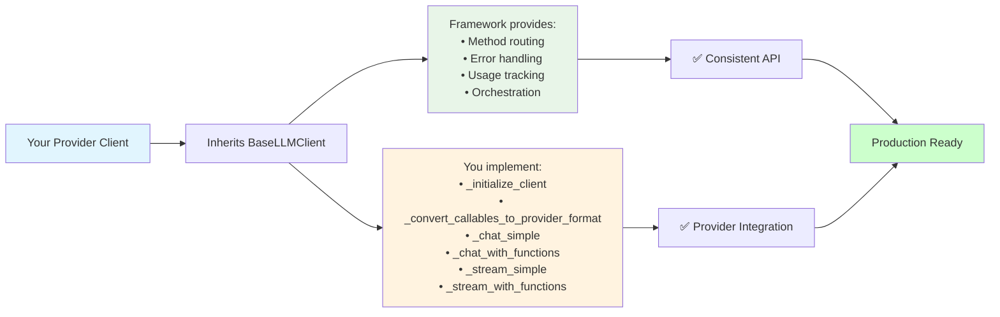
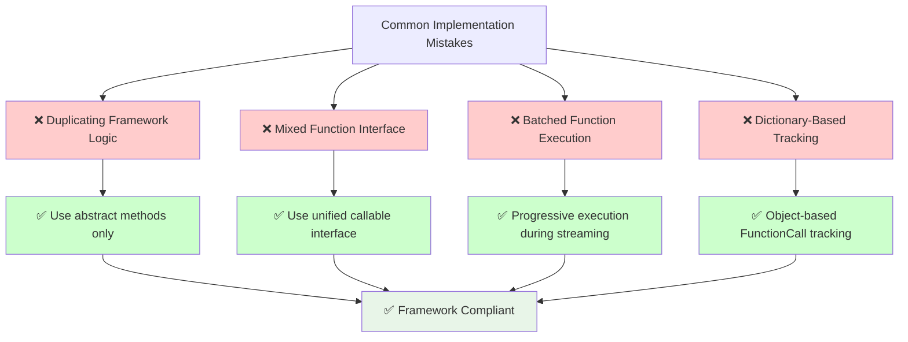

# Arshai LLM Implementation Guide

This document provides critical implementation notes and step-by-step guidance for contributors and maintainers working with LLM clients in the Arshai framework.

## ⚠️ CRITICAL IMPLEMENTATION NOTES

**READ THESE CAREFULLY BEFORE MODIFYING ANY LLM CLIENT**

### 1. BaseLLMClient Framework Compliance

**CRITICAL**: All LLM clients MUST inherit from `BaseLLMClient` and implement exactly 5 abstract methods:

#### Framework Implementation Requirements



```python
@abstractmethod
def _initialize_client(self) -> Any
@abstractmethod  
def _convert_callables_to_provider_format(self, functions: Dict[str, Callable]) -> Any
@abstractmethod
async def _chat_simple(self, input: ILLMInput) -> Dict[str, Any]
@abstractmethod
async def _chat_with_functions(self, input: ILLMInput) -> Dict[str, Any]
@abstractmethod
async def _stream_simple(self, input: ILLMInput) -> AsyncGenerator[Dict[str, Any], None]
@abstractmethod
async def _stream_with_functions(self, input: ILLMInput) -> AsyncGenerator[Dict[str, Any], None]
```

**DO NOT**:
- Override public methods (`chat()`, `stream()`) - the framework handles routing
- Duplicate framework logic - routing, orchestration, and error handling are centralized
- Implement deprecated methods (`chat_with_tools()`, `stream_with_tools()`) - they delegate automatically

### 2. Unified Function Interface Requirements

**CRITICAL**: The interface has been unified to use ONLY callables:

```python
# CORRECT - Current interface
input = ILLMInput(
    regular_functions={"func": callable_function},  # Dict[str, Callable]
    background_tasks={"task": background_callable}  # Dict[str, Callable]
)

# WRONG - Old mixed interface (removed)
input = ILLMInput(
    tools_list=[{"name": "func", "parameters": {...}}],  # REMOVED
    callable_functions={"func": callable_function}       # REMOVED
)
```

**Implementation Requirements**:
- All functions must be Python `Callable` objects
- Background tasks identified by `"BACKGROUND TASK:"` prefix in docstring
- Use `_convert_callables_to_provider_format()` for pure conversion only
- No execution metadata in conversion methods

### 3. Progressive Streaming Implementation

**CRITICAL**: All streaming methods must support progressive (real-time) function execution:

```python
# REQUIRED pattern in _stream_with_functions():
async def _stream_with_functions(self, input: ILLMInput) -> AsyncGenerator[Dict[str, Any], None]:
    # 1. Initialize streaming state
    streaming_state = StreamingExecutionState()
    tool_calls_in_progress = {}
    
    # 2. Process streaming chunks
    async for chunk in provider_stream:
        # 3. Handle function calls progressively
        if has_function_calls(chunk):
            for function_call in extract_function_calls(chunk):
                # 4. Execute immediately when complete
                if self._is_function_complete(function_call):
                    if not streaming_state.is_already_executed(function_call):
                        task = await self._execute_function_progressively(function_call, input)
                        streaming_state.add_function_task(task, function_call)
    
    # 5. Gather results after stream completes
    if streaming_state.active_function_tasks:
        execution_result = await self._gather_progressive_results(streaming_state.active_function_tasks)
        # Add results to context for next turn if needed
```

**DO NOT**:
- Execute functions only after stream completion (batched approach)
- Ignore `StreamingExecutionState` for duplicate prevention
- Skip progressive execution for background tasks

### 4. Function Orchestrator Integration

**CRITICAL**: Use the object-based orchestrator approach:

```python
# CORRECT - Object-based approach (prevents infinite loops)
function_calls_list = []
for i, tool_call in enumerate(provider_tool_calls):
    function_name = extract_name(tool_call)
    function_args = extract_args(tool_call)
    
    # Determine execution type
    is_background = function_name in (input.background_tasks or {})
    
    function_calls_list.append(FunctionCall(
        name=function_name,
        args=function_args,
        call_id=f"{function_name}_{i}",  # Unique identifier prevents duplicates
        is_background=is_background
    ))

# Execute via orchestrator
execution_input = FunctionExecutionInput(
    function_calls=function_calls_list,
    available_functions=input.regular_functions or {},
    available_background_tasks=input.background_tasks or {}
)
result = await self._execute_functions_with_orchestrator(execution_input)
```

**DO NOT**:
- Use dictionary-based approaches that lose duplicate function calls
- Skip call_id generation - it's required for duplicate prevention
- Execute functions directly - always use the orchestrator

### 5. Error Handling Requirements

**CRITICAL**: Follow the "collect errors but continue execution" philosophy:

```python
# CORRECT - Resilient error handling
try:
    response = await provider_api_call()
    # Process response...
except ProviderError as e:
    self.logger.error(f"Provider error in turn {current_turn}: {str(e)}")
    return {
        "llm_response": f"Provider temporarily unavailable: {str(e)}",
        "usage": accumulated_usage or self._standardize_usage_metadata(
            None, self._get_provider_name(), self.config.model
        )
    }
```

**Requirements**:
- Always return usage metadata, even on errors
- Provide informative error messages to users
- Log errors with context (turn number, function name, etc.)
- Don't let single function failures break entire conversations

### 6. Usage Tracking Standards

**CRITICAL**: All methods must return standardized usage metadata:

```python
# REQUIRED format
usage = self._standardize_usage_metadata(
    raw_provider_usage,
    self._get_provider_name(),
    self.config.model,
    request_id  # Optional
)

# Expected output format
{
    "input_tokens": int,      # REQUIRED
    "output_tokens": int,     # REQUIRED  
    "total_tokens": int,      # REQUIRED
    "thinking_tokens": int,   # Optional - for reasoning models
    "tool_calling_tokens": int, # Optional - function calling overhead
    "provider": str,          # REQUIRED - for identification
    "model": str,            # REQUIRED - for cost tracking
    "request_id": str        # Optional - provider request ID
}
```

## Implementation Step-by-Step Guide

### Step 1: Client Class Setup

```python
from arshai.llms.base_llm_client import BaseLLMClient
from arshai.core.interfaces.illm import ILLMConfig, ILLMInput
from arshai.llms.utils.function_execution import FunctionCall, FunctionExecutionInput, StreamingExecutionState

class YourProviderClient(BaseLLMClient):
    """
    [Provider] implementation using the BaseLLMClient framework.
    
    CRITICAL: This docstring should clearly state:
    - Provider name and version
    - Key capabilities and optimizations  
    - Authentication requirements
    - Any provider-specific patterns
    """
    
    def __init__(self, config: ILLMConfig, **provider_kwargs):
        # Store provider-specific configuration BEFORE calling super()
        self.provider_specific_config = provider_kwargs
        
        # CRITICAL: Call super().__init__() last - it calls _initialize_client()
        super().__init__(config)
```

### Step 2: Client Initialization

```python
def _initialize_client(self) -> Any:
    """
    CRITICAL: This method is called by BaseLLMClient.__init__()
    
    Requirements:
    - Check required environment variables/configuration
    - Try SafeHttpClientFactory if available, fallback to basic client
    - Handle authentication (API keys, service accounts, etc.)
    - Return configured client instance
    - Raise ValueError with clear message if configuration missing
    """
    # Example implementation:
    api_key = os.environ.get("PROVIDER_API_KEY")
    if not api_key:
        raise ValueError("PROVIDER_API_KEY environment variable is required")
    
    try:
        from arshai.clients.utils.safe_http_client import SafeHttpClientFactory
        self.logger.info("Creating client with safe HTTP configuration")
        return SafeHttpClientFactory.create_provider_client(api_key=api_key)
    except ImportError:
        self.logger.warning("Safe HTTP client not available, using basic client")
        return ProviderSDK(api_key=api_key)
```

### Step 3: Function Conversion

```python
def _convert_callables_to_provider_format(self, functions: Dict[str, Callable]) -> Any:
    """
    CRITICAL: Pure conversion only - no execution metadata
    
    Requirements:
    - Convert Python callables to provider-specific format
    - Detect background tasks by docstring prefix "BACKGROUND TASK:"
    - Use function introspection for parameter schemas
    - Handle conversion failures gracefully (log warning, skip function)
    - Return provider-specific format (OpenAI tools, Gemini FunctionDeclarations, etc.)
    """
    provider_functions = []
    
    for name, func in functions.items():
        try:
            # Inspect function
            signature = inspect.signature(func)
            description = func.__doc__ or f"Execute {name} function"
            is_background_task = description.startswith("BACKGROUND TASK:")
            
            # Build provider-specific schema
            schema = self._build_function_schema(name, signature, description)
            provider_functions.append(schema)
            
            self.logger.debug(f"Converted {'background task' if is_background_task else 'function'}: {name}")
            
        except Exception as e:
            self.logger.warning(f"Failed to convert function {name}: {str(e)}")
            continue
    
    return provider_functions
```

### Step 4: Simple Methods Implementation

```python
async def _chat_simple(self, input: ILLMInput) -> Dict[str, Any]:
    """
    CRITICAL: Handle simple chat without function calling
    
    Requirements:
    - No tools/functions in the request
    - Support structured output if input.structure_type provided
    - Return standardized format: {"llm_response": content, "usage": usage}
    - Handle provider errors gracefully
    """
    # Implementation example in contributing guide

async def _stream_simple(self, input: ILLMInput) -> AsyncGenerator[Dict[str, Any], None]:
    """
    CRITICAL: Handle simple streaming without function calling
    
    Requirements:  
    - Progressive text streaming: yield {"llm_response": accumulated_text}
    - Final usage yield: yield {"llm_response": None, "usage": usage}
    - Handle structured output streaming if requested
    - Error handling with informative yield
    """
    # Implementation example in contributing guide
```

### Step 5: Complex Methods Implementation

**This is the most critical part - function calling with progressive streaming.**

```python
async def _chat_with_functions(self, input: ILLMInput) -> Dict[str, Any]:
    """
    CRITICAL: Multi-turn function calling implementation
    
    Requirements:
    - Multi-turn loop with max_turns limit
    - Function conversion using unified approach (regular + background)
    - Object-based orchestrator integration
    - Context accumulation between turns
    - Usage accumulation across turns
    - Graceful error handling
    """
    # Prepare tools
    all_functions = {}
    if input.regular_functions:
        all_functions.update(input.regular_functions)
    if input.background_tasks:
        all_functions.update(input.background_tasks)
    
    provider_tools = []
    if all_functions:
        provider_tools = self._convert_callables_to_provider_format(all_functions)
    
    # Multi-turn conversation
    messages = self._create_initial_messages(input)
    current_turn = 0
    accumulated_usage = None
    
    while current_turn < input.max_turns:
        try:
            # API call with tools
            response = await self._make_api_call(messages, provider_tools)
            
            # Accumulate usage
            if response.usage:
                current_usage = self._standardize_usage_metadata(...)
                accumulated_usage = self._accumulate_usage_safely(current_usage, accumulated_usage)
            
            # Check for function calls
            if self._has_function_calls(response):
                function_calls_list = self._extract_function_calls(response, input)
                
                if function_calls_list:
                    # CRITICAL: Use object-based orchestrator
                    execution_input = FunctionExecutionInput(
                        function_calls=function_calls_list,
                        available_functions=input.regular_functions or {},
                        available_background_tasks=input.background_tasks or {}
                    )
                    
                    execution_result = await self._execute_functions_with_orchestrator(execution_input)
                    
                    # Add results to conversation
                    self._add_function_results_to_messages(execution_result, messages)
                    
                    # Continue if regular functions executed
                    if execution_result.get('regular_results'):
                        current_turn += 1
                        continue
            
            # Return final response
            return {"llm_response": self._extract_content(response), "usage": accumulated_usage}
            
        except Exception as e:
            self.logger.error(f"Error in function calling turn {current_turn}: {str(e)}")
            return {
                "llm_response": f"An error occurred: {str(e)}",
                "usage": accumulated_usage
            }
    
    return {
        "llm_response": "Maximum number of function calling turns reached",
        "usage": accumulated_usage
    }

async def _stream_with_functions(self, input: ILLMInput) -> AsyncGenerator[Dict[str, Any], None]:
    """
    CRITICAL: Progressive streaming with real-time function execution
    
    This is the most complex method. Requirements:
    - Real-time function execution during streaming (not after)
    - StreamingExecutionState for duplicate prevention
    - Progressive task management
    - Multi-turn support with context accumulation
    - Error resilience during streaming
    """
    
    # Prepare tools (same as chat_with_functions)
    all_functions = {}
    if input.regular_functions:
        all_functions.update(input.regular_functions)
    if input.background_tasks:
        all_functions.update(input.background_tasks)
    
    provider_tools = []
    if all_functions:
        provider_tools = self._convert_callables_to_provider_format(all_functions)
    
    messages = self._create_initial_messages(input)
    current_turn = 0
    accumulated_usage = None
    
    while current_turn < input.max_turns:
        try:
            # Start streaming
            stream = await self._create_stream(messages, provider_tools)
            
            # CRITICAL: Progressive streaming state management
            streaming_state = StreamingExecutionState()
            collected_text = ""
            chunk_count = 0
            tool_calls_in_progress = {}  # Provider-specific tracking
            
            # Process stream with progressive execution
            async for chunk in stream:
                chunk_count += 1
                
                # Handle usage metadata
                if self._chunk_has_usage(chunk):
                    current_usage = self._standardize_usage_metadata(...)
                    accumulated_usage = self._accumulate_usage_safely(current_usage, accumulated_usage)
                
                # Handle text content
                if self._chunk_has_content(chunk):
                    text_delta = self._extract_text_delta(chunk)
                    collected_text += text_delta
                    yield {"llm_response": collected_text}
                
                # CRITICAL: Progressive function execution
                if self._chunk_has_function_calls(chunk):
                    for tool_call_data in self._extract_tool_call_data(chunk):
                        # Track incremental tool call building (provider-specific)
                        call_index = tool_call_data.get('index', len(tool_calls_in_progress))
                        
                        if call_index not in tool_calls_in_progress:
                            tool_calls_in_progress[call_index] = {
                                "name": "",
                                "arguments": "",
                                "id": ""
                            }
                        
                        # Update with delta data
                        current_tool_call = tool_calls_in_progress[call_index]
                        self._update_tool_call_with_delta(current_tool_call, tool_call_data)
                        
                        # CRITICAL: Execute when complete
                        if self._is_function_complete(current_tool_call):
                            function_name = current_tool_call["name"]
                            function_args = json.loads(current_tool_call["arguments"])
                            
                            function_call = FunctionCall(
                                name=function_name,
                                args=function_args,
                                call_id=current_tool_call.get("id", f"{function_name}_{call_index}"),
                                is_background=function_name in (input.background_tasks or {})
                            )
                            
                            # Execute progressively if not already executed
                            if not streaming_state.is_already_executed(function_call):
                                self.logger.info(f"Executing function progressively: {function_call.name}")
                                try:
                                    task = await self._execute_function_progressively(function_call, input)
                                    streaming_state.add_function_task(task, function_call)
                                except Exception as e:
                                    self.logger.error(f"Progressive execution failed for {function_call.name}: {str(e)}")
            
            # CRITICAL: Gather progressive results after streaming
            if streaming_state.active_function_tasks:
                self.logger.info(f"Gathering results from {len(streaming_state.active_function_tasks)} progressive executions")
                
                execution_result = await self._gather_progressive_results(streaming_state.active_function_tasks)
                
                # Add failed functions to context for model awareness
                if execution_result.get('failed_functions'):
                    self._add_failed_functions_to_context(execution_result['failed_functions'], messages)
                
                # Add function results to conversation
                self._add_function_results_to_messages(execution_result, messages)
                
                # Continue if regular functions executed
                regular_results = execution_result.get('regular_results', [])
                if regular_results:
                    current_turn += 1
                    continue
            
            # Stream completed
            break
            
        except Exception as e:
            self.logger.error(f"Error in streaming turn {current_turn}: {str(e)}")
            yield {
                "llm_response": f"An error occurred: {str(e)}",
                "usage": accumulated_usage
            }
            return
    
    # Final usage yield
    if current_turn >= input.max_turns:
        yield {
            "llm_response": "Maximum number of function calling turns reached",
            "usage": accumulated_usage
        }
    else:
        yield {"llm_response": None, "usage": accumulated_usage}
```

## Helper Methods Requirements

### Usage Accumulation

```python
def _accumulate_usage_safely(self, current_usage: Dict[str, Any], accumulated_usage: Dict[str, Any] = None) -> Dict[str, Any]:
    """CRITICAL: Safe usage accumulation without in-place mutations."""
    if accumulated_usage is None:
        return current_usage
    
    # REQUIRED: Create new dict, don't mutate existing
    return {
        "input_tokens": accumulated_usage["input_tokens"] + current_usage["input_tokens"],
        "output_tokens": accumulated_usage["output_tokens"] + current_usage["output_tokens"],
        "total_tokens": accumulated_usage["total_tokens"] + current_usage["total_tokens"],
        "thinking_tokens": accumulated_usage.get("thinking_tokens", 0) + current_usage.get("thinking_tokens", 0),
        "tool_calling_tokens": accumulated_usage.get("tool_calling_tokens", 0) + current_usage.get("tool_calling_tokens", 0),
        "provider": current_usage["provider"],
        "model": current_usage["model"],
        "request_id": current_usage.get("request_id")
    }
```

### Function Call Extraction

```python
def _extract_function_calls(self, response, input: ILLMInput) -> List[FunctionCall]:
    """CRITICAL: Extract function calls with proper type detection."""
    function_calls_list = []
    
    for i, tool_call in enumerate(self._get_tool_calls_from_response(response)):
        function_name = self._extract_function_name(tool_call)
        function_args = self._extract_function_args(tool_call)  # Handle JSON parsing
        
        # CRITICAL: Unique call_id for duplicate prevention
        call_id = f"{function_name}_{i}"
        
        # CRITICAL: Determine execution type
        is_background = function_name in (input.background_tasks or {})
        
        function_calls_list.append(FunctionCall(
            name=function_name,
            args=function_args,
            call_id=call_id,
            is_background=is_background
        ))
    
    return function_calls_list
```

## Testing Requirements

### Test File Structure

Create `/tests/unit/llms/test_your_provider.py`:

```python
import pytest
from unittest.mock import AsyncMock, MagicMock
from arshai.llms.your_provider import YourProviderClient
from arshai.core.interfaces.illm import ILLMConfig, ILLMInput

class TestYourProviderClient:
    """CRITICAL: Must test all framework integration points."""
    
    @pytest.fixture
    def mock_client(self):
        """Mock the provider's API client."""
        return MagicMock()
    
    @pytest.fixture
    def client_config(self):
        return ILLMConfig(model="test-model", temperature=0.7)
    
    @pytest.fixture  
    def client(self, client_config, monkeypatch):
        # Mock environment variables
        monkeypatch.setenv("PROVIDER_API_KEY", "test-key")
        return YourProviderClient(client_config)
    
    @pytest.mark.asyncio
    async def test_chat_simple(self, client):
        """CRITICAL: Test simple chat functionality."""
        input_data = ILLMInput(
            system_prompt="Test system",
            user_message="Test message"
        )
        
        # Mock provider response
        with patch.object(client._client, 'api_method') as mock_api:
            mock_api.return_value = self._create_mock_response()
            
            response = await client.chat(input_data)
            
            assert "llm_response" in response
            assert "usage" in response
            assert response["usage"]["provider"] == "yourprovider"
    
    @pytest.mark.asyncio
    async def test_function_calling(self, client):
        """CRITICAL: Test function calling with orchestrator."""
        def test_function(x: int) -> int:
            """Test function."""
            return x * 2
        
        def background_task(msg: str) -> None:
            """BACKGROUND TASK: Test background task."""
            print(f"Background: {msg}")
        
        input_data = ILLMInput(
            system_prompt="Test system", 
            user_message="Call functions",
            regular_functions={"test_function": test_function},
            background_tasks={"background_task": background_task}
        )
        
        # Test function calling integration
        # CRITICAL: Must test orchestrator integration
        
    @pytest.mark.asyncio
    async def test_progressive_streaming(self, client):
        """CRITICAL: Test progressive streaming functionality."""
        # Test that functions execute during streaming, not after
        # CRITICAL: Must verify real-time execution timing
```

## Common Pitfalls and Solutions

### Critical Implementation Mistakes Overview



### ❌ Pitfall 1: Duplicating Framework Logic

```python
# WRONG - Don't reimplement routing
async def chat(self, input: ILLMInput):
    if self._has_functions(input):
        return await self._chat_with_functions(input)
    else:
        return await self._chat_simple(input)

# CORRECT - Framework handles routing
# Just implement the abstract methods
```

### ❌ Pitfall 2: Mixed Function Interface

```python
# WRONG - Old mixed interface
if input.tools_list:
    tools = self._convert_tools(input.tools_list)
if input.callable_functions: 
    tools.extend(self._convert_callables(input.callable_functions))

# CORRECT - Unified callable interface
all_functions = {}
if input.regular_functions:
    all_functions.update(input.regular_functions)
if input.background_tasks:
    all_functions.update(input.background_tasks)

if all_functions:
    provider_tools = self._convert_callables_to_provider_format(all_functions)
```

### ❌ Pitfall 3: Batched Function Execution

```python
# WRONG - Execute functions after streaming completes
collected_functions = []
async for chunk in stream:
    if chunk.has_function_calls:
        collected_functions.extend(chunk.function_calls)

# After streaming ends...
await self._execute_functions(collected_functions)

# CORRECT - Progressive execution during streaming
async for chunk in stream:
    if chunk.has_function_calls:
        for func_call in chunk.function_calls:
            if self._is_function_complete(func_call):
                task = await self._execute_function_progressively(func_call, input)
                streaming_state.add_function_task(task, func_call)
```

### ❌ Pitfall 4: Dictionary-Based Function Tracking

```python
# WRONG - Loses duplicate function calls
functions_to_call = {"func_name": args}  # Overwrites duplicates

# CORRECT - Object-based tracking preserves all calls
function_calls_list = []
for i, call in enumerate(function_calls):
    function_calls_list.append(FunctionCall(
        name=call.name,
        args=call.args,
        call_id=f"{call.name}_{i}",  # Unique ID
        is_background=call.is_background
    ))
```

## Provider-Specific Patterns

### OpenAI Pattern
- Function calling via `tools` parameter
- Delta streaming with `tool_calls` incremental updates
- Usage in `response.usage` object

### Gemini Pattern  
- `FunctionDeclaration.from_callable()` for auto-generation
- Tool objects with `function_declarations` list
- Usage in `response.usage_metadata`

### Azure Pattern
- `responses.parse()` and `responses.stream()` APIs
- Event-driven streaming with `ResponseStreamManager`
- Usage in completion events

### OpenRouter Pattern
- OpenAI-compatible interface with proxy headers
- Safe HTTP client integration
- Enhanced error handling for proxy scenarios

## Comprehensive Troubleshooting Guide

### **Critical Architecture Understanding**

Before troubleshooting, understand these **fundamental architectural decisions**:

#### **Why Object-Based FunctionCall Instead of Dictionaries**
```python
# ❌ OLD APPROACH - Caused infinite loops
function_calls = {"weather_api": {"city": "Tokyo"}}  # Lost duplicate calls
if "weather_api" in function_calls:  # Same function called twice = lost

# ✅ NEW APPROACH - Preserves all calls
function_calls = [
    FunctionCall(name="weather_api", args={"city": "Tokyo"}, call_id="weather_api_0"),
    FunctionCall(name="weather_api", args={"city": "London"}, call_id="weather_api_1")
]
```
**Critical Issue Solved**: Multiple calls to same function no longer get lost/overwritten.

#### **Why Unified Function Interface**
```python
# ❌ OLD COMPLEX INTERFACE
input = ILLMInput(
    tools_list=[{"name": "search", "parameters": {...}}],      # Schema format
    callable_functions={"calculate": calc_func},               # Callable format
    background_tasks={"notify": notify_func}                   # Background format
)

# ✅ NEW UNIFIED INTERFACE  
input = ILLMInput(
    regular_functions={"search": search_func, "calculate": calc_func},  # All callables
    background_tasks={"notify": notify_func}                            # Explicit background
)
```
**Simplification Result**: Single conversion pattern, reduced complexity, better type safety.

### **Common Issues & Solutions**

#### **Issue 1: Functions Not Executing During Streaming**
**Symptoms**: Functions only run after stream completes
**Root Cause**: Not implementing progressive execution pattern

**Solution**:
```python
# ✅ CORRECT - Progressive execution
async def _stream_with_functions(self, input: ILLMInput):
    streaming_state = StreamingExecutionState()
    
    async for chunk in provider_stream:
        if self._has_function_calls(chunk):
            for function_call in self._extract_function_calls(chunk):
                # Execute immediately when complete
                if self._is_function_complete(function_call):
                    if not streaming_state.is_already_executed(function_call):
                        task = await self._execute_function_progressively(function_call, input)
                        streaming_state.add_function_task(task, function_call)
    
    # Gather results after streaming
    execution_result = await self._gather_progressive_results(streaming_state.active_function_tasks)
```

#### **Issue 2: Duplicate Function Execution**
**Symptoms**: Same function runs multiple times with identical arguments
**Root Cause**: Not tracking execution state properly

**Solution**:
```python
# ✅ Use StreamingExecutionState to prevent duplicates
streaming_state = StreamingExecutionState()

if not streaming_state.is_already_executed(function_call):
    streaming_state.mark_as_executed(function_call)
    # Execute function
```

#### **Issue 3: Background Tasks Not Running**
**Symptoms**: Background tasks never execute
**Root Cause**: Not using proper fire-and-forget pattern

**Solution**:
```python
# ✅ CORRECT - Fire-and-forget execution
if function_call.is_background:
    task = asyncio.create_task(func(**args))
    self._background_tasks.add(task)  # Track to prevent GC
    task.add_done_callback(self._background_tasks.discard)
```

#### **Issue 4: Usage Metadata Inconsistencies**
**Symptoms**: Token counts don't match across turns
**Root Cause**: In-place mutations of usage objects

**Solution**:
```python
# ❌ WRONG - Mutates original object
def _accumulate_usage_badly(self, current, accumulated):
    accumulated["input_tokens"] += current["input_tokens"]  # Mutates!
    return accumulated

# ✅ CORRECT - Returns new object
def _accumulate_usage_safely(self, current, accumulated=None):
    if accumulated is None:
        return current
    
    return {  # NEW object, no mutations
        "input_tokens": accumulated["input_tokens"] + current["input_tokens"],
        "output_tokens": accumulated["output_tokens"] + current["output_tokens"],
        # ... rest of fields
    }
```

### **Debugging Strategies**

#### **1. Function Execution Flow Debugging**
```python
# Add comprehensive logging to track execution
self.logger.info(f"Function call detected: {function_call.name}")
self.logger.info(f"Function complete: {self._is_function_complete(function_data)}")
self.logger.info(f"Already executed: {streaming_state.is_already_executed(function_call)}")
self.logger.info(f"Execution type: {'background' if function_call.is_background else 'regular'}")
```

#### **2. Progressive Streaming State Tracking**
```python
# Monitor streaming state throughout execution
self.logger.debug(f"Active tasks: {len(streaming_state.active_function_tasks)}")
self.logger.debug(f"Executed functions: {streaming_state.executed_functions}")
self.logger.debug(f"Background initiated: {len(streaming_state.background_initiated)}")
```

#### **3. Usage Tracking Validation**
```python
# Validate usage accumulation at each step
def _validate_usage_integrity(self, usage):
    required_fields = ["input_tokens", "output_tokens", "total_tokens", "provider", "model"]
    missing = [field for field in required_fields if field not in usage]
    if missing:
        self.logger.error(f"Missing usage fields: {missing}")
    
    if usage["total_tokens"] != usage["input_tokens"] + usage["output_tokens"]:
        self.logger.warning("Usage token totals don't match sum of input + output")
```

### **Performance Optimization Guidelines**

#### **1. Function Execution Efficiency**
```python
# Use asyncio.gather for parallel regular functions
regular_tasks = [func(**args) for func in regular_functions]
results = await asyncio.gather(*regular_tasks)

# Use asyncio.create_task for background tasks (fire-and-forget)
for bg_func in background_tasks:
    task = asyncio.create_task(bg_func(**args))
    self._track_background_task(task)
```

#### **2. Memory Management**
```python
# Prevent memory leaks in background task tracking
def _track_background_task(self, task):
    self._background_tasks.add(task)
    task.add_done_callback(lambda t: self._background_tasks.discard(t))
```

#### **3. Streaming Performance**
```python
# Minimize overhead during streaming
# - Execute functions immediately when complete
# - Don't buffer all chunks before processing
# - Use efficient JSON parsing for completion detection
```

### **Provider-Specific Implementation Notes**

#### **OpenAI Pattern**
- Use `tools` parameter for function calling
- Delta streaming with incremental `tool_calls` updates
- Usage in `response.usage` object

#### **Gemini Pattern**
- `FunctionDeclaration.from_callable()` for auto-generation
- Tool objects with `function_declarations` list  
- Usage in `response.usage_metadata`

#### **Azure Pattern**
- `responses.parse()` and `responses.stream()` APIs
- Event-driven streaming with `ResponseStreamManager`
- Usage in completion events

#### **OpenRouter Pattern**
- OpenAI-compatible interface with proxy headers
- Safe HTTP client integration required
- Enhanced error handling for proxy scenarios

## Final Checklist

Before submitting any LLM client implementation:

- [ ] Inherits from `BaseLLMClient` ✓
- [ ] Implements all 5 abstract methods ✓
- [ ] Uses unified callable interface ✓
- [ ] Implements progressive streaming ✓
- [ ] Uses object-based orchestrator ✓
- [ ] Follows error handling patterns ✓
- [ ] Returns standardized usage metadata ✓
- [ ] Includes comprehensive tests ✓
- [ ] Handles provider-specific authentication ✓
- [ ] Integrates with SafeHttpClientFactory when available ✓
- [ ] Documents environment variables and configuration ✓
- [ ] Passes all framework test scenarios ✓

**Remember: The framework handles complexity - you only implement provider-specific API integration. Follow these patterns exactly for consistency and reliability.**

## Related Documentation

- **[Technical Architecture](../../../docs/technical/llm_architecture.md)**: Understanding the overall framework design and architecture layers
- **[Contributing Guide](../../../docs/contributing/llm_providers.md)**: Step-by-step provider implementation with code templates  
- **[User Guide](../../../docs/guides/llm_usage.md)**: How framework users interact with your provider implementation