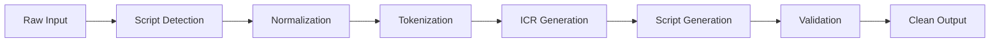

# CaDaR: Canonicalization and Darija Representation

<div class="grid cards" markdown>

-   :material-clock-fast:{ .lg .middle } __Fast & Efficient__

    ---

    Built in Rust for high performance, with Python bindings for ease of use.

    [:octicons-arrow-right-24: Quick Start](quickstart.md)

-   :material-cog:{ .lg .middle } __FST-Style Pipeline__

    ---

    6-stage pipeline with Intermediate Canonical Representation (ICR) for accurate transliteration.

    [:octicons-arrow-right-24: Architecture](guide/architecture.md)

-   :material-language-arabic:{ .lg .middle } __Darija-Aware__

    ---

    Specially designed for Moroccan Darija with bidirectional Arabic ↔ Latin support.

    [:octicons-arrow-right-24: Examples](guide/examples.md)

-   :material-scale-balance:{ .lg .middle } __Open Source, MIT__

    ---

    Free and open-source software under the MIT License.

    [:octicons-arrow-right-24: License](license.md)

</div>

## Overview

CaDaR is a robust, FST-style (Finite State Transducer) transliteration library designed specifically for Darija (Moroccan Arabic). It provides bidirectional conversion between Arabic script and Latin (Romanized/Bizi) script, along with standardization capabilities for both scripts.

### Key Features

- **Bidirectional Transliteration**: Convert seamlessly between Arabic and Latin scripts
- **Intelligent Normalization**: Handles noise, diacritics, and common variations
- **Darija-Aware Processing**: Respects Darija-specific linguistic patterns
- **Intermediate Canonical Representation (ICR)**: Unified internal representation for accurate conversion
- **High Performance**: Written in Rust with Python bindings for optimal speed
- **Extensible**: Designed to support multiple Darija dialects (currently Moroccan)

## Quick Example

=== "Python"

    ```python
    import cadar

    # Arabic to Latin
    result = cadar.ara2bizi("كيفاش داير؟", darija="Ma")
    print(result)  # Output: "kifash dayer?"

    # Latin to Arabic
    result = cadar.bizi2ara("salam 3likom", darija="Ma")
    print(result)  # Output: "سلام عليكم"

    # Standardize Arabic
    result = cadar.ara2ara("أنَا مِنْ المَغْرِب", darija="Ma")
    print(result)  # Output: "انا من المغرب"

    # Standardize Latin
    result = cadar.bizi2bizi("salaaaam", darija="Ma")
    print(result)  # Output: "salam"
    ```

=== "Rust"

    ```rust
    use cadar::{CaDaR, types::Dialect};

    let processor = CaDaR::new(Dialect::Moroccan);

    // Arabic to Latin
    let result = processor.ara2bizi("كيفاش داير؟").unwrap();
    println!("{}", result); // Output: "kifash dayer?"

    // Latin to Arabic
    let result = processor.bizi2ara("salam").unwrap();
    println!("{}", result); // Output: "سلام"
    ```

## Installation

### From PyPI

```bash
pip install cadar
```

### From Source

```bash
git clone https://github.com/Oit-Technologies/CaDaR.git
cd CaDaR
pip install maturin
maturin develop
```

## Architecture

CaDaR uses a 6-stage pipeline:



The **Intermediate Canonical Representation (ICR)** is the core innovation:

- Abstracts away script-specific quirks
- Preserves Darija phonological distinctions
- Enables lossless round-trip conversions
- Allows for consistent normalization across scripts

## Use Cases

- **Chat Applications**: Support users writing in both Arabic and Latin scripts
- **Search Engines**: Match queries regardless of script
- **Data Processing**: Standardize mixed-script datasets
- **NLP Pipelines**: Normalize Darija text for machine learning
- **Language Learning**: Help learners see connections between scripts

## Next Steps

<div class="grid cards" markdown>

-   :material-rocket-launch:{ .lg .middle } __Get Started__

    ---

    Follow our quick start guide to start using CaDaR in 5 minutes.

    [:octicons-arrow-right-24: Quick Start](quickstart.md)

-   :material-book-open:{ .lg .middle } __Learn More__

    ---

    Dive into the user guide to understand all features.

    [:octicons-arrow-right-24: User Guide](guide/overview.md)

-   :material-api:{ .lg .middle } __API Reference__

    ---

    Explore the complete API documentation.

    [:octicons-arrow-right-24: Python API](api/python.md)

-   :material-github:{ .lg .middle } __Contribute__

    ---

    Help us improve CaDaR by contributing code or reporting issues.

    [:octicons-arrow-right-24: Contributing](dev/contributing.md)

</div>
