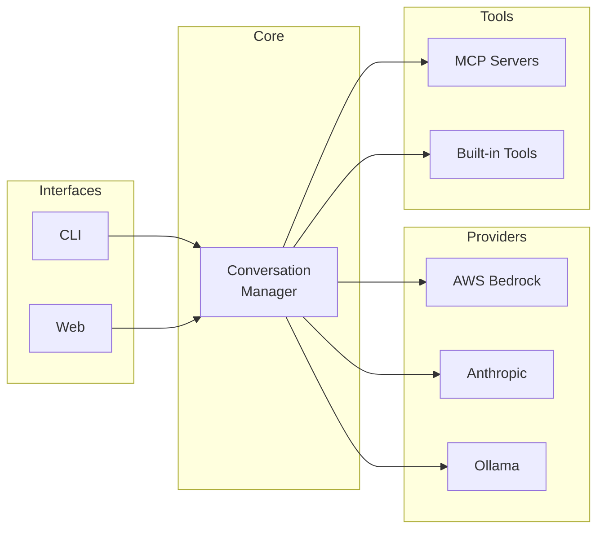

# Spark - Secure Personal AI Research Kit

[](https://opensource.org/licenses/MIT)
[](https://www.python.org/downloads/)

[](https://sonarcloud.io/summary/new_code?id=Digital-Thought_dtSpark)
[](https://sonarcloud.io/summary/new_code?id=Digital-Thought_dtSpark)
[](https://sonarcloud.io/summary/new_code?id=Digital-Thought_dtSpark)
[](https://sonarcloud.io/summary/new_code?id=Digital-Thought_dtSpark)
[](https://sonarcloud.io/summary/new_code?id=Digital-Thought_dtSpark)
[](https://sonarcloud.io/summary/new_code?id=Digital-Thought_dtSpark)

**Spark** is a powerful, multi-provider LLM interface for conversational AI with integrated tool support. It supports AWS Bedrock, Anthropic Direct API, and Ollama local models through both CLI and Web interfaces.

## Key Features

- **Multi-Provider Support** - AWS Bedrock, Anthropic Direct API, and Ollama local models
- **Dual Interface** - Rich CLI terminal UI and modern Web browser interface
- **MCP Tool Integration** - Connect external tools via Model Context Protocol
- **Intelligent Context Management** - Automatic conversation compaction with model-aware limits
- **Security Features** - Prompt inspection, tool permissions, and audit logging
- **Multiple Database Backends** - SQLite, MySQL, PostgreSQL, and Microsoft SQL Server

## Quick Start

### Installation

```bash
pip install dtSpark
```

### First-Time Setup

Run the interactive setup wizard to configure Spark:

```bash
spark --setup
```

This guides you through:
- LLM provider selection and configuration
- Database setup
- Interface preferences
- Security settings

### Running Spark

```bash
# Start with CLI interface
spark

# Or use the alternative command
dtSpark
```

## Documentation

Comprehensive documentation is available in the [docs](docs/) folder:

- [Installation Guide](docs/installation.md) - Detailed installation instructions
- [Configuration Reference](docs/configuration.md) - Complete config.yaml documentation
- [Features Guide](docs/features.md) - Detailed feature documentation
- [CLI Reference](docs/cli-reference.md) - Command-line options and chat commands
- [Web Interface](docs/web-interface.md) - Web UI guide
- [MCP Integration](docs/mcp-integration.md) - Tool integration documentation
- [Security](docs/security.md) - Security features and best practices

## Architecture Overview



## Requirements

- Python 3.10 or higher
- AWS credentials (for Bedrock)
- Anthropic API key (for direct API)
- Ollama server (for local models)

## Licence

MIT Licence - see [LICENSE](LICENSE) for details.

## Author

Matthew Westwood-Hill
matthew@digital-thought.org

## Support

- **Documentation**: [docs/](docs/)
- **Issues**: [GitHub Issues](https://github.com/digital-thought/dtSpark/issues)
