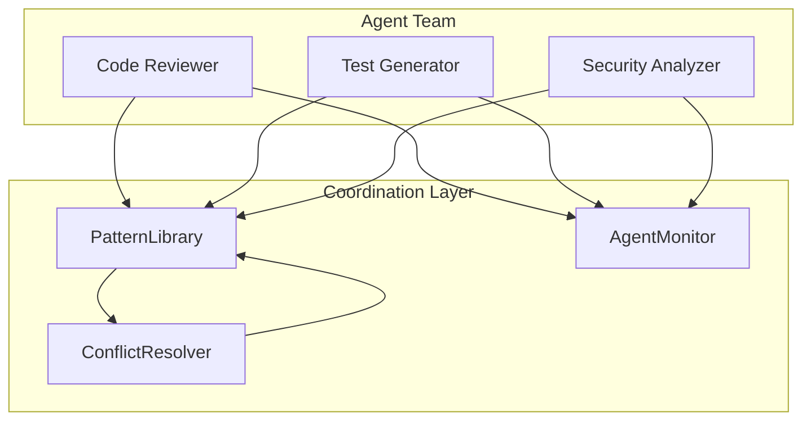

# Multi-Agent Coordination

Conflict resolution and monitoring for distributed agent teams.

## Overview

The Multi-Agent Coordination module enables:

- **Pattern Conflict Resolution**: When multiple agents discover conflicting patterns, resolve which takes precedence
- **Team Monitoring**: Track agent performance, collaboration efficiency, and system health
- **Shared Memory**: Coordinate agents via shared pattern libraries (see [Pattern Library](pattern-library.md))

## Architecture



## Quick Start

```python
from empathy_os import (
    EmpathyOS,
    PatternLibrary,
    ConflictResolver,
    AgentMonitor,
)

# 1. Create shared infrastructure
library = PatternLibrary()
resolver = ConflictResolver()
monitor = AgentMonitor(pattern_library=library)

# 2. Create agent team with shared library
code_reviewer = EmpathyOS(
    user_id="code_reviewer",
    target_level=4,
    shared_library=library
)

test_generator = EmpathyOS(
    user_id="test_generator",
    target_level=3,
    shared_library=library
)

# 3. Agents discover and share patterns
# (Code reviewer finds a pattern, test generator can use it)

# 4. Monitor team collaboration
stats = monitor.get_team_stats()
print(f"Collaboration efficiency: {stats['collaboration_efficiency']:.0%}")
```

---

## ConflictResolver

Resolves conflicts between patterns from different agents.

### Class Reference

::: empathy_os.coordination.ConflictResolver
    options:
      show_root_heading: false
      show_source: false
      heading_level: 4

### Resolution Strategies

| Strategy | Description | Best For |
|----------|-------------|----------|
| `HIGHEST_CONFIDENCE` | Pick pattern with highest confidence score | When accuracy is paramount |
| `MOST_RECENT` | Pick most recently discovered pattern | Fast-changing domains |
| `BEST_CONTEXT_MATCH` | Pick best match for current context | Context-sensitive decisions |
| `TEAM_PRIORITY` | Use team-configured priorities | Enforcing team standards |
| `WEIGHTED_SCORE` | Combine all factors (default) | Balanced decisions |

### Example: Resolving Pattern Conflicts

```python
from empathy_os import Pattern, ConflictResolver, ResolutionStrategy

resolver = ConflictResolver()

# Two agents have different recommendations
performance_pattern = Pattern(
    id="use_list_comprehension",
    agent_id="performance_agent",
    pattern_type="performance",
    name="Use list comprehension",
    description="Use list comprehension for better performance",
    confidence=0.85
)

readability_pattern = Pattern(
    id="use_explicit_loop",
    agent_id="style_agent",
    pattern_type="style",
    name="Use explicit loop",
    description="Use explicit loop for better readability",
    confidence=0.80
)

# Resolve based on team priority
resolution = resolver.resolve_patterns(
    patterns=[performance_pattern, readability_pattern],
    context={
        "team_priority": "readability",  # Team values readability
        "code_complexity": "high"         # Complex code needs clarity
    }
)

print(f"Winner: {resolution.winning_pattern.name}")
print(f"Reasoning: {resolution.reasoning}")
# Output: Winner: Use explicit loop
# Reasoning: Selected 'Use explicit loop' based on team priority: readability
```

### Example: Custom Team Priorities

```python
from empathy_os import ConflictResolver, TeamPriorities

# Configure team priorities
priorities = TeamPriorities(
    readability_weight=0.4,
    performance_weight=0.2,
    security_weight=0.3,
    maintainability_weight=0.1,
    type_preferences={
        "security": 1.0,      # Security always wins
        "best_practice": 0.8,
        "performance": 0.7,
        "style": 0.5,
    },
    preferred_tags=["production", "tested"]
)

resolver = ConflictResolver(team_priorities=priorities)

# Now security patterns will be strongly preferred
```

### Resolution Statistics

```python
# After several resolutions
stats = resolver.get_resolution_stats()

print(f"Total resolutions: {stats['total_resolutions']}")
print(f"Most used strategy: {stats['most_used_strategy']}")
print(f"Average confidence: {stats['average_confidence']:.0%}")
```

---

## AgentMonitor

Tracks agent performance and team collaboration metrics.

### Class Reference

::: empathy_os.monitoring.AgentMonitor
    options:
      show_root_heading: false
      show_source: false
      heading_level: 4

### Recording Agent Activity

```python
from empathy_os import AgentMonitor, PatternLibrary

library = PatternLibrary()
monitor = AgentMonitor(pattern_library=library)

# Record agent interactions
monitor.record_interaction("code_reviewer", response_time_ms=150.0)
monitor.record_interaction("code_reviewer", response_time_ms=200.0)

# Record pattern discovery
monitor.record_pattern_discovery("code_reviewer", pattern_id="pat_001")

# Record cross-agent pattern reuse
monitor.record_pattern_use(
    agent_id="test_generator",
    pattern_id="pat_001",
    pattern_agent="code_reviewer",  # Original discoverer
    success=True
)
```

### Individual Agent Stats

```python
stats = monitor.get_agent_stats("code_reviewer")

print(f"Agent: {stats['agent_id']}")
print(f"Total interactions: {stats['total_interactions']}")
print(f"Avg response time: {stats['avg_response_time_ms']:.0f}ms")
print(f"Patterns discovered: {stats['patterns_discovered']}")
print(f"Success rate: {stats['success_rate']:.0%}")
print(f"Status: {stats['status']}")  # 'active' or 'inactive'
```

### Team-Wide Metrics

```python
team_stats = monitor.get_team_stats()

print(f"Active agents: {team_stats['active_agents']}")
print(f"Total agents: {team_stats['total_agents']}")
print(f"Shared patterns: {team_stats['shared_patterns']}")
print(f"Pattern reuse rate: {team_stats['pattern_reuse_rate']:.0%}")
print(f"Collaboration efficiency: {team_stats['collaboration_efficiency']:.0%}")
```

**Collaboration Efficiency** measures how effectively agents learn from each other:
- 0% = Agents only use their own patterns
- 100% = All pattern reuse is cross-agent

### Top Contributors

```python
# Find agents contributing most patterns
top = monitor.get_top_contributors(n=5)

for agent in top:
    print(f"{agent['agent_id']}: {agent['patterns_discovered']} patterns")
```

### Health Monitoring

```python
health = monitor.check_health()

print(f"Status: {health['status']}")  # 'healthy', 'degraded', or 'unhealthy'
print(f"Issues: {health['issues']}")
print(f"Active agents: {health['active_agents']}")
print(f"Recent alerts: {health['recent_alerts']}")

# Alerts are generated automatically for:
# - Slow response times (>5 seconds)
# - No active agents
# - Low collaboration efficiency
```

---

## Data Classes

### ResolutionResult

::: empathy_os.coordination.ResolutionResult
    options:
      show_root_heading: false
      show_source: false
      heading_level: 4

Result of conflict resolution:

```python
result = resolver.resolve_patterns([pattern1, pattern2])

print(result.winning_pattern.name)   # The chosen pattern
print(result.losing_patterns)        # Patterns that lost
print(result.strategy_used)          # Which strategy was used
print(result.confidence)             # Confidence in this resolution
print(result.reasoning)              # Human-readable explanation
print(result.factors)                # Score breakdown
```

### AgentMetrics

::: empathy_os.monitoring.AgentMetrics
    options:
      show_root_heading: false
      show_source: false
      heading_level: 4

Per-agent metrics:

```python
# Accessing raw metrics
metrics = monitor.agents["code_reviewer"]

print(metrics.total_interactions)
print(metrics.patterns_discovered)
print(metrics.avg_response_time_ms)  # Property
print(metrics.success_rate)          # Property
print(metrics.pattern_contribution_rate)  # Property
```

### TeamMetrics

::: empathy_os.monitoring.TeamMetrics
    options:
      show_root_heading: false
      show_source: false
      heading_level: 4

Team-wide aggregated metrics:

```python
from empathy_os.monitoring import TeamMetrics

metrics = TeamMetrics(
    active_agents=3,
    total_agents=5,
    shared_patterns=100,
    pattern_reuse_count=50,
    cross_agent_reuses=30
)

print(metrics.pattern_reuse_rate)       # 0.5 (50/100)
print(metrics.collaboration_efficiency)  # 0.6 (30/50)
```

---

## Integration with EmpathyOS

EmpathyOS includes built-in support for shared pattern libraries:

```python
from empathy_os import EmpathyOS, PatternLibrary, Pattern

# Create shared library
library = PatternLibrary()

# Create agent with shared library
agent = EmpathyOS(
    user_id="code_reviewer",
    target_level=4,
    shared_library=library  # Enable multi-agent coordination
)

# Check if agent has shared library
if agent.has_shared_library():
    # Contribute a pattern
    pattern = Pattern(
        id="pat_001",
        agent_id="code_reviewer",
        pattern_type="best_practice",
        name="Test Pattern",
        description="A discovered pattern"
    )
    agent.contribute_pattern(pattern)

    # Query patterns from other agents
    matches = agent.query_patterns(
        context={"language": "python"},
        min_confidence=0.7
    )
```

---

## Best Practices

### 1. Use Consistent Agent IDs

```python
# Good: Descriptive, consistent naming
code_reviewer = EmpathyOS(user_id="code_reviewer", ...)
test_generator = EmpathyOS(user_id="test_generator", ...)

# Bad: Generic or inconsistent names
agent1 = EmpathyOS(user_id="agent1", ...)
```

### 2. Monitor Collaboration Efficiency

```python
# Check regularly
team_stats = monitor.get_team_stats()

if team_stats["collaboration_efficiency"] < 0.3:
    print("Warning: Agents aren't learning from each other")
    # Consider: shared contexts, better pattern tagging
```

### 3. Configure Team Priorities Early

```python
# Set expectations before agents start
priorities = TeamPriorities(
    security_weight=0.4,  # Security first
    ...
)
resolver = ConflictResolver(team_priorities=priorities)
```

### 4. Track Resolution History

```python
# Learn from past resolutions
stats = resolver.get_resolution_stats()

if stats["most_used_strategy"] == "highest_confidence":
    print("Tip: Consider using team priorities for more nuanced decisions")
```

---

## See Also

- [Pattern Library](pattern-library.md) - Pattern storage and retrieval
- [EmpathyOS](empathy-os.md) - Core agent API
- [Multi-Agent Coordination Example](../examples/multi-agent-team-coordination.md)
- See the Memory System chapter for distributed memory concepts
