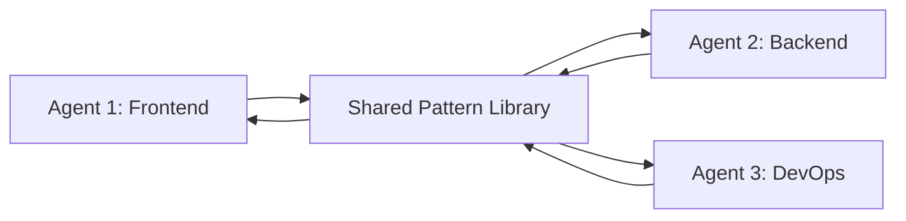

# Pattern Library

Pattern discovery, learning, and sharing system for multi-agent coordination.

## Overview

The Pattern Library enables AI systems to:

- **Discover Patterns**: Automatically identify recurring interaction patterns
- **Learn from Experience**: Improve responses based on successful patterns
- **Share Knowledge**: Coordinate across multiple agents via shared pattern libraries
- **Track Confidence**: Maintain confidence scores based on success rate
- **Decay Over Time**: Patterns fade if unused (adaptive learning)

## Key Concepts

### Patterns

A **pattern** is a discovered interaction template that worked well in the past:

```python
Pattern(
    id="pattern_deployment_friday",
    agent_id="agent_123",
    pattern_type="warning",
    name="Friday Deployment Warning",
    description="Warn about Friday afternoon deployments",
    context={"day": "friday", "time": "afternoon", "action": "deploy"},
    code="Recommend delaying until Monday morning",
    confidence=0.92,  # 92% confidence based on past success
    usage_count=25,
    success_count=23,
    tags=["deployment", "best-practice", "timing"]
)
```

### Multi-Agent Coordination

Multiple agents can share patterns via a common library:



When one agent discovers a useful pattern, all agents learn from it.

## Class Reference

### PatternLibrary

::: empathy_os.pattern_library.PatternLibrary
    options:
      show_root_heading: false
      show_source: false
      heading_level: 4

Central repository for discovered patterns.

**Example:**
```python
from empathy_os.pattern_library import PatternLibrary, Pattern

# Create library
library = PatternLibrary()

# Contribute a pattern
pattern = Pattern(
    id="pat_123",
    agent_id="agent_1",
    pattern_type="suggestion",
    name="Add error handling",
    description="Suggest error handling for API calls",
    context={"task": "api_call", "error_handling": False},
    code="Always wrap API calls in try-except blocks",
    confidence=0.85
)

library.contribute_pattern(agent_id="agent_1", pattern=pattern)

# Find matching patterns
matches = library.find_patterns(
    context={"task": "api_call"},
    min_confidence=0.75
)

for match in matches:
    print(f"Pattern: {match.pattern.name}")
    print(f"Confidence: {match.confidence:.0%}")
    print(f"Code: {match.pattern.code}")
```

### Pattern

::: empathy_os.pattern_library.Pattern
    options:
      show_root_heading: false
      show_source: false
      heading_level: 4

Individual pattern with metadata and confidence tracking.

**Attributes:**
- `id` (str): Unique pattern identifier
- `agent_id` (str): Agent that discovered the pattern
- `pattern_type` (str): Type (suggestion, warning, optimization, etc.)
- `name` (str): Human-readable name
- `description` (str): Detailed description
- `context` (dict): Context where pattern applies
- `code` (str): Pattern implementation/response template
- `confidence` (float): Confidence score (0.0-1.0)
- `usage_count` (int): Times pattern was used
- `success_count` (int): Times pattern led to success
- `failure_count` (int): Times pattern led to failure
- `tags` (List[str]): Searchable tags
- `discovered_at` (datetime): When pattern was discovered
- `last_used` (datetime): When pattern was last used

**Derived Properties:**
- `success_rate` (float): success_count / usage_count
- `age_days` (float): Days since discovery

**Example:**
```python
from empathy_os.pattern_library import Pattern
from datetime import datetime

pattern = Pattern(
    id="pat_security_review",
    agent_id="security_bot",
    pattern_type="warning",
    name="Security Review Required",
    description="Flag code changes that need security review",
    context={
        "file_type": "authentication",
        "has_security_review": False
    },
    code="This change affects authentication. Request security review.",
    confidence=0.90,
    tags=["security", "authentication", "compliance"]
)

# Update based on usage
pattern.usage_count += 1
pattern.success_count += 1
pattern.last_used = datetime.now()

# Confidence increases with success
new_confidence = pattern.success_rate * 0.9 + 0.1
print(f"Confidence: {new_confidence:.0%}")
```

### PatternMatch

::: empathy_os.pattern_library.PatternMatch
    options:
      show_root_heading: false
      show_source: false
      heading_level: 4

Result of pattern matching with relevance score.

**Attributes:**
- `pattern` (Pattern): The matched pattern
- `confidence` (float): Match confidence (0.0-1.0)
- `relevance` (float): Context relevance score (0.0-1.0)

**Example:**
```python
matches = library.find_patterns(
    context={"task": "deployment", "environment": "production"},
    min_confidence=0.70
)

for match in matches:
    print(f"Pattern: {match.pattern.name}")
    print(f"  Confidence: {match.confidence:.0%}")
    print(f"  Relevance: {match.relevance:.0%}")
    print(f"  Code: {match.pattern.code}")
    print()
```

## Usage Patterns

### Single-Agent Pattern Learning

```python
from empathy_os import EmpathyOS
from empathy_os.pattern_library import PatternLibrary

# Create agent with pattern learning
library = PatternLibrary()
empathy = EmpathyOS(
    user_id="user_123",
    target_level=4,
    pattern_library=library,
    pattern_learning_enabled=True
)

# Agent discovers patterns from successful interactions
for i in range(100):
    response = empathy.interact(
        user_id="user_123",
        user_input=f"Task {i}",
        context={"iteration": i}
    )

    # Record success/failure
    empathy.record_success(success=user_was_satisfied)

# Check discovered patterns
patterns = library.get_top_patterns(n=10)
for pattern in patterns:
    print(f"{pattern.name}: {pattern.confidence:.0%} confidence")
```

### Multi-Agent Pattern Sharing

```python
from empathy_os import EmpathyOS
from empathy_os.pattern_library import PatternLibrary

# Shared library for team coordination
shared_library = PatternLibrary()

# Create multiple specialized agents
frontend_agent = EmpathyOS(
    user_id="frontend_agent",
    target_level=4,
    pattern_library=shared_library  # Same library
)

backend_agent = EmpathyOS(
    user_id="backend_agent",
    target_level=4,
    pattern_library=shared_library  # Same library
)

devops_agent = EmpathyOS(
    user_id="devops_agent",
    target_level=4,
    pattern_library=shared_library  # Same library
)

# Frontend agent discovers a pattern
frontend_response = frontend_agent.interact(
    user_id="developer_1",
    user_input="How do I optimize this API call?",
    context={"task": "api_optimization"}
)

# Pattern is saved to shared library
# Now backend agent can use it!
backend_response = backend_agent.interact(
    user_id="developer_2",
    user_input="My API is slow",
    context={"task": "api_optimization"}
)

# Backend agent benefits from frontend agent's learning
print("Backend agent used pattern discovered by frontend agent!")
```

### Pattern Persistence

```python
from empathy_os.pattern_library import PatternLibrary
from empathy_os.persistence import PatternPersistence

# Create and populate library
library = PatternLibrary()
# ... add patterns ...

# Save to JSON (human-readable, good for backups)
PatternPersistence.save_to_json(library, "patterns.json")

# Save to SQLite (queryable, good for production)
PatternPersistence.save_to_sqlite(library, "patterns.db")

# Load later
loaded_library = PatternPersistence.load_from_json("patterns.json")
# or
loaded_library = PatternPersistence.load_from_sqlite("patterns.db")
```

### Pattern Discovery

```python
from empathy_os.pattern_library import PatternLibrary, Pattern

library = PatternLibrary()

# Automatically discover patterns from interactions
def discover_pattern_from_interaction(user_input, response, success, context):
    """Discover pattern from successful interaction"""
    if success and context.get("confidence", 0) > 0.80:
        pattern = Pattern(
            id=f"pattern_{hash(user_input)}",
            agent_id="discovery_agent",
            pattern_type="auto_discovered",
            name=f"Pattern for: {user_input[:50]}",
            description=f"Discovered from successful interaction",
            context=context,
            code=response,
            confidence=context.get("confidence", 0.80)
        )

        library.contribute_pattern("discovery_agent", pattern)
        return pattern
    return None

# Use in interaction loop
response = empathy.interact(user_id="user_123", user_input="...", context={})
empathy.record_success(success=True)

pattern = discover_pattern_from_interaction(
    user_input="How do I deploy?",
    response=response.response,
    success=True,
    context={"confidence": response.confidence}
)

if pattern:
    print(f"Discovered new pattern: {pattern.name}")
```

### Pattern Decay (Adaptive Learning)

```python
from empathy_os.pattern_library import PatternLibrary
from datetime import datetime, timedelta

library = PatternLibrary()

# ... patterns are used over time ...

# Decay unused patterns
def decay_unused_patterns(library, decay_rate=0.01, max_age_days=90):
    """Reduce confidence of old, unused patterns"""
    for pattern in library.patterns.values():
        age_days = (datetime.now() - pattern.last_used).days

        if age_days > max_age_days:
            # Pattern hasn't been used in 90+ days
            pattern.confidence *= (1 - decay_rate * age_days)
            pattern.confidence = max(0.0, pattern.confidence)

        if pattern.confidence < 0.50:
            # Remove low-confidence patterns
            library.remove_pattern(pattern.id)

# Run periodically
decay_unused_patterns(library)
```

## Advanced Features

### Pattern Conflict Detection

```python
def detect_conflicts(library):
    """Find patterns that conflict with each other"""
    conflicts = []

    for p1 in library.patterns.values():
        for p2 in library.patterns.values():
            if p1.id >= p2.id:
                continue

            # Check for context overlap but different recommendations
            if (p1.context == p2.context and
                p1.code != p2.code and
                p1.confidence > 0.75 and
                p2.confidence > 0.75):

                conflicts.append((p1, p2))

    return conflicts

conflicts = detect_conflicts(library)
for p1, p2 in conflicts:
    print(f"Conflict: {p1.name} vs {p2.name}")
    print(f"  {p1.name}: {p1.code}")
    print(f"  {p2.name}: {p2.code}")
```

### Pattern Recommendation

```python
def recommend_best_pattern(library, context, min_confidence=0.75):
    """Find best pattern for given context"""
    matches = library.find_patterns(context, min_confidence=min_confidence)

    if not matches:
        return None

    # Score by: confidence * relevance * recency
    best_match = max(
        matches,
        key=lambda m: (
            m.confidence *
            m.relevance *
            (1.0 - m.pattern.age_days / 365.0)  # Prefer recent patterns
        )
    )

    return best_match

# Use in interactions
context = {"task": "deployment", "environment": "production"}
best = recommend_best_pattern(library, context)

if best:
    print(f"Recommendation: {best.pattern.name}")
    print(f"  {best.pattern.code}")
    print(f"  Confidence: {best.confidence:.0%}")
```

## See Also

- [EmpathyOS API](empathy-os.md)
- [Persistence API](persistence.md)
- [Multi-Agent Coordination Example](../examples/multi-agent-team-coordination.md)
- [Adaptive Learning Example](../examples/adaptive-learning-system.md)
