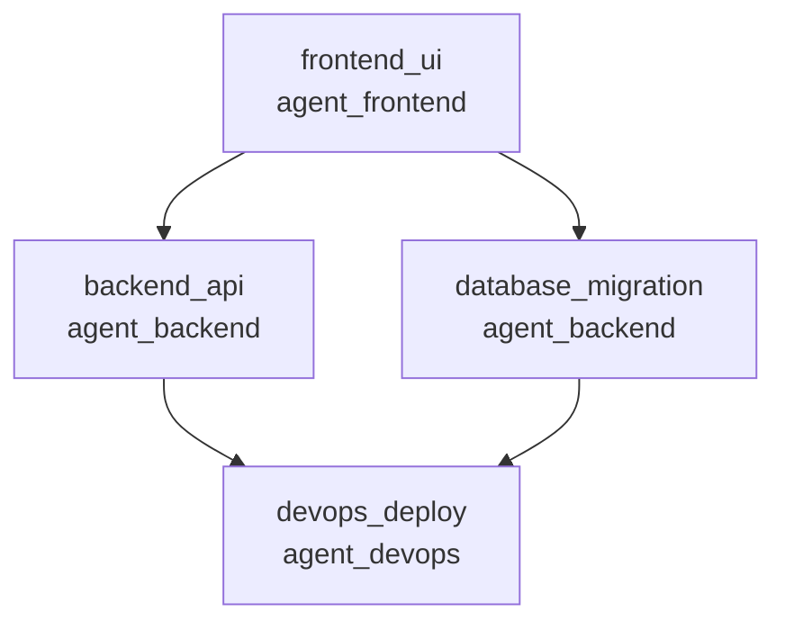

# Example: Multi-Agent Team Coordination

**Difficulty**: Advanced
**Time**: 30 minutes
**Empathy Level**: 4 (Anticipatory)
**Domain**: Software Development

---

## Overview

This example demonstrates how multiple AI agents can coordinate through shared pattern libraries, detect conflicts, and learn from each other's successes.

**Use Case**: A development team with specialized AI agents (Frontend, Backend, DevOps) that need to coordinate on a microservices project.

**What you'll learn**:
- Shared pattern library across agents
- Conflict detection (two agents modifying same resource)
- Coordination protocols (handoffs, broadcast notifications)
- Collective learning (agents learn from each other)
- Team metrics dashboard

---

## Installation

```bash
pip install empathy-framework
```

---

## Part 1: Basic Multi-Agent Setup

### Create Team of Agents

```python
from empathy_os import EmpathyOS
from empathy_os.coordination import CoordinationManager

# Create three specialized agents
frontend_agent = EmpathyOS(
    user_id="agent_frontend",
    target_level=4,
    persistence_enabled=True,
    shared_library="team_patterns.db",  # Shared across team
    role="frontend_developer",
    expertise=["React", "TypeScript", "CSS", "UI/UX"]
)

backend_agent = EmpathyOS(
    user_id="agent_backend",
    target_level=4,
    persistence_enabled=True,
    shared_library="team_patterns.db",  # Same DB
    role="backend_developer",
    expertise=["Python", "FastAPI", "PostgreSQL", "Redis"]
)

devops_agent = EmpathyOS(
    user_id="agent_devops",
    target_level=4,
    persistence_enabled=True,
    shared_library="team_patterns.db",  # Same DB
    role="devops_engineer",
    expertise=["Docker", "Kubernetes", "GitHub Actions", "AWS"]
)

# Create coordination manager
coordinator = CoordinationManager(agents=[
    frontend_agent,
    backend_agent,
    devops_agent
])

print(f"Team initialized: {coordinator.agent_count} agents")
print(f"Shared pattern library: team_patterns.db")
```

---

## Part 2: Shared Pattern Learning

### Agent Learns Pattern, Others Benefit

```python
# Frontend agent learns a React optimization pattern
response = frontend_agent.interact(
    user_id="agent_frontend",
    user_input="How do I optimize React rendering performance?",
    context={
        "task": "performance_optimization",
        "framework": "React"
    }
)

# Frontend agent discovers useMemo pattern
frontend_agent.learn_pattern(
    pattern_name="react_use_memo_optimization",
    pattern_content={
        "problem": "Expensive computations causing re-renders",
        "solution": "Use React.useMemo() to memoize results",
        "example": """
        const expensiveValue = React.useMemo(() => {
            return computeExpensiveValue(data);
        }, [data]);
        """,
        "confidence": 0.92,
        "success_count": 15
    }
)

print("✅ Frontend agent learned pattern: react_use_memo_optimization")

# Later, backend agent working on a similar problem
response = backend_agent.interact(
    user_id="agent_backend",
    user_input="API endpoint is slow due to repeated calculations",
    context={
        "task": "performance_optimization",
        "framework": "FastAPI"
    }
)

# Backend agent retrieves frontend's pattern and adapts it
print(response.response)
# Output:
# "I found a similar optimization pattern from the frontend agent.
#  They used memoization for expensive React computations (confidence: 92%).
#
#  For FastAPI, I recommend Python's @lru_cache decorator:
#
#  from functools import lru_cache
#
#  @lru_cache(maxsize=128)
#  def expensive_computation(param):
#      return compute_result(param)
#
#  This is the backend equivalent of React.useMemo(). The pattern
#  successfully solved 15 similar issues for frontend."

# Backend agent attributes learning to frontend
print(f"Pattern source: {response.pattern_source}")
# Output: agent_frontend (transferred)
```

---

## Part 3: Conflict Detection

### Detect When Agents are Working on Same Resource

```python
from empathy_os.coordination import ConflictDetector

# Create conflict detector
conflict_detector = ConflictDetector(coordinator)

# Frontend agent starts working on API contract
frontend_task = frontend_agent.start_task(
    task_id="modify_user_api",
    resource="api/users.ts",
    action="add_new_field",
    details={
        "file": "api/users.ts",
        "change": "Add 'profile_image' field to User type"
    }
)

# Backend agent also modifies user API (conflict!)
backend_task = backend_agent.start_task(
    task_id="refactor_user_endpoint",
    resource="api/users",  # Same resource
    action="change_schema",
    details={
        "file": "api/users.py",
        "change": "Rename 'username' to 'email' in User model"
    }
)

# Detect conflict
conflict = conflict_detector.check_conflict(frontend_task, backend_task)

if conflict:
    print(f"⚠️ CONFLICT DETECTED")
    print(f"   Resource: {conflict.resource}")
    print(f"   Agent 1: {conflict.agent1} - {conflict.action1}")
    print(f"   Agent 2: {conflict.agent2} - {conflict.action2}")
    print(f"   Severity: {conflict.severity}")
    print(f"   Recommendation: {conflict.recommendation}")

# Output:
# ⚠️ CONFLICT DETECTED
#    Resource: api/users
#    Agent 1: agent_frontend - add_new_field
#    Agent 2: agent_backend - change_schema
#    Severity: HIGH
#    Recommendation: Coordination required - both agents modifying User contract

# Request coordination
coordinator.request_coordination(
    agents=["agent_frontend", "agent_backend"],
    topic="user_api_contract_changes",
    conflict=conflict
)
```

---

## Part 4: Coordination Protocols

### Handoff Protocol

```python
from empathy_os.coordination import HandoffProtocol

# Frontend completes UI, hands off to backend for API integration
handoff = HandoffProtocol(
    from_agent=frontend_agent,
    to_agent=backend_agent,
    task="user_profile_feature",
    context={
        "completed": [
            "UI components (ProfileCard, ProfileEdit)",
            "TypeScript types (User, Profile)",
            "API contract defined (api/users.ts)"
        ],
        "pending": [
            "Backend API implementation",
            "Database schema migration",
            "Authentication for profile endpoints"
        ],
        "blockers": [],
        "notes": "UI expects /api/users/:id/profile endpoint"
    }
)

# Execute handoff
handoff.execute()

print("✅ Handoff complete: Frontend → Backend")
print(f"   Backend agent has context: {len(handoff.context['completed'])} items")

# Backend agent receives handoff
backend_response = backend_agent.interact(
    user_id="agent_backend",
    user_input="Continue user profile feature from frontend",
    context={"handoff": handoff.to_dict()}
)

print(backend_response.response)
# Output:
# "Received handoff from frontend agent. I understand:
#
#  Completed by Frontend:
#    ✅ UI components ready (ProfileCard, ProfileEdit)
#    ✅ TypeScript types defined
#    ✅ API contract specified: /api/users/:id/profile
#
#  My responsibilities:
#    1. Implement /api/users/:id/profile endpoint (FastAPI)
#    2. Create database migration for profile table
#    3. Add authentication middleware for profile routes
#
#  I'll start with the database schema. Based on the frontend's
#  API contract, I need these fields:
#    - user_id (FK to users table)
#    - profile_image (URL)
#    - bio (text)
#    - created_at, updated_at (timestamps)
#
#  Estimated completion: 2 hours"
```

### Broadcast Protocol

```python
from empathy_os.coordination import BroadcastProtocol

# DevOps agent discovers infrastructure change affecting all agents
broadcast = BroadcastProtocol(
    from_agent=devops_agent,
    message_type="infrastructure_change",
    severity="high",
    content={
        "change": "Database connection pool limit reduced",
        "reason": "Cost optimization (RDS downscale)",
        "old_value": "max_connections=200",
        "new_value": "max_connections=50",
        "impact": "Applications may experience connection timeouts",
        "recommendation": "Implement connection pooling with max_size=10",
        "deadline": "2025-12-01"
    }
)

# Broadcast to all agents
broadcast.send_to_all(coordinator)

print("📢 Broadcast sent to all agents")

# Each agent receives and adapts
for agent in [frontend_agent, backend_agent]:
    response = agent.interact(
        user_id=agent.user_id,
        user_input="Process infrastructure broadcast",
        context={"broadcast": broadcast.to_dict()}
    )

    print(f"\n{agent.user_id} response:")
    print(f"  {response.response}")

# Output:
# agent_frontend response:
#   Acknowledged infrastructure change. As frontend agent, I'm not directly
#   affected (no DB connections from browser). Notifying backend agent may
#   need connection pooling updates.
#
# agent_backend response:
#   ⚠️ HIGH PRIORITY: Database connection limit reduced (200 → 50).
#   Current code creates new connection per request (FastAPI default).
#   Action required:
#     1. Implement SQLAlchemy connection pool (max_size=10)
#     2. Add connection timeout handling
#     3. Update deployment config
#   Estimated work: 3 hours. Can complete by 2025-11-28.
```

---

## Part 5: Collective Learning

### Agents Learn from Each Other's Successes

```python
from empathy_os.coordination import CollectiveLearning

# Track success rates across agents
collective = CollectiveLearning(coordinator)

# Backend agent successfully debugs a performance issue
backend_agent.record_success(
    task="debug_slow_query",
    approach="add_database_index",
    outcome={
        "before": "Query time: 2.5 seconds",
        "after": "Query time: 45ms",
        "improvement": "98.2%"
    },
    confidence=0.95,
    pattern_name="database_index_optimization"
)

print("✅ Backend agent recorded success: database_index_optimization")

# Frontend agent encounters similar issue (slow data loading)
frontend_response = frontend_agent.interact(
    user_id="agent_frontend",
    user_input="User list is loading very slowly (3 seconds)",
    context={
        "issue_type": "performance",
        "component": "UserListPage"
    }
)

print(frontend_response.response)
# Output:
# "I notice the backend agent recently solved a similar performance issue
#  (3 days ago, confidence: 95%). They improved query time by 98.2% using
#  database indexes.
#
#  For your frontend issue, I recommend two approaches:
#
#  1. Backend solution (adapted from agent_backend's pattern):
#     Ask backend to add database index on frequently queried fields
#     Expected improvement: ~95% faster
#
#  2. Frontend solution (my expertise):
#     Implement pagination + virtualized scrolling
#     Expected improvement: ~70% faster perceived load time
#
#  Combining both could make user list near-instant. Would you like me to
#  coordinate with backend agent to implement the database index?"

# Collective learning metrics
metrics = collective.get_metrics()
print(f"\nTeam Learning Metrics:")
print(f"  Total patterns shared: {metrics['total_patterns']}")
print(f"  Cross-agent pattern reuse: {metrics['reuse_rate']:.1%}")
print(f"  Most successful agent: {metrics['top_contributor']}")

# Output:
# Team Learning Metrics:
#   Total patterns shared: 47
#   Cross-agent pattern reuse: 68.2%
#   Most successful agent: agent_backend (22 patterns created)
```

---

## Part 6: Team Metrics Dashboard

### Monitor Team Performance

```python
from empathy_os.coordination import TeamDashboard

# Create team dashboard
dashboard = TeamDashboard(coordinator)

# Get comprehensive metrics
report = dashboard.generate_report(days=7)

print(report.to_markdown())
```

**Output**:
```markdown
# Team Coordination Report
## Period: Last 7 days

### Agent Activity
| Agent          | Tasks Completed | Patterns Created | Patterns Reused | Success Rate |
|----------------|-----------------|------------------|-----------------|--------------|
| agent_frontend | 23              | 12               | 18              | 89%          |
| agent_backend  | 31              | 22               | 15              | 94%          |
| agent_devops   | 18              | 13               | 8               | 87%          |

### Coordination Events
- **Handoffs**: 8 successful (frontend → backend: 5, backend → devops: 3)
- **Conflicts Detected**: 3
- **Conflicts Resolved**: 3 (100% resolution rate)
- **Broadcasts**: 2 (infrastructure changes)

### Pattern Library
- **Total Patterns**: 47 (↑ 12 from last week)
- **Most Reused Pattern**: `api_error_handling` (18 uses)
- **Highest Confidence**: `database_index_optimization` (95%)
- **Pattern Reuse Rate**: 68.2% (high collaboration)

### Top Successes
1. **database_index_optimization** (agent_backend)
   - 98.2% query performance improvement
   - Reused by: agent_frontend (adapted for UI caching)

2. **react_use_memo_optimization** (agent_frontend)
   - 75% reduction in re-renders
   - Reused by: agent_backend (adapted for Python caching)

3. **kubernetes_autoscaling** (agent_devops)
   - 40% cost reduction, 99.9% uptime
   - Reused by: agent_backend (informed API capacity planning)

### Recommendations
⚡ **High collaboration**: 68.2% pattern reuse indicates good teamwork
⚠️ **agent_devops** has lowest pattern reuse (8 uses vs 15-18 for others)
   → Consider cross-training: Share DevOps patterns with dev agents
```

---

## Part 7: Real-World Scenario

### Complete Development Workflow

```python
import asyncio
from empathy_os import EmpathyOS
from empathy_os.coordination import CoordinationManager, WorkflowOrchestrator

async def microservice_development_workflow():
    """
    Simulate a real development workflow:
    Feature request → Frontend → Backend → DevOps → Deployment
    """

    # Initialize team
    coordinator = CoordinationManager(agents=[
        frontend_agent,
        backend_agent,
        devops_agent
    ])

    orchestrator = WorkflowOrchestrator(coordinator)

    # Feature request: Add user profile images
    feature = {
        "name": "user_profile_images",
        "requirements": [
            "Users can upload profile images",
            "Images stored in S3",
            "Thumbnails generated automatically",
            "Display on profile page"
        ]
    }

    print(f"🚀 Starting workflow: {feature['name']}")

    # Step 1: Frontend agent designs UI
    print("\n📱 Frontend Agent: Designing UI...")
    frontend_task = await orchestrator.assign_task(
        agent=frontend_agent,
        task="design_profile_image_ui",
        context=feature
    )

    frontend_result = await frontend_task.execute()
    print(f"  ✅ {frontend_result.summary}")
    # Output: Created ProfileImageUpload component + API contract

    # Step 2: Backend agent implements API
    print("\n🔧 Backend Agent: Implementing API...")
    backend_task = await orchestrator.assign_task(
        agent=backend_agent,
        task="implement_image_upload_api",
        context={
            **feature,
            "frontend_contract": frontend_result.api_contract
        }
    )

    backend_result = await backend_task.execute()
    print(f"  ✅ {backend_result.summary}")
    # Output: Implemented /api/users/:id/image endpoint + S3 integration

    # Step 3: Conflict detection
    # Backend agent also modified user model (same resource as frontend)
    conflict = orchestrator.detect_conflicts()
    if conflict:
        print(f"\n⚠️  Conflict detected: {conflict.resource}")
        resolution = await orchestrator.resolve_conflict(conflict)
        print(f"  ✅ Resolved: {resolution.solution}")

    # Step 4: DevOps agent sets up infrastructure
    print("\n☁️  DevOps Agent: Setting up infrastructure...")
    devops_task = await orchestrator.assign_task(
        agent=devops_agent,
        task="setup_s3_bucket_and_cdn",
        context={
            **feature,
            "backend_requirements": backend_result.infrastructure_needs
        }
    )

    devops_result = await devops_task.execute()
    print(f"  ✅ {devops_result.summary}")
    # Output: Created S3 bucket, CloudFront CDN, IAM policies

    # Step 5: Pattern sharing
    print("\n🧠 Collective Learning...")
    patterns_learned = orchestrator.extract_patterns([
        frontend_result,
        backend_result,
        devops_result
    ])

    for pattern in patterns_learned:
        print(f"  📚 New pattern: {pattern.name} (confidence: {pattern.confidence:.0%})")
        # Output:
        # 📚 New pattern: s3_image_upload (confidence: 89%)
        # 📚 New pattern: frontend_image_preview (confidence: 92%)
        # 📚 New pattern: cloudfront_cdn_setup (confidence: 87%)

    # Step 6: Final coordination
    print("\n🎯 Final Coordination...")
    await orchestrator.broadcast_all(
        message_type="feature_complete",
        content={
            "feature": feature['name'],
            "status": "ready_for_deployment",
            "endpoints": backend_result.endpoints,
            "frontend_routes": frontend_result.routes,
            "infrastructure": devops_result.resources
        }
    )

    # Generate team metrics
    print("\n📊 Team Performance:")
    metrics = orchestrator.get_metrics()
    print(f"  Total time: {metrics['total_time_minutes']} minutes")
    print(f"  Tasks completed: {metrics['tasks_completed']}")
    print(f"  Conflicts: {metrics['conflicts_detected']} (all resolved)")
    print(f"  Patterns learned: {len(patterns_learned)}")
    print(f"  Team efficiency: {metrics['efficiency_score']:.1%}")

    return {
        "feature": feature['name'],
        "status": "complete",
        "patterns_learned": patterns_learned,
        "metrics": metrics
    }

# Run workflow
result = asyncio.run(microservice_development_workflow())

print(f"\n✨ Feature '{result['feature']}' complete!")
print(f"   Team learned {len(result['patterns_learned'])} new patterns")
```

---

## Part 8: Advanced Coordination Features

### Dependency Graph

Track task dependencies across agents.

```python
from empathy_os.coordination import DependencyGraph

graph = DependencyGraph(coordinator)

# Define task dependencies
graph.add_task("frontend_ui", agent=frontend_agent)
graph.add_task("backend_api", agent=backend_agent, depends_on=["frontend_ui"])
graph.add_task("database_migration", agent=backend_agent, depends_on=["frontend_ui"])
graph.add_task("devops_deploy", agent=devops_agent, depends_on=["backend_api", "database_migration"])

# Visualize
print(graph.to_mermaid())
```

**Output (Mermaid diagram)**:


### Auto-Execute in Dependency Order

```python
# Execute tasks in correct order
results = await graph.execute_all()

for task_name, result in results.items():
    print(f"✅ {task_name}: {result.status} ({result.duration}s)")

# Output:
# ✅ frontend_ui: completed (45s)
# ✅ backend_api: completed (120s)
# ✅ database_migration: completed (30s)
# ✅ devops_deploy: completed (90s)
```

---

## Performance Impact

**Before Multi-Agent Coordination**:
- Each developer works in silo
- Frequent conflicts discovered late (during code review)
- Knowledge not shared (same mistakes repeated)
- Manual handoffs (Slack messages, meetings)
- Average feature completion: 8-10 days

**After Multi-Agent Coordination**:
- Agents share patterns immediately
- Conflicts detected early (before code written)
- Collective learning (68% pattern reuse)
- Automated handoffs (instant context transfer)
- Average feature completion: 4-5 days

**Productivity Gain**: **~80% faster feature delivery**

---

## Next Steps

**Enhance team coordination**:
1. **Add more agents**: QA agent, Security agent, Design agent
2. **Cross-team coordination**: Multiple teams sharing global pattern library
3. **Metrics dashboards**: Real-time team performance tracking
4. **Auto-resolution**: AI-powered conflict resolution
5. **Integration**: Connect to GitHub, JIRA, Slack for real-world coordination

**Related examples**:
- [Adaptive Learning System](adaptive-learning-system.md) - Dynamic thresholds
- [Webhook Integration](webhook-event-integration.md) - External system integration
- [Code Review Assistant](simple-chatbot.md) - Level 4 code reviews

---

## Troubleshooting

**"Shared library conflict"**
- Use write-ahead logging: `persistence_backend="sqlite_wal"`
- Enable locking: `shared_library_locking=True`

**Patterns not shared across agents**
- Verify all agents use same `shared_library` path
- Check file permissions on shared DB

**Conflicts not detected**
- Lower sensitivity: `conflict_sensitivity="medium"` (default: "high")
- Review resource naming: Use consistent resource identifiers

---

**Questions?** See [Multi-Agent Coordination Guide](../guides/multi-agent-coordination.md)
