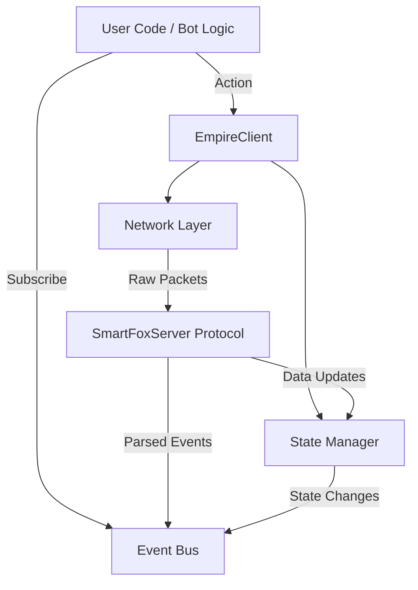

# Architecture Overview

EmpireCore is designed as a layered framework to ensure separation of concerns, scalability, and maintainability.

## High-Level Layers

### 1. The Network Layer (`empire_core.network`)
*   **Responsibility**: Handles the raw TCP/WebSocket connection to Goodgame Studios servers.
*   **Components**:
    *   `ConnectionManager`: Manages the socket, reconnections, and SSL contexts.
    *   `PacketSerializer`: Converts Python objects to SFS `%xt%` strings.
    *   `PacketDeserializer`: Parses incoming XML/SFS strings into Python dictionaries/objects.
*   **Performance**: Uses `asyncio` streams to prevent I/O blocking.

### 2. The Protocol Layer (`empire_core.protocol`)
*   **Responsibility**: Defines the grammar of the game communication.
*   **Components**:
    *   `CommandDef`: Definitions of known commands (e.g., `lli`, `gam`, `get_account_infos`).
    *   `HandshakeHandler`: Manages the complex login sequence (Policy file -> Version check -> Login -> Zone join).

### 3. The State Layer (`empire_core.state`)
*   **Responsibility**: Maintains a "source of truth" for the current game state.
*   **Components**:
    *   `World`: The root object containing the map, players, and alliances.
    *   `EntityManager`: Tracks objects by ID to ensure strict object identity (e.g., `player_a` in the memory is the same instance everywhere).
*   **Behavior**: 
    *   Passive: Updated strictly by incoming network packets.
    *   Reactive: Emits signals when properties change (e.g., `castle.resource_update`).

### 4. The Public API (`empire_core.client`)
*   **Responsibility**: The user-facing entry point.
*   **Components**:
    *   `EmpireClient`: The main class users instantiate.
    *   Exposes high-level methods: `attack()`, `send_resources()`, `get_messages()`.
    *   Exposes the decorator-based event system.
