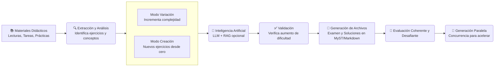

# EvolutIA: Generador de preguntas de examen

Sistema automatizado para generar preguntas de examen desafiantes basadas en materiales didácticos existentes (lecturas, prácticas, tareas). El sistema aumenta la complejidad matemática de los ejercicios mientras mantiene el formato y estructura familiar.


## Características

- **Extracción automática**: Lee y procesa materiales didácticos en formato Markdown/MyST
- **Análisis de complejidad**: Identifica tipo, pasos, variables y conceptos de cada ejercicio
- **Generación inteligente**: Usa IA (OpenAI GPT-4 o Claude) para crear variaciones más complejas
- **Validación automática**: Verifica que las variaciones sean más desafiantes que los originales
- **Formato consistente**: Genera archivos en formato MyST/Markdown compatible con Curvenote
- **Multi-proveedor**: Soporte para OpenAI (GPT-4), Anthropic (Claude 3) y Google (Gemini 1.5).
- **RAG (Retrieval-Augmented Generation)**: Utiliza apuntes de clase y ejercicios existentes para dar contexto.
- **Modo Creación**: Genera ejercicios nuevos desde cero basados en temas y tags del curso.
- **Generación Paralela**: Utiliza concurrencia para acelerar drásticamente la generación de múltiples ejercicios.
- **Parseo Robusto**: Sistema avanzado para manejar y limpiar JSON con alta densidad de LaTeX.



## Requisitos

- Python 3.8 o superior
- API key de OpenAI o Anthropic (Claude)
- Opcional: Servidor LLM local (Ollama, LM Studio) para generación offline

### Instalación

1.  Clona el repositorio:
    ```bash
    git clone https://github.com/glacy/evolutIA.git
    cd evolutia
    ```

2.  Crea y activa un entorno virtual:
    ```bash
    python -m venv venv
    source venv/bin/activate  # En Windows: venv\Scripts\activate
    ```

3.  Instala el paquete en modo editable (esto instalará también las dependencias):
    ```bash
    pip install -e .
    ```

4.  Configura las variables de entorno:
    ```bash
    cp .env.example .env
    # Edita .env con tus API keys
    ```
   Y edita `.env` con tus claves reales:
   ```
   OPENAI_API_KEY=sk-tu-api-key-aqui
   ANTHROPIC_API_KEY=sk-ant-tu-api-key-aqui
   GOOGLE_API_KEY=tu-api-key-aqui
   ```

   **Obtener API keys**:
   - OpenAI: https://platform.openai.com/api-keys
   - Anthropic: https://console.anthropic.com/
   - Google: https://console.cloud.google.com/ai/generative-ai/credentials

## Uso

### Uso básico

```bash
python evolutia.py \
  --tema analisis_vectorial \
  --num_ejercicios 4 \
  --output examenes/examen3
```

### Variación de ejercicios específicos

```bash
python evolutia.py \
  --tema analisis_vectorial \
  --label ex1-s1 ex2-s1 \
  --output variacion_especifica
```

### Listar ejercicios disponibles

```bash
python evolutia.py --tema analisis_vectorial --list
```

Si no se indica un tema, el sistema buscará en todos los archivos disponibles.

### Opciones disponibles

- `--tema`: Tema del examen (requerido)
  - Ejemplos: `analisis_vectorial`, `matrices`, `edps`, `espacios_vectoriales`, `numeros_complejos`
  
- `--num_ejercicios`: Número de ejercicios a generar (default: 1)

- `--output`: Directorio de salida (requerido)
  - Se creará automáticamente si no existe

- `--complejidad`: Nivel de complejidad objetivo
  - Opciones: `media`, `alta` (default), `muy_alta`

- `--api`: Proveedor de API de IA
  - Opciones: `openai` (default), `anthropic`, `local`, `gemini`

- `--label`: ID(s) específico(s) del ejercicio a variar (ej: `ex1-s1` o múltiples: `ex1-s1 ex2-s1`).
  - Si se usa, ignora `--num_ejercicios` y genera variaciones **solo** para los ejercicios indicados.

- `--config`: Ruta a un archivo de configuración externo (ej: `./mi_curso_config.yaml`). (default: busca `evolutia_config.yaml` en la raíz, o usa el interno).

- `--base_path`: Ruta base del proyecto (default: directorio actual)

- `--examen_num`: Número del examen (se infiere del nombre del directorio si no se especifica)

- `--no_generar_soluciones`: NO genera las soluciones (por defecto siempre se generan)

- `--subject`: Asignatura del examen (default: "IF3602 - II semestre 2025")

- `--keywords`: Palabras clave para el examen (múltiples valores)

- `--use_rag`: Usa RAG para enriquecer generación con contexto del curso (requiere indexación inicial)

- `--reindex`: Fuerza re-indexación de materiales (solo con `--use_rag`)

- `--list`: Lista todos los ejercicios encontrados en los temas seleccionados y muestra sus etiquetas, archivo origen y preview.

- `--query`: Realiza una búsqueda semántica en la base de datos RAG y muestra los fragmentos de texto más relevantes encontrados. Útil para verificar qué "sabe" el sistema sobre un tema.

- `--workers`: Número de hilos simultáneos para la generación paralela (default: 5). Útil para ajustar el rendimiento o evitar límites de rate.

### Ejemplos

**Generar examen de análisis vectorial con 4 ejercicios:**
```bash
python evolutia.py \
  --tema analisis_vectorial \
  --num_ejercicios 4 \
  --output examenes/examen3
```

**Generar examen usando Claude (las soluciones se generan automáticamente):**
```bash
python evolutia.py \
  --tema matrices \
  --num_ejercicios 3 \
  --api anthropic \
  --output examenes/examen4
```

### Uso Básico

Una vez instalado, puedes usar el comando `evolutia` (o ejecutar el wrapper `python evolutia_cli.py`):

1.  **Analizar el repositorio y entender la estructura:**
    ```bash
    evolutia --analyze
    ```
    *(Esto generará `config.yaml` si no existe)*

2.  **Generar examen con variaciones de ejercicios existentes:**
    ```bash
    evolutia --exam-number 1 --num-ejercicios 3 --tema "Derivadas" --complejidad "media"
    ```
**Generar examen SIN soluciones:**
```bash
python evolutia.py \
  --tema matrices \
  --num_ejercicios 3 \
  --no_generar_soluciones \
  --output examenes/examen5
```

**Generar examen con complejidad muy alta:**
```bash
python evolutia.py \
  --tema edps \
  --num_ejercicios 5 \
  --complejidad muy_alta \
  --output examenes/examen5
```

**Generar examen usando RAG (recomendado para mejor calidad):**
```bash
python evolutia.py \
  --tema analisis_vectorial \
  --num_ejercicios 4 \
  --use_rag \
  --output examenes/examen3
```

### Herramienta de Consulta RAG
Puedes "preguntarle" al sistema qué información tiene sobre un concepto específico sin generar nada:

```bash
python evolutia.py --query "Teorema de Stokes"
```

Esto mostrará una lista de ejercicios y lecturas relevantes con su puntuación de similitud.

### Modo Creación (Nuevo)
Genera ejercicios totalmente nuevos desde cero, basándose en un tema y tags opcionales, en lugar de variar ejercicios existentes.

**Generar 3 ejercicios nuevos de variable compleja:**
```bash
python evolutia.py \
  --mode creation \
  --tema numeros_complejos \
  --num_ejercicios 3 \
  --output examenes/parcial1
```

**Generar con tags específicos y usar Gemini:**
```bash
python evolutia.py \
  --mode creation \
  --tema analisis_vectorial \
  --tags stokes divergencia \
  --api gemini \
  --output examenes/quiz3
```

### Tipos de Ejercicio
Ahora puedes elegir entre ejercicios de desarrollo (default) o selección única (quiz).

**Generar pregunta de Selección Única (Conceptual):**
```bash
python evolutia.py \
  --mode creation \
  --tema matrices \
  --type multiple_choice \
  --api anthropic \
  --output examenes/quiz_rapido
```

## Uso de LLM local (offline)

EvolutIA soporta la generación de exámenes usando modelos locales como Llama 3, Mistral, o Qwen, ejecutándose en tu propia máquina a través de herramientas como [Ollama](https://ollama.com/) o [LM Studio](https://lmstudio.ai/).

**Requisitos:**
1. Tener corriendo un servidor local compatible con OpenAI API.
   - **Ollama**: Ejecuta `ollama serve` (por defecto en puerto 11434).
   - **LM Studio**: Inicia el servidor local desde la interfaz.

2. **Ejemplo de ejecución:**
```bash
python evolutia.py \
  --tema matrices \
  --num_ejercicios 3 \
  --api local \
  --output examenes/examen_local
```

3. **Configuración avanzada (opcional):**
Si tu servidor no usa el puerto por defecto o quieres cambiar el modelo, edita `evolutia/config/config.yaml`:
```yaml
local:
  base_url: "http://localhost:11434/v1"  # URL de tu servidor
  model: "llama3"                        # Modelo a utilizar
  api_key: "not-needed"
```

## Sistema RAG (Retrieval-Augmented Generation)

El sistema incluye un módulo RAG opcional que mejora significativamente la calidad de las variaciones generadas.

### ¿Qué es RAG?

RAG (Retrieval-Augmented Generation) es un sistema que:
- **Indexa** todos tus materiales didácticos (ejercicios, soluciones y **lecturas/teoría**)
- **Busca** ejercicios similares y conceptos teóricos relevantes cuando generas variaciones
- **Enriquece** los prompts con información del curso para generar variaciones más coherentes
- **Valida** consistencia comparando con ejercicios y teoría reales del curso

### Ventajas de usar RAG

1. **Mejor contexto**: Las variaciones son más coherentes con el estilo y nivel del curso
2. **Consistencia**: Los ejercicios generados se alinean mejor con materiales existentes
3. **Relevancia**: Selección inteligente de ejercicios base por similitud semántica
4. **Validación mejorada**: Compara con ejercicios reales del curso

### Cómo usar RAG

**Primera vez (indexación inicial):**
```bash
python evolutia.py \
  --tema analisis_vectorial \
  --num_ejercicios 4 \
  --use_rag \
  --reindex \
  --output examenes/examen3
```

La primera vez con `--use_rag` indexará automáticamente todos los materiales. Esto puede tardar unos minutos.

**Uso posterior:**
```bash
python evolutia.py \
  --tema analisis_vectorial \
  --num_ejercicios 4 \
  --use_rag \
  --output examenes/examen4
```

El índice se reutiliza automáticamente. Solo usa `--reindex` si cambias materiales y quieres actualizar el índice.

### Configuración de RAG

Edita `config/config.yaml` para personalizar RAG:
```yaml
rag:
  vector_store:
    # Base de datos vectorial persistente
    persist_directory: "./storage/vector_store"
    collection_name: "mi_curso_coleccion"
  embeddings:
    provider: openai
    model: text-embedding-3-small
  retrieval:
    top_k: 5
    similarity_threshold: 0.7
```

**Opciones de embeddings:**
- `openai`: Más rápido y preciso, pero tiene costo (~$0.02 por 1M tokens)
- `sentence-transformers`: Gratis y local, pero más lento

### Costos de RAG

- **Indexación inicial**: ~$1-5 dependiendo del volumen de materiales
- **Búsquedas**: Mínimas, solo cuando generas variaciones
- **Alternativa gratuita**: Usa `sentence-transformers` en lugar de OpenAI

### Cuándo usar RAG

**Usa RAG si:**
- Tienes muchos materiales (50+ ejercicios)
- Quieres máxima consistencia con el curso
- Tienes presupuesto para embeddings de OpenAI

**No uses RAG si:**
- Tienes pocos materiales (<20 ejercicios)
- Prefieres simplicidad y rapidez
- El costo es una preocupación

## Gestión de metadatos y descubrimiento

### Organización y visibilidad de ejercicios

Para que `evolutia` encuentre ejercicios ubicados en carpetas generales como `examenes/` o `tareas/` cuando filtras por un tema (ej: `--tema analisis_vectorial`), es fundamental que los archivos fuente incluyan los metadatos correctos.

El sistema utiliza la siguiente lógica de "descubrimiento":

1. **Escaneo directo**: Todos los archivos dentro de la carpeta del tema (ej: `analisis_vectorial/`) son incluidos automáticamente.
2. **Escaneo de exámenes y tareas**: Para archivos fuera de la carpeta del tema, el sistema revisa el *frontmatter* y los incluye **SOLO SI** encuentra coincidencias con el tema en:
    - **`tags`**: (Recomendado) Incluye el código del tema (ej: `analisis_vectorial`) en la lista.
    - **`subject`**: El nombre de la asignatura o tema.
    - **`keywords`**: Palabras clave relacionadas.

**Ejemplo de Frontmatter para que un examen sea "visible":**
```yaml
---
title: Examen Parcial 1
tags: 
  - analisis_vectorial    # <--- CRÍTICO: Permite que el extractor lo encuentre
  - stokes
subject: Cálculo Superior
---
```

> **Nota**: Si usas `--label` para seleccionar un ejercicio específico, el filtro de tema se ignora y el sistema buscará el ID en todos los archivos disponibles.

### Propagación de tags (trazabilidad)

`EvolutIA` asegura que los metadatos de los ejercicios originales se conserven en las variaciones generadas. Esto es crucial para mantener un registro de qué conceptos se están evaluando.

**¿Cómo funciona?**
1. **Lectura**: El sistema lee los tags del archivo fuente (`.md`) donde reside el ejercicio original.
2. **Transferencia**: Al generar la variación, estos tags se copian al nuevo archivo generado.
3. **Agregación**: El archivo final del examen (`examenX.md`) recopila automáticamente los tags de *todos* los ejercicios incluidos, generando un resumen temático del examen.

#### Ejemplo práctico

**1. Archivo fuente (ej: `matrices/semana11_practica.md`)**
Este archivo contiene los ejercicios originales ("semilla") y define el contexto temático:

```yaml
---
title: Ejercicios Semana 11
tags: 
  - autovalores        # Concepto clave
  - diagonalizacion    # Concepto clave
  - procedimental      # Tipo de competencia
  - intermedio         # Nivel de dificultad
subject: Matrices y Algebra Lineal
---
```

**2. Archivo generado (ej: `examenes/examen1/ex1_e1.md`)**
La variación generada hereda estos metadatos y agrega los suyos propios:

```yaml
---
generator: evolutia
source: ai_variation
tags: [autovalores, diagonalizacion, procedimental, intermedio] # <--- Tags heredados
original_subject: Matrices y Algebra Lineal
complexity: media
mode: variation          # <--- Nuevo: Modo de generación
target_difficulty: alta  # <--- Nuevo: Dificultad objetivo
based_on: ex1-e1         # <--- Nuevo: ID del ejercicio semilla
rag_references:          # <--- Nuevo: Contexto usado (con --use_rag)
  - ex5-e2
  - semana3_lectura.md
---
```


## Estructura de archivos generados

El script genera la siguiente estructura:

```
examenes/examen3/
├── examen3.md              # Archivo principal del examen
├── ex1_e3.md              # Ejercicio 1
├── ex2_e3.md              # Ejercicio 2
├── ex3_e3.md              # Ejercicio 3
├── ex4_e3.md              # Ejercicio 4
├── solucion_ex1_e3.md     # Solución ejercicio 1
├── solucion_ex2_e3.md     # Solución ejercicio 2
├── solucion_ex3_e3.md     # Solución ejercicio 3
└── solucion_ex4_e3.md     # Solución ejercicio 4
```

## ¿Cómo funciona?

1. **Extracción**: El sistema busca y lee materiales didácticos del tema especificado
   - Busca en directorios del tema (ej: `analisis_vectorial/`)
   - Lee archivos de prácticas (`*practica*.md`)
   - Lee archivos de tareas (`tareas/tarea*/tarea*.md`)

2. **Análisis**: Analiza cada ejercicio encontrado
   - Identifica tipo (demostración, cálculo, aplicación)
   - Cuenta pasos en soluciones
   - Extrae variables y conceptos matemáticos
   - Calcula complejidad matemática

3. **Generación**: Crea variaciones más complejas usando IA
   - Aumenta número de variables
   - Combina múltiples conceptos
   - Agrega pasos intermedios
   - Modifica sistemas de coordenadas

4. **Validación**: Verifica que las variaciones sean más complejas
   - Compara complejidad total
   - Verifica aumento en pasos, variables, conceptos
   - Valida operaciones matemáticas

5. **Generación de archivos**: Crea archivos en formato MyST/Markdown
   - Frontmatter YAML apropiado
   - Estructura de ejercicios con labels
   - Bloques de solución

## Configuración

Puedes personalizar el comportamiento editando `config/config.yaml`:

- **APIs**: Configurar modelos y parámetros
- **Rutas**: Especificar directorios de materiales (dentro de `materials_directories`)
- **Complejidad**: Ajustar umbrales de validación
- **Exámenes**: Configurar valores por defecto y **keywords** por tema
- **RAG**: Definir persistencia (local vs nube) y nombres de colección

### Cambiar Proveedor por Defecto
Puedes definir qué IA usar si no se especifica el argumento `--api`:

```yaml
api:
  default_provider: gemini  # openai, anthropic, gemini, local
  gemini:
    model: gemini-1.5-pro   # Cambiar modelo específico
```

### Nota Importante sobre Configuración
Para evitar errores de validación, asegúrate de que tu `evolutia_config.yaml` incluya la sección `api`. El sistema usa esto para determinar los modelos por defecto.

### Configuración Avanzada / Multi-Curso

Para usar `evolutia` en múltiples cursos o sin modificar el código fuente:

1.  **Archivo de Configuración Externo**: Crea un archivo `evolutia_config.yaml` en la raíz de tu proyecto (junto a la carpeta `evolutia/`). El sistema lo detectará automáticamente.
2.  **Argumento CLI**: Usa `--config ruta/a/mi_config.yaml` para especificar un archivo arbitrario.

**Ejemplo de estructura recomendada para un nuevo curso:**
```
NuevoCurso/
├── evolutia/            # Carpeta copiada o submódulo git
├── evolutia_config.yaml # Configuración específica de este curso
└── temas/               # Carpetas de contenido
```

> **IMPORTANTE**: No edites `evolutia/config/config.yaml` para datos de un curso específico. Ese archivo es una plantilla del motor. Crea un `evolutia_config.yaml` en la raíz de tu proyecto para tus ajustes personales.

> **Guía Detallada**: Para instrucciones paso a paso sobre cómo usar Git Submodules, consulta [GUIDE_SUBMODULES.md](GUIDE_SUBMODULES.md).

## Estrategias de aumento de complejidad

El sistema aplica las siguientes estrategias para aumentar la complejidad:

1. **Más variables independientes**: Introduce parámetros adicionales
2. **Combinación de conceptos**: Integra múltiples teoremas en un ejercicio
3. **Pasos intermedios**: Agrega cálculos adicionales
4. **Casos límite**: Introduce condiciones especiales
5. **Sistemas de coordenadas**: Cambia de cartesianas a cilíndricas/esféricas
6. **Dimensiones adicionales**: Aumenta la dimensionalidad del problema

## Solución de Problemas

### Error: "No se encontraron materiales"
- Verifica que el tema especificado existe como directorio
- Asegúrate de que hay archivos `.md` con ejercicios en ese directorio
- Usa `--base_path` para especificar la ruta correcta

### Error: "API key no configurada"
- Verifica que el archivo `.env` existe y contiene la API key
- Asegúrate de que el archivo está en el directorio `evolutia/`
- Revisa que la variable se llama correctamente (`OPENAI_API_KEY` o `ANTHROPIC_API_KEY`)

### Error: "No se generaron variaciones válidas"
- Intenta aumentar el número de ejercicios candidatos
- Verifica que los ejercicios originales tienen suficiente complejidad
- Considera usar `--complejidad media` para requisitos menos estrictos

### Variaciones no son suficientemente complejas
- Ajusta los umbrales en `config/config.yaml`
- Usa `--complejidad muy_alta`
- Revisa los prompts en `variation_generator.py` y ajústalos según necesites
- Considera usar `--use_rag` para mejor contexto

### Error: "RAG no disponible"
- Instala dependencias: `pip install chromadb sentence-transformers`
- Verifica que `OPENAI_API_KEY` está configurada si usas embeddings de OpenAI
- Si prefieres embeddings locales, cambia `provider: sentence-transformers` en `config.yaml`

## Limitaciones

- Requiere conexión a internet para usar APIs de IA
- Los costos de API dependen del número de ejercicios generados
- La calidad depende de la calidad de los materiales originales
- Las variaciones requieren revisión manual antes de usar

## Mejores prácticas

1. **Revisar siempre**: Las variaciones generadas deben revisarse manualmente
2. **Ajustar según necesidad**: Modifica los ejercicios generados según tu criterio
3. **Probar primero**: Genera un examen de prueba antes de usar en evaluación real
4. **Mantener materiales actualizados**: Asegúrate de que los materiales fuente están completos
5. **Documentar cambios**: Si modificas ejercicios, documenta los cambios realizados

## Configuración automática

El proyecto incluye una herramienta para sincronizar automáticamente el archivo de configuración con la estructura de carpetas y los metadatos de los archivos de lectura.

### config_manager.py

Este script escanea el directorio del proyecto para:
1. Identificar carpetas de temas existentes.
2. Leer los archivos de lectura (`semana*_lectura.md`) y extraer las palabras clave (`keywords`) del frontmatter.
3. Actualizar el archivo de configuración activo (`evolutia_config.yaml` o interno).

**Uso:**

```bash
# Uso básico (detecta configuración automáticamente)
python evolutia/config_manager.py

# Uso con archivo específico
python evolutia/config_manager.py --config ./evolutia_config.yaml
```

Ejecuta este script cada vez que agregues nuevos temas o modifiques las palabras clave en los materiales de lectura.

### Validación de Configuración (Schema)

Evolutia incluye un sistema de validación estricta para el archivo de configuración (`evolutia_config.yaml`).

- **JSON Schema**: La estructura válida se define en `evolutia/schemas/config.schema.json`.
- **Validación Automática**: Cada vez que ejecutas `evolutia.py` o `config_manager.py`, el sistema verifica que tu archivo de configuración cumpla con el esquema.
- **Errores Claros**: Si tu configuración tiene errores (campos faltantes, tipos incorrectos), el sistema detendrá la ejecución y te indicará exactamente dónde está el problema.

Esto facilita la adopción de la herramienta por nuevos usuarios, reduciendo errores de configuración inicial.

## Estructura del repositorio (Contexto)

El generador está diseñado para funcionar dentro de la estructura estándar del curso. A continuación se muestra el esquema de directorios esperado:

```
.
├── tema1/                    # Carpeta del primer tema (ej: analisis_vectorial)
├── tema2/                    # Carpeta del segundo tema
├── ...                       # Otros temas
├── tareas/                   # Tareas evaluadas (fuente de ejercicios)
├── proyecto/                 # Enunciados de proyectos
├── examenes/                 # Directorio de salida para exámenes generados
├── evolutia/                 # Este sistema de generación
├── myst.yml                  # Configuración del sitio Curvenote
└── programa-curso.md         # Información general del curso
```

### Estructura interna de cada tema

Cada carpeta de tema (ej: `tema1/`) debe seguir una estructura similar para que el extractor encuentre los materiales:

```
tema1/
├── semana1_lectura.md        # Material teoría (puede contener ejemplos)
├── semana1_practica.md       # Ejercicios de práctica
├── semana2_lectura.md
├── semana2_practica.md
└── otros_archivos.md         # Otros materiales complementarios
```

## Estructura del código (generador)

```
evolutia/
├── evolutia.py               # Script principal (CLI Wrapper)
├── evolutia_engine.py        # Motor central de orquestación
├── config_manager.py         # Gestor de configuración automática
├── material_extractor.py     # Extracción de materiales
├── exercise_analyzer.py      # Análisis de complejidad
├── variation_generator.py    # Generación de variaciones
├── llm_providers.py          # Proveedores de LLM (OpenAI, Anthropic, Gemini, Local)
├── complexity_validator.py   # Validación de complejidad
├── exam_generator.py         # Generación de archivos
├── rag/                      # Sistema RAG (opcional)
│   ├── rag_indexer.py        # Indexación de materiales
│   ├── rag_retriever.py      # Búsqueda semántica
│   ├── context_enricher.py   # Enriquecimiento de contexto
│   ├── enhanced_variation_generator.py  # Generador con RAG
│   ├── consistency_validator.py  # Validación de consistencia
│   └── rag_manager.py        # Gestor principal
├── storage/
│   └── vector_store/         # Base de datos vectorial (RAG)
├── config/
│   └── config.yaml          # Configuración
├── templates/
│   ├── exam_template.md      # Plantilla de examen
│   └── exercise_template.md  # Plantilla de ejercicio
├── utils/
│   ├── markdown_parser.py    # Parser de Markdown
│   ├── math_extractor.py     # Extracción de matemáticas
│   └── json_parser.py        # Parser robusto de JSON (LaTeX friendly)
├── requirements.txt          # Dependencias
└── README.md                 # Esta documentación
```

## Contribuciones

Para mejorar el sistema:

1. Ajusta los prompts en `variation_generator.py` para mejor generación
2. Agrega nuevos patrones de conceptos en `exercise_analyzer.py`
3. Mejora las métricas de complejidad en `complexity_validator.py`
4. Personaliza las plantillas en `templates/`

## Licencia

Este proyecto está bajo la Licencia Apache 2.0. Consulta el archivo [LICENSE](LICENSE) para más detalles.

## Reconocimientos

Este proyecto fue desarrollado utilizando asistencia de Inteligencia Artificial:

- **Cursor**: Entorno de desarrollo asistido por IA.
- **Antigravity** (Google DeepMind): Agente de codificación y planificación avanzado.

