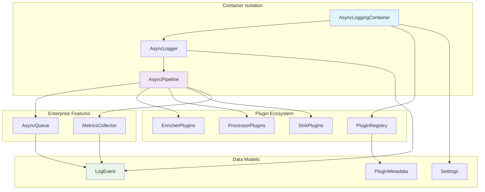

# Components

Based on the architectural patterns, tech stack, and data models defined above, here are the major logical components that will implement the Fapilog v3 async-first architecture:

## AsyncLogger

**Responsibility:** Primary interface for async-first logging with zero-copy operations and parallel processing

**Key Interfaces:**

- `async def info(message: str, **kwargs) -> None` - Async logging methods
- `async def create(settings: Settings) -> AsyncLogger` - Factory method
- `async def shutdown() -> None` - Graceful resource cleanup

**Dependencies:** Settings, AsyncLoggingContainer, LogEvent pipeline
**Technology Stack:** Python asyncio, Pydantic v2 for validation, zero-copy event creation

## AsyncLoggingContainer

**Responsibility:** Perfect isolation with zero global state, managing isolated plugin instances and pipeline execution

**Key Interfaces:**

- `async def create_logger(settings: Settings) -> AsyncLogger` - Logger factory
- `async def load_plugins() -> None` - Dynamic plugin loading and validation
- `async def get_metrics() -> ContainerMetrics` - Performance monitoring

**Dependencies:** PluginRegistry, MetricsCollector
**Technology Stack:** asyncio context management, importlib.metadata for plugin discovery

## AsyncPipeline

**Responsibility:** Core async-first event processing pipeline implementing enrichment → redaction → processing → queue → sinks flow

**Key Interfaces:**

- `async def process_event(event: LogEvent) -> None` - Main pipeline entry point
- `async def register_enricher(enricher: EnricherPlugin) -> None` - Plugin registration
- `async def register_redactor(redactor: RedactorPlugin) -> None` - Plugin registration
- `async def get_pipeline_metrics() -> PipelineMetrics` - Performance monitoring

**Dependencies:** EnricherPlugins, RedactorPlugins, ProcessorPlugins, SinkPlugins, AsyncQueue  
**Technology Stack:** asyncio parallel processing, zero-copy event passing, Prometheus metrics

## PluginRegistry

**Responsibility:** Dynamic plugin discovery, loading, and lifecycle management for the universal plugin ecosystem

**Key Interfaces:**

- `async def discover_plugins() -> List[PluginMetadata]` - Plugin discovery
- `async def load_plugin(metadata: PluginMetadata) -> Plugin` - Safe plugin loading

**Dependencies:** PluginMetadata
**Technology Stack:** importlib.metadata, setuptools entry points (multi-group: `fapilog.sinks`, `fapilog.processors`, `fapilog.enrichers`, `fapilog.redactors`, `fapilog.alerting`), async validation

## MetricsCollector

**Responsibility:** Comprehensive metrics collection with async-first patterns and zero-copy operations for 500K-2M events/second monitoring

**Key Interfaces:**

- `async def record_event_processed(duration: float) -> None` - Event processing metrics
- `async def record_pipeline_throughput(events_per_second: float) -> None` - Throughput tracking
- `async def export_metrics() -> Dict[str, float]` - Metrics export for monitoring systems

**Dependencies:** Prometheus client, AsyncPipeline performance data  
**Technology Stack:** Prometheus client async support, zero-copy metric aggregation

## AsyncQueue

**Responsibility:** High-performance async buffering and batching with overflow handling for zero-copy operations

**Key Interfaces:**

- `async def enqueue(event: LogEvent) -> None` - Event queuing with backpressure
- `async def dequeue_batch(size: int) -> List[LogEvent]` - Batch dequeuing
- `async def handle_overflow(strategy: OverflowStrategy) -> None` - Overflow management

**Dependencies:** asyncio.Queue, OverflowStrategy, batch management  
**Technology Stack:** asyncio native queuing, zero-copy event references, batch optimization

## FastAPIIntegrationLayer

**Responsibility:** Framework integration for FastAPI applications providing middleware, dependency injection, lifecycle management, and testing utilities

**Key Interfaces:**

- `class FapilogMiddleware` - ASGI middleware for request-scoped logging with correlation ID propagation
- `async def get_logger() -> AsyncLogger` - FastAPI dependency for logger injection
- `def register_fapilog_lifecycle(app: FastAPI, settings: Settings) -> None` - Lifecycle hook registration
- `class FapilogExceptionHandler` - Optional exception logging integration
- `def fapilog_test_fixture() -> AsyncLogger` - Test fixture for FastAPI applications

**Dependencies:** AsyncLogger, AsyncLoggingContainer, FastAPI application instance  
**Technology Stack:** FastAPI middleware, dependency injection, async context variables, pytest fixtures; optional extra with import guard (`fapilog.fastapi.AVAILABLE`)

**Key Features:**

- **Zero Global State**: Each request gets independent logger instance with container isolation
- **Correlation ID Propagation**: Automatic correlation ID generation and async context propagation
- **Request-Aware Logging**: Optional request/response logging plugin with PII redaction
- **Performance Optimized**: <1ms initialization overhead per request
- **Testing Support**: Comprehensive test fixtures for FastAPI application testing

## Component Diagrams

