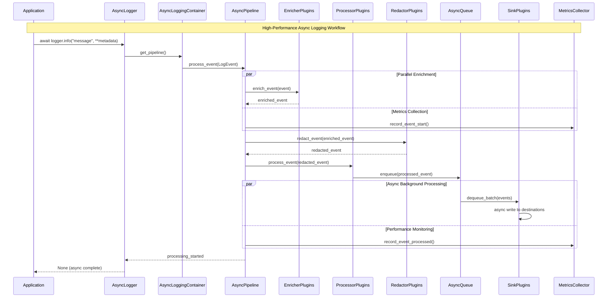
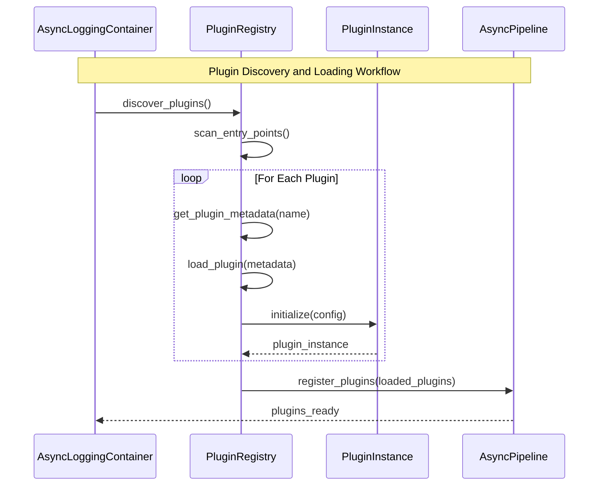
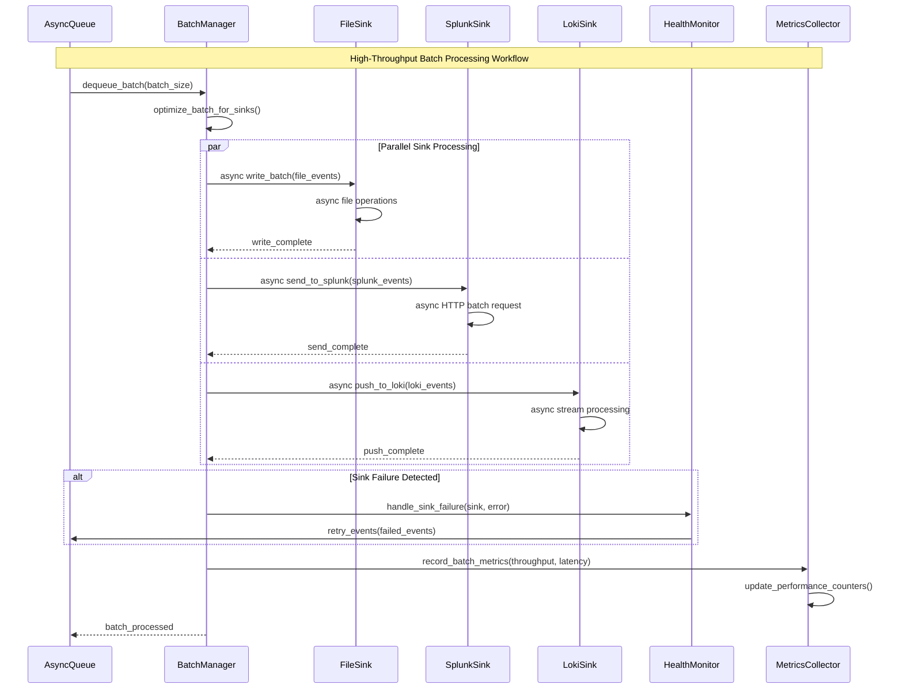
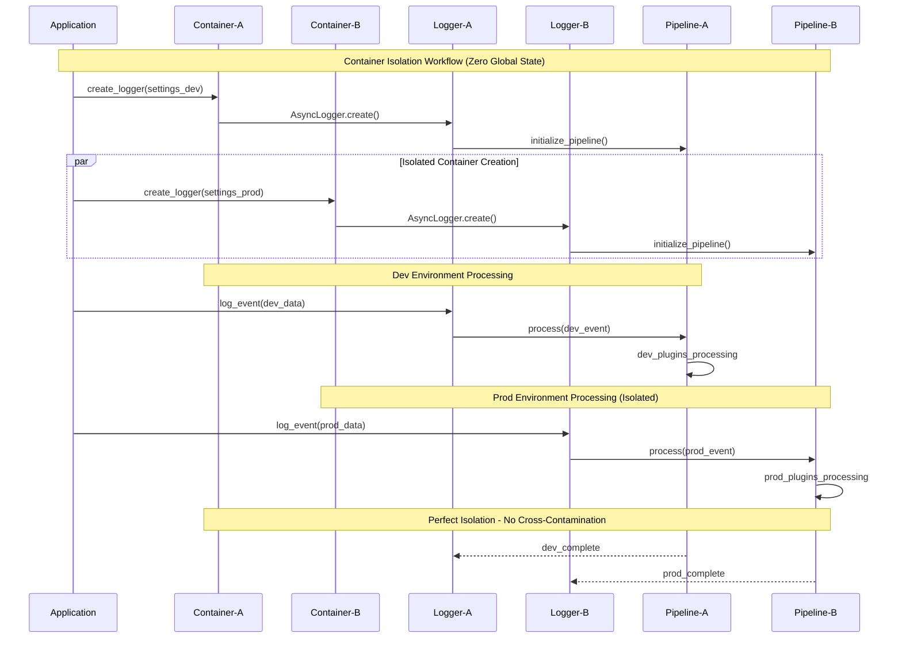

# Core Workflows

Here are the key system workflows that illustrate the async-first architecture and component interactions:

## High-Performance Async Logging Workflow

## Plugin Discovery and Loading Workflow

## High-Throughput Batch Processing Workflow

## Container Isolation Workflow

