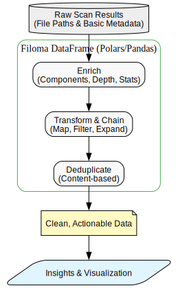

# Filoma Architecture

Filoma is built to solve two main challenges: blazingly fast filesystem discovery and seamless data preparation for analysis.

## 1. High-Speed Discovery & Profiling

The primary goal of Filoma is to scan massive directory trees and extract metadata as quickly as possible. It achieves this by automatically selecting the best available backend for your system, preferring high-performance Rust or the `fd` utility over pure Python.


*Intuition: Filoma acts as a smart orchestrator that picks the fastest path to your data, enriching it with deep metadata (like hashes or image stats) along the way.*

DOT source: `docs/diagrams/profiling-flow.dot`.

## 2. Intuitive Data Preparation

Once discovered, Filoma turns raw filesystem metadata into a powerful `filoma.DataFrame`. This layer allows you to treat your filesystem like a database, enabling easy enrichment, chaining of operations, and content-based deduplication.



*Intuition: Filoma bridges the gap between raw files and actionable insights, providing a clean API to transform, filter, and deduplicate your data for downstream use.*

DOT source: `docs/diagrams/data-processing.dot`.

Render both diagrams locally with Graphviz. Example commands:

```bash
# install graphviz on macOS (if needed)
brew install graphviz

# render profiling flow
dot -Tsvg docs/diagrams/profiling-flow.dot -o docs/assets/images/profiling-flow.svg

# render data processing flow
dot -Tsvg docs/diagrams/data-processing.dot -o docs/assets/images/data-processing.svg
```

If you want, I can run these commands here and replace the placeholder SVGs with the generated diagrams.
