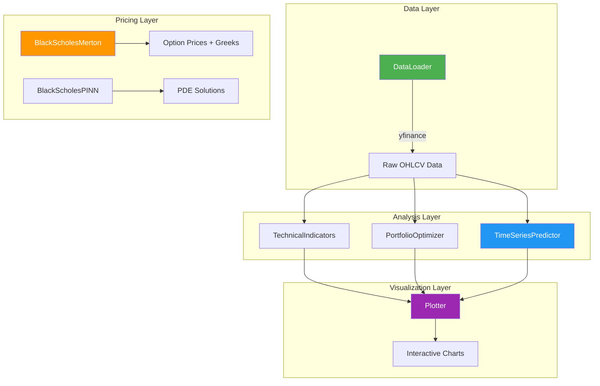

<p align="center">
  
  <br>
  <em>State-of-the-art Financial Analysis & Deep Learning Library</em>
</p>

<p align="center">
  <a href="https://github.com/ankitdutta428/finlearner/actions/workflows/tests.yml">
    
  </a>
  <a href="https://pypi.org/project/finlearner/">
    
  </a>
  <a href="https://pypi.org/project/finlearner/">
    
  </a>
  <a href="https://opensource.org/licenses/Apache-2.0">
    
  </a>
  <a href="https://www.python.org/downloads/">
    
  </a>
  <a href="https://github.com/ankitdutta428/finlearner/stargazers">
    
  </a>
</p>

<h3 align="center">
  <a href="#-installation">Installation</a> |
  <a href="#-quick-start">Quick Start</a> |
  <a href="./docs/THEORY.md">📖 Theory</a> |
  <a href="https://finlearner.readthedocs.io">Documentation</a> |
  <a href="#-contributing">Contributing</a>
</h3>

---

## 🔥 What is FinLearner?

**FinLearner** is a comprehensive Python library designed for quantitative researchers, algorithmic traders, and data scientists. It provides production-ready tools for:

- 📈 **Deep Learning Forecasting** — LSTM, GRU, Transformer, CNN-LSTM, Ensemble models
- 💼 **Portfolio Optimization** — Markowitz, Black-Litterman, Risk Parity
- 📊 **Technical Analysis** — 20+ indicators including RSI, MACD, Bollinger Bands, Ichimoku Cloud
- 🎯 **Options Pricing** — Black-Scholes-Merton model with Greeks calculation
- 🧠 **Physics-Informed Neural Networks** — PINN for solving Black-Scholes PDE
- 📉 **Risk Metrics** — VaR (Historical, Parametric, Monte Carlo), CVaR, Max Drawdown
- 🔍 **Anomaly Detection** — VAE for price pattern anomalies
- 🤖 **Gradient Boosting** — XGBoost/LightGBM with auto feature engineering
- 📊 **Interactive Visualization** — Beautiful Plotly-powered financial charts

> **Philosophy**: One library. All the tools you need. From data fetching to model deployment.

---

## 📰 News

| Date | News |
|------|------|
| **2026-02** | 02/2026 | v0.1.1 Patch Release | Critical fix for Deep Learning models and updated demos |
| 02/2026 | v0.1.0 Major Release | Full suite: Portfolio, Risk, Options, ML/DL models |API, and CLI demos |
| **2025-12** | 📊 Added Ichimoku Cloud and advanced technical indicators |
| **2025-12** | 🚀 FinLearner is now available on PyPI! |

---

## 📦 Installation

### Install with pip (recommended)

```bash
pip install finlearner
```

### Install from source

```bash
git clone https://github.com/ankitdutta428/finlearner.git
cd finlearner
pip install -e .
```

### Requirements

- Python 3.8+
- TensorFlow 2.10+
- NumPy, Pandas, SciPy, Scikit-learn
- Plotly, Matplotlib, Seaborn
- yfinance

---

## ⚡ Quick Start

### 🔮 Stock Price Prediction with LSTM

Train a deep learning model to predict stock prices with just a few lines of code:

```python
from finlearner import DataLoader, TimeSeriesPredictor, Plotter

# 1. Fetch and preprocess data
df = DataLoader.download_data('AAPL', start='2020-01-01', end='2024-01-01')

# 2. Initialize and train the LSTM predictor
predictor = TimeSeriesPredictor(lookback_days=60)
predictor.fit(df, epochs=25, batch_size=32)

# 3. Generate predictions
predictions = predictor.predict(df)

# 4. Visualize results
Plotter.plot_prediction(df, predictions, title="Apple Stock Prediction")
```

### 💼 Portfolio Optimization (Markowitz)

Find the optimal asset allocation using Modern Portfolio Theory:

```python
from finlearner import PortfolioOptimizer

# Define your portfolio
tickers = ['AAPL', 'GOOG', 'MSFT', 'AMZN', 'TSLA']

# Run optimization with Monte Carlo simulation
optimizer = PortfolioOptimizer(tickers=tickers, start='2023-01-01', end='2024-01-01')
results, optimal_allocation, metrics = optimizer.optimize(num_portfolios=10000)

print("📊 Optimal Allocation (Max Sharpe Ratio):")
print(optimal_allocation)
print(f"\n📈 Expected Return: {metrics[1]:.2%}")
print(f"📉 Volatility: {metrics[0]:.2%}")
```

### 📊 Technical Analysis

Apply comprehensive technical indicators to your data:

```python
from finlearner import DataLoader, TechnicalIndicators, Plotter

# Load data
df = DataLoader.download_data('NVDA', start='2023-01-01', end='2024-01-01')

# Add all technical indicators at once
ti = TechnicalIndicators(df)
df_enriched = ti.add_all()  # Adds RSI, MACD, Bollinger Bands, ATR, Ichimoku, etc.

# Or add specific indicators
df = ti.rsi(window=14)
df = ti.macd(fast=12, slow=26, signal=9)
df = ti.bollinger_bands(window=20, num_std=2)

# Interactive candlestick chart
Plotter.candlestick(df_enriched, title="NVIDIA Technical Analysis")
```

### 🎯 Options Pricing (Black-Scholes-Merton)

Price European options and calculate Greeks:

```python
from finlearner.options import BlackScholesMerton

# Create option pricer
option = BlackScholesMerton(
    S=100,      # Spot price
    K=100,      # Strike price
    T=1,        # Time to maturity (years)
    r=0.05,     # Risk-free rate
    sigma=0.2,  # Volatility
    q=0.02      # Dividend yield
)

# Calculate prices
call_price = option.price('call')
put_price = option.price('put')

# Calculate Greeks
greeks = option.greeks('call')
print(f"Call Price: ${call_price:.2f}")
print(f"Delta: {greeks['delta']:.4f}")
print(f"Gamma: {greeks['gamma']:.4f}")
print(f"Vega: {greeks['vega']:.4f}")
```

---

## 🏗️ Architecture



---

## 📚 Module Reference

| Module | Class | Description |
|--------|-------|-------------|
| `finlearner.data` | `DataLoader` | Unified data fetching wrapper for Yahoo Finance |
| `finlearner.models` | `TimeSeriesPredictor` | LSTM-based time series forecasting |
| `finlearner.models` | `GRUPredictor` | GRU-based predictor (faster than LSTM) |
| `finlearner.models` | `CNNLSTMPredictor` | CNN-LSTM hybrid for pattern extraction |
| `finlearner.models` | `TransformerPredictor` | Transformer with self-attention |
| `finlearner.models` | `EnsemblePredictor` | LSTM + GRU + Attention ensemble |
| `finlearner.ml_models` | `GradientBoostPredictor` | XGBoost/LightGBM for tabular data |
| `finlearner.anomaly` | `VAEAnomalyDetector` | VAE for price anomaly detection |
| `finlearner.risk` | `RiskMetrics` | VaR, CVaR, Max Drawdown calculations |
| `finlearner.portfolio` | `PortfolioOptimizer` | Markowitz Mean-Variance optimization |
| `finlearner.portfolio` | `BlackLittermanOptimizer` | Black-Litterman with investor views |
| `finlearner.portfolio` | `RiskParityOptimizer` | Equal risk contribution portfolio |
| `finlearner.technical` | `TechnicalIndicators` | 20+ technical analysis indicators |
| `finlearner.options` | `BlackScholesMerton` | European option pricing with Greeks |
| `finlearner.pinn` | `BlackScholesPINN` | Physics-Informed Neural Network for Black-Scholes |
| `finlearner.plotting` | `Plotter` | Interactive visualization with Plotly |
| `finlearner.utils` | `check_val` | Model validation utilities |

---

## 📊 Technical Indicators Available

| Category | Indicators |
|----------|------------|
| **Trend** | SMA, EMA, MACD, Ichimoku Cloud |
| **Momentum** | RSI, Stochastic Oscillator, CCI |
| **Volatility** | Bollinger Bands, ATR |
| **Volume** | OBV (On-Balance Volume) |

---

## 🧪 Testing

Run the test suite:

```bash
# Run all tests
pytest tests/ -v

# Run with coverage report
pytest tests/ --cov=finlearner --cov-report=term-missing

# Run specific test module
pytest tests/test_options.py -v
```

---

## 🤝 Contributing

We welcome contributions from the community! Here's how to get started:

1. **Fork** the repository
2. **Create** a feature branch (`git checkout -b feature/AmazingFeature`)
3. **Write tests** for your changes
4. **Commit** your changes (`git commit -m 'Add AmazingFeature'`)
5. **Push** to the branch (`git push origin feature/AmazingFeature`)
6. **Open** a Pull Request

### Development Setup

```bash
# Clone your fork
git clone https://github.com/YOUR_USERNAME/finlearner.git
cd finlearner

# Create virtual environment
python -m venv venv
source venv/bin/activate  # On Windows: venv\Scripts\activate

# Install in development mode
pip install -e ".[dev]"

# Run tests
pytest tests/ -v
```

---

## 📖 Documentation

- 📘 [User Guide](./docs/user_guide.md)
- 📗 [API Reference](https://finlearner.readthedocs.io)
- 📙 [Examples](https://github.com/ankitdutta428/finlearner/tree/main/examples)

---

## 🗺️ Roadmap

- [x] **Risk metrics** — VaR (Historical, Parametric, Monte Carlo), CVaR, Maximum Drawdown ✅
- [x] **Transformer-based forecasting** — TransformerPredictor with self-attention ✅
- [x] **Advanced ML models** — GRU, CNN-LSTM, Ensemble, XGBoost/LightGBM ✅
- [x] **Anomaly detection** — VAE for price pattern anomalies ✅
- [x] **Advanced portfolio optimization** — Black-Litterman, Risk Parity ✅
- [ ] Backtesting engine for strategy testing
- [ ] Sentiment analysis integration
- [ ] Additional data sources (Alpha Vantage, Polygon.io)
- [ ] CLI interface for quick analysis

---

## 📝 Citation

If you use FinLearner in your research, please cite:

```bibtex
@software{finlearner2024,
  author = {Dutta, Ankit},
  title = {FinLearner: A Comprehensive Financial Analysis and Deep Learning Library},
  year = {2025},
  publisher = {GitHub},
  url = {https://github.com/ankitdutta428/finlearner}
}
```

---

## 📄 License

Distributed under the **Apache 2.0 License**. See [LICENSE](./LICENSE) for more information.

---

## 🙏 Acknowledgments

- [yfinance](https://github.com/ranaroussi/yfinance) for financial data
- [TensorFlow](https://www.tensorflow.org/) for deep learning infrastructure
- [Plotly](https://plotly.com/) for interactive visualizations
- The open-source quantitative finance community

---

<p align="center">
  Built with ❤️ by <a href="https://github.com/ankitdutta428">Ankit Dutta</a>
</p>

<p align="center">
  <a href="https://github.com/ankitdutta428/finlearner">
    
  </a>
</p>