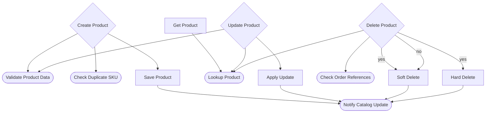

# FastAPI Example — Product Inventory API

This example demonstrates `@step` decorators applied **directly to FastAPI
endpoint functions**.  FlowDoc discovers the business flow by analysing which
`@step`-decorated functions call other `@step`-decorated functions — no
separate service layer or `@flow` class required.

## Key Pattern

```python
@app.post("/products", status_code=201)
@step(name="Create Product", description="Validate, de-duplicate, and persist a new product")
async def create_product(request: CreateProductRequest) -> dict:
    result = validate_product_data(asdict(request))
    ...
```

Stack the FastAPI route decorator and `@step` on the same function.  Helper
functions like `validate_product_data` also carry `@step` so FlowDoc can trace
the full business flow from endpoint to leaf.

## Endpoints

| Method   | Path                | Description                     |
|----------|---------------------|---------------------------------|
| `POST`   | `/products`         | Create a new product            |
| `GET`    | `/products/{id}`    | Retrieve a single product       |
| `PUT`    | `/products/{id}`    | Update an existing product      |
| `DELETE` | `/products/{id}`    | Soft- or hard-delete a product  |

## Business Flow Diagram

Generated with `flowdoc generate examples/fastapi/app.py --format mermaid`



## Generating Diagrams

```bash
# Mermaid (renders on GitHub)
flowdoc generate examples/fastapi/app.py --format mermaid

# Graphviz DOT source
flowdoc generate examples/fastapi/app.py --format dot

# PNG (requires graphviz system package)
flowdoc generate examples/fastapi/app.py --format png

# Validate flow
flowdoc validate examples/fastapi/app.py
```
