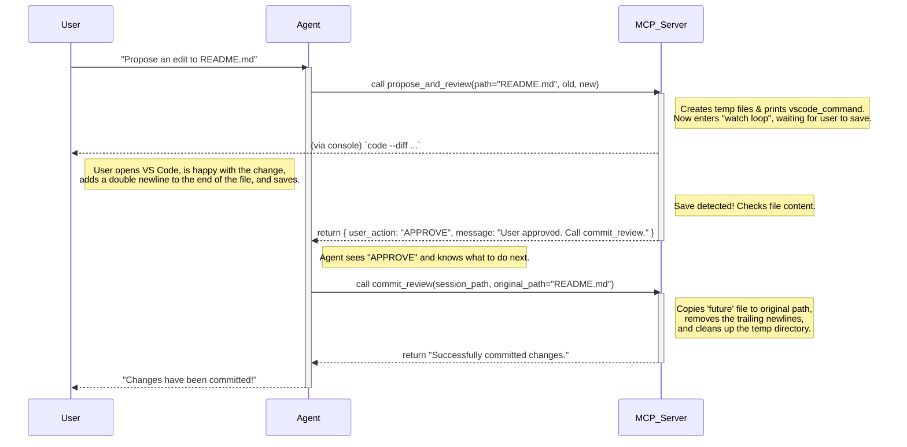

# fs-mcp 📂

**The "Human-in-the-Loop" Filesystem MCP Server**

---

https://github.com/user-attachments/assets/132acdd9-014c-4ba0-845a-7db74644e655

## 💡 Why This Exists

I built this because I was tired of jumping through hoops.

The promise of the Model Context Protocol (MCP) is incredible, but the reality of using the standard filesystem server hit a few walls for my workflow:

1.  **The Container Gap:** I do most of my work in Docker. Connecting a local agent (like Claude Desktop) to a filesystem inside a container via Stdio is a networking nightmare.
2.  **The Free Tier Lockout:** I wanted to use the free tier of [Google AI Studio](https://aistudio.google.com/) to edit code, but you can't easily plug MCP into a web interface.
3.  **Schema Hell:** Even if you *do* copy-paste schemas into Gemini, they often break because Gemini's strict validation is only a [subset of the standard OpenAPI spec](https://ai.google.dev/gemini-api/docs/function-calling).

**fs-mcp solves this.** It is a Python-based server built on `fastmcp` that treats "Human-in-the-Loop" as a first-class citizen, enabling seamless and interactive collaboration between LLM agents and a developer's local environment.

---

## 🚀 Key Features

### 1. HTTP by Default (Remote Ready)

It runs a background HTTP server alongside the CLI. You can finally connect agents to remote environments or containers without SSH tunneling wizardry.

### 2. Zero-Config Inspector

No `npm install inspector`. I baked a **Streamlit Web UI** directly into the package. Launch it, and you instantly have a visual form to test tools, view results, and generate configs.

### 3. Copy-Paste Gemini Schemas 📋

The UI automatically sanitizes and translates your tool schemas specifically for **Google GenAI**. It strips forbidden keys (`default`, `title`, etc.) so you can paste function definitions directly into AI Studio and start coding for free.

### 4. Human-in-the-Loop Diffing 🤝

The **`propose_and_review`** tool bridges the gap between agent proposals and human oversight. It opens a VS Code diff window for you to inspect changes. 

**How it Works:**
1. The agent calls `propose_and_review` with a code change.
2. A VS Code window pops up showing the **Diff**.
3. **To Approve:** Add a double newline at the very end of the file and Save.
4. **To Review:** Just edit the code directly in the diff window and Save. The agent will receive your edits as feedback and try again!




---

## ⚡ Quick Start

### Run Instantly

By default, this command launches the **Web UI (8123)** and a **Background HTTP Server (8124)**.

```bash
# Allow access to the current dir
uvx fs-mcp .
```

### Selective Launch

Want to disable a component? Use the flags:

```bash
# UI Only (No background HTTP)
fs-mcp --no-http .

# HTTP Only (Headless / Docker mode)
fs-mcp --no-ui .
```

---

## 🔌 Configuration

### Claude Desktop (Stdio Mode)

Add this to your `claude_desktop_config.json`:

```json
{
  "mcpServers": {
    "fs-mcp": {
      "command": "uvx",
      "args": [
        "fs-mcp",
        "/absolute/path/to/your/project"
      ]
    }
  }
}
```

### Docker (HTTP Mode)

To run inside a container and expose the filesystem to a local agent:

```bash
# In your entrypoint or CMD
uvx fs-mcp --no-ui --http-host 0.0.0.0 --http-port 8124 /app
```

---

## The Toolbox 🧰

| Tool                       | Description                                                                |
| -------------------------- | -------------------------------------------------------------------------- |
| `propose_and_review`       | **Interactive Review:** Opens VS Code diff. Add a double newline to finalize.  |
| `commit_review`            | Finalizes the changes from an interactive review session.                  |
| `read_multiple_files`      | Reads content of multiple files to save context window.                    |
| `directory_tree`           | **Fast:** Returns recursive JSON tree. Skips `.venv`/`.git` automatically. |
| `search_files`             | Recursive pattern discovery using `rglob`.                                 |
| `grounding_search`         | **New:** Natural language query for grounded search results.               |
| `read_text_file`           | Standard text reader (supports `head`/`tail` for large files).             |
| `list_directory_with_sizes`| Detailed listing including formatted file sizes.                           |
| `list_allowed_directories` | List security-approved paths.                                              |
| `get_file_info`            | Metadata retrieval (size, modified time).                                  |
| `read_media_file`          | Returns base64 encoded images/audio.                                       |
| `write_file`               | Creates or overwrites files (atomic operations).                           |
| `create_directory`         | Create a new directory.                                                    |
| `move_file`                | Move or rename files.                                                      |
| `append_text`              | Safe fallback for appending content to EOF.                                |

---

## License & Credits

Built with ❤️ for the MCP Community by **luutuankiet**.
Powered by **FastMCP** and **Streamlit**.

**Now go build some agents.** 🚀