# Contributing to GAIK

Quick guide for developers.

---

## ➕ Adding New Code

### Project Module Structure

```text
implementation_layer/src/gaik/
├── extractor/        # Schema generation & structured extraction (+ tests)
├── parsers/          # Vision, PDF, and other parsers (+ tests)
├── transcriber/      # Audio/video transcription (+ tests)
└── [your-feature]/   # New standalone modules
```

### Extend Existing Module

Add new functionality to existing modules (e.g., `extractor/`, `parsers/`, `transcriber/`).

#### Example: Add a new parser to `parsers/`

1. **Create parser file** → `implementation_layer/src/gaik/parsers/your_parser.py`

2. **Export in module** → [implementation_layer/src/gaik/parsers/\_\_init\_\_.py](implementation_layer/src/gaik/parsers/__init__.py)

   ```python
   from .your_parser import YourParser
   __all__ = [..., "YourParser"]
   ```

3. **Add dependencies** → [pyproject.toml](pyproject.toml)

   Add to existing `[parser]` group (NOT a new group):

   ```toml
   [project.optional-dependencies]
   parser = [
       "openai>=2.7",
       "PyMuPDF>=1.23.0",
       "your-new-dependency>=1.0.0",  # Add here
   ]
   ```

4. **Add tests** _(recommended)_ → `implementation_layer/src/gaik/parsers/tests/test_your_parser.py`

5. **Add example** _(recommended)_ → `examples/parsers/demo_your_parser.py`

### Add New Standalone Feature

Create entirely new module for capabilities that don't fit existing modules.

#### Example: New analysis module

1. **Create module** → `implementation_layer/src/gaik/analysis/`

   ```text
   implementation_layer/src/gaik/analysis/
   ├── __init__.py
   ├── analyzer.py
   └── utils.py
   ```

2. **Add dependencies** → [pyproject.toml](pyproject.toml)

   Create NEW optional dependency group:

   ```toml
   [project.optional-dependencies]
   analysis = [
       "numpy>=1.24.0",
       "pandas>=2.0.0",
   ]
   all = ["gaik[extractor,parser,transcriber,analysis]"]  # Update all group
   ```

3. **Export public API** → [implementation_layer/src/gaik/\_\_init\_\_.py](implementation_layer/src/gaik/__init__.py)

   ```python
   from . import analysis

   __all__ = [
       "extractor",
       "parsers",
       "transcriber",
       "analysis",  # Add new module
   ]
   ```

4. **Add tests** _(recommended)_ → `implementation_layer/src/gaik/analysis/tests/`

5. **Add examples** _(recommended)_ → `examples/analysis/` with README

## Testing (Optional, but Recommended)

Tests are automatically run by GitHub Actions on every push. Local testing and linting are optional but help catch issues early.

**Tests go in:** `implementation_layer/src/gaik/<module>/tests/`

```bash
# Option 1: Using activated venv
pip install -e .[all,dev]
pytest                      # Run all tests
ruff check --fix .          # Lint
ruff format .               # Format

# Option 2: Using uv (creates project-local .venv)
uv run pytest
uv run ruff check .
uv run ruff format .
```

## Release Process

```bash
git commit -m "Changes"
git push origin main
git tag v0.3.0              # Must be vX.Y.Z format
git push origin v0.3.0      # Triggers GitHub Actions
```

**GitHub Actions automatically:**

- Runs all tests (pytest)
- Builds the package
- **Validates version matches tag** (fails early if mismatch)
- Validates package (twine check)
- Publishes to PyPI
- Creates GitHub Release

**Note:** Linting (ruff) is not enforced by CI. Run locally if needed.

### Fixing Version Mismatch

If the pipeline fails with "Version mismatch" error, it means commits were added after the tag. Fix by recreating the tag:

```bash
# 1. Delete old tag locally and from remote
git tag -d v0.3.0
git push origin :refs/tags/v0.3.0

# 2. Create new tag on current HEAD
git tag v0.3.0
git push origin v0.3.0
```

## Project Structure

```text
gaik-toolkit/
├── implementation_layer/src/gaik/                       # Package source
│   ├── extractor/                  # Schema generation & extraction + tests
│   ├── parsers/                    # PDF/vision parsers + tests
│   └── transcriber/                # Audio/video transcription + tests
├── examples/                       # Usage examples
├── scripts/                        # CI/build scripts
└── .github/workflows/              # CI/CD
```

## Release Flow

```mermaid
flowchart LR
    A[Code Changes] --> B[git commit & push]
    B --> C[git tag v0.X.Y]
    C --> D[git push tag]
    D --> E[GitHub Actions]
    E --> F[Run Tests]
    F --> G[Build Package]
    G --> H[Validate Version]
    H --> I[Validate with Twine]
    I --> J[Publish to PyPI]
    J --> K[Create GitHub Release]

    style E fill:#f9f,stroke:#333
    style F fill:#bbf,stroke:#333
    style G fill:#bbf,stroke:#333
    style H fill:#fbb,stroke:#333
    style I fill:#bbf,stroke:#333
    style J fill:#bfb,stroke:#333
    style K fill:#bfb,stroke:#333
```


