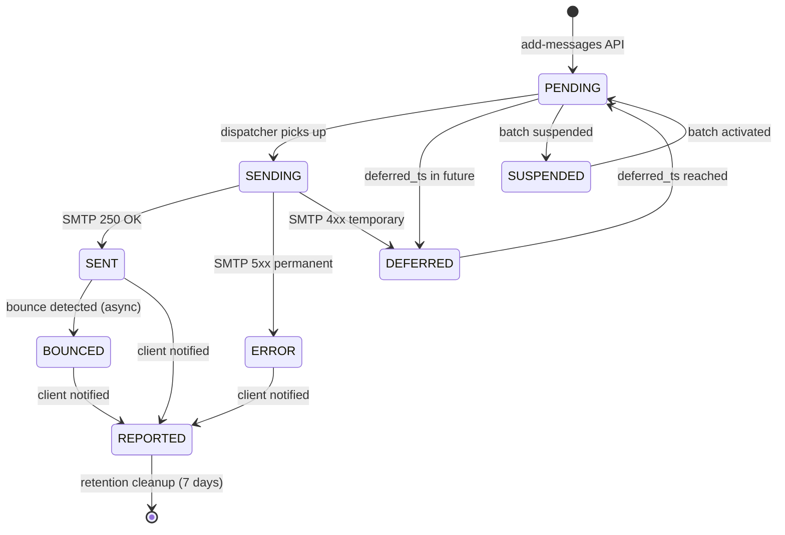
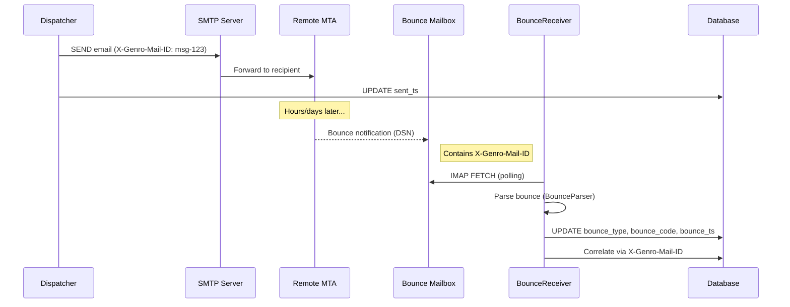
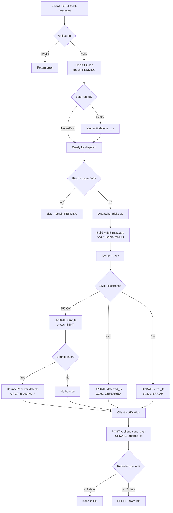

# Message Entity

Email queue entries with full lifecycle and delivery status tracking.

## Overview

A Message represents an email in the delivery queue. It tracks the complete lifecycle
from submission through delivery, error handling, bounce detection, and eventual cleanup.

Messages are **never deleted** during normal processing - they transition through states
tracked by timestamps. Only the retention policy removes old reported messages.

## Message Lifecycle

### State Machine



### Bounce Detection Flow



### Complete Message Flow



### State Transitions

| State | Condition | Description |
|-------|-----------|-------------|
| **PENDING** | `sent_ts=NULL`, `error_ts=NULL`, `deferred_ts=NULL` | Ready for delivery |
| **DEFERRED** | `deferred_ts` set, `sent_ts=NULL` | Scheduled for future delivery or retry |
| **SENT** | `sent_ts` set | Successfully delivered to SMTP server |
| **ERROR** | `error_ts` set | Permanent delivery failure |
| **REPORTED** | `reported_ts` set | Client notified of delivery status |
| **BOUNCED** | `bounce_ts` set | Remote server returned the message (EE) |

### Important Notes

- Messages are **never deleted** during normal processing
- State is derived from timestamps, not a status field
- A message can be both SENT and later BOUNCED (bounce detected after delivery)
- REPORTED means the client has been notified via the sync mechanism
- Only the retention policy deletes messages (after `report_retention_seconds`, default 7 days)

## Fields

### Core Fields

| Field | Type | Description |
|-------|------|-------------|
| `id` | string | Unique message identifier (provided by client) |
| `account_id` | string | SMTP account FK (determines which server sends) |
| `priority` | integer | 0=immediate, 1=high, 2=normal, 3=low |
| `payload` | JSON | Full message data (from, to, subject, body, headers, attachments) |
| `batch_code` | string | Optional batch/campaign identifier for grouping |
| `created_at` | timestamp | When message was queued |
| `updated_at` | timestamp | Last modification time |

### Delivery Status Fields

| Field | Type | Description |
|-------|------|-------------|
| `deferred_ts` | integer | Unix timestamp - don't send before this time |
| `sent_ts` | integer | Unix timestamp when successfully sent |
| `error_ts` | integer | Unix timestamp when error occurred |
| `error` | string | Error message if delivery failed |
| `reported_ts` | integer | Unix timestamp when client was notified |

### Bounce Detection Fields (Enterprise)

| Field | Type | Description |
|-------|------|-------------|
| `bounce_type` | string | `'hard'` or `'soft'` - severity of bounce |
| `bounce_code` | string | SMTP error code (e.g., `'550'`, `'421'`) |
| `bounce_reason` | string | Human-readable bounce reason |
| `bounce_ts` | timestamp | When bounce was detected |
| `bounce_reported_ts` | integer | When client was notified of bounce |

### PEC Fields (Enterprise, Italy)

| Field | Type | Description |
|-------|------|-------------|
| `pec_rda_ts` | timestamp | Ricevuta di Accettazione received |
| `pec_rdc_ts` | timestamp | Ricevuta di Consegna received |
| `pec_error` | string | PEC-specific error message |
| `pec_error_ts` | timestamp | When PEC error occurred |

## Bounce Detection

When bounce detection is enabled, the system monitors a dedicated bounce mailbox
(e.g., `bounces@proxy.example.com`) for returned messages.

### How It Works

1. **Outgoing emails** include an `X-Genro-Mail-ID` header with the message ID
2. **Bounced emails** arrive at the bounce mailbox with this header intact
3. **Bounce receiver** polls the mailbox via IMAP, parses bounce notifications
4. **Correlation** uses `X-Genro-Mail-ID` to update the original message record

### Bounce Types

| Type | Description | Example Codes |
|------|-------------|---------------|
| `hard` | Permanent failure - address doesn't exist | 550, 551, 552, 553 |
| `soft` | Temporary failure - may succeed later | 421, 450, 451, 452 |

### Bounce Flow

```
1. Message SENT (sent_ts set)
2. Remote server rejects → bounce email generated
3. Bounce arrives at bounce mailbox
4. BounceReceiver detects and parses
5. Original message updated: bounce_type, bounce_code, bounce_reason, bounce_ts
6. Client notified via sync (bounce_reported_ts set)
```

## Batch Operations

Messages can be grouped using `batch_code` for bulk operations:

### Suspend/Activate by Batch

```
POST /commands/suspend?tenant_id=X&batch_code=campaign-2024-01
POST /commands/activate?tenant_id=X&batch_code=campaign-2024-01
```

When a batch is suspended:
- Messages with that `batch_code` are **not fetched** for delivery
- They remain in PENDING state
- Other batches (or messages without batch_code) continue normally

### Batch Code Usage

- Optional field - messages without batch_code work normally
- Useful for campaigns, newsletters, transactional groups
- Enables pause/resume of specific message groups without affecting others

## Priority Levels

| Value | Label | Behavior |
|-------|-------|----------|
| `0` | immediate | Processed first, bypasses normal batching |
| `1` | high | Processed before normal priority |
| `2` | normal | Default priority (if not specified) |
| `3` | low | Processed last, after all higher priorities |

## Retention and Cleanup

Messages are retained for auditing, bounce correlation, and delivery reports.

### Retention Policy

- **Default**: 7 days (`report_retention_seconds = 604800`)
- **Configurable**: At instance level via `report_retention_seconds` parameter
- **Applies to**: Only messages with `reported_ts` set (client notified)

### Cleanup Process

1. Retention policy runs periodically during the report loop
2. Queries for messages where `reported_ts < (now - retention_period)`
3. Deletes qualifying messages permanently
4. Manual cleanup available via `POST /commands/cleanup-messages`

### Manual Cleanup

```
POST /commands/cleanup-messages?tenant_id=X&older_than_seconds=86400
```

## Attachments

Messages can include attachments with different fetch modes:

| Mode | Description |
|------|-------------|
| `endpoint` | Fetch from tenant's configured HTTP endpoint |
| `http_url` | Fetch from arbitrary HTTP URL |
| `base64` | Inline base64-encoded content |

Large attachments can be offloaded to object storage (MinIO/S3) with download links.

## Database Schema

```sql
CREATE TABLE messages (
    id TEXT PRIMARY KEY,
    account_id TEXT,
    priority INTEGER NOT NULL DEFAULT 2,
    payload TEXT NOT NULL,
    batch_code TEXT,
    created_at TIMESTAMP DEFAULT CURRENT_TIMESTAMP,
    updated_at TIMESTAMP DEFAULT CURRENT_TIMESTAMP,
    deferred_ts INTEGER,
    sent_ts INTEGER,
    error_ts INTEGER,
    error TEXT,
    reported_ts INTEGER,
    -- Enterprise: Bounce Detection
    bounce_type TEXT,
    bounce_code TEXT,
    bounce_reason TEXT,
    bounce_ts TIMESTAMP,
    bounce_reported_ts INTEGER,
    -- Enterprise: PEC Support
    pec_rda_ts TIMESTAMP,
    pec_rdc_ts TIMESTAMP,
    pec_error TEXT,
    pec_error_ts TIMESTAMP
);
```

## Related Entities

- **Account**: SMTP server configuration (messages belong to an account)
- **Tenant**: Logical grouping of accounts (for multi-tenant setups)
