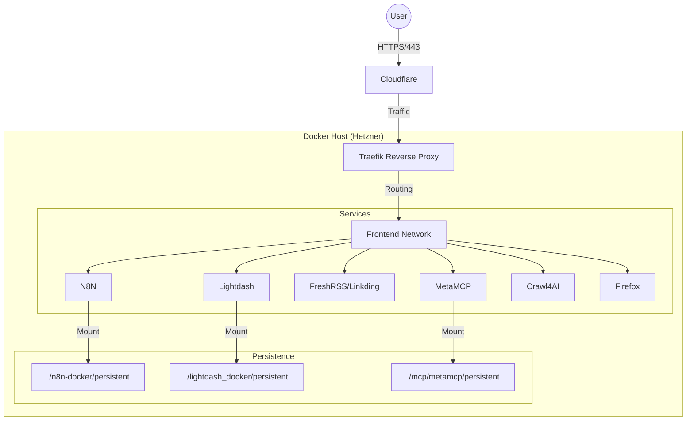

# Architecture

## High-Level Data Flow

## Network Topology
- **Edge:** Cloudflare -> Traefik
- **Internal:** Docker Bridge Network (`frontend`)
- **Isolation:**
  - Most services sit on `frontend` to be reachable by Traefik.
  - No database-only isolation network observed yet (DBs like Postgres are also on `frontend` in Lightdash/MetaMCP compose files).

## Service Discovery
- **Static:** File-based configuration in `traefik/config/hosts.yaml`.
- **Dynamic:** Labels usage commented out in `rss-docker` (migrated to static file?).

## Scale
- **Vertical Scaling:** Single node architecture.
- **Resource Limits:** Explicit limits seen on `crawl4ai` (4GB RAM).