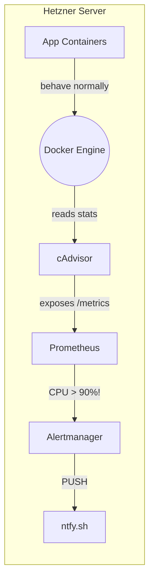
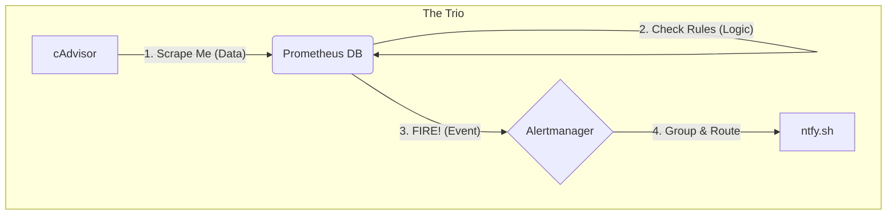
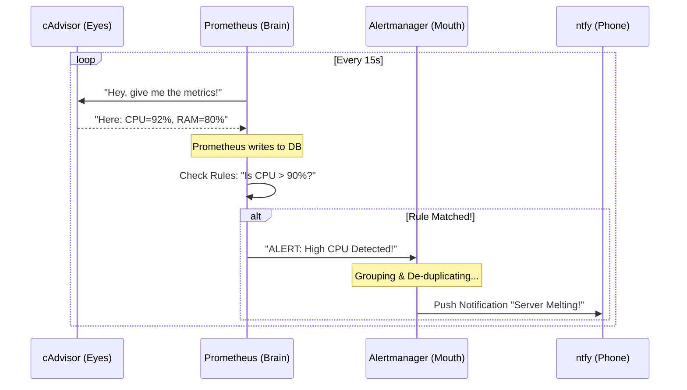

# GSD-Lite Work Log

<!--
PERPETUAL SESSION WORK LOG - captures all work during project execution.
Tracks vision, planning, execution, decisions, and blockers across multiple tasks.

LIFECYCLE:
- Created: When project starts
- Updated: Throughout project execution
- Housekeeping: User-controlled archiving of completed tasks to HISTORY.md
- Perpetual: Logs persist until user requests archiving

PURPOSE:
- Session continuity: Fresh agents resume by reading Current Understanding (30-second context)
- Detailed history: Atomic log provides HOW we got here with full evidence
- Non-linear access: Grep patterns enable quick discovery (headers, log IDs, types, tasks)
- PR extraction: Filter by task to generate PR descriptions from execution logs

GREP PATTERNS FOR DISCOVERY:
- Headers: grep "^## " WORK.md — discover 3-part structure
- All logs with summaries: grep "^### \[LOG-" WORK.md — scan project evolution from headers
- Log by ID: grep "\[LOG-015\]" WORK.md — find specific entry
- Log by type: grep "\[DECISION\]" WORK.md — find all decisions
- Log by task: grep "Task: MODEL-A" WORK.md — filter by task

FILE READING STRATEGY:
1. Discover structure: grep "^## " to find section boundaries
2. Surgical read: Read from start_line using read_to_next_pattern or calculate end_line
3. See PROTOCOL.md "File Reading Strategy" section for detailed patterns
-->

---

## 1. Current Understanding (Read First)

<!--
HANDOFF SECTION - Read this first when resuming work.
Updated at checkpoint time or when significant state changes.
Target: Fresh agent can understand current state in 30 seconds.

Structure:
- current_mode: What workflow are we in? (moodboard, execution, checkpoint, etc.)
- active_task: What task is being worked on NOW
- parked_tasks: What tasks are on hold (waiting for decisions, dependencies, etc.)
- vision: What user wants - the intent, feel, references, success criteria
- decisions: Key decisions with rationale - not just WHAT but WHY
- blockers: Open questions, stuck items, waiting on user, ambiguities
- next_action: Specific first action when resuming this session

Use concrete facts, not jargon. Avoid "as discussed" or "per original vision" - fresh agent has zero context.

IMPORTANT: Below are EXAMPLE entries showing format - replace with your actual session content.
-->

<current_mode>
execution - checkpointed with full WBS ready
</current_mode>

<active_task>
MON-001: Fix docker-compose.monitoring.yml volume path typo (pending)
</active_task>

<parked_tasks>
- SOCKS5 proxy as Firefox replacement (LOG-004) - parked for later pickup
</parked_tasks>

<vision>
User wants a "reasonable headroom" (>2GB RAM free) on a remote Hetzner server (8GB RAM, 4 vCPU) running 13+ containers.
Core value: System stability for single-user usage. No timeouts.

**User Context (important for understanding priorities):**
- DE background (data pipelines), new to Linux OOM troubleshooting
- Uses metamcp as MCP proxy hub (you're using it right now!) - TOP priority
- Uses lightdash for "life admin" BI (TickTick, Todoist, future YNAB) - TOP priority
- Uses n8n for orchestration (dbt triggers, RSS digest to AI summary) - HIGH priority
- Uses freshrss + fulltextrss for Kindle-friendly news reading - HIGH priority
- Uses syncthing for remote dev folder mounting to Mac - MEDIUM priority
- Uses crawl4ai as occasional scraper fallback - LOW priority
- Uses firefox-docker for geo-bypass (Medium blogs blocked in user's country) - LOW priority, open to alternatives

**Observability Goal:**
- User wants Grafana + Prometheus for DE learning goals (OTel, observability)
- Understands Grafana itself can die during OOM, so needs out-of-band push alerts
- Wants ntfy as push notification service (Android client)
- n8n can route alerts to ntfy
</vision>

<decisions>
1. Service priority tiers established:
   - TOP: metamcp, lightdash (must restart on OOM)
   - HIGH: n8n, rss-docker
   - MEDIUM: syncthing
   - LOW: crawl4ai, firefox (can be down briefly)

2. Firefox replacement viable: SOCKS5 proxy (~5MB) vs Firefox (~500MB) - user interested, parked for later

3. Observability stack confirmed:
   - Phase 1 (Stability First): Prometheus + cAdvisor + ntfy. Grafana added in Phase 2.
   - Alerting Path: Prometheus Alertmanager → ntfy (Direct, "DevOps way").

4. Alert thresholds finalized (LOG-011):
   - Memory: 85% system-wide for 2 min (early warning before OOM killer)
   - CPU: 90% sustained for 5 min (filter normal browser spikes)
   - Scope: All containers via cAdvisor blanket monitoring

5. ntfy.sh cloud selected over self-hosted (zero setup, priority is pipeline validation)
</decisions>

<blockers>
- User needs to provide ntfy topic name (e.g., `kiet-hetzner-alerts`) before MON-004
</blockers>

<next_action>
Execute MON-001: Fix volume path typo in docker-compose.monitoring.yml (`./monitoringprometheus/` → `./monitoring/prometheus/`)
</next_action>

---

## 2. Key Events Index (Query Accelerator)

| Log ID | Type | Task | Summary |
|--------|------|------|---------|
| LOG-001 | VISION | INIT | Initialized project. Goal: Headroom & Stability. |
| LOG-002 | DISCOVERY | DIAG-001 | `dmesg` confirms `chrome` killed by OOM killer. |
| LOG-003 | DECISION | DIAG-001 | Strategy: Cap memory for heavy containers. |
| LOG-004 | DISCOVERY | DIAG-001 | SOCKS5 proxy as Firefox replacement (~500MB savings). |
| LOG-005 | VISION | DIAG-001 | Deep-dive: user context, service priorities, observability goals. |
| LOG-006 | CHECKPOINT | DIAG-001 | Session paused. Q2/Q3 pending. |
| LOG-007 | DECISION | DIAG-001 | Observability: Stability First + Direct Alerting. |
| LOG-008 | DISCOVERY | DIAG-001 | Prometheus Pull Model & cAdvisor Sidecar explained. |
| LOG-009 | DECISION | DIAG-001 | docker-compose.monitoring.yml lives at project root. |
| LOG-010 | DISCOVERY | DIAG-001 | 3-Step Pipeline: Scraper vs Evaluator vs Dispatcher. |
| LOG-011 | PLAN | MON-PHASE1 | Alert thresholds + WBS for monitoring stack execution. |

---

## 3. Atomic Session Log (Chronological)

<!--
TYPE-TAGGED ATOMIC ENTRIES - All session work captured here.
Each entry is self-contained with code snippets where applicable.

Entry types (6 types):
- [VISION] - User vision/preferences, vision evolution, reference points
- [DECISION] - Decision made (tech, scope, approach) with rationale
- [DISCOVERY] - Evidence, findings, data (ALWAYS with code snippets)
- [PLAN] - Planning work: task breakdown, risk identification, approach
- [BLOCKER] - Open questions, stuck items, waiting states
- [EXEC] - Execution work: files modified, commands run (ALWAYS with code snippets)

Entry format:
### [LOG-NNN] - [TYPE] - {{one line summary}} - Task: TASK-ID
**Timestamp:** [YYYY-MM-DD HH:MM]
**Details:** [Full context with code snippets for EXEC/DISCOVERY]

WHY THIS FORMAT:
- Agents grep headers (`^### \[LOG-`) to scan project evolution without reading full content
- Summary in header line enables quick onboarding from grep output alone
- "###" level headers render nicely in IDE outlines for human navigation
- Timestamp moved under header keeps the grep-scanned line focused on WHAT happened

Use action timestamp (when decision made or action taken), not entry-write time.
Code snippets REQUIRED for EXEC and DISCOVERY entries (enables PR extraction).

IMPORTANT: Below are EXAMPLE entries showing format. Real entries should use [LOG-NNN] not [EXAMPLE-NNN].
-->

### [EXAMPLE-001] - [VISION] - User wants Linear-like feel + Bloomberg density for power users - Task: MODEL-A
**Timestamp:** 2026-01-22 14:00
**Details:**
- Context: Discussed UI patterns during moodboard session
- Reference: Clean layout (Linear) but with information density (Bloomberg terminal)
- Implication: Interface should not patronize advanced users with excessive whitespace

### [EXAMPLE-002] - [PLAN] - Broke card layout into 3 sub-tasks - Task: MODEL-A
**Timestamp:** 2026-01-22 14:10
**Details:**
- SUBTASK-001: Base card component with props interface
- SUBTASK-002: Engagement metrics display (likes, comments, shares)
- SUBTASK-003: Layout grid with responsive breakpoints
- Risk: Responsive behavior may need user verification on mobile

### [EXAMPLE-003] - [DECISION] - Use card-based layout, not timeline view - Task: MODEL-A
**Timestamp:** 2026-01-22 14:15
**Details:**
- Rationale: Cards support varying content length (post + engagement + metadata); timeline more rigid
- Alternative considered: Timeline view (simpler implementation, less flexible for content types)
- Impact: Unblocks component design; affects SUBTASK-001 (card props interface)

### [EXAMPLE-004] - [EXEC] - Created base card component with TypeScript interface - Task: MODEL-A
**Timestamp:** 2026-01-22 14:30
**Details:**
- Files modified: src/components/Card.tsx (created), src/types/post.ts (created)
- Code snippet:
```typescript
interface PostCardProps {
  post: {
    id: string;
    content: string;
    author: string;
    timestamp: Date;
    engagement: {
      likes: number;
      comments: number;
      shares: number;
    };
  };
}
```
- Status: SUBTASK-001 complete, proceeding to SUBTASK-002

### [EXAMPLE-005] - [DISCOVERY] - Found engagement pattern in Linear reference app - Task: MODEL-A
**Timestamp:** 2026-01-22 15:00
**Details:**
- Observation: Linear shows engagement inline, not in dropdown/modal
- Evidence from inspection:
```html
<div class="engagement-bar">
  <span class="metric">👍 12</span>
  <span class="metric">💬 5</span>
  <span class="metric">🔄 3</span>
</div>
```
- Impact: Informs SUBTASK-002 design (inline engagement, emoji + count)

### [EXAMPLE-006] - [EXEC] - Implemented engagement metrics component - Task: MODEL-A
**Timestamp:** 2026-01-22 15:30
**Details:**
- Files modified: src/components/EngagementBar.tsx (created)
- Code snippet:
```typescript
export function EngagementBar({ likes, comments, shares }: EngagementProps) {
  return (
    <div className="engagement-bar">
      <Metric icon="👍" count={likes} />
      <Metric icon="💬" count={comments} />
      <Metric icon="🔄" count={shares} />
    </div>
  );
}
```
- Status: SUBTASK-002 complete, proceeding to SUBTASK-003

### [EXAMPLE-007] - [BLOCKER] - Mobile breakpoint unclear - 768px or 640px? - Task: MODEL-A
**Timestamp:** 2026-01-22 16:00
**Details:**
- Issue: User hasn't specified mobile breakpoint preference
- Context: Linear uses 768px, Bloomberg uses custom breakpoints
- Waiting on: User decision on responsive strategy
- Impact: Blocks SUBTASK-003 (layout grid) until clarified

### [EXAMPLE-008] - [DECISION] - Use 768px breakpoint, standard tablet/mobile split - Task: MODEL-A
**Timestamp:** 2026-01-22 16:15
**Details:**
- Rationale: 768px is industry standard, matches Linear reference
- User preference: "Keep it simple, use standard breakpoints"
- Impact: Unblocks SUBTASK-003

### [EXAMPLE-009] - [EXEC] - Implemented responsive grid with 768px breakpoint - Task: MODEL-A
**Timestamp:** 2026-01-22 16:45
**Details:**
- Files modified: src/components/CardGrid.tsx (created), src/styles/grid.css (created)
- Code snippet:
```css
.card-grid {
  display: grid;
  grid-template-columns: repeat(auto-fill, minmax(300px, 1fr));
  gap: 1rem;
}

@media (max-width: 768px) {
  .card-grid {
    grid-template-columns: 1fr;
  }
}
```
- Status: SUBTASK-003 complete, Task: MODEL-A ready for verification

### [EXAMPLE-010] - [VISION] - Authentication must support refresh token rotation - Task: AUTH-IMPL
**Timestamp:** 2026-01-23 10:00
**Details:**
- Security requirement from user: "Don't want long-lived tokens floating around"
- Reference: OAuth 2.0 refresh token rotation best practice
- Success criteria: Access token 15min, refresh token rotates on use

### [EXAMPLE-011] - [PLAN] - JWT auth broken into 3 tasks - Task: AUTH-IMPL
**Timestamp:** 2026-01-23 10:20
**Details:**
- TASK-001: Library setup (jose v0.5.0) + token generation
- TASK-002: Login endpoint with bcrypt password hashing
- TASK-003: Token validation middleware + refresh rotation
- Risk: Token expiry strategy may need user decision

### [EXAMPLE-012] - [EXEC] - Installed jose library and created token generation - Task: AUTH-IMPL
**Timestamp:** 2026-01-23 10:30
**Details:**
- Files modified: src/auth/token.ts (created), package.json (jose added)
- Code snippet:
```typescript
export async function generateAccessToken(userId: string): Promise<string> {
  const secret = new TextEncoder().encode(process.env.JWT_SECRET);
  return await new SignJWT({ userId })
    .setProtectedHeader({ alg: 'HS256' })
    .setExpirationTime('15m')
    .sign(secret);
}
```
- Status: TASK-001 complete

### [EXAMPLE-013] - [DISCOVERY] - bcrypt cost factor 12 optimal for performance - Task: AUTH-IMPL
**Timestamp:** 2026-01-23 11:00
**Details:**
- Benchmark: Cost 10 = 50ms, Cost 12 = 150ms, Cost 14 = 600ms
- Code used for testing:
```typescript
import bcrypt from 'bcrypt';
for (const cost of [10, 12, 14]) {
  const start = Date.now();
  await bcrypt.hash('password', cost);
  console.log(`Cost ${cost}: ${Date.now() - start}ms`);
}
```
- Decision: Use cost 12 (150ms acceptable for login latency)

### [EXAMPLE-014] - [EXEC] - Created login endpoint with bcrypt hashing - Task: AUTH-IMPL
**Timestamp:** 2026-01-23 11:30
**Details:**
- Files modified: src/api/auth/login.ts (created)
- Code snippet:
```typescript
export async function loginHandler(req: Request, res: Response) {
  const { email, password } = req.body;
  const user = await db.findUserByEmail(email);
  const valid = await bcrypt.compare(password, user.passwordHash);
  if (!valid) throw new AuthError('Invalid credentials');
  const accessToken = await generateAccessToken(user.id);
  res.json({ accessToken });
}
```
- Status: TASK-002 complete, proceeding to TASK-003

### [EXAMPLE-015] - [BLOCKER] - Password reset flow unclear - same JWT or separate token? - Task: AUTH-IMPL
**Timestamp:** 2026-01-23 12:00
**Details:**
- Issue: Security model for password reset not specified
- Question: Reuse main JWT or generate separate reset token?
- Waiting on: User decision on security approach
- Impact: Blocks finalization of auth module architecture

### [EXAMPLE-016] - [DECISION] - Use separate reset token, not main JWT - Task: AUTH-IMPL
**Timestamp:** 2026-01-23 12:15
**Details:**
- Rationale: Separate token provides better security isolation
- User preference: "Don't reuse auth token for password reset - keep them separate"
- Expiry: 1 hour for reset token (short-lived for security)
- Impact: Need to add generateResetToken() to auth module

### [EXAMPLE-017] - [EXEC] - Added password reset token generation - Task: AUTH-IMPL
**Timestamp:** 2026-01-23 12:45
**Details:**
- Files modified: src/auth/token.ts (updated), src/api/auth/reset.ts (created)
- Code snippet:
```typescript
export async function generateResetToken(userId: string): Promise<string> {
  const secret = new TextEncoder().encode(process.env.JWT_SECRET);
  return await new SignJWT({ userId, type: 'reset' })
    .setProtectedHeader({ alg: 'HS256' })
    .setExpirationTime('1h')
    .sign(secret);
}
```
- Status: Password reset complete, Task: AUTH-IMPL ready for verification

---

*Housekeeping: Run "write PR for [TASK]" to extract task logs, or "archive [TASK]" to move completed entries to HISTORY.md*

### [LOG-001] - [VISION] - Project initialized. Goal: Headroom & Stability. - Task: INIT
**Timestamp:** 2026-01-31 10:00
**Details:**
- User context: Remote Hetzner server, 8GB RAM, 13+ containers.
- Problem: Frequent server timeouts.
- Goal: "Reasonable headroom" for single client use.
- Artifacts: Created `.planning/PROJECT.md` and codebase mapping folder at `./.planning/codebase/`

### [LOG-002] - [DISCOVERY] - System `dmesg` shows `chrome` killed by OOM killer - Task: DIAG-001
**Timestamp:** 2026-01-31 10:15
**Details:**
- Command run: `sudo dmesg | grep -i "killed" | tail -n 20`
- Output: `[7585453.115486] Out of memory: Killed process 2656581 (chrome) total-vm:1446409496kB...`
- Diagnosis: Server is running out of RAM, killing processes (likely `crawl4ai` or `lightdash` headless browser).
- Implication: "Frequent timeouts" are likely caused by memory thrashing and service death.

### [LOG-004] - [DISCOVERY] - SOCKS5 proxy as Firefox replacement for geo-bypass - Task: DIAG-001
**Timestamp:** 2026-01-31 10:30
**Details:**
Alternative to running full Firefox container (~500MB) for geo-restricted content (Medium):

**Option: Lightweight SOCKS5 Proxy**
- Container: `serjs/go-socks5-proxy` or similar (~5-10MB RAM)
- Exposes SOCKS5 proxy on a port (e.g., 1080)
- User configures local Mac browser (or Firefox addon like FoxyProxy) to route traffic through VM
- Traffic exits from Finland IP → bypasses geo-blocks
- Benefit: ~500MB RAM savings vs full Firefox container

**Example docker-compose snippet:**
```yaml
services:
  socks5-proxy:
    image: serjs/go-socks5-proxy
    container_name: socks5-proxy
    ports:
      - "1080:1080"
    environment:
      - PROXY_USER=your_user
      - PROXY_PASSWORD=your_pass
    restart: unless-stopped
    networks:
      - frontend
```

**Client-side setup:**
- Firefox addon: FoxyProxy → configure SOCKS5 proxy to `proxy.kenluu.org:1080`
- Or system-wide: macOS Network Preferences → Proxies → SOCKS Proxy

**Trade-off:** User reads on local browser (fast, native experience) vs remote VNC browser (slow, but fully isolated).

**Status:** Parked for later pickup. User interested.

### [LOG-005] - [VISION] - Deep-dive on user context and observability goals - Task: DIAG-001
**Timestamp:** 2026-01-31 11:00
**Details:**
User provided rich context during discussion phase:

**User Background:**
- DE by trade (data pipelines), homelab by hobby
- New to Linux OOM troubleshooting
- Bad prior experience: GCloud Ops Agent on weak VM (1vCPU/2GB) caused more problems than it solved

**Stack Purpose (why each service matters):**
- metamcp: MCP proxy hub - agents connect through this (currently in use!)
- lightdash: "Life admin" BI - dbt models from TickTick, Todoist, future YNAB budget data
- n8n: Orchestration - daily dbt triggers, RSS cleanup, AI-powered news digest (100+ articles → 5 must-reads)
- freshrss + fulltextrss: Kindle-friendly daily news reading ritual
- syncthing: Remote dev folder mount to Mac for codebase access
- crawl4ai: Occasional scraper fallback when agent webfetch fails
- firefox: Geo-bypass for Medium (blocked in user's country) - experimental

**Timeout Symptoms Clarified:**
- Claude Desktop failing to connect to remote MCP endpoint
- SSH freezes
- Webapp freezes (general)

**Observability Goals:**
- Wants Grafana + Prometheus (aligns with DE roadmap, OTel learning)
- Understands Grafana can die during OOM → needs out-of-band push alerts
- Discovered ntfy as push notification service (Android client)
- n8n can route alerts

**Recovery Strategy:**
- TOP priority containers: must auto-restart
- LOW priority: can be down briefly, just need visibility

### [LOG-006] - [CHECKPOINT] - Session paused mid-discussion - Task: DIAG-001
**Timestamp:** 2026-01-31 11:15
**Details:**
Session checkpointed at user request. Discussion 60% complete.

**What was accomplished:**
- Identified 5 grey areas in project scope
- Deep-dived on user context, service priorities, observability goals
- Discovered SOCKS5 proxy as Firefox alternative (LOG-004)
- Established service priority tiers

**What remains:**
- User to answer Q2 (Grafana timing) and Q3 (alert routing path)
- Lock in observability architecture
- Create execution plan for monitoring stack

**Resume point:** Continue discussion workflow, get Q2/Q3 answers, then transition to execution.

### [LOG-007] - [DECISION] - Observability: Stability First + Direct Alerting - Task: DIAG-001
**Timestamp:** 2026-01-31 11:30
**Details:**
User finalized the architecture choices:
1. **Phasing:** Option 1A (Stability First). Start with Prometheus + cAdvisor + ntfy only. Add Grafana in Phase 2 once headroom is proven.
2. **Alert Routing:** Option 2A (DevOps Way). Prometheus Alertmanager → ntfy.
   - Rationale: Simpler, fewer moving parts, aligns with standard industry practices.
   - Trade-off: Less customizable logic than n8n, but more robust (doesn't depend on n8n being alive).

### [LOG-008] - [DISCOVERY] - Prometheus "Pull Model" vs Push & cAdvisor's Sidecar Magic - Task: DIAG-001
**Timestamp:** 2026-01-31 11:45
**Details:**
Core conceptual breakthrough on how modern monitoring works compared to legacy systems.

**1. The "Pull" (Scraping) Model vs "Push"**
- **Legacy (Push):** Apps have to shout "I'm alive!" to the server. If the server is down, apps crash or hang trying to shout.
- **Prometheus (Pull):** Prometheus is a **Census Taker**.
  - It holds a list of addresses (Targets).
  - It walks around every 15s and asks: "What are your numbers?"
  - *Key Benefit:* If Prometheus dies, your apps keep running silently. Zero impact on production.

**2. The cAdvisor "Translator" Pattern**
- **Problem:** Nginx, Postgres, and Python apps don't speak "Prometheus Metrics" natively. They don't have a `/metrics` page.
- **Solution:** **cAdvisor** (Container Advisor) runs as a sidecar.
  - It plugs into the Docker Daemon (the engine room).
  - It reads raw CPU/RAM stats for *every* container.
  - It publishes a single `/metrics` page that Prometheus scrapes.
- **Analogy:** Your containers are silent workers. cAdvisor is the Supervisor who reports their productivity to the Census Taker.

**Architecture Diagram:**


**Analogue Project:**
Confirmed this stack matches **Jeff Geerling's `internet-pi`** project (found in `tmp/internet-pi`).
- They use: Prometheus + Grafana + Blackbox Exporter (for ping).
- We use: Prometheus + Alertmanager + cAdvisor (for stability).

### [LOG-009] - [DECISION] - Move docker-compose.monitoring.yml to Root - Task: DIAG-001
**Timestamp:** 2026-01-31 12:00
**Details:**
**Decision:** Keep `docker-compose.monitoring.yml` in the project root (not `monitoring/` subdirectory).
**Rationale:**
1.  **Unified Control:** Allows a single `make` command or script to manage all stacks.
2.  **Context Management:** Keeps file paths relative to root (e.g., `./prometheus/config.yml`), avoiding confusion about where the "working directory" is.
3.  **Env Access:** Ensures access to the root `.env` file without complex path mapping.

**Structure:**
```text
.
├── docker-compose.monitoring.yml  <-- Lives here
├── prometheus/
│   └── prometheus.yml
└── alertmanager/
    └── config.yml
```

### [LOG-010] - [DISCOVERY] - The 3-Step Pipeline: Scraper vs. Evaluator vs. Dispatcher - Task: DIAG-001
**Timestamp:** 2026-01-31 12:15
**Details:**
Clarified why we need separate containers (`prometheus` vs `alertmanager`) instead of one monolithic "Monitor".

**The 3-Step Data Flow:**
1.  **Scraping (Data Collection):**
    -   *Actor:* **Prometheus** (Job 1)
    -   *Action:* Every 15s, asks cAdvisor "What is CPU usage?"
    -   *Result:* Writes `cpu=92%` to database. (Dumb storage).
2.  **Evaluation (Logic):**
    -   *Actor:* **Prometheus** (Job 2)
    -   *Action:* Every 15s, runs queries like `IF cpu > 90% FOR 5m`.
    -   *Result:* Firing Condition Met? Yes/No. If YES -> Sends "FIRE!" signal to Alertmanager.
3.  **Dispatch (Notification):**
    -   *Actor:* **Alertmanager**
    -   *Action:* Receives "FIRE!", de-duplicates (ignores 1000 repeats), groups signals ("50 containers down"), and routes to channel (ntfy).
    -   *Result:* User gets ONE ping on phone.

**Why Separate?**
- **De-coupling:** Prometheus focuses on math/storage. Alertmanager focuses on routing/silencing.
- **Scale:** Multiple Prometheus servers can feed one central Alertmanager.
- **Silencing:** You can "Mute" alerts in Alertmanager without stopping data collection in Prometheus.

**Mermaid Diagram:**


**Sequence Diagram (The Conversation):**


### [LOG-011] - [PLAN] - Alert Thresholds & Work Breakdown Structure for Monitoring Stack - Task: MON-PHASE1
**Timestamp:** 2026-01-31 14:00
**Details:**

---

#### 1. THE SITUATION: Why We Need Alert Thresholds

After LOG-007 through LOG-010 established the *architecture* (Prometheus → Alertmanager → ntfy), this session tackled the *configuration* question: **"When should the system actually alert us?"**

This is a critical decision because:
- **Too sensitive** (e.g., alert at 50% RAM) = Alert fatigue. User ignores notifications.
- **Too lenient** (e.g., alert at 95% RAM) = OOM killer strikes before alert fires. Useless.

The goal: **Goldilocks zone** — alert early enough to take action, but not so early that normal operations trigger false alarms.

---

#### 2. EVIDENCE GATHERING: Current System State

To recommend thresholds, we analyzed three data sources:

**Source A: Live Container Stats (`docker stats` from `./machine_state.md`)**

| Container | RAM Usage | % of 7.57 GiB | Risk Assessment |
|-----------|-----------|---------------|-----------------|
| **metamcp** | 1.27 GiB | **16.8%** | 🔴 Highest consumer |
| crawl4ai | 515 MiB | 6.8% (but 12.6% of its 4GB cap) | 🟡 Capped, can spike |
| firefox | 473 MiB | 6.1% | 🟡 Headless browser |
| n8n + n8n-queue | 683 MiB | 8.8% | 🟡 Workflow automation |
| lightdash + headless | 436 MiB | 5.6% | 🟡 BI tool with browser |
| All 16 other containers | ~1.1 GiB | ~15% | 🟢 Low individual impact |

**Key Finding:** System uses **~4.5 GiB at idle** (60% of 7.57 GiB). Headroom looks healthy at rest.

**Source B: OOM Killer History (from LOG-002)**
```bash
# Evidence from dmesg
[7585453.115486] Out of memory: Killed process 2656581 (chrome) total-vm:1446409496kB...
```
The `chrome` process (headless browser inside `crawl4ai` or `lightdash`) was killed when RAM exceeded capacity. This confirms the system *does* hit OOM under load.

**Source C: Hardware Constraints (from `./.planning/PROJECT.md`)**
- **Total RAM:** 8 GB (7.57 GiB available to containers)
- **CPU:** 4 vCPU (AMD EPYC-Rome)
- **Constraint:** Cannot upgrade hardware; must optimize within limits.

---

#### 3. THRESHOLD ANALYSIS: The Math Behind the Numbers

**Why 85% Memory (not 80% or 90%)?**

```
Current idle usage:     60% (~4.5 GiB)
Normal browser spike:  +15% (~1.1 GiB) when crawl4ai/lightdash active
─────────────────────────────────────
Expected active usage:  75% (~5.6 GiB)

Alert at 80%? → Fires during normal browser activity (false positive)
Alert at 90%? → Only 750 MiB headroom. OOM killer may strike first.
Alert at 85%? → ~1.1 GiB headroom. Gives 2-5 min to react.
```

**Visual Timeline Example:**
```
Time    RAM%   Event
─────────────────────────────────
10:00   60%    Idle
10:05   72%    User triggers crawl4ai scrape
10:06   78%    Chrome spawns, loading page
10:07   85%    ⚠️ ALERT FIRES (2 min timer starts)
10:08   88%    Alert confirmed (sustained 2 min)
10:09   ──     User receives ntfy push: "RAM 88%"
10:10   82%    Scrape completes, Chrome releases memory
10:15   62%    Back to idle
```

Without the 2-minute duration filter, the alert would fire at 10:07 and resolve at 10:10 — unnecessary noise for a normal operation.

**Why 90% CPU for 5 Minutes (not 2 minutes)?**

Browser rendering causes brief 100% CPU spikes. These are normal:
```
Time    CPU%   Event
─────────────────────────────────
10:00   15%    Idle
10:05   95%    Page render starts
10:05   100%   JavaScript execution
10:06   30%    Render complete
```

A 2-minute threshold would fire false alarms. A 5-minute threshold only fires when something is *stuck* (infinite loop, deadlock, runaway process).

---

#### 4. FINAL THRESHOLDS (Decision Record)

| Metric | Threshold | Duration | PromQL Expression |
|--------|-----------|----------|-------------------|
| **System Memory** | > 85% | 2 min | `(1 - (node_memory_MemAvailable_bytes / node_memory_MemTotal_bytes)) > 0.85` |
| **Container Memory** | > 90% of limit | 2 min | `container_memory_usage_bytes / container_spec_memory_limit_bytes > 0.90` |
| **System CPU** | > 90% | 5 min | `100 - (avg(irate(node_cpu_seconds_total{mode="idle"}[5m])) * 100) > 90` |

**Scope:** All containers via cAdvisor blanket monitoring (no exclusions).

---

#### 5. WORK BREAKDOWN STRUCTURE (WBS)

User created `./monitoring/` directory and `./docker-compose.monitoring.yml` skeleton. Remaining work:

```
┌─────────────────────────────────────────────────────────────────────────────┐
│  MON-001 ──► MON-002 ──► MON-003 ──► MON-004 ──► MON-005 ──► MON-006       │
│     │           │           │           │           │           │          │
│     │           │           │           │           │           └─ 🎉 E2E  │
│     │           │           │           │           └─ Smoke test          │
│     │           │           │           └─ alertmanager/config.yml         │
│     │           │           └─ prometheus/alerts.yml                       │
│     │           └─ prometheus/prometheus.yml                               │
│     └─ Fix volume path typo                                                │
└─────────────────────────────────────────────────────────────────────────────┘
```

| Task ID | Description | Deliverable | Est. Time |
|---------|-------------|-------------|-----------|
| **MON-001** | Fix docker-compose volume paths | `./monitoring/prometheus/` not `./monitoringprometheus/` | 2 min |
| **MON-002** | Create Prometheus scrape config | `monitoring/prometheus/prometheus.yml` | 5 min |
| **MON-003** | Create alert rules | `monitoring/prometheus/alerts.yml` | 10 min |
| **MON-004** | Create Alertmanager config | `monitoring/alertmanager/config.yml` with ntfy webhook | 5 min |
| **MON-005** | Smoke test | Verify cAdvisor `:8080`, Prometheus `:9090` endpoints | 5 min |
| **MON-006** | End-to-end test | Trigger test alert, confirm ntfy push on phone | 5 min |

**Dependency Chain:** Linear. Each task depends on previous completion.

---

#### 6. CURRENT FILE STATE (What Exists vs What's Missing)

**Created by User:**
```
./docker-compose.monitoring.yml   ← Service definitions (has typo in volume paths)
./monitoring/
├── prometheus/                   ← Empty directory
└── alertmanager/                 ← Empty directory
```

**Bug Found in docker-compose.monitoring.yml:**
```yaml
# CURRENT (broken):
volumes:
  - ./monitoringprometheus/prometheus.yml:/etc/prometheus/prometheus.yml:ro

# SHOULD BE:
volumes:
  - ./monitoring/prometheus/prometheus.yml:/etc/prometheus/prometheus.yml:ro
```

**Files to Create:**
```
./monitoring/
├── prometheus/
│   ├── prometheus.yml            ← MON-002: Scrape config
│   └── alerts.yml                ← MON-003: Alert rules
└── alertmanager/
    └── config.yml                ← MON-004: Routing to ntfy
```

---

#### 7. NTFY DECISION: Cloud vs Self-Hosted

**Decision:** Use `ntfy.sh` cloud service (Option 1).

**Rationale:**
- Zero setup. Pick a topic URL like `https://ntfy.sh/kiet-hetzner-alerts`.
- Priority is validating the alert pipeline works, not running another container.
- Can migrate to self-hosted later if needed.

**How ntfy Works (for agents unfamiliar):**

ntfy is a pub/sub notification service. Think of it like a public bulletin board:
1. **Publisher** (Alertmanager) POSTs a message to a topic URL.
2. **Subscriber** (your phone's ntfy app) subscribes to that topic.
3. **Delivery:** Message appears as push notification.

```bash
# Example: Sending a test alert to ntfy
curl -X POST "https://ntfy.sh/kiet-hetzner-alerts" \
  -H "Title: Test Alert" \
  -d "Server memory at 88%"

# Result: Phone buzzes with notification
```

**Blocker:** User needs to provide their preferred topic name before MON-004.

---

#### 8. CONCEPTUAL REFRESHER: The 3-Container Architecture

For agents onboarding fresh, here's why we have 3 separate services:

```mermaid
graph LR
    subgraph "Data Layer"
        CA[cAdvisor] -->|"/metrics"| P[Prometheus]
    end
    
    subgraph "Logic Layer"
        P -->|"Evaluate Rules"| P
        P -->|"FIRE!"| AM[Alertmanager]
    end
    
    subgraph "Delivery Layer"
        AM -->|"POST"| N[ntfy.sh]
        N -->|"Push"| Phone[📱]
    end
```



| Service | Role | Analogy |
|---------|------|---------|
| **cAdvisor** | Reads Docker stats, exposes `/metrics` | The **Eyes** — sees everything |
| **Prometheus** | Scrapes metrics, stores time-series, evaluates rules | The **Brain** — remembers and thinks |
| **Alertmanager** | Receives "FIRE!" events, deduplicates, routes to channels | The **Mouth** — speaks once, clearly |

**Why not one monolithic "Monitor" container?**
- **Separation of concerns:** Prometheus focuses on math. Alertmanager focuses on routing.
- **Resilience:** If Alertmanager crashes, Prometheus keeps collecting data. Nothing lost.
- **Scalability:** Multiple Prometheus instances can feed one Alertmanager (not needed now, but design allows it).

---

#### 9. EXAMPLE PROMETHEUS CONFIG (Preview for MON-002)

```yaml
# monitoring/prometheus/prometheus.yml (to be created in MON-002)
global:
  scrape_interval: 15s          # How often to collect metrics
  evaluation_interval: 15s      # How often to evaluate alert rules

alerting:
  alertmanagers:
    - static_configs:
        - targets: ['alertmanager:9093']

rule_files:
  - '/etc/prometheus/alerts.yml'

scrape_configs:
  - job_name: 'cadvisor'
    static_configs:
      - targets: ['cadvisor:8080']  # cAdvisor exposes metrics here
```

---

#### 10. EXAMPLE ALERT RULE (Preview for MON-003)

```yaml
# monitoring/prometheus/alerts.yml (to be created in MON-003)
groups:
  - name: resource_alerts
    rules:
      - alert: HighMemoryUsage
        expr: (1 - (node_memory_MemAvailable_bytes / node_memory_MemTotal_bytes)) > 0.85
        for: 2m
        labels:
          severity: warning
        annotations:
          summary: "High memory usage detected"
          description: "Memory usage is above 85% for more than 2 minutes. Current: {{ $value | humanizePercentage }}"

      - alert: HighCPUUsage
        expr: 100 - (avg(irate(node_cpu_seconds_total{mode="idle"}[5m])) * 100) > 90
        for: 5m
        labels:
          severity: warning
        annotations:
          summary: "High CPU usage detected"
          description: "CPU usage is above 90% for more than 5 minutes."
```

---

#### 11. EXAMPLE ALERTMANAGER CONFIG (Preview for MON-004)

```yaml
# monitoring/alertmanager/config.yml (to be created in MON-004)
global:
  resolve_timeout: 5m

route:
  receiver: 'ntfy'
  group_wait: 30s       # Wait 30s to batch alerts
  group_interval: 5m    # Wait 5m before sending another batch
  repeat_interval: 4h   # Re-alert every 4h if still firing

receivers:
  - name: 'ntfy'
    webhook_configs:
      - url: 'https://ntfy.sh/YOUR-TOPIC-HERE'  # User to provide
        send_resolved: true
```

---

**Status:** Ready for execution. Awaiting user's ntfy topic name, then proceed with MON-001.

---

*Housekeeping: Run "write PR for [TASK]" to extract task logs, or "archive [TASK]" to move completed entries to HISTORY.md*

