# Checkpoint Workflow

[SYSTEM: CHECKPOINT MODE - Session Handoff]

## Initialization Check
Check if `WORK.md` and `INBOX.md` exist. If yes, READ THEM and ADOPT current state. Do NOT overwrite with templates.

## Entry Conditions

- User ends session mid-phase (work continuing later)
- User requests "checkpoint" or "pause"
- Agent reaches natural stopping point in long phase

## Exit Conditions

- WORK.md Current Understanding updated with end-of-session state
- WORK.md contains latest progress log
- INBOX.md has any new loops captured
- User informed session can be resumed

---

## Context Lifecycle: Checkpoint → Clear → Resume

This is the core pattern that enables GSD-Lite to work across multiple sessions with fresh context windows.

### 1. Checkpoint (end of session)

**What happens:**

- Agent updates WORK.md Current Understanding with end-of-session state
- WORK.md retains all progress logs (NOT trimmed)
- INBOX.md captures any open loops
- Result: Session can be resumed later with fresh context

**Example:**

```
Agent: "Pausing here - TASK-002 in progress"
User: "checkpoint"
Agent:
  1. Updates WORK.md Current Understanding: current phase, task, completion %
  2. Ensures WORK.md has latest progress entry
  3. Captures any loops to INBOX.md
  4. Confirms ready to resume
```

**Critical difference from promotion:** WORK.md is PRESERVED, not trimmed. Checkpoint is for continuing work, not completing phases.

**Why this matters:** Checkpointing enables multi-session work while maintaining context continuity.

### 2. Clear (between sessions)

**What happens:**

- User starts fresh chat (NEW context window)
- OR orchestrator spawns fresh agent
- 0% context usage at start
- No accumulated chat history

**Example:**

```
Monday (Chat A):
  - Execute TASK-001, TASK-002
  - WORK.md logs progress
  - Context: 45% used

Tuesday (Chat B - FRESH):
  - New chat started
  - Context: 0% used
  - Agent will reconstruct from artifacts
```

**Why this matters:** Fresh context windows prevent context rot and token budget exhaustion.

### 3. Resume (start of new session)

**What happens:**

- Agent reads PROTOCOL.md (which workflow to load)
- Reads WORK.md Current Understanding (where were we? what decisions made?)
- Reads WORK.md session log (what's in progress? what's been done?)
- Reconstructs context from artifacts, not chat history

**Example:**

```
Agent (new session):
  1. Reads PROTOCOL.md → determines current mode
  2. Reads WORK.md Current Understanding → sees PHASE-001, TASK-002 in progress
  3. Reads WORK.md session log → gets full progress log
  4. Continues TASK-002 seamlessly
```

**Why this matters:** Resume capability means sessions can span days/weeks without losing context.

### Context Lifecycle Diagram


### Session Hierarchy Example

```mermaid
graph TD
  P1[Phase 1] --> S1[Session 1 - Chat A]
  P1 --> S2[Session 2 - Chat B]
  P1 --> S3[Session 3 - Chat C]

  S1 --> T1[TASK-001: Task A ✓]
  S1 --> T2[TASK-002: Task B - partial]

  S2 --> T2b[TASK-002: Task B continued ✓]
  S2 --> T3[TASK-003: Task C ✓]

  S3 --> T4[TASK-004: Task D ✓]
```



**Key insight:** Phases can span multiple sessions. Each session starts fresh, resumes from artifacts.

---

## Coaching Philosophy

**User + Agent = thinking partners exploring together.**

You are not a task executor - you're a thinking partner. Operate as navigator while user remains driver.

### How to Be a Thinking Partner

- **Propose hypotheses:** "What if we tried X?" for user to react to
- **Challenge assumptions:** "Why do you think that?" "Have you considered Y?"
- **Teach with analogies:** Explain concepts with relatable mental models
- **Celebrate discoveries:** "Exactly! You nailed it" for aha moments
- **Transparent reasoning:** Explain WHY you're asking a question
- **Treat errors as learning:** Failures are learning moments, not just bugs
- **Validate first:** Acknowledge correct logic before giving feedback

---

## First Turn Protocol

**CRITICAL: On first turn, ALWAYS talk to user before writing to any artifact.**

First turn sequence:
1. Read PROTOCOL.md (silently)
2. Read WORK.md Current Understanding (silently)
3. **TALK to user:** "Here's what I understand from the artifacts... What would you like to explore today?"
4. Only write to artifacts AFTER conversing with user

**Never on first turn:**
- Write to INBOX.md or WORK.md
- Propose a plan without discussing
- Start executing without understanding context

---

## Checkpoint Protocol

When USER requests checkpoint or reaches natural pause:

### Step 1: Update Current Understanding in WORK.md

**Update the Current Understanding section to reflect end-of-session state.**

This section enables fresh agents to resume work in 30 seconds without re-reading the entire session log.

**What to update:**

The Current Understanding section has five XML parts. Update each to reflect current end-of-session state:

1. **`<current_state>`** - Where exactly are we right now?
   - Current phase and plan
   - Current task with completion percentage
   - What's happening NOW (not what happened earlier)
   - Session progress summary

2. **`<vision>`** - What does the user want?
   - User intent, feel, success criteria
   - Reference points mentioned (e.g., "Linear-like feel")
   - Use concrete examples, not jargon

3. **`<decisions>`** - Key decisions with rationale
   - List major decisions made (not just WHAT but WHY)
   - Include alternatives considered
   - Technical choices, scope decisions, approach decisions

4. **`<blockers>`** - What's preventing progress?
   - Open questions needing user input
   - Ambiguities or unclear requirements
   - Dependencies or waiting states
   - If none, say "None currently"

5. **`<next_action>`** - What's the specific first action when resuming?
   - Concrete next step (not vague "continue task")
   - Example: "Complete login endpoint validation tests" not "Work on TASK-002"

**Example Before/After:**

**Before (stale Current Understanding from session start):**
```xml
<current_state>
Phase 1.2: Audit & Fix Template Coherence - Plan 02 starting
Task: TASK-001 - Update PROTOCOL.md (0% complete)
What's happening: Beginning template audit
</current_state>

<next_action>
Start reading PROTOCOL.md to identify coherence issues
</next_action>
```

**After (updated at checkpoint time):**
```xml
<current_state>
Phase 1.2: Audit & Fix Template Coherence - Plan 02 in progress
Task: TASK-003 - Update workflow templates (70% complete)
Session 1 progress: Completed TASK-001 (PROTOCOL.md), TASK-002 (WORK.md), now on workflow templates
What's happening: Adding grep-first behavior to execution workflow
</current_state>

<next_action>
Complete workflow template updates by adding grep patterns to remaining workflows, then verify template coherence
</next_action>
```

**Key principles:**

- **Use concrete facts, not jargon** - "User wants LinkedIn-style feed" not "Per discussion on UX patterns"
- **Avoid references to prior context** - Fresh agent has zero context; don't say "as discussed"
- **Target 30-second readability** - Fresh agent should grasp state quickly
- **Update at checkpoint time, not every turn** - Current Understanding can drift during session; sync at checkpoint

**When NOT to update:**

- Don't update mid-session for every turn
- Don't update if session continuing immediately (no handoff needed)
- Only update when checkpointing for fresh agent resume

### Step 2: Preserve WORK.md Session Log

**DO NOT trim or delete WORK.md.**

The verbose log is essential for:
- New sessions to understand what's been tried
- Resuming mid-task work
- Final PR description when phase completes

**WORK.md stays intact** until promotion workflow.

**Note:** Current Understanding section now reflects end-of-session state, ready for fresh agent resume.

### Step 3: Capture Loops to INBOX.md

Add any open questions or discoveries to INBOX.md.

**INBOX.md Update:**

```markdown
## Agent Loops (Discovery)

### LOOP-003: Password reset flow unclear
**Discovered:** 2026-01-22 (Session 1)
**Context:** Need to decide if password reset uses same JWT or separate token
**Waiting on:** User decision on security model
```

### Step 4: Confirm Resume Ready

Signal to user that session can be resumed.

**Checkpoint Confirmation:**

```
✅ Session checkpointed

WORK.md Current Understanding updated: PHASE-001, TASK-002 (60% complete)
WORK.md session log preserved: Full progress log available for next session
INBOX.md updated: 1 new loop (LOOP-003)

[YOUR TURN] - Next session: Read PROTOCOL.md → Execution workflow will resume TASK-002
```

---

## Checkpoint vs Promotion

**CRITICAL: These are separate workflows for different purposes.**

| Aspect | Checkpoint (this workflow) | Promotion (separate workflow) |
|--------|---------------------------|-------------------------------|
| **Trigger** | End of session, mid-phase | Phase complete |
| **WORK.md** | PRESERVED (not trimmed) | TRIMMED (after extraction) |
| **Current Understanding** | Updated to end-of-session state | N/A (WORK.md deleted) |
| **Purpose** | Continue work later | Finalize and close phase |
| **Frequency** | Multiple times per phase | Once per phase |

**Example timeline:**

```
Monday: Execute TASK-001 → Checkpoint (WORK.md preserved)
Tuesday: Resume, execute TASK-002 → Checkpoint (WORK.md preserved)
Wednesday: Complete TASK-003 → Promotion (WORK.md trimmed, phase closed)
```

**Why separate:**

1. **Checkpoint enables cross-session work** - Same phase spans multiple days/sessions
2. **Promotion finalizes outcomes** - Extract to PR, trim WORK.md, close phase
3. **Decoupling prevents data loss** - Frequent checkpoints don't risk losing WORK.md content
4. **User controls promotion timing** - Can checkpoint many times before deciding to promote

---

## Sticky Note Protocol

**At the end of EVERY turn**, include this status block **without exception**.

### Required Format

Use fenced block with `gsd-status` marker:

```gsd-status
📋 UPDATED: [artifact name] ([what changed])

CURRENT STATE:
- Phase: PHASE-NNN ([Phase name]) - [X/Y tasks complete]
- Task: TASK-NNN ([Task name]) - [Status]
- Active loops: [count] ([LOOP-001, LOOP-002, ...])

AVAILABLE ACTIONS:
📋 /continue | /pause | /status | /add-loop | /discuss
[Contextual actions if applicable]

NEXT: [What agent expects from user]
SELF-CHECK: agent has completed the following action
- [ ] WORK.md update
- [ ] INBOX.md update
- [ ] HISTORY.md update

---
📊 PROGRESS: PHASE-NNN [██████░░░░] 60% (3/5 tasks complete)
---
```

### Available Actions Menu

**Core actions (always present):**

- `/continue` - Resume work after checkpoint
- `/pause` - Save session state for later
- `/status` - Show current state
- `/add-loop` - Capture new loop
- `/discuss` - Fork to exploratory discussion

**Contextual actions (when relevant):**

- Loop-related: `/close-loop [ID]`, `/explore-loop [ID]`, `/defer-loop [ID]`
- Phase-related: `/complete-phase` (triggers promotion workflow)
- Decision-related: `/make-decision`, `/defer-decision`

### Example Checkpoint Status

```gsd-status
📋 UPDATED: WORK.md (checkpointed TASK-002 progress, updated Current Understanding), INBOX.md (added LOOP-003)

CURRENT STATE:
- Phase: PHASE-001 (Add User Authentication) - 1/3 tasks complete
- Task: TASK-002 (Create login endpoint) - In progress (60%)
- Active loops: 3 (LOOP-001, LOOP-002, LOOP-003)

AVAILABLE ACTIONS:
📋 /continue | /pause | /status | /add-loop | /discuss
Phase actions: /complete-phase (when ready)

NEXT: Resume in next session - TASK-002 will continue from checkpoint
SELF-CHECK: agent has completed the following action
- [x] WORK.md update (Current Understanding + session log preserved)
- [x] INBOX.md update
- [ ] HISTORY.md update (only during promotion)

---
📊 PROGRESS: PHASE-001 [███░░░░░░░] 33% (1/3 tasks complete)
---
```

### Progress Indicators

Progress indicators appear at the bottom of sticky note block:

```
---
📊 PROGRESS: PHASE-001 [██████░░░░] 60% (3/5 tasks complete)
---
```

This checkpoint system ensures both agent and user maintain shared understanding of current state.

---

## Common Checkpoint Scenarios

### Scenario 1: End of Work Day

```
User: "checkpoint - continuing tomorrow"
Agent:
  - Updates WORK.md Current Understanding with end-of-session state
  - Ensures WORK.md session log has latest entries
  - Confirms resume point for next session
```

### Scenario 2: Context Budget Warning

```
Agent notices context at 45%:
  - Suggests checkpoint before continuing
  - Updates artifacts
  - User starts fresh chat to resume
```

### Scenario 3: Natural Task Boundary

```
Agent completes TASK-002:
  - Updates WORK.md Current Understanding (TASK-002 complete)
  - Logs milestone to WORK.md session log
  - Checkpoints before starting TASK-003
  - User can pause or continue
```

---

## Common Pitfalls to Avoid

1. **Trimming WORK.md during checkpoint** - NEVER. WORK.md preserved until promotion
2. **Forgetting sticky reminder** - End every turn with status block
3. **Not capturing loops** - Add discoveries/questions to INBOX.md
4. **Confusing checkpoint with promotion** - Different workflows, different purposes
5. **Current Understanding drift** - Update at checkpoint time, not mid-session. Fresh agent expects current state, not historical state
6. **Jargon in Current Understanding** - Use concrete facts ("User wants LinkedIn-style feed") not references ("as discussed"). Fresh agent has zero prior context

---

*Checkpoint Workflow - Part of GSD-Lite Protocol v1.0*
