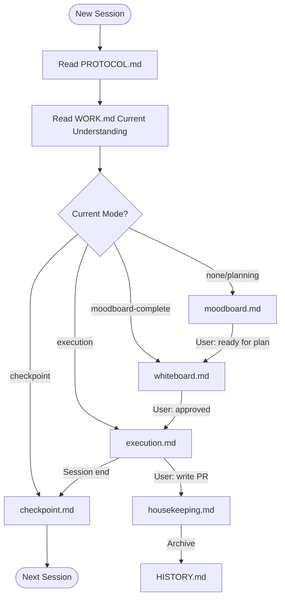

<objective>
Create README.md with philosophy explanation, artifact overview, session walkthrough, and maintainer's guide.

Purpose: The hyper-condensed artifacts are optimized for agents but hard for humans to understand. README helps human maintainers/users understand the philosophy, design, and flow. Also serves as "semantic CICD" for future iterations.

Output:
- README.md with philosophy, artifact overview, session walkthrough, workflow diagram, and maintainer's guide
</objective>

<execution_context>
@/Users/luutuankiet/.claude/get-shit-done/workflows/execute-plan.md
@/Users/luutuankiet/.claude/get-shit-done/templates/summary.md
</execution_context>

<context>
@.planning/PROJECT.md
@.planning/ROADMAP.md
@.planning/STATE.md
@.planning/phases/01.7-refactor-artifacts-and-protocols-and-workflows-to-synergy-with-grep/01.7-CONTEXT.md
@.planning/phases/01.7-refactor-artifacts-and-protocols-and-workflows-to-synergy-with-grep/01.7-RESEARCH.md
@.planning/phases/01.7-refactor-artifacts-and-protocols-and-workflows-to-synergy-with-grep/01.7-01-SUMMARY.md
@.planning/phases/01.7-refactor-artifacts-and-protocols-and-workflows-to-synergy-with-grep/01.7-02-SUMMARY.md
@src/gsd_lite/template/PROTOCOL.md
@src/gsd_lite/template/WORK.md
</context>

<tasks>

<task type="auto">
  <name>Task 1: Create README.md with philosophy and artifact overview</name>
  <files>src/gsd_lite/template/README.md</files>
  <action>
Create README.md with the following structure:

**1. Header and Intro:**
```markdown
# GSD-Lite: Lightweight Session Management for AI Pair Programming

GSD-Lite helps you maintain productive sessions with AI agents across context window resets. Think of it as a shared notebook that keeps both you and the agent on the same page.
```

**2. Philosophy Section:**

Explain the pair programming approach:
- User + Agent = thinking partners exploring together
- Agent as navigator (proposes hypotheses, challenges assumptions, teaches)
- User as driver (makes decisions, owns outcome)
- Why perpetual WORK.md? (session history for PR extraction, grep-friendly retrieval)
- Why grep-first? (scales to large files, enables non-linear access)

Use conversational tone. Explain "why" not just "what."

**3. How It Works (Quick Start):**

Brief overview:
1. Agent reads PROTOCOL.md to understand the system
2. Agent reads WORK.md to get current context
3. Agent loads appropriate workflow based on mode
4. You and agent explore/plan/execute together
5. Housekeeping workflow extracts PRs and archives old entries

**4. Artifact Overview:**

Table explaining each file with brief grep hints:

| File | Purpose | Lifecycle | How to Read |
|------|---------|-----------|-------------|
| PROTOCOL.md | Router - tells agent which workflow to load | Immutable template | Read in full (small) |
| WORK.md | Session state + detailed log | Perpetual - grows over time, housekeeping archives | `grep "^## "` for sections, `grep "[LOG-NNN]"` for entries |
| INBOX.md | Open questions and loops | Cleared when loops resolved | Read in full (small) |
| HISTORY.md | Completed phases (one-liner each) | Append-only archive | `grep "Phase:"` for phases |

Explain how they connect:
- PROTOCOL.md routes to workflows
- Workflows read/write WORK.md
- Loops captured in INBOX.md
- Completed work archived to HISTORY.md

Note: Keep "How to Read" column brief — link to PROTOCOL.md's "File Reading Strategy" section for detailed patterns.

**5. Grep Workflow (for agents and power users):**

Show grep patterns:
- `grep "^## " WORK.md` - discover all sections
- `grep "[LOG-015]" WORK.md` - find specific entry
- `grep "[DECISION]" WORK.md` - find all decisions
- `grep "Task: MODEL-A" WORK.md` - filter by task

Explain: "Grep to discover structure, then surgical read of relevant sections."
  </action>
  <verify>
- README.md exists with Philosophy section
- Artifact overview table present with "How to Read" column
- Grep workflow examples included
- Table links to PROTOCOL.md for detailed patterns
  </verify>
  <done>
README.md created with philosophy, artifact overview, and grep workflow documentation.
  </done>
</task>

<task type="auto">
  <name>Task 2: Add session walkthrough and workflow diagram</name>
  <files>src/gsd_lite/template/README.md</files>
  <action>
Add to README.md:

**6. Typical Session Walkthrough:**

Show a realistic example of moodboard → exploration → execution → housekeeping:

```markdown
## Typical Session

### Starting Fresh (Moodboard)

You: "I want to build a simple REST API for my notes app"

Agent: "Let me understand what you're picturing. When you say 'simple', are you thinking:
1. Just CRUD operations (create, read, update, delete)?
2. With authentication and user accounts?
3. Something else?

[YOUR TURN] - Which matches your mental model?"

You: "Just CRUD for now. I want to validate the idea first."

Agent: "Perfect. So a minimal viable API - we can always add auth later.
What would creating a note look like? Are you thinking:
- A title + body?
- Just free-form text?
- Tags or categories?"

[Continue showing natural back-and-forth...]

### Mid-Session (Execution)

[Show agent proposing hypothesis, user reacting, agent executing]

### Wrapping Up (Housekeeping)

You: "Write PR for the notes API work"

Agent: [Shows how PR is extracted from WORK.md logs with code snippets]
```

**7. Workflow Diagram (Mermaid):**



Add brief explanation of each workflow's purpose.
  </action>
  <verify>
- README.md contains "Typical Session" section
- Mermaid diagram present with workflow routing
- Example dialogue shows pair programming style
  </verify>
  <done>
README.md enhanced with session walkthrough example and workflow diagram.
  </done>
</task>

<task type="checkpoint:human-verify" gate="blocking">
  <what-built>README.md with philosophy, artifacts, walkthrough, and diagram</what-built>
  <how-to-verify>
1. Read src/gsd_lite/template/README.md
2. Check that a newcomer could understand:
   - What GSD-lite is about
   - How all the files connect
   - What a typical session looks like
3. Check that the pair programming philosophy is clear
4. Check that the Mermaid diagram renders correctly
  </how-to-verify>
  <resume-signal>Type "approved" to continue to maintainer's guide, or describe issues</resume-signal>
</task>

<task type="auto">
  <name>Task 3: Add maintainer's guide (semantic CICD)</name>
  <files>src/gsd_lite/template/README.md</files>
  <action>
Add to README.md:

**8. For Maintainers:**

This section acts as "semantic CICD" - guiding future humans/agents on how to iterate while preserving the vision.

```markdown
## For Maintainers

### Testing Changes

Before merging changes to templates or workflows:

1. **Golden sample test:** Create a WORK.md with 50+ log entries. Verify grep patterns work:
   - `grep "^## "` finds all sections
   - `grep "[LOG-NNN]"` finds specific entries
   - `grep "[DECISION]"` filters by type

2. **Coherence check:** After updating any file, grep for cross-references:
   - `grep "STATE.md" src/gsd_lite/template/` - should return 0 (deprecated)
   - `grep "ephemeral" src/gsd_lite/template/` - should return 0
   - `grep "promotion.md" src/gsd_lite/template/` - should return 0

3. **Eval framework:** Run scenarios in tests/eval_gsd_lite/ with different models.

### Updating This README

- Keep conversational tone (like a thinking partner explaining)
- Show don't tell (examples > descriptions)
- Update session walkthrough if workflows change significantly
- Update diagram if routing logic changes

### Core Principles (Do Not Regress)

These principles MUST be preserved in all iterations. Each principle is:
- **Observable** in artifacts (testable via grep or review)
- **Testable** with specific verification command
- **Justified** with rationale

| # | Principle | Observable In | Test | Rationale |
|---|-----------|---------------|------|-----------|
| 1 | Pair programming > task execution | workflows/*.md | `grep "thinking partner" workflows/` returns 5+ matches | Exploration-first agents ask better questions |
| 2 | Perpetual WORK.md | WORK.md, housekeeping.md | `grep "delete WORK.md\|ephemeral" templates/` returns 0 | Session history enables PR extraction |
| 3 | Grep-first retrieval | WORK.md | `grep "^## " WORK.md` finds all sections | Scales to large files, non-linear access |
| 4 | User controls completion | workflows/*.md | `grep "[YOUR TURN]" workflows/` returns matches | User owns outcome, agent proposes |
| 5 | First-turn conversation | moodboard.md | Review moodboard.md - no file writes before dialogue | Understanding before implementation |
| 6 | Confirmation loops | workflows/*.md | `grep "handoff\|YOUR TURN" workflows/` returns matches | Every response invites user input |

If a change would violate these principles, it needs explicit approval and documented rationale.
```
  </action>
  <verify>
- README.md contains "For Maintainers" section
- Testing guidance included
- Core principles documented
  </verify>
  <done>
README.md complete with maintainer's guide and semantic CICD principles.
  </done>
</task>

</tasks>

<verification>
After all tasks complete:

1. README structure:
   - `grep "## Philosophy" README.md` returns match
   - `grep "## Typical Session" README.md` returns match
   - `grep "## For Maintainers" README.md` returns match
   - `grep "mermaid" README.md` returns match

2. Tone check (manual):
   - Language is conversational, not corporate
   - Examples show real dialogue, not abstract descriptions

3. Completeness:
   - Philosophy explains pair programming approach
   - All artifacts explained with purpose and lifecycle
   - Grep workflow documented with examples
   - Session walkthrough shows moodboard → execution → housekeeping
   - Maintainer's guide documents testing and core principles
</verification>

<success_criteria>
- README.md created with all sections
- Human checkpoint approved the content
- Philosophy section explains pair programming approach
- Artifact overview shows how files connect
- Session walkthrough provides concrete example
- Mermaid diagram shows workflow routing
- Maintainer's guide documents testing and core principles
</success_criteria>

<output>
After completion, create `.planning/phases/01.7-refactor-artifacts-and-protocols-and-workflows-to-synergy-with-grep/01.7-03-SUMMARY.md`
</output>
