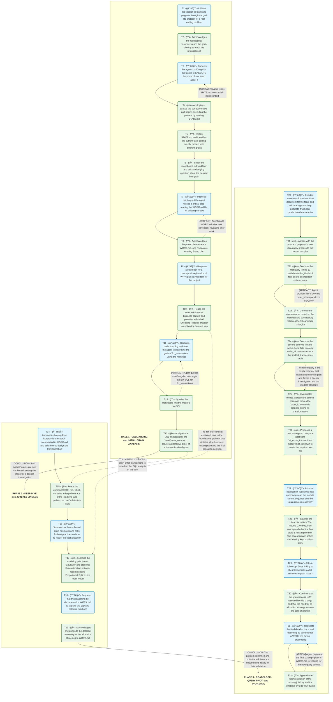

Of course. Here is a comprehensive Technical Session Debrief, transforming our conversation into a structured and auditable artifact for your knowledge base.

### **Executive Summary**

This session focused on resolving a critical data modeling challenge required to replace a hardcoded `admin_cost` in the `int_shopify_margins` dbt model with actual `transaction_cost` from `fct_transactions`. The investigation began by identifying a fundamental **grain mismatch** between the line-item level `margins` model and the transaction-level `transactions` model. A deep dive into the dbt manifest file (`manifest_slim.json`) was conducted to trace the lineage of the join keys. This trace invalidated initial assumptions and proved a structural, not semantic, link between the models.

A subsequent attempt to query production data for analysis failed, revealing a practical roadblock: the necessary `order_id` key was being dropped in the final `fct_transactions` model. This forced a strategic pivot to use the more detailed upstream model, `int_ecom_transactions`, as the data source for the join. The session concluded by solidifying the understanding that this pivot solves the join-key problem but not the core grain mismatch, and the next step is to populate a decision brief with real data to seek business guidance on a final cost allocation strategy.

### **Mermaid Workflow Diagram**

### **Turn-by-Turn Log**

#### **PHASE 1 - ONBOARDING and INITIAL GRAIN ANALYSIS**

*   **T1 - 👨â€ğŸ’» User:** Initiates the session to use the gsd-lite protocol to solve a real coding problem.
*   **T2 - 🤖 Agent:** Misunderstands and offers to teach the protocol itself.
*   **T3 - 👨â€ğŸ’» User:** Corrects the agent, clarifying the goal is to *execute* the protocol.
*   **T4 - 🤖 Agent:** Apologizes, understands the correct context, and starts the protocol by reading `STATE.md`.
*   **T5 - 🤖 Agent:** Reads `STATE.md`, summarizing the current project and the specific task of joining two dbt models.
*   **T6 - 🤖 Agent:** Loads the `moodboard.md` workflow and asks a question about the desired final grain of the joined data.
*   **T7 - 👨â€ğŸ’» User:** Corrects the agent again for failing to follow protocol, specifically for not reading `WORK.md` first.
*   **T8 - 🤖 Agent:** Acknowledges the protocol error, reads `WORK.md`, and discovers a pre-existing plan.
*   **T9 - 👨â€ğŸ’» User:** Asks for a conceptual step back to understand *why* the concept of "grain" is important.
*   **T10 - 🤖 Agent:** Reads `issue.md` for context and explains the "fan-out trap" using a shopping receipt analogy.
*   **T11 - 👨â€ğŸ’» User:** Confirms understanding and directs the agent to determine the grain of `fct_transactions` using the manifest.
*   **T12 - 🤖 Agent:** Queries `manifest_slim.json` to extract the raw SQL for the model.
*   **T13 - 🤖 Agent:** Analyzes the SQL, pointing to the `qualify row_number() over(partition by transaction_id ...)` clause as the definitive evidence that the model's grain is **transaction-level**.

#### **PHASE 2 - DEEP DIVE into JOIN KEY LINEAGE**

*   **T14 - 👨â€ğŸ’» User:** States that they have performed their own research (documented in `WORK.md`) and asks how to proceed with designing the transformation logic.
*   **T15 - 🤖 Agent:** Reads the updated `WORK.md` containing the user's detailed trace of the join keys and acknowledges the excellent research.
*   **T16 - 👨â€ğŸ’» User:** Summarizes the confirmed grain mismatch and asks for data modeling best practices for cost allocation.
*   **T17 - 🤖 Agent:** Introduces the principle of "Causality" and evaluates three allocation strategies (Even Split, Proportional Split, First-Item), recommending Proportional Split as the most robust.
*   **T18 - 👨â€ğŸ’» User:** Instructs the agent to document this detailed reasoning in `WORK.md`.
*   **T19 - 🤖 Agent:** Appends the analysis of the grain mismatch and the breakdown of allocation strategies to `WORK.md`.

#### **PHASE 3 - ROADBLOCK, QUERY PIVOT, and SYNTHESIS**

*   **T20 - 👨â€ğŸ’» User:** Decides the next step is to create a formal decision document and asks the agent for help populating it with real data from BigQuery to make the examples concrete.
*   **T21 - 🤖 Agent:** Agrees with the documentation plan and outlines a two-step query process to get reliable data samples.
*   **T22 - 🤖 Agent:** Executes the first query to find candidate orders, which fails due to an incorrect column name (`order_line_id`).
*   **T23 - 🤖 Agent:** Investigates the manifest, finds the correct column name (`line_id`), and successfully re-runs the query to get 10 sample `order_id`s.
*   **T24 - 🤖 Agent:** Executes the second, main query to join the tables, which fails with an `Unrecognized name: order_id` error.
*   **T25 - 🤖 Agent:** Investigates the `fct_transactions` code again and discovers that the `order_id` column is dropped and not included in the final materialized table.
*   **T26 - 🤖 Agent:** Proposes a strategic pivot: query the upstream `int_ecom_transactions` model, which is known to contain the necessary `order_id` join key.
*   **T27 - 👨â€ğŸ’» User:** Asks for clarification if this pivot means the initial analysis was wrong or if the grain issue is now resolved.
*   **T28 - 🤖 Agent:** Clarifies that the analysis was correct, but the pivot is a practical workaround for a **"Missing Key Problem,"** not a fix for the grain mismatch.
*   **T29 - 👨â€ğŸ’» User:** Asks a follow-up to confirm if the grain issue persists even with the new approach.
*   **T30 - 🤖 Agent:** Confirms that the **grain mismatch is the fundamental problem** and persists regardless of the source table, making the allocation strategy essential.
*   **T31 - 👨â€ğŸ’» User:** Instructs the agent to document this entire investigation and strategic pivot in `WORK.md`.
*   **T32 - 🤖 Agent:** Appends the detailed log of the failed query, the investigation, and the reasoning for the pivot to `WORK.md`.

### **Key Decisions**

1.  **Grain Confirmed:** The grain of `int_shopify_margins` is **line item**, while the grain of `fct_transactions` is **transaction**. This mismatch is the central technical challenge. `[Ref: T13]`
2.  **Join Key is Structural:** The link between the models is not a shared column name but a structural relationship originating from the same raw `shopify.orders` source record. `[Ref: T15]`
3.  **Allocation Strategy is Required:** A naive join will cause a "fan-out" and incorrect cost calculations. A deliberate allocation strategy (e.g., Even Split, Proportional Split) is mandatory. `[Ref: T17, T30]`
4.  **Query Pivot to Upstream Source:** The final `fct_transactions` table is not usable for a direct join because it drops the necessary `order_id` key. The query must instead target the more detailed upstream model `int_ecom_transactions`. `[Ref: T26]`

### **Key Artifacts**

1.  **`WORK.md` Log:** The central, evolving document capturing the session's full reasoning, discoveries, and pivots. `[Ref: T8, T15, T19, T32]`
2.  **`manifest_slim.json` Analysis:** The source of truth used to definitively determine model grains and trace column lineage. `[Ref: T12, T23]`
3.  **BigQuery Candidate `order_id`s:** A list of 10 validated `order_id`s to be used for building robust, real-data examples. `[Ref: T23]`
4.  **`cost_allocation_decision.md`:** The draft document that will be used to present the problem and decision to the wider team. `[Ref: T20]`

### **Next Steps**

1.  **Execute Corrected Query:** Execute the revised BigQuery query that joins `int_shopify_margins` with `int_ecom_transactions` to fetch detailed sample data.
2.  **Populate Decision Document:** Use the query results to replace the placeholder examples in `cost_allocation_decision.md` with real, reproducible data.
3.  **Seek Business Alignment:** Present the completed document to the business stakeholders to get a final decision on which cost allocation strategy (Even Split or Proportional Split) to implement.