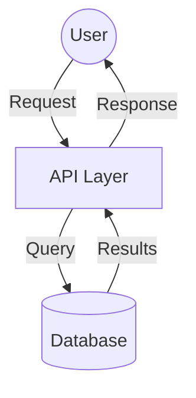

# Architecture

*Mapped: [date]*

## Project Structure Overview

| Directory | Purpose |
|-----------|---------|
| [root/] | [Brief description of what lives at project root] |
| [src/] | [Main source code, application logic] |
| [config/] | [Configuration files, environment setup] |
| [data/] | [Data files, databases, persistence] |
| [scripts/] | [Build scripts, deployment tools, utilities] |
| [tests/] | [Test suites, fixtures, test utilities] |
| [docs/] | [Documentation, diagrams, references] |

*Replace with actual directories (2 levels deep: root + one level down). Example:*
- *`app/` - Next.js application root*
- *`app/api/` - API route handlers*
- *`app/components/` - React components*

## Tech Stack

- **Runtime:** [e.g., Node.js 20, Python 3.11, Docker, Go 1.22]
- **Language:** [e.g., TypeScript, Python, Go, Bash]
- **Key Dependencies:**
  - [critical-lib-1] - [why it matters]
  - [critical-lib-2] - [why it matters]
  - [critical-lib-3] - [why it matters]

*List only 2-5 critical dependencies that define the architecture. Skip utilities.*

## Data Flow

*Choose one format based on complexity:*

**Option A: Mermaid diagram (for complex flows)**

**Option B: Text description (for simple flows)**
1. User submits request via [entry point]
2. [Component A] validates and processes input
3. [Component B] queries/transforms data
4. [Component C] formats and returns response
5. Results flow back to user

*Use the format that best communicates how data moves through the system.*

## Entry Points

Start reading here:

- `[path/to/main.ts]` - [Application entry point, initializes server/runtime]
- `[path/to/config.yaml]` - [Configuration that controls behavior]
- `[path/to/router.ts]` - [Request routing logic]
- `[path/to/README.md]` - [Setup instructions and context]

*List 3-5 files that give the fastest path to understanding the codebase.*

---
*Update when architecture changes significantly (new services, major refactors, technology shifts)*
