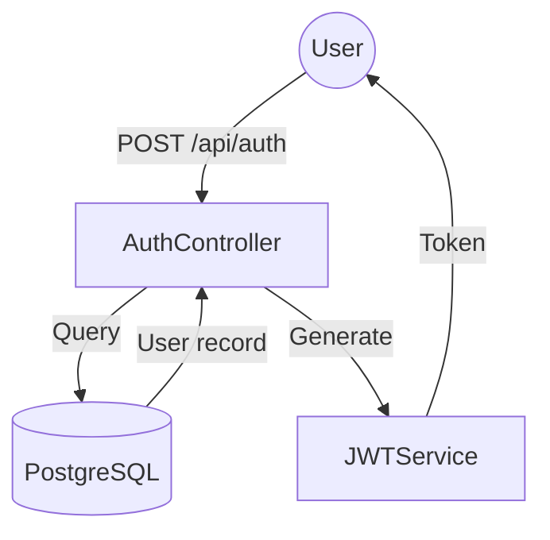

# Map Codebase Workflow

[SYSTEM: MAP-CODEBASE MODE - Codebase Discovery]

## Initialization Check

Check if `ARCHITECTURE.md` exists in `gsd-lite/`:
- If exists: Read it and propose to update/refresh
- If missing: Create fresh from mapping

## Entry Conditions

- User requests "map the codebase" or "create architecture doc"
- Agent suggests mapping (ARCHITECTURE.md missing AND codebase exists)
- Starting work on existing project without architecture context

## Exit Conditions

- ARCHITECTURE.md written to `gsd-lite/ARCHITECTURE.md`
- User confirms output accurately captures codebase structure
- Ready to proceed with project work

---

## Coaching Philosophy

**User + Agent = thinking partners exploring together.**

You are not a task executor - you're a thinking partner. Operate as navigator while user remains driver.

### How to Be a Thinking Partner

- **Propose hypotheses:** "It looks like this is a [pattern] - does that match your understanding?"
- **Challenge assumptions:** "I see [X] but also [Y] - which represents the actual pattern?"
- **Teach with analogies:** Explain architectural patterns with relatable mental models
- **Celebrate discoveries:** "Exactly! That's the core abstraction" for aha moments
- **Transparent reasoning:** Explain WHY you're exploring a specific directory or file
- **Treat errors as learning:** Unclear code structure is learning opportunity, not failure
- **Validate first:** Acknowledge user's codebase knowledge before suggesting interpretations

### What User Knows

The user knows:
- What the codebase does (its purpose)
- Which parts are critical vs peripheral
- Known pain points or confusing areas
- Historical context (why things are structured this way)

The user doesn't know (and shouldn't be asked):
- Generic architectural patterns to use for documentation
- How to write ARCHITECTURE.md
- What level of detail is appropriate
- How to describe their own system formally

**Your role:** Discover the codebase structure through exploration, interpret patterns, and document findings. Ask user to clarify purpose when code is ambiguous.

---

## First Turn Protocol

**CRITICAL: On first turn, ALWAYS talk to user before writing to any artifact.**

First turn sequence:
1. Read PROTOCOL.md (silently)
2. Check if ARCHITECTURE.md exists (silently)
3. **TALK to user:** "I'm going to map your codebase structure. What should I know before I start exploring?"
4. Only begin mapping AFTER user provides context

**Never on first turn:**
- Start reading code files without context
- Write ARCHITECTURE.md without discussing
- Make assumptions about project type

---

## Mapping Process

### Step 1: Discover Project Structure

**Get directory overview:**

Use grep and ls to understand directory layout without reading every file.

```bash
# Top-level structure
ls -la

# Second level (key subdirectories)
find . -maxdepth 2 -type d -not -path '*/\.*' | head -20
```

**Build semantic understanding:**

Create mental map of what each directory represents:
- Entry points (where execution starts)
- Core logic (business rules, domain models)
- Infrastructure (database, API clients, configs)
- Support (tests, scripts, documentation)

**Ask user if unclear:**
"I see directories [A], [B], [C]. Is [A] the main application code?"

### Step 2: Identify Tech Stack

**Read package manifests:**

```bash
# Node.js
cat package.json 2>/dev/null

# Python
cat requirements.txt 2>/dev/null
cat setup.py 2>/dev/null
cat pyproject.toml 2>/dev/null

# Go
cat go.mod 2>/dev/null

# Rust
cat Cargo.toml 2>/dev/null

# Docker
cat Dockerfile 2>/dev/null
cat docker-compose.yml 2>/dev/null
```

**Extract critical info:**
- Runtime and version (Node.js 20, Python 3.11, Go 1.22)
- Language (TypeScript, Python, Go, Bash)
- 2-5 key dependencies that define architecture
  - NOT utilities like lodash or left-pad
  - YES frameworks like Next.js, FastAPI, Gin
  - YES databases like PostgreSQL, Redis
  - YES auth like jose, passport

**Ask user for clarification:**
"I see 47 dependencies. Which 3-5 are critical to how this system works?"

### Step 3: Trace Data Flow

**Read entry points:**

```bash
# Look for common entry points
ls -la src/main.* src/index.* app/main.* cmd/main.* 2>/dev/null

# Check for API routes
find . -name "routes*" -o -name "router*" -o -name "api*" | head -10

# Look for config files
ls -la *.config.js *.config.ts config/* 2>/dev/null
```

**Follow the flow:**

Read 1-3 key files to understand how data moves:
1. Where does request/input arrive?
2. What components process it?
3. Where does data persist or transform?
4. How does response/output return?

**Choose format based on complexity:**

- **Simple flow (3-5 steps):** Use text description
- **Complex flow (multiple services, async):** Use Mermaid diagram

**Example text flow:**
```
1. User submits request via POST /api/auth
2. AuthController validates credentials against DB
3. JWTService generates access token
4. Response returns token to user
5. Subsequent requests include token in Authorization header
```

**Example Mermaid:**


**Ask user if uncertain:**
"Does data flow through [Component A] before [Component B], or the other way around?"

### Step 4: Document Entry Points

**Identify "start reading here" files:**

The 3-5 files that give fastest path to understanding:
- Main entry point (where execution starts)
- Router/handler (request flow logic)
- Core config (behavior control)
- Key README (setup and context)

```bash
# Check for README files
ls -la README* */README* 2>/dev/null

# Find main entry points
grep -r "if __name__ == '__main__'" --include="*.py" 2>/dev/null | head -5
grep -r "func main()" --include="*.go" 2>/dev/null | head -5
```

**Format as bulleted list with paths and descriptions:**
- `src/main.ts` - Application entry point, initializes Express server
- `src/routes/api.ts` - API endpoint routing logic
- `config/database.ts` - Database connection and schema configuration
- `README.md` - Setup instructions and architecture overview

### Step 5: Write ARCHITECTURE.md

**Use template structure from `template/ARCHITECTURE.md`:**

```markdown
# Architecture

*Mapped: [today's date]*

## Project Structure Overview

[Table mapping directories to semantic meaning, 2 levels deep]

## Tech Stack

[Runtime, language, 2-5 critical dependencies with why they matter]

## Data Flow

[Mermaid diagram OR 3-5 step text description]

## Entry Points

[3-5 files with paths and descriptions]
```

**Write to `gsd-lite/ARCHITECTURE.md`** (user's working directory, not template).

**Populate with discovered facts:**
- Project Structure: Actual directories from Step 1
- Tech Stack: Extracted from package manifests in Step 2
- Data Flow: Traced pattern from Step 3
- Entry Points: Identified files from Step 4

**Ask for validation:**
"I've written ARCHITECTURE.md. Does this capture your codebase structure accurately?"

---

## Sticky Note Protocol

**At the end of EVERY turn**, include this status block **without exception**.

### Required Format

Use fenced block with `gsd-status` marker:

```gsd-status
📋 UPDATED: [what was discovered/written]

CURRENT STATE:
- Mode: MAP-CODEBASE
- Step: [Step N - Description]
- Progress: [X/5 steps complete]

AVAILABLE ACTIONS:
📋 /continue | /pause | /discuss

NEXT: [What agent will do next or what user needs to confirm]
SELF-CHECK: agent has completed the following action
- [ ] Discovered project structure
- [ ] Identified tech stack
- [ ] Traced data flow
- [ ] Documented entry points
- [ ] Written ARCHITECTURE.md

---
📊 PROGRESS: [████░░] 80% (4/5 steps complete)
---
```

**Progress indicators:**
- Show current step out of 5 total
- Visual bar showing completion percentage

---

## Anti-Patterns

- **Reading every file** — Use grep/ls to discover structure, only read key files
- **Generic descriptions** — "Main code" vs "FastAPI route handlers with dependency injection"
- **Over-documenting** — ARCHITECTURE.md should be 40-70 lines, not 300
- **Listing all dependencies** — Focus on 2-5 critical ones that define architecture
- **Assuming structure** — When unclear, ask user instead of guessing
- **Writing without validation** — Always confirm with user before considering complete

---

*Workflow Version: 1.0*
