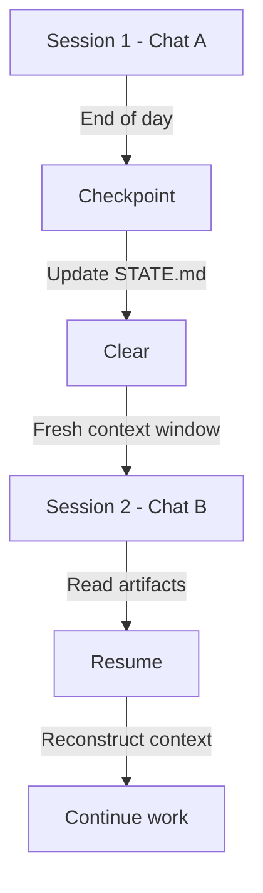

<objective>
Extract execution and checkpoint workflows into separate files.

Purpose: Complete the workflow decomposition by creating execution mode (task work) and checkpoint mode (promotion/handoff). The checkpoint workflow documents the critical context lifecycle (checkpoint -> clear -> resume) pattern discovered in research.

Output: Two focused workflow files with identical sticky note sections. Checkpoint workflow explicitly documents how sessions checkpoint, clear, and resume.
</objective>

<execution_context>
@/Users/luutuankiet/.claude/get-shit-done/workflows/execute-plan.md
@/Users/luutuankiet/.claude/get-shit-done/templates/summary.md
</execution_context>

<context>
@.planning/PROJECT.md
@.planning/ROADMAP.md
@.planning/STATE.md
@.planning/phases/01.3-context-lifecycle-coaching-workflow-decomposition/01.3-RESEARCH.md
@gsd-lite/template/PROTOCOL.md
</context>

<tasks>

<task type="auto">
  <name>Task 1: Create execution.md workflow</name>
  <files>gsd-lite/workflows/execution.md</files>
  <action>
Create execution.md with the following structure:

1. **Header section** (entry/exit conditions):
```markdown
# Execution Workflow
[SYSTEM: EXECUTION MODE - Task Work]

## Entry Conditions
- After whiteboard approval (user says "yes")
- STATE.md shows active phase with tasks
- No blocking decisions pending

## Exit Conditions
- All tasks in scope complete
- Agent signals "phase ready for completion"
- User requests checkpoint/promotion
```

2. **Coaching philosophy section** (governance for execution):
- User owns outcome, agent executes
- Technical details: agent auto-fixes with deviation log
- Architectural changes: pause, present decision
- Scope creep: capture to INBOX, continue with original scope

3. **Execution protocol** (extract from PROTOCOL.md lines 426-458):
- The Journalist Rule (rich context for wins)
- WORK.md logging standard (Milestone vs Standard entries)
- Granular logs for steps

4. **Loop capture protocol** (extract from PROTOCOL.md lines 460-503):
- Two sources: User and Agent
- INBOX.md format with systematic IDs
- Example entries

5. **Scope discipline section** (extract from PROTOCOL.md lines 723-740):
- Stop, capture, reference, continue
- Why this matters

6. **Checkpoint emoji banners** (extract from PROTOCOL.md lines 596-719):
- Blocking checkpoints format
- Informational checkpoints (LOOP, DECISION, TASK, HYPOTHESIS)
- Checkpoint confirmation format

7. **Sticky note protocol section** (verbatim - identical to other workflows):
- Required format with gsd-status marker
- Systematic IDs
- Available actions menu
- Self-check section

Target length: 250-350 lines.
  </action>
  <verify>
- File exists at gsd-lite/workflows/execution.md
- Contains "Entry:" and "Exit:" sections
- Contains "Journalist Rule" section
- Contains loop capture protocol
- Contains sticky note protocol with gsd-status marker
- Line count is 200-400 (reasonable range)
- Sticky note section matches canonical format (will be verified for identity with other workflows in Plan 01.3-05)
  </verify>
  <done>
Execution workflow is self-contained with rich logging guidance and scope discipline.
  </done>
</task>

<task type="auto">
  <name>Task 2: Create checkpoint.md workflow</name>
  <files>gsd-lite/workflows/checkpoint.md</files>
  <action>
Create checkpoint.md with the following structure:

1. **Header section** (entry/exit conditions):
```markdown
# Checkpoint Workflow
[SYSTEM: CHECKPOINT MODE - Promotion/Handoff]

## Entry Conditions
- User requests "complete phase" or "promote"
- All tasks in scope marked complete
- No blocking loops remain

## Exit Conditions
- HISTORY.md updated with phase record
- WORK.md trimmed (deleted)
- STATE.md cleared for next phase
- User informed of promotion
```

2. **Context Lifecycle Documentation** (from research Pattern 3):
```markdown
## Context Lifecycle: Checkpoint -> Clear -> Resume

### 1. Checkpoint (end of session)
- Agent signals completion readiness
- User triggers promotion workflow
- STATE.md captures: current phase, decisions made, session log
- WORK.md trimmed after extraction to external artifact
- Result: Clean slate for next session

### 2. Clear (between sessions)
- User starts fresh chat (NEW context window)
- OR orchestrator spawns fresh agent
- 0% context usage at start
- No accumulated chat history

### 3. Resume (start of new session)
- Agent reads PROTOCOL.md (which workflow to load)
- Reads STATE.md (where were we? what decisions made?)
- If mid-task: reads WORK.md (what's in progress?)
- Reconstructs context from artifacts, not chat history
```

Include mermaid diagram from research:


3. **Promotion workflow** (extract from PROTOCOL.md lines 822-892):
- Step 1: Promote (extract to external artifact)
- Step 2: Record to HISTORY.md (systematic ID, date, outcome)
- Step 3: Trim WORK.md (aggressive deletion)
- Step 4: Clear STATE.md (ready for next phase)

4. **User-controlled completion** (from decisions):
- Agent signals readiness, user decides when
- Why: promotion trims WORK.md, material can be lost
- User may need time to extract outcomes, write PR description

5. **Sticky note protocol section** (verbatim - identical to other workflows):
- Required format with gsd-status marker
- Systematic IDs
- Available actions menu
- Self-check section

Target length: 200-300 lines.
  </action>
  <verify>
- File exists at gsd-lite/workflows/checkpoint.md
- Contains "Context Lifecycle" section
- Contains "Checkpoint -> Clear -> Resume" documentation
- Contains mermaid diagram
- Contains sticky note protocol with gsd-status marker
- Line count is 200-350 (reasonable range)
- Sticky note section matches canonical format (will be verified for identity with other workflows in Plan 01.3-05)
  </verify>
  <done>
Checkpoint workflow documents context lifecycle and promotion protocol.
  </done>
</task>

</tasks>

<verification>
1. Both workflow files exist in gsd-lite/workflows/
2. Both contain entry/exit conditions
3. checkpoint.md contains Context Lifecycle section with checkpoint/clear/resume
4. checkpoint.md contains mermaid diagram (not ASCII art)
5. execution.md contains loop capture and scope discipline
6. Both contain IDENTICAL sticky note protocol section
</verification>

<success_criteria>
- gsd-lite/workflows/execution.md exists with task execution protocol
- gsd-lite/workflows/checkpoint.md exists with promotion/handoff protocol
- Context lifecycle (checkpoint -> clear -> resume) explicitly documented
- All workflows have identical sticky note sections
</success_criteria>

<output>
After completion, create `.planning/phases/01.3-context-lifecycle-coaching-workflow-decomposition/01.3-02-SUMMARY.md`
</output>
