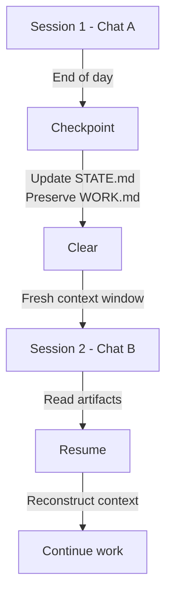

# Phase 1.4: Enrich Checkpoint Workflow - Research

**Researched:** 2026-01-25
**Domain:** Session handoff patterns, context preservation, multi-session work management
**Confidence:** HIGH

## Summary

This phase enriches the checkpoint workflow (implemented in Phase 1.3) with enhanced context preservation capabilities discovered through analyzing the context lifecycle pattern. The current checkpoint.md handles basic state tracking, but lacks rich semantic capture of work-in-progress reasoning, vision evolution, and decision rationale—information critical for fresh agents resuming multi-day work.

Research identified three key enrichments needed:

1. **WORK.md Semantic Broadening** - Current semantic ("execution log") doesn't fit moodboard/whiteboard modes; needs broader "session work log" semantics capturing all session-level work
2. **Current Understanding Section** - Hybrid narrative+log structure borrowed from OG GSD's pause-work pattern enabling 30-second fresh agent resume
3. **Session Log Entries with Type Tags** - Chronological entries tagged by work type ([VISION], [DECISION], [PLAN], [EXEC], [BLOCKER]) enabling non-linear retrieval

**Primary recommendation:** Implement three-part WORK.md enrichment: (1) Add "Current Understanding" section at top (structured narrative for fresh agent resume), (2) Broaden WORK.md semantics to "Session Work Log" capturing all work types, (3) Implement type-tagged session log entries below narrative section.

## Standard Stack

This is an architectural/documentation phase with no code dependencies. Patterns sourced from OG GSD analysis and verified through Phase 1.3 implementation.

### Core Patterns (from OG GSD Analysis)

| Pattern | Source | Purpose | Why Standard |
|---------|--------|---------|--------------|
| Current Understanding Section | OG GSD pause-work.md | Handoff narrative structure | Enables fresh agent to grasp state in 30 seconds without reading full log |
| Session Work Log | Phase 1.3 CONTEXT.md decisions | Multi-mode work capture | Captures vision/planning/execution work in single chronological log |
| Type-tagged Entries | HANDOFF-01 through HANDOFF-06 patterns | Work retrieval and categorization | Allows agent to find specific work type without scanning full log |
| Checkpoint-Promotion Separation | Phase 1.3-05 Implementation | Cross-session continuity | Checkpoint preserves WORK.md, promotion trims after extraction |

### Supporting Concepts (from Context Engineering Patterns)

| Concept | Source | Purpose | Why Standard |
|---------|--------|---------|--------------|
| Narrative + Log Hybrid | OG GSD pause-work/continue-here | Balance readability vs detail | Top-level summary for quick resume, full log for deep context |
| Tag-based Organization | HANDOFF patterns in GSD_PATTERNS.md | Non-linear access | Query-friendly: `grep "\[DECISION\]"` to find decision history |
| Session-level Granularity | Phase 1.3-02 Context Lifecycle | Multi-session work tracking | Bridges gap between checkpoint (preserve) and promotion (extract) |

### Alternatives Considered

| Instead of | Could Use | Tradeoff |
|------------|-----------|----------|
| Type-tagged entries | Free-form entries | Simpler to write, harder to query/retrieve specific work type |
| Current Understanding at top | Implicit from reading full log | Less cognitive load for simple phases, fails on complex multi-day phases |
| Semantic broadening to "work log" | Keep "execution log" semantic | Simpler naming, but forces uncomfortable fit for vision/planning work |

**Installation:** None (documentation-only phase)

## Architecture Patterns

### Recommended WORK.md Structure (Enriched)

```markdown
# GSD-Lite Work Log

## Current Understanding
<current_state>
[Where exactly are we? Phase, task, completion %, what's happening NOW]
</current_state>

<vision>
[What user wants - the intent, feel, references, success criteria]
</vision>

<decisions>
[Key decisions with rationale - not just WHAT but WHY]
</decisions>

<blockers>
[Open questions, stuck items, waiting on user, ambiguities]
</blockers>

<next_action>
[Specific first action when resuming this session]
</next_action>

---

## Session Log (Chronological)

**[2026-01-22 15:30]** - [VISION] User wants Linear-like feel + Bloomberg density for power users
- Context: Discussed UI patterns during whiteboard
- Implication: Clean layout but with information density for advanced users

**[2026-01-22 15:45]** - [DECISION] Use card-based layout, not timeline
- Rationale: Cards support varying content length (post + engagement + metadata)
- Alternative considered: Timeline view (simpler, less flexible)

**[2026-01-22 16:00]** - [PLAN] TASK-001 scope: Set up JWT library + create login endpoint
- Tasks: Install jose, create auth/login.ts, write tests
- Risk: Token expiry strategy TBD

**[2026-01-22 16:30]** - [EXEC] TASK-001: Installed jose library v0.5.0
- Result: src/auth/token.ts created with generateToken function
- Files: src/auth/token.ts, src/auth/token.test.ts
- Status: In progress (generateToken done, validation next)

**[2026-01-22 17:00]** - [BLOCKER] Password reset flow unclear
- Issue: Do we use same JWT or separate token for password reset?
- Waiting on: User decision on security model
- Impact: Blocks TASK-002 (login endpoint) until clarified
```

### Pattern 1: Current Understanding Section (Handoff Readiness)

**What:** Structured narrative section at top of WORK.md following OG GSD's pause-work pattern, readable in 30 seconds by fresh agent.

**When to use:** Update before every checkpoint. At session start, fresh agent reads this section first to understand current state.

**Structure (5 XML sections):**
```xml
<current_state>
Where exactly are we? Phase, task, completion %, what's happening NOW
</current_state>

<vision>
What user wants - the intent, feel, references, success criteria
</vision>

<decisions>
Key decisions with rationale - not just WHAT but WHY
</decisions>

<blockers>
Open questions, stuck items, waiting on user, ambiguities
</blockers>

<next_action>
Specific first action when resuming this session
</next_action>
```

**Example:**
```xml
<current_state>
Phase 1.4: Enrich Checkpoint Workflow - Plan 02 in progress
Task: Implement Current Understanding section in WORK.md template (70% complete)
Session 1 progress: Researched OG GSD patterns, drafted structure
What's happening: Adding documentation and implementation guidance
</current_state>

<vision>
Fresh agents need to resume cross-session work without re-reading entire WORK.md.
Current Understanding section should be readable in 30 seconds, providing complete orientation.
</vision>

<decisions>
- Use OG GSD pause-work structure (current_state, vision, decisions, blockers, next_action)
- Keep narrative form (not bullet points) for human readability
- Position at top of WORK.md before chronological log
</decisions>

<blockers>
None currently, proceeding with implementation
</blockers>

<next_action>
Update WORK.md template with Current Understanding section example
</next_action>
```

**Why standard:** OG GSD's pause-work pattern proved effective. Current Understanding section provides handoff state without requiring fresh agent to read full log. Reduces resume cognitive load from "understand this entire work log" to "understand these 5 key facts."

### Pattern 2: Session Work Log Semantic Broadening

**What:** Rename WORK.md semantic from "execution log" to "session work log" and capture ALL session-level work (vision, planning, execution, decisions, blockers) in single chronological structure.

**When to use:** During moodboard, whiteboard, and execution modes—whenever agents add entries to WORK.md.

**Current limitation:** WORK.md template describes "execution log" which awkwardly forces vision/planning work into execution-focused structure. Blocks moodboard/whiteboard modes from naturally capturing their work.

**Solution:** Broaden semantic to "Session Work Log" that naturally accommodates:
- Moodboard mode: Vision extraction entries ([VISION])
- Whiteboard mode: Planning entries ([PLAN], [DECISION])
- Execution mode: Action entries ([EXEC])
- Any mode: Blocker entries ([BLOCKER])

**Example entries across modes:**

```markdown
[VISION] User wants cards over timeline (from moodboard mode, 2026-01-22 15:30)
[DECISION] Use jose library, not jsonwebtoken (from moodboard/whiteboard discussion, rationale: better maintenance)
[PLAN] TASK-001 scope: auth setup + login endpoint (from whiteboard mode, 2026-01-22 16:00)
[EXEC] Installed jose, created token.ts (from execution mode, 2026-01-22 16:30)
[BLOCKER] Password reset strategy unclear (from execution mode, 2026-01-22 17:00)
```

**Why standard:** Phase 1.3 CONTEXT.md explicitly called for broadening WORK.md to capture all session work. This semantic change enables natural capture across all workflow modes, not just execution.

### Pattern 3: Type-Tagged Session Log Entries

**What:** Chronological session log entries tagged with work type: [VISION], [DECISION], [PLAN], [EXEC], [BLOCKER]

**When to use:** Every entry in session log (below Current Understanding section) gets a type tag.

**Tag meanings:**
- `[VISION]` - User vision/preferences extracted, vision evolution, reference points
- `[DECISION]` - Decision made (tech, scope, approach) with rationale
- `[PLAN]` - Planning work: task breakdown, risk identification, approach sketched
- `[EXEC]` - Execution work: files modified, commands run, changes made
- `[BLOCKER]` - Open questions, stuck items, waiting states

**Entry format:**
```markdown
**[YYYY-MM-DD HH:MM]** - [TAG] Brief description
- Details: [what happened, why it matters]
- Files: [if applicable]
- Impact: [what this unblocks or blocks]
```

**Example:**
```markdown
**[2026-01-22 16:00]** - [DECISION] Use card-based layout, not timeline
- Rationale: Cards support varying content length; timeline is more rigid
- Alternative considered: Timeline view (simpler implementation, less flexible)
- Impact: Unblocks whiteboard presentation to user; affects TASK-003 (card styling)

**[2026-01-22 16:30]** - [EXEC] Created src/auth/token.ts with generateToken function
- Files modified: src/auth/token.ts, src/auth/token.test.ts
- Status: In progress (generateToken done, validation next)
- Impact: TASK-001 progressing, blocks on password reset decision
```

**Query advantage:** Agent can `grep "\[DECISION\]" WORK.md` to trace decision history without reading full log.

**Why standard:** HANDOFF patterns (HANDOFF-01 through HANDOFF-06 in GSD_PATTERNS.md) show tag-based organization enables non-linear access to handoff state. Supports both "what's happening now" (Current Understanding) and "let me trace this decision" (grep in log).

### Revisit Workflow (NEW)

**What:** User-initiated workflow allowing non-linear thinking after whiteboard completion. User returns with new ideas; agent reviews plan, incorporates feedback, presents revised plan.

**When to use:** After whiteboard-complete mode, when user wants to re-explore decisions.

**Entry condition:**
- User requests "revisit" or "let me rethink this"
- MODE = whiteboard-complete (ready for execution but not yet executing)

**Exit condition:**
- Revised plan presented and user approves
- MODE transitions back to whiteboard-complete (ready for execution)
- OR user decides original plan was correct (no changes)

**Capabilities:**
1. Review current plan (show PLAN.md state)
2. Add new ideas from user (capture to WORK.md)
3. Identify what changed (compare new vs original)
4. Revise PLAN.md if needed

**Why separate:** Non-linear thinking (revisit) is different from linear execution. User may circle back to planning layer after whiteboard completion. Revisit workflow handles this transition without forcing loop back to moodboard.

**Scope:** Stays in planning layer. User rethinking decisions doesn't restart discovery—it's a deliberate re-examination of already-made choices.

### No ASCII Art in Any Workflow

**Decision:** All diagrams use Mermaid format, never ASCII art.

**Rationale:** Phase 1.3 research identified ASCII art as anti-pattern. Mermaid diagrams maintain interactivity, support rendering across platforms, enable maintenance without manual reformatting.

**Example (Context Lifecycle):**


## Don't Hand-Roll

Problems that look simple but have existing solutions:

| Problem | Don't Build | Use Instead | Why |
|---------|-------------|-------------|-----|
| Session state format | Custom JSON or YAML | Follow OG GSD pause-work structure (XML sections + markdown) | Proven pattern, human-readable, supports both narrative and structured data |
| Handoff protocol | Custom "resume instruction" format | OG GSD's Current Understanding section (5 XML parts) | Tested across multi-day work, 30-second resume design |
| Work type categorization | Custom taxonomy | HANDOFF pattern tags ([VISION], [DECISION], [PLAN], [EXEC], [BLOCKER]) | Covers all work types naturally, grep-friendly |

**Key insight:** OG GSD's pause-work and continue-here patterns already solve multi-session handoff comprehensively. GSD-Lite should adapt these patterns, not reinvent them.

## Common Pitfalls

### Pitfall 1: Current Understanding Drifts Out of Date

**What goes wrong:** Current Understanding section written at session start, but not updated when new decisions made or state changes during session.

**Why it happens:** Agent treats Current Understanding as static, not realizing it should reflect end-of-session state for fresh agent resume.

**How to avoid:**
- Update Current Understanding at checkpoint time (not just at session start)
- Fresh agent reads Current Understanding expecting current state, not historical state
- Sticky note self-check: "[ ] Current Understanding updated" before checkpoint

**Warning signs:** Fresh agent says "This doesn't match what WORK.md shows" or has to re-read entire log to understand current state.

### Pitfall 2: Session Log Entries Too Sparse or Too Verbose

**What goes wrong:** Either missing important context (sparse), or 500-line entries per decision (verbose)—both break queryability.

**Why it happens:** Unclear granularity guidance; agents don't know what counts as "entry-worthy."

**How to avoid:**
- Each entry = one decision, one action, one vision extraction, one blocker
- Entry length: 3-8 lines maximum (decision + rationale + impact)
- Timestamp = when decision made or action taken, not when entry written
- If tempted to write >10 lines, break into multiple entries

**Warning signs:** Agents write paragraph-long entries; grep queries return too much context.

### Pitfall 3: Semantic Confusion—Is This WORK.md or STATE.md?

**What goes wrong:** Duplication between WORK.md (session work log) and STATE.md (phase/task tracker), or unclear ownership of what goes where.

**Why it happens:** Boundary between "work done" (WORK.md) and "phase state" (STATE.md) poorly defined.

**How to avoid:**
- WORK.md = detailed log of HOW we got here (entries, decisions, reasoning)
- STATE.md = WHAT is our current position (phase, task, completion %, active loops)
- WORK.md is deleted after promotion; STATE.md persists for next phase
- Fresh agent reads STATE.md for WHERE ARE WE, WORK.md for HOW DID WE GET HERE

**Warning signs:** STATE.md is >200 lines; WORK.md and STATE.md repeat same information.

### Pitfall 4: Current Understanding Uses Jargon Instead of Concrete Facts

**What goes wrong:** Current Understanding says "We're aligned on structure" without saying what the structure actually is.

**Why it happens:** Author assumes fresh agent knows context or shares vocabulary.

**How to avoid:**
- Every section should be readable by agent with zero prior context
- Use concrete examples: "User wants LinkedIn-style feed, not Twitter timeline"
- Avoid: "Per original vision" or "As discussed" (fresh agent doesn't know what was discussed)
- Test: Would a fresh Claude understand this in 30 seconds?

**Warning signs:** Fresh agent asks clarifying questions about Current Understanding section.

### Pitfall 5: Revisit Workflow Loops Back to Moodboard Instead of Staying in Whiteboard

**What goes wrong:** User revisits decisions → agent goes back to moodboard mode, forcing complete re-discussion of already-extracted vision.

**Why it happens:** Unclear boundary between "revisit planning" and "restart discovery."

**How to avoid:**
- Revisit = re-examine decisions within whiteboard layer, not back to moodboard
- User is NOT re-discovering what they want (that happened in moodboard)
- User IS reconsidering HOW to implement (planning layer decisions)
- Exit revisit with updated PLAN.md, back to whiteboard-complete mode

**Warning signs:** User frustrated at re-discussing already-settled vision; agent loops back to "what do you want?" questions.

## Code Examples

Not applicable—this is an architectural/documentation phase.

However, WORK.md examples are embedded throughout Architecture Patterns section above.

## State of the Art

### Checkpoint Workflow Evolution

| Old Approach (Phase 1.3) | Current Approach (Phase 1.4) | When Changed | Impact |
|--------------------------|-----------------------------|--------------|---------|
| Basic STATE.md updates | Rich Current Understanding section | 2026-01-25 | Fresh agents resume without re-reading full log |
| Execution log semantic | Session work log semantic | 2026-01-25 | All workflow modes (moodboard, whiteboard, execution) can log naturally |
| Untagged WORK.md entries | Type-tagged entries ([VISION], [DECISION], [PLAN], [EXEC], [BLOCKER]) | 2026-01-25 | Non-linear access—query specific work type via grep |
| No revisit capability | Revisit workflow for post-whiteboard rethinking | 2026-01-25 | Supports non-linear thinking; user can reconsider decisions before execution |

### Deprecated/Outdated

None identified—Phase 1.4 enriches rather than replaces Phase 1.3 patterns.

## Open Questions

### 1. Current Understanding Update Trigger

- **What we know:** Current Understanding should reflect end-of-session state for fresh agent resume
- **What's unclear:** Should every turn update Current Understanding, or only at checkpoint time?
- **Recommendation:** Update at checkpoint time only. During session, Current Understanding can drift from real-time state. At checkpoint, it becomes source of truth for next session. Prevents "stale Current Understanding" pitfall.

### 2. Revisit Workflow Interaction with Loops

- **What we know:** Revisit workflow lets user reconsider planning decisions
- **What's unclear:** If user discovers new questions during revisit, do they become INBOX.md loops or stay in WORK.md as [BLOCKER]?
- **Recommendation:** New questions discovered during revisit stay in WORK.md as [BLOCKER] for agent to address before next whiteboard presentation. Only capture to INBOX.md if user wants async processing (tag LOOP-XXX, move to INBOX). Default = WORK.md [BLOCKER] in revisit context.

### 3. Session Log Timestamp Granularity

- **What we know:** Entries should be timestamped for chronological ordering
- **What's unclear:** Should timestamp reflect action time or entry-write time? If decision made at T1 but entry written at T2, which timestamp?
- **Recommendation:** Use action time (when decision made or action taken), not write time. Maintains accurate chronology for future agent understanding. If agent can't remember exact time, use approximate (nearest 15-min block).

### 4. Current Understanding Section for Multi-Day Work

- **What we know:** Current Understanding aims for 30-second resume readability
- **What's unclear:** On day 3 of 5-day phase, if state is complex (5 blockers, 3 decisions, partial task), does 30-second goal still apply? Risk of over-compression?
- **Recommendation:** Target 30 seconds for majority of cases. For complex states, accept 60 seconds but prioritize clarity over brevity. Better to be clear + 60s than compressed + confusing. Fresh agent can ask for clarification if Current Understanding incomplete.

## Sources

### Primary (HIGH confidence)

- OG GSD pause-work.md (`.gsd_reference/commands/gsd/pause-work.md`) - Pause-work handoff structure pattern
- OG GSD continue-here.md reference (referenced in pause-work.md) - Multi-session continuation pattern
- Phase 1.3-CONTEXT.md ("WORK.md Semantic Broadening" section) - User decision on broadening WORK.md semantics
- Phase 1.3-05-SUMMARY.md - Checkpoint-promotion separation decision with rationale
- GSD_PATTERNS.md (HANDOFF-01 through HANDOFF-06 patterns) - Session handoff and type-tagging patterns
- Phase 1.3-RESEARCH.md (Context Lifecycle Pattern section) - Checkpoint → clear → resume architecture

### Secondary (MEDIUM confidence - verified in codebase)

- Current checkpoint.md (src/gsd_lite/template/workflows/checkpoint.md) - Existing checkpoint implementation
- WORK.md template (src/gsd_lite/template/WORK.md) - Current WORK.md semantic
- GSD_PATTERNS.md Pattern 1 (XML Structure) - XML semantic clarity pattern
- GSD_PATTERNS.md Pattern 8 (Checkpoint Patterns) - Checkpoint categorization patterns

## Metadata

**Confidence breakdown:**

- **Current Understanding section pattern: HIGH** - Directly from OG GSD pause-work/continue-here, verified in Phase 1.3 CONTEXT.md decisions
- **WORK.md semantic broadening: HIGH** - Explicit user decision in Phase 1.3-CONTEXT.md ("WORK.md Semantic Broadening")
- **Type-tagged entries: HIGH** - HANDOFF patterns documented in GSD_PATTERNS.md, session log entry format specified in Phase 1.3-CONTEXT.md
- **Revisit workflow: MEDIUM** - Specified in Phase 1.3-CONTEXT.md "Revisit Workflow" section, architecture clear but not yet implemented
- **Pitfalls and anti-patterns: HIGH** - Derived from Phase 1.3 eval findings and Phase 1.2 coherence audit

**Research date:** 2026-01-25
**Valid until:** 45 days (stable handoff patterns, no API churn risk; revisit workflow needs implementation validation)

---

*Phase: 01.4-enrich-checkpoint-workflow*
*Research completed: 2026-01-25*
