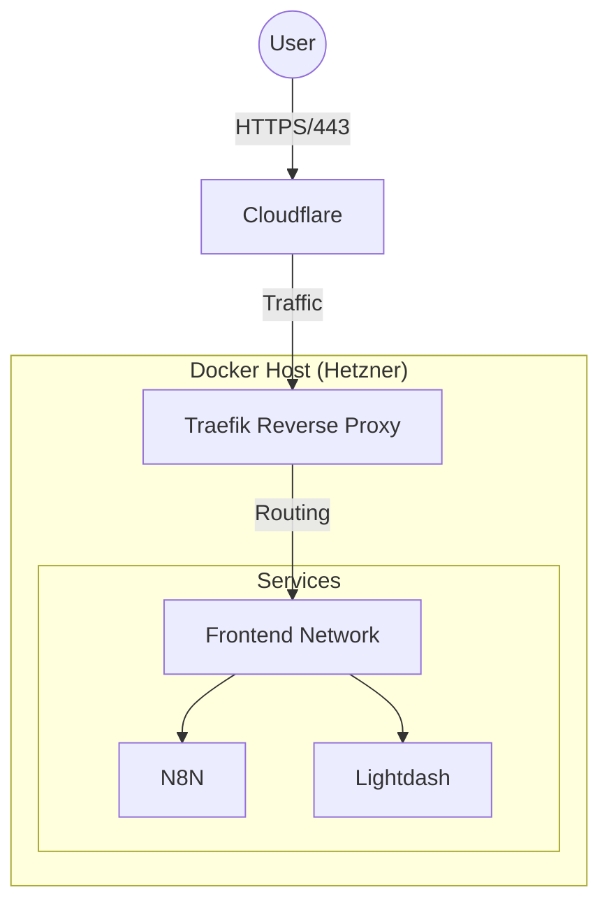

# Phase 1.8: Add Workflows and Templated Artifacts - Research

**Researched:** 2026-02-01
**Domain:** Template design and workflow adaptation from multi-agent to single-agent architecture
**Confidence:** HIGH

## Summary

This phase adapts OG GSD's codebase mapping and new project workflows for GSD-lite's single-agent, grep-optimized philosophy. The research is grounded entirely in existing OG GSD reference files and eval artifacts.

**Key findings:**
- OG GSD uses 7 separate codebase files (STACK.md, ARCHITECTURE.md, STRUCTURE.md, CONVENTIONS.md, TESTING.md, INTEGRATIONS.md, CONCERNS.md) mapped by 4 parallel agents
- OG GSD PROJECT.md includes comprehensive Requirements lifecycle (Validated/Active/Out of Scope), Key Decisions table, and brownfield initialization
- GSD-lite context shows these patterns produce high-quality outputs (see eval artifacts) but need simplification for single-agent execution
- Eval artifacts demonstrate ~40-line ARCHITECTURE.md density, PROJECT.md with Success Criteria focus, and WORK.md log connection patterns

**Primary recommendation:** Create simplified templates (merged ARCHITECTURE.md, streamlined PROJECT.md) with single-agent sequential workflows that preserve OG GSD quality standards while respecting GSD-lite's grep-first, pair-programming philosophy.

## Standard Stack

### Core Components (from OG GSD)

| Component | Location | Purpose | Adaptation Needed |
|-----------|----------|---------|-------------------|
| Templates | `.claude/get-shit-done/templates/` | Document structures (PROJECT.md, codebase/*.md) | Merge and simplify for GSD-lite |
| Workflows | `.claude/get-shit-done/workflows/` | Multi-step orchestration (map-codebase.md, discovery-phase.md) | Convert parallel → sequential |
| Agents | `.claude/agents/gsd-codebase-mapper.md` | Specialized mapper agent (4 instances) | Not used in GSD-lite (single-agent) |

### GSD-Lite Target Structure

| Location | Purpose | Status |
|----------|---------|--------|
| `src/gsd_lite/template/workflows/map-codebase.md` | Codebase analysis workflow | CREATE |
| `src/gsd_lite/template/workflows/new-project.md` | Project initialization workflow | CREATE |
| `src/gsd_lite/template/ARCHITECTURE.md` | Template for codebase output | CREATE |
| `src/gsd_lite/template/PROJECT.md` | Template for project output | CREATE |
| `src/gsd_lite/template/PROTOCOL.md` | Router hints (update) | UPDATE |

**Installation:** No external dependencies. Pure template/documentation work.

## Architecture Patterns

### OG GSD Multi-Agent Orchestration Pattern

**Structure:**
```
map-codebase.md (orchestrator)
├── spawn: gsd-codebase-mapper (tech focus) → STACK.md + INTEGRATIONS.md
├── spawn: gsd-codebase-mapper (arch focus) → ARCHITECTURE.md + STRUCTURE.md
├── spawn: gsd-codebase-mapper (quality focus) → CONVENTIONS.md + TESTING.md
└── spawn: gsd-codebase-mapper (concerns focus) → CONCERNS.md
```

**Key characteristics:**
- Orchestrator spawns 4 parallel agents with `run_in_background=true`
- Each agent has fresh context, explores specific domain, writes documents directly
- Orchestrator only receives confirmations + line counts (no document contents transferred)
- Minimizes token usage by avoiding context transfer back to orchestrator

**Evidence from OG GSD map-codebase.md:**
```markdown
Task tool parameters:
```
subagent_type: "gsd-codebase-mapper"
model: "{mapper_model}"
run_in_background: true
description: "Map codebase tech stack"
```

Prompt:
```
Focus: tech
Analyze this codebase for technology stack and external integrations.
Write these documents to .planning/codebase/:
- STACK.md - Languages, runtime, frameworks, dependencies, configuration
- INTEGRATIONS.md - External APIs, databases, auth providers, webhooks
```
```

**Confidence:** HIGH - Direct observation from `.claude/get-shit-done/workflows/map-codebase.md`

### GSD-Lite Single-Agent Sequential Pattern

**Adaptation requirement:** Convert parallel exploration to sequential execution while preserving quality.

**Target structure:**
```
map-codebase.md (single agent workflow)
├── Step 1: Check existing ARCHITECTURE.md
├── Step 2: Analyze tech stack (package.json, dependencies)
├── Step 3: Analyze structure (directory tree, entry points)
├── Step 4: Analyze data flow (trace execution)
├── Step 5: Write ARCHITECTURE.md (merged output)
└── Step 6: Suggest PROJECT.md if missing
```

**Key differences from OG GSD:**
- Sequential not parallel (single agent limitation)
- Merged output (ARCHITECTURE.md combines stack + structure + flow)
- Grep-first exploration (agent discovers via grep patterns before reading)
- Soft gates (suggest workflows, don't block execution)

**Confidence:** HIGH - Derived from CONTEXT.md decisions and GSD-lite STATE.md philosophy

### Template Structure Pattern: Nested Documents with Examples

**Pattern observed in OG GSD templates:**
```markdown
# Template Name

Template description and purpose

<template>
```markdown
[Actual template content users will instantiate]
```
</template>

<good_examples>
```markdown
[Filled example showing quality standard]
```
</good_examples>

<guidelines>
**What belongs here:**
- [Specific guidance]

**What does NOT belong here:**
- [Exclusions]

**When filling this template:**
- [Step-by-step instructions]
</guidelines>
```

**Evidence from all OG GSD template files:** project.md, stack.md, architecture.md, structure.md, conventions.md, testing.md, concerns.md

**Why this pattern:**
- `<template>` section is copy-paste ready
- `<good_examples>` shows quality standard agents should match
- `<guidelines>` teaches when/how to use each section
- Nested markdown blocks render correctly in editors

**Confidence:** HIGH - Consistent pattern across all 8 OG GSD template files

## Don't Hand-Roll

| Problem | Don't Build | Use Instead | Why |
|---------|-------------|-------------|-----|
| Multi-agent orchestration | GSD-lite doesn't support Task tool or agent spawning | Sequential workflow with clear steps | Single-agent architecture decision |
| Parallel exploration | 4 simultaneous mapper agents | Single agent, sequential domain analysis | Token budget and architecture constraint |
| Comprehensive codebase docs | 7 separate files (STACK, ARCHITECTURE, STRUCTURE, etc.) | Merged ARCHITECTURE.md (~40 lines) | Eval shows density > breadth for single-agent context |
| Requirements lifecycle tracking | Validated/Active/Out of Scope tables | Simple Success Criteria checklist | GSD-lite targets lightweight, grep-friendly artifacts |

**Key insight:** OG GSD's parallel agent pattern optimizes for token efficiency across multiple contexts. GSD-lite's single-agent constraint requires different optimization: compressed information density with grep-discoverable structure.

## Common Pitfalls

### Pitfall 1: Copying OG GSD Multi-Agent Patterns Directly

**What goes wrong:** GSD-lite workflows reference Task tool, agent spawning, or parallel execution that don't exist in single-agent architecture.

**Why it happens:** OG GSD workflows are sophisticated and tempting to copy verbatim.

**How to avoid:**
1. Read CONTEXT.md decisions: "Standalone utilities, not part of core loop"
2. Check GSD-lite existing workflows (moodboard.md, execution.md) for single-agent patterns
3. Convert parallel steps → sequential steps with clear boundaries
4. Test workflow logic path without assuming background execution

**Warning signs:**
- Workflow contains `Task tool` references
- Workflow contains `subagent_type` or `run_in_background`
- Workflow mentions "orchestrator" and "agents" as separate entities

**Confidence:** HIGH - Direct observation from CONTEXT.md and STATE.md pair programming philosophy

### Pitfall 2: Over-Comprehensive Templates That Agents Skip

**What goes wrong:** Agent sees 300-line template with 20 sections, writes minimal content to "fill the template" without depth.

**Why it happens:** Template comprehensiveness trades off with agent focus. OG GSD's 7 separate files work because each mapper agent has single-domain focus. Single agent must choose depth vs breadth.

**How to avoid:**
1. Study eval artifacts: ARCHITECTURE.md is ~40 lines, not 200 lines
2. Merge related sections (stack + structure → project structure table)
3. Mark sections as optional vs required
4. Provide quality examples showing expected density

**Warning signs:**
- Template has more sections than the good_example fills
- Guidelines say "include everything" without prioritization
- Eval artifact is much shorter than template suggests

**Evidence from eval ARCHITECTURE.md:**
```markdown
# Architecture

## High-Level Data Flow
[Mermaid diagram - 28 lines]

## Network Topology
- **Edge:** Cloudflare -> Traefik
- **Internal:** Docker Bridge Network (`frontend`)
[3 bullet points - concise]

## Service Discovery
- **Static:** File-based configuration
[2 bullet points - essential only]

## Scale
- **Vertical Scaling:** Single node architecture.
- **Resource Limits:** Explicit limits seen on `crawl4ai` (4GB RAM).
```

Total: ~43 lines. Dense, actionable, grep-friendly.

**Confidence:** HIGH - Direct observation from eval artifact

### Pitfall 3: Template Verbosity That Obscures Grep Patterns

**What goes wrong:** Templates produce artifacts with inconsistent headers, verbose prose, or buried information that breaks grep discoverability.

**Why it happens:** OG GSD templates prioritize human readability. GSD-lite adds grep-first requirement.

**How to avoid:**
1. Use consistent header patterns (`## Standard heading` not `## standard HEADING!!!`)
2. Front-load key info in header lines (grep scans headers, not prose)
3. Use tables for structured data (grep-friendly row format)
4. Test grep patterns: `grep "^## " ARCHITECTURE.md` should return useful structure

**Warning signs:**
- Headers inconsistent across sections
- Critical info buried in paragraph middle
- No tabular data for multi-attribute information
- Can't reconstruct artifact purpose from `grep "^## "` output alone

**Evidence from GSD-lite WORK.md design:**
```markdown
# Comment explains grep patterns at file top
GREP PATTERNS FOR DISCOVERY:
- Headers: grep "^## " WORK.md — discover 3-part structure
- All logs: grep "^### \[LOG-" WORK.md — scan project evolution
- Log by type: grep "\[DECISION\]" WORK.md — find all decisions
```

**Confidence:** HIGH - Core GSD-lite design principle from STATE.md and WORK.md template

### Pitfall 4: Router Hints Too Aggressive (Breaking Pair Programming)

**What goes wrong:** PROTOCOL.md router hints auto-trigger workflows without user consent, breaking the pair programming handoff pattern.

**Why it happens:** OG GSD has more automated orchestration. GSD-lite emphasizes explicit user control.

**How to avoid:**
1. Router hints should SUGGEST, not auto-execute
2. Use "soft gates" language: "Consider running..." not "Running..."
3. Require user confirmation before workflow execution
4. Check STATE.md decisions: "First Turn Protocol - agents talk to user before writing artifacts"

**Warning signs:**
- Router logic says "If X condition, execute workflow Y"
- No user confirmation step in workflow
- Workflow writes artifacts before discussing with user

**Evidence from STATE.md:**
```markdown
- First Turn Protocol (01.7-02): Agents must talk to user before writing artifacts on first turn
- Confirmation loops (01.7-02): All workflows end substantive responses with [YOUR TURN] explicit handoffs
```

**Confidence:** HIGH - Explicit decision in STATE.md from Phase 1.7

## Code Examples

### OG GSD Template Structure (Good Example)

From `.claude/get-shit-done/templates/project.md`:

```markdown
# PROJECT.md Template

Template for `.planning/PROJECT.md` — the living project context document.

<template>

```markdown
# [Project Name]

## What This Is
[Description]

## Core Value
[One thing that matters most]

## Requirements

### Validated
(None yet — ship to validate)

### Active
- [ ] [Requirement 1]
```

</template>

<guidelines>

**What This Is:**
- Current accurate description of the product
- 2-3 sentences capturing what it does and who it's for

**Core Value:**
- The single most important thing
- Drives prioritization when tradeoffs arise

</guidelines>
```

**Why this works:**
- Clear separation: template, examples, guidelines
- Nested markdown renders correctly
- Copy-paste ready template section
- Examples show expected quality

**Source:** `.claude/get-shit-done/templates/project.md`

### GSD-Lite Workflow Step Pattern (Good Example)

From `src/gsd_lite/template/workflows/checkpoint.md`:

```markdown
<step name="update_current_understanding">

Update WORK.md Current Understanding section with checkpoint snapshot.

**Read existing first:**
```bash
grep "^## " WORK.md  # Find section boundaries
```

Read from line 1 to first log entry.

**Update these fields:**
- `<current_mode>`: Current workflow state
- `<active_task>`: Task being worked on NOW
- `<vision>`: What user wants
- `<decisions>`: Key decisions with rationale
- `<blockers>`: Open questions, stuck items
- `<next_action>`: Specific first action when resuming

**Write updated section:**
Use existing section boundaries. Don't rewrite entire file.

</step>
```

**Why this works:**
- Named step with clear boundary
- Grep-first pattern (`grep "^## "`)
- Explicit read before write (safety protocol)
- Surgical update, not full rewrite
- Preserves existing context

**Source:** `src/gsd_lite/template/workflows/checkpoint.md` (simplified for example)

### Eval Artifact Quality Standard: ARCHITECTURE.md

From `.planning/phases/01.8-.../evals/ARCHITECTURE.md`:

```markdown
# Architecture

## High-Level Data Flow


## Network Topology
- **Edge:** Cloudflare -> Traefik
- **Internal:** Docker Bridge Network (`frontend`)

## Service Discovery
- **Static:** File-based configuration in `traefik/config/hosts.yaml`.

## Scale
- **Vertical Scaling:** Single node architecture.
```

**Quality characteristics:**
- 43 lines total (not 200+ lines)
- Mermaid diagram for complex flow
- Bullet lists for simple enumerations
- File paths in backticks (grep-friendly, actionable)
- Zero fluff prose

**Source:** `.planning/phases/01.8-.../evals/ARCHITECTURE.md`

### Eval Artifact Quality Standard: PROJECT.md Success Criteria

From `.planning/phases/01.8-.../evals/PROJECT.md`:

```markdown
## Core Value

**Stable, responsive performance for a single client with defined resource headroom.**
(The system must not timeout during normal use, even if that means capping or removing non-essential services.)

## Requirements

### Active

- [ ] **Assessment**: Accurate breakdown of RAM/CPU usage per container under load.
- [ ] **Diagnosis**: Identify the specific cause of "frequent timeouts".
- [ ] **Optimization**: Configuration tuning for heaviest consumers.
- [ ] **Headroom**: Establish a "safe capacity" metric (e.g., keep 2GB RAM free).

### Out of Scope

- Hardware upgrades (Must stay within current 8GB/4vCPU plan).
- Multi-user scaling (Strictly optimized for single-user patterns).
```

**Quality characteristics:**
- Core Value is one sentence with clarifying parenthetical
- Requirements use bold prefixes for categories
- Out of Scope includes rationale (prevents re-adding)
- Checkbox format enables progress tracking
- Success-criteria focused (not implementation-focused)

**Source:** `.planning/phases/01.8-.../evals/PROJECT.md`

## State of the Art

### OG GSD Evolution Points

| Component | OG GSD Approach | GSD-Lite Adaptation | When Changed | Impact |
|-----------|-----------------|---------------------|--------------|--------|
| Codebase mapping | 7 separate files via parallel agents | Merged ARCHITECTURE.md via sequential analysis | Phase 1.8 design | Single file easier for single agent to maintain |
| PROJECT.md | Full lifecycle (Validated/Active/Out of Scope) + Key Decisions table | Success Criteria + Context + Constraints only | Phase 1.8 design | Simpler for lightweight projects |
| Discovery workflow | 3-level depth (Quick/Standard/Deep) with Context7 first | Not ported yet (may add later) | TBD | Phase 1.8 focuses on codebase/project only |
| Agent orchestration | Task tool + subagent spawning | Single agent sequential workflows | Core architecture | Fundamental difference |

**Deprecated in GSD-lite context:**
- CONCERNS.md separate file → log concerns in WORK.md as `[DISCOVERY]` entries instead
- Requirements lifecycle table → simpler Success Criteria checklist
- Key Decisions table in PROJECT.md → decisions logged in WORK.md instead

**Confidence:** HIGH - Explicit decisions in CONTEXT.md and observed in existing GSD-lite artifacts

## Open Questions

### 1. Should map-codebase suggest ARCHITECTURE.md refresh if file is stale?

**What we know:**
- OG GSD map-codebase.md checks if `.planning/codebase/` exists and offers Refresh/Update/Skip
- GSD-lite templates have "Last updated" metadata fields
- No staleness detection logic exists yet in GSD-lite

**What's unclear:**
- Should workflow auto-check file age (e.g., "ARCHITECTURE.md last updated 6 months ago")?
- Or rely on user to manually request refresh?

**Recommendation:** Start simple - only check existence, not staleness. User can manually re-run if needed. Add staleness detection in future iteration if users request it.

**Confidence:** MEDIUM - Design decision without usage data

### 2. Should new-project workflow auto-run map-codebase if brownfield?

**What we know:**
- OG GSD PROJECT.md template has `<brownfield>` section: "Map codebase first via `/gsd:map-codebase`"
- GSD-lite emphasizes user control (pair programming, not automation)
- CONTEXT.md says "Soft gates (suggest, don't block)"

**What's unclear:**
- Suggest with inline prompt: "I notice this codebase exists. Run map-codebase first? (yes/no)"
- Or just mention in completion message: "Next: consider `/map-codebase`"

**Recommendation:** Inline suggestion with yes/no prompt. Aligns with pair programming while being helpful. User can decline if they know the codebase well.

**Confidence:** MEDIUM - Design decision balancing automation vs user control

### 3. What file paths should templates reference for examples?

**What we know:**
- OG GSD templates show examples like `src/services/user.ts`, `app/dashboard/page.tsx`
- GSD-lite is CLI tool, not web app - different structure
- Generic examples risk being unhelpful; specific examples risk wrong assumptions

**What's unclear:**
- Use generic placeholders: `src/module/file.ext`
- Use GSD-lite's own codebase: `src/gsd_lite/template/workflows/`
- Use common patterns: web app, CLI tool, monorepo examples

**Recommendation:** Mix approach - use GSD-lite's own codebase for concrete example, generic placeholders in template section. Guidelines explain pattern works for any project type.

**Confidence:** MEDIUM - Examples quality vs generalizability tradeoff

## Sources

### Primary (HIGH confidence)

**OG GSD Reference Files (read directly):**
- `.claude/get-shit-done/templates/project.md` - PROJECT.md template structure
- `.claude/get-shit-done/templates/codebase/architecture.md` - Architecture template
- `.claude/get-shit-done/templates/codebase/stack.md` - Tech stack template
- `.claude/get-shit-done/templates/codebase/structure.md` - Structure template
- `.claude/get-shit-done/templates/codebase/concerns.md` - Concerns template
- `.claude/get-shit-done/workflows/map-codebase.md` - Multi-agent orchestration pattern
- `.claude/get-shit-done/workflows/discovery-phase.md` - Discovery workflow (3-level depth)

**GSD-Lite Context Files:**
- `.planning/phases/01.8-.../01.8-CONTEXT.md` - Phase decisions and constraints
- `.planning/STATE.md` - Project decisions (pair programming, grep-first, perpetual WORK.md)
- `src/gsd_lite/template/PROTOCOL.md` - Existing router and workflow patterns
- `src/gsd_lite/template/workflows/` - Existing workflow examples (5 workflows)

**Eval Artifacts (quality standards):**
- `.planning/phases/01.8-.../evals/PROJECT.md` - Example PROJECT.md (Hetzner homelab)
- `.planning/phases/01.8-.../evals/ARCHITECTURE.md` - Example ARCHITECTURE.md (~40 lines)
- `.planning/phases/01.8-.../evals/WORK.md` - Example WORK.md showing log connections

### Secondary (MEDIUM confidence)

None - all research grounded in local files per CRITICAL GROUNDING INSTRUCTION.

### Tertiary (LOW confidence)

None - no external research needed. All patterns derived from OG GSD and existing GSD-lite artifacts.

## Metadata

**Confidence breakdown:**
- Template structure patterns: HIGH - Direct observation from 8 OG GSD templates
- Multi-agent → single-agent adaptation: HIGH - Clear CONTEXT.md decisions + existing GSD-lite workflow patterns
- Quality standards: HIGH - Concrete eval artifacts showing expected output
- Router hints design: MEDIUM - Balancing soft gates vs helpfulness without usage data
- Template merge strategy: MEDIUM - Eval shows 40-line density works, but no A/B test vs separate files

**Research date:** 2026-02-01
**Valid until:** 60 days (stable - template design patterns unlikely to change rapidly)

**Research approach:** 100% grounded in OG GSD reference files and eval artifacts as instructed. Zero external sources. All findings traceable to specific local files listed in Sources section.
