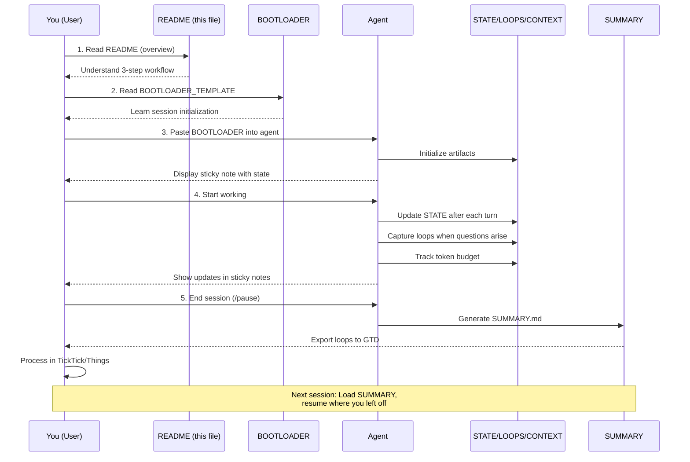
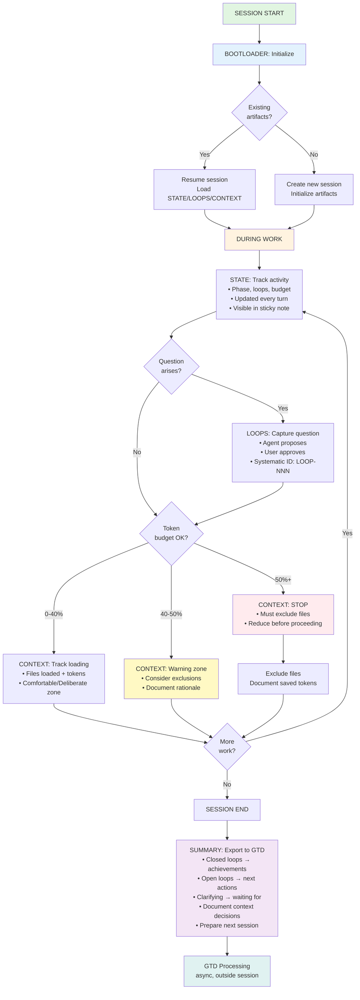

# Data Engineering Copilot Templates

**Purpose**: File-based protocol and heavily-commented templates for using AI copilots in data engineering workflows. Maintain ownership of reasoning while leveraging AI assistance - works with any agent (Claude, ChatGPT, Gemini, Cursor) via MCP or copy-paste.

## Getting Started

### For First-Time Users

If you're new to this system, follow this sequence:



**Time to competence:** 30 minutes (read README → test session → export SUMMARY)

### Fastest Start (One-Liner Trigger)

**For immediate activation** → Copy `INIT_PROMPT.md` and paste into any LLM

This concise initialization prompt (120 lines) activates gsd-lite protocol immediately:
- Agent adopts sticky note format
- Agent initializes session artifacts (STATE/LOOPS/CONTEXT)
- Agent follows protocol from first response
- Full documentation linked for reference

**Use when:** You want instant activation without reading 300+ lines of documentation.

### Quick Start

**Step 1: Start Session** → Copy `INIT_PROMPT.md` (fastest) or `BOOTLOADER_TEMPLATE.md` (detailed)
- Paste template into agent at session start
- Agent initializes artifacts (STATE.md, LOOPS.md, CONTEXT.md)
- Protocol enforcement activates (sticky notes, checkpoints, action menus)

**Step 2: Work with Protocol** → Use LOOPS/CONTEXT/STATE during session
- Agent updates STATE.md after every turn (tracks current activity)
- Agent captures loops when questions arise (parking lot for non-linear reasoning)
- Agent manages CONTEXT.md when loading files (token budget tracking)

**Step 3: Export Session** → Generate `SUMMARY.md` at end
- Export closed loops → GTD achievements
- Export open loops → GTD next actions
- Document context decisions → learning library
- Prepare next session → eliminate 15-30 min reconstruction

### What to Read First

**Fastest path (start immediately):**
1. **INIT_PROMPT.md** - Paste into LLM, activate gsd-lite mode instantly
2. **Run a test session** - Experience protocol in action
3. **BOOTLOADER_TEMPLATE.md** (optional) - Read for full protocol details

**Learning path (understand first):**
1. **This README** (you are here) - Get overview and workflow understanding
2. **BOOTLOADER_TEMPLATE.md** - Learn how to initialize sessions and protocol
3. **Run a test session** - Experience sticky notes, loop capture, token budget tracking
4. **SUMMARY_TEMPLATE.md** - Learn how to export and integrate with GTD
5. **Generate your first SUMMARY** - Complete the cycle

**Reading order for resuming work:**
1. **Last session's SUMMARY.md** - "Next Session Prep" section tells you what to load
2. **Paste INIT_PROMPT** (fast) or **BOOTLOADER** (detailed) - Start new session with context from SUMMARY
3. **Import loops from GTD** - Bring back clarified loops
4. **Resume where you left off** - No 15-30 min reconstruction needed

## Template Index

### INIT_PROMPT.md
**Purpose**: Concise one-liner trigger for immediate gsd-lite activation

**When to use**: When you want instant activation without reading full documentation

**What it does**:
- Activates gsd-lite protocol in ~120 lines (vs 356 in BOOTLOADER)
- Embeds core behaviors (sticky notes, loop capture, artifact updates)
- Provides initialization steps (check existing → create/resume session)
- Links to full templates for detailed reference

**Key sections**:
- Core protocol summary (sticky note format)
- Session artifacts overview (STATE/LOOPS/CONTEXT)
- Initialization steps (3-step quick start)
- Key behaviors (loop capture, token budget, checkpoints, systematic IDs)

**Read this when**: You want to feed a concise prompt to an LLM and have it immediately adopt gsd-lite behavior. Full details available in BOOTLOADER_TEMPLATE.md.

---

### BOOTLOADER_TEMPLATE.md
**Purpose**: Session initialization and protocol enforcement (comprehensive version)

**When to use**: Start of every new session

**What it does**:
- Initializes session artifacts (STATE, LOOPS, CONTEXT)
- Embeds protocol enforcement via sticky note template
- Provides recovery mechanism if agent drifts from protocol
- Works with both MCP (file access) and copy-paste workflows

**Key sections**:
- Session initialization protocol (resume existing or start fresh)
- Sticky note template (end-of-turn protocol reminder)
- Protocol checklist (artifact updates, loop capture, checkpoints)
- Example session (3-turn workflow showing sticky notes)

**Read this when**: You're starting a new session and need to understand how to activate the protocol.

---

### LOOPS_TEMPLATE.md
**Purpose**: Open questions and parking lot management

**When to use**:
- When a question arises that's not immediately answerable
- When an idea needs capture but interrupts current focus
- When non-linear reasoning needs structure in linear chat

**What it does**:
- Defines loop capture format (XML structure with status)
- Tracks loop lifecycle (open → clarifying → closed)
- Provides systematic ID coding (LOOP-NNN format)
- Exports to GTD for async processing

**Key sections**:
- Loop status definitions (open/clarifying/closed)
- Capture workflow (agent proposes, user approves)
- ID format specification (globally unique across sessions)
- GTD export mapping (status → next action type)

**Read this when**: Agent proposes a loop and you need to understand the format and workflow.

**Note**: As of 2026-01-21, this template has not been created yet. It's referenced by BOOTLOADER but will be built in a future plan (01-01 or earlier). When it exists, it will follow the patterns established in BOOTLOADER and SUMMARY.

---

### CONTEXT_TEMPLATE.md
**Purpose**: Token budget management and context optimization

**When to use**:
- When loading files into session context
- When context budget approaches warning threshold (40%+)
- When deciding what to exclude from scope
- When documenting context decisions for future reference

**What it does**:
- Tracks token budget (total, used, remaining, percentage)
- Documents what's loaded with token counts per file
- Documents what's excluded with rationale
- Defines budget phases (comfortable/deliberate/warning/stop)

**Key sections**:
- Token budget thresholds (20/40/50% phases)
- Context loaded tracking (file paths + token counts)
- Context excluded tracking (patterns + rationale)
- Context scoping patterns (dbt lineage, debugging, refactoring)

**Read this when**: You're approaching budget limits or need to decide what files to load.

**Note**: As of 2026-01-21, this template has not been created yet. It's referenced by BOOTLOADER but will be built in a future plan (01-01 or earlier). When it exists, it will define conservative thresholds (20/40/50%) adapted from GSD patterns for data engineering workflows.

---

### STATE_TEMPLATE.md
**Purpose**: Session working memory and current activity tracking

**When to use**: Continuously updated throughout session (after every significant activity)

**What it does**:
- Tracks current phase/task/activity
- Maintains active loop count and IDs
- Shows token budget status
- Provides session continuity (where am I, what's next)

**Key sections**:
- Current position (phase, task, activity)
- Active loops (count and IDs)
- Token budget snapshot
- Last activity timestamp
- Next action

**Read this when**: You need to see current session state or agent needs to update status after completing work.

**Note**: As of 2026-01-21, this template has not been created yet. It's referenced by BOOTLOADER but will be built in a future plan (01-01 or earlier). When it exists, it will define the structure updated by agents in sticky note protocol.

---

### SUMMARY_TEMPLATE.md
**Purpose**: Session export for GTD integration and learning capture

**When to use**: End of session, before closing

**What it does**:
- Exports loops to GTD (closed → achievements, open → next actions, clarifying → waiting for)
- Documents context decisions (what loaded/excluded, why, patterns discovered)
- Captures session metadata (duration, token budget peak, deliverables)
- Prepares next session (what to load, where to resume)

**Key sections**:
- Session metadata (date, duration, phase, budget peak)
- Loops captured (closed/open/clarifying with outcomes)
- Context decisions (loaded/excluded with rationale)
- GTD export format (how to process loops in TickTick/Things)
- Learning capture (patterns, mistakes avoided)
- Next session prep (eliminates 15-30 min reconstruction)

**Read this when**: Session is ending and you need to export working memory to your GTD system.

---

## Workflow Diagram

Visual representation of how templates interact during a session:



## File Locations

### Templates (Read-only reference)
**Location**: `.gsd-lite/templates/`

**Purpose**: Reference templates you copy/adapt for sessions

**Files**:
- `INIT_PROMPT.md` - Quick activation (one-liner trigger)
- `BOOTLOADER_TEMPLATE.md` - Session initialization (comprehensive)
- `LOOPS_TEMPLATE.md` - Loop capture format
- `CONTEXT_TEMPLATE.md` - Token budget tracking
- `STATE_TEMPLATE.md` - Working memory structure
- `SUMMARY_TEMPLATE.md` - Session export format
- `PROTOCOL_REFERENCE.md` - Quick reference for all patterns
- `README.md` - This file

**Do NOT edit**: Templates are reference materials. Editing them changes the pattern for future sessions.

### Session Artifacts (Working files)
**Location**: `.project/sessions/YYYY-MM-DD-description/`

**Purpose**: Ephemeral working memory for active session

**Files** (created during session):
- `STATE.md` - Current phase, loops, budget, activity
- `LOOPS.md` - Captured loops with status
- `CONTEXT.md` - Files loaded/excluded, token budget
- `SUMMARY.md` - Session export (created at end)

**Do edit**: These are your working files. Agent updates them throughout session.

**Lifecycle**: Created at session start → updated during work → exported to SUMMARY → archived (or deleted) when no longer needed

### Project Context (Stable reference)
**Location**: `.gsd-lite/`

**Purpose**: Stable project context that persists across sessions

**Files**:
- `PROJECT.md` - North star goals, key decisions
- `ROADMAP.md` - Phase breakdown, milestone tracking
- `STATE.md` - Project-level state (different from session STATE.md)

**Loaded**: At session start via BOOTLOADER

## Phase Context

**Current phase**: Phase 1 - Foundation & Templates

**What Phase 1 delivers**:
- File-based protocol that works across all agent types (MCP + copy-paste)
- Heavily-commented templates that teach GSD mechanics through use
- Core templates: INIT_PROMPT (quick activation), BOOTLOADER (comprehensive), LOOPS, CONTEXT, STATE, SUMMARY
- Protocol documentation (PROTOCOL_REFERENCE) and session workflow (README)

**What's NOT in Phase 1** (coming later):
- **Phase 2**: Session handoff system (pause/resume across days, continuity between sessions)
- **Phase 3**: Context engineering patterns (dbt lineage scoping, token optimization strategies)
- **Phase 4**: Educational integration (teaching materials, validation on real work)

**Status**: As of 2026-01-21, Phase 1 is in progress. BOOTLOADER and SUMMARY templates complete. LOOPS, CONTEXT, and STATE templates pending (to be created in earlier plans of Phase 1).

## Educational Philosophy

**Learn by doing**: Templates include inline educational comments explaining:
- **GSD mechanics**: Why artifacts exist, how protocol works, why sticky notes prevent drift
- **Data engineering patterns**: Token budget for lineage vs debugging, context scoping strategies, loop capture workflows

**Vendor agnostic**: Protocol works with any agent via:
- **MCP** (Model Context Protocol): Direct file access for Claude Desktop, Claude Code, Cursor
- **Copy-paste**: Manual file sharing for ChatGPT web, Gemini web, any agent without file tools

**Self-documenting**: Every template explains:
- **What**: What this template does
- **Why**: Why it matters, what problem it solves
- **When**: When to use it during workflow
- **How**: Detailed sections showing structure and usage

**Ownership maintained**: You stay the author who understands "why" behind every decision:
- Agent proposes loops → you approve (key reasoning stays with you)
- Context decisions documented → you learn what scoping works
- Checkpoints explicit → you verify before proceeding

## What to Read First

**If you want to start immediately (fastest path):**
1. Copy INIT_PROMPT.md → paste into any LLM
2. Agent activates gsd-lite mode and starts session
3. Experience sticky notes, loop capture, token budget tracking
4. Generate a SUMMARY at end of test session
5. Read BOOTLOADER_TEMPLATE.md for full protocol details (optional)

**If you want to understand first (learning path):**
1. Read this README (you are here)
2. Read BOOTLOADER_TEMPLATE.md (understand session initialization and protocol)
3. Start a test session with BOOTLOADER
4. Experience sticky notes, loop capture, token budget tracking
5. Read SUMMARY_TEMPLATE.md (understand session export)
6. Generate a SUMMARY at end of test session
7. Process SUMMARY loops into your GTD system

**If you're resuming existing work:**
1. Read last session's SUMMARY.md "Next Session Prep" section
2. Load specified context files
3. Start new session with BOOTLOADER
4. Import loops from GTD (if clarified since last session)
5. Resume where previous session stopped

**If you're teaching a colleague:**
1. Share this README (entry point and overview)
2. Walk through Quick Start 3-step workflow
3. Run test session together (live demo of protocol)
4. Review SUMMARY together (show GTD export, context decisions)
5. 30-minute onboarding target (do + understand)

## Common Questions

### Do I need MCP to use these templates?

**No.** Templates work with copy-paste workflows (ChatGPT web, Gemini web, any agent without file access). MCP just makes it smoother - agent reads/writes files directly instead of asking you to paste contents.

### Do sticky notes create too much visual noise?

**Maybe.** User testing pending (LOOP-003 from Phase 1 testing). Current approach: Include sticky note only when artifact updated or actions changed. Skip if nothing changed (avoid fatigue). Phase 2 will gather feedback.

### Can I use these templates for non-data-engineering work?

**Yes, with adaptation.** Core protocol (sticky notes, loop capture, token budget, session export) applies to any domain. Data engineering examples (dbt lineage, test debugging) would need replacement with your domain patterns.

### What if agent stops following protocol mid-session?

**Recovery mechanism:** Type "update artifacts" or "protocol check". Agent reads STATE.md, shows current state in sticky note format, resumes protocol compliance. Alternatively, export session state and start fresh session (GSD pattern: fresh context window resets attention).

### How do I know if I'm within token budget?

**Agent tracks in CONTEXT.md** and shows in sticky note. Budget phases:
- **0-20%**: Comfortable - explore freely
- **20-40%**: Deliberate - start tracking what's loaded
- **40-50%**: Warning - consider excluding files
- **50%+**: STOP - must scope down before proceeding

Conservative thresholds prevent context overload.

### What's the difference between session STATE.md and project STATE.md?

**Session STATE.md** (`.project/sessions/YYYY-MM-DD-description/STATE.md`):
- Ephemeral working memory for active session
- Tracks: current activity, loops, token budget
- Lifecycle: Created at session start → updated during work → exported to SUMMARY → archived

**Project STATE.md** (`.gsd-lite/STATE.md`):
- Stable project-level state across sessions
- Tracks: current phase, plan progress, accumulated decisions
- Lifecycle: Persists across all sessions, updated at phase/plan boundaries

Different purposes, different lifecycles.

## Contributing Patterns

As you use these templates, you'll discover patterns worth capturing:

**Context scoping patterns**:
- "When doing X task, load Y context, exclude Z" (e.g., "When building docs, exclude code and tests")
- Capture in SUMMARY "Context Decisions" section
- Build pattern library over time

**Loop patterns**:
- Common question types that recur (e.g., "Clarify assumption about data model")
- Capture in SUMMARY "Learning" section
- Inform future template improvements

**Token budget patterns**:
- Different tasks have different context needs (debugging narrow, lineage wide)
- Document budget ranges per task type
- Refine thresholds based on experience

**Share back**: If you discover patterns worth generalizing, create issues or contribute to template improvements.

## Troubleshooting

### Agent doesn't include sticky notes

**Problem**: Agent stops including ```gsd-status blocks after a few turns

**Cause**: Protocol drift - context window pushed bootloader instructions out of attention

**Fix**: Type "update artifacts" to trigger protocol reset. Agent will resume sticky note compliance.

**Prevention**: Include sticky note every turn where artifact updated (maintains visibility)

---

### Token budget hits 80%+ unexpectedly

**Problem**: Context loaded rapidly, hit warning phase without realizing

**Cause**: Loaded files without tracking token counts, no budget awareness

**Fix**: Review CONTEXT.md, identify large files, exclude non-essential context

**Prevention**: Track budget as files load (agent should show in sticky note). Stop at 50% to review before continuing.

---

### Loops get lost in conversation

**Problem**: Question arose at turn 10, buried by turn 20, forgotten

**Cause**: Loop not captured - kept in chat only, no artifact

**Fix**: Search chat history for question, propose loop retroactively, capture in LOOPS.md

**Prevention**: Agent should propose loop immediately when question arises. User approves → artifact created → question preserved.

---

### Session reconstruction takes 15-30 minutes

**Problem**: Resuming after a few days requires re-reading full chat history

**Cause**: No SUMMARY created at end of previous session

**Fix**: Generate SUMMARY from previous session chat (extract loops, context decisions, state)

**Prevention**: Always generate SUMMARY before closing session. "Next Session Prep" section eliminates reconstruction.

---

### GTD system full of vague loop items

**Problem**: Loop says "Fix the thing" with no context

**Cause**: Loop captured without sufficient context in description

**Fix**: Review LOOPS.md, add context to each loop (what thing? why fix? what's the question?)

**Prevention**: Loop capture format includes `<context>` element. Agent should fill with enough detail for async processing.

---

## Next Steps

**For this Phase 1**:
- Complete remaining core templates (LOOPS, CONTEXT, STATE)
- Add protocol documentation (PROTOCOL_REFERENCE.md)
- Create AGENTS.md for cross-platform support
- Validate templates are clear and actionable (human verification)

**For Phase 2** (Session Handoff System):
- Session pause/resume mechanism
- Cross-session continuity patterns
- Loop import from GTD (clarified → back to session)
- Session chain tracking (what sessions built on each other)

**For Phase 3** (Context Engineering Patterns):
- dbt lineage scoping strategies (200+ model scenarios)
- Token optimization patterns (dbt-mp usage, slim manifests)
- Context progressive expansion (start narrow, grow deliberately)
- Domain-specific budget thresholds (debugging vs refactoring vs analysis)

**For Phase 4** (Educational Integration & Validation):
- 30-minute onboarding guide for colleagues
- Validation on real dbt refactoring work
- PR narrative generation (reasoning + proof + root cause)
- Pattern library (reusable context decisions, loop types, workflows)

---

**Last updated**: 2026-01-21
**Phase**: 1 - Foundation & Templates
**Status**: All templates complete (INIT_PROMPT, BOOTLOADER, LOOPS, CONTEXT, STATE, SUMMARY, PROTOCOL_REFERENCE, README)
