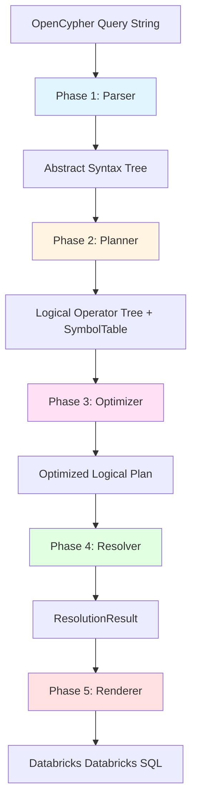

# Contributing Guide

This guide covers architecture, development workflow, and contribution guidelines.

---

## Why Contribute?

### Rich Error Messages

One of the key features of this transpiler is its **developer-friendly error messages**. When something goes wrong, you get detailed context to quickly identify and fix the issue:

```
╔══════════════════════════════════════════════════════════════════════════════╗
║ ColumnResolutionError: Variable 'rels' is not defined                        ║
╚══════════════════════════════════════════════════════════════════════════════╝

━━━ Query ━━━━━━━━━━━━━━━━━━━━━━━━━━━━━━━━━━━━━━━━━━━━━━━━━━━━━━━━━━━━━━━━━━━━━━

    1 │ MATCH path = (root:Vertex)-[rels:REL*1..5]-(n:Vertex) WHERE root.node_id = '1234' RETURN rels
      │                             ▲
      │                             └── ERROR: Variable 'rels' is not defined
    2 │

━━━ Available Variables (Scope Level 0) ━━━━━━━━━━━━━━━━━━━━━━━━━━━━━━━━━━━━━━━━

  Name         Type      Data Type   Defined At              Properties
  ───────────────────────────────────────────────────────────────────────────
  root         entity   Vertex       MATCH (root:Vertex)      node_type, metadata, node_id
  path         path     PATH         MATCH path = ...         -
  n            entity   Vertex       MATCH (n:Vertex)         node_type, metadata, node_id

━━━ Suggestions ━━━━━━━━━━━━━━━━━━━━━━━━━━━━━━━━━━━━━━━━━━━━━━━━━━━━━━━━━━━━

  • Did you mean 'root'? (3 characters difference)

━━━ Hints ━━━━━━━━━━━━━━━━━━━━━━━━━━━━━━━━━━━━━━━━━━━━━━━━━━━━━━━━━━━━━━━━━

  💡 Make sure 'rels' is defined in a MATCH clause before use.
     Variables must be defined before they can be referenced in WHERE, WITH, or RETURN clauses.

━━━ Debug Information ━━━━━━━━━━━━━━━━━━━━━━━━━━━━━━━━━━━━━━━━━━━━━━━━━━━━━━━

  Operator:         ProjectionOperator (id=6)
  Resolution Phase: expression_resolution
  Symbol Table:
    Symbol Table Dump:
      Scope 0 (global):
        root: entity(Vertex) @ scope 0
        path: path(PATH) @ scope 0
        n: entity(Vertex) @ scope 0
```

Error messages include:
- **Visual pointer** to the exact error location in the query
- **Available variables** at that scope with their types and properties
- **Suggestions** for typos (using Levenshtein distance)
- **Hints** explaining why the error occurred
- **Debug info** for advanced troubleshooting

---

## Architecture Overview

### High-Level Dataflow



### Design Principle

Each phase has a **single responsibility** and **does not** perform the responsibilities of other phases:

1. **Parser**: Syntax only (what is valid Cypher?)
2. **Planner**: Semantics only (what does it mean logically?)
3. **Resolver**: Validation only (do all references exist?)
4. **Renderer**: Implementation only (how to generate SQL?)

This prevents:
- Parser from needing schema knowledge
- Planner from validating column references
- Renderer from making semantic decisions

---

## Phase Details

### Phase 1: Parser (Lexical/Syntactic Analysis)

**Location**: [src/gsql2rsql/parser/](https://github.com/devmessias/gsql2rsql/tree/main/python/src/gsql2rsql/parser/)

**Responsibility**: Convert OpenCypher query string to Abstract Syntax Tree (AST). Validates **syntax only** — does NOT validate semantics, resolve references, or access schema.

| File | Purpose |
|------|---------|
| [`opencypher_parser.py`](https://github.com/devmessias/gsql2rsql/tree/main/python/src/gsql2rsql/parser/opencypher_parser.py) | Main entry point, ANTLR runtime invocation |
| [`ast.py`](https://github.com/devmessias/gsql2rsql/tree/main/python/src/gsql2rsql/parser/ast.py) | AST node definitions (50+ node types) |
| [`visitor.py`](https://github.com/devmessias/gsql2rsql/tree/main/python/src/gsql2rsql/parser/visitor.py) | ANTLR visitor pattern implementation |
| [`operators.py`](https://github.com/devmessias/gsql2rsql/tree/main/python/src/gsql2rsql/parser/operators.py) | Operator enums (binary, aggregation, functions) |
| [`grammar/`](https://github.com/devmessias/gsql2rsql/tree/main/python/src/gsql2rsql/parser/grammar/) | ANTLR-generated parser/lexer |

**Does NOT**:

- ❌ Validate semantics
- ❌ Resolve references
- ❌ Access schema
- ❌ Perform type checking
- ❌ Validate property names

**Rules**:

- Parser MUST NOT import from `planner/`, `renderer/`, or `common/schema.py`
- Parser MUST NOT call graph schema provider
- Parser MUST only validate syntax (grammar rules)

### Phase 2: Planner (Logical Operator Construction)

**Location**: [src/gsql2rsql/planner/](https://github.com/devmessias/gsql2rsql/tree/main/python/src/gsql2rsql/planner/)

**Responsibility**: Convert AST to logical relational algebra. Builds symbol table tracking variable definitions and scopes. Does NOT resolve column references or validate property access.

| File | Purpose |
|------|---------|
| [`logical_plan.py`](https://github.com/devmessias/gsql2rsql/tree/main/python/src/gsql2rsql/planner/logical_plan.py) | Main orchestrator, AST → operator conversion |
| [`operators.py`](https://github.com/devmessias/gsql2rsql/tree/main/python/src/gsql2rsql/planner/operators.py) | Logical operator definitions (11 operator types) |
| [`symbol_table.py`](https://github.com/devmessias/gsql2rsql/tree/main/python/src/gsql2rsql/planner/symbol_table.py) | Variable tracking with nested scopes |
| [`path_analyzer.py`](https://github.com/devmessias/gsql2rsql/tree/main/python/src/gsql2rsql/planner/path_analyzer.py) | Variable-length path optimization |
| [`schema.py`](https://github.com/devmessias/gsql2rsql/tree/main/python/src/gsql2rsql/planner/schema.py) | Internal schema representation |
| [`subquery_optimizer.py`](https://github.com/devmessias/gsql2rsql/tree/main/python/src/gsql2rsql/planner/subquery_optimizer.py) | Conservative subquery flattening |

**Does NOT**:

- ❌ Resolve column references
- ❌ Validate property access
- ❌ Generate SQL
- ❌ Query database schema

**Rules**:

- Planner CAN import from `parser/` (uses AST)
- Planner CAN import from `common/schema.py` (uses GraphSchema)
- Planner MUST NOT import from `renderer/`
- Planner MUST NOT perform column resolution (that's Phase 4)

### Phase 3: Optimizer (Conservative Transformations)

**Location**: [src/gsql2rsql/planner/subquery_optimizer.py](https://github.com/devmessias/gsql2rsql/tree/main/python/src/gsql2rsql/planner/subquery_optimizer.py)

**Responsibility**: Apply **conservative** transformations to reduce SQL nesting. Only flattens patterns guaranteed to preserve semantics.

**Safe to Flatten:**
- ✅ Selection → Projection: `WHERE` can be pushed before `SELECT`
- ✅ Selection → Selection: Multiple `WHERE` clauses can be merged

**NEVER Flattened:**
- ❌ Projection → Projection: Aliases must stay in separate subqueries
- ❌ Anything involving aggregation boundaries: Aggregation semantics are fragile

**Configuration**: Enabled by default. Disable with `--no-optimize` CLI flag.

### Phase 4: Resolver (Column Reference Validation)

**Location**: [src/gsql2rsql/planner/column_resolver.py](https://github.com/devmessias/gsql2rsql/tree/main/python/src/gsql2rsql/planner/column_resolver.py)

**Responsibility**: Validate **ALL** column references before rendering. Query schema for entity properties. Build resolution context for SQL generation.

| File | Purpose |
|------|---------|
| [`column_resolver.py`](https://github.com/devmessias/gsql2rsql/tree/main/python/src/gsql2rsql/planner/column_resolver.py) | Main resolver implementation |
| [`column_ref.py`](https://github.com/devmessias/gsql2rsql/tree/main/python/src/gsql2rsql/planner/column_ref.py) | Resolved reference objects |

**Does NOT**:

- ❌ Generate SQL
- ❌ Modify logical plan structure
- ❌ Perform optimizations

**Rules**:

- Resolver CAN import from `parser/`, `planner/`, `common/`
- Resolver MUST NOT import from `renderer/`
- Resolver MUST validate ALL column refs before SQL generation
- Resolver MUST provide rich error messages with suggestions

### Phase 5: Renderer (SQL Generation)

**Location**: [src/gsql2rsql/renderer/sql_renderer.py](https://github.com/devmessias/gsql2rsql/tree/main/python/src/gsql2rsql/renderer/sql_renderer.py)

**Responsibility**: Generate Databricks Databricks SQL from logical plan using pre-resolved column references. Handle SQL dialect specifics.

| File | Purpose |
|------|---------|
| [`sql_renderer.py`](https://github.com/devmessias/gsql2rsql/tree/main/python/src/gsql2rsql/renderer/sql_renderer.py) | Main SQL code generator |
| [`schema_provider.py`](https://github.com/devmessias/gsql2rsql/tree/main/python/src/gsql2rsql/renderer/schema_provider.py) | Database schema provider interface |

**Does NOT**:

- ❌ Resolve columns
- ❌ Validate references
- ❌ Make semantic decisions

**Rules**:

- Renderer CAN import from all phases (uses everything)
- Renderer MUST use `ResolutionResult` for all column refs
- Renderer MUST NOT resolve columns itself
- Renderer MUST NOT perform semantic validation

---

## Quick Start for Contributors

### 1. Set Up Development Environment

#### Option A: Using Makefile (Recommended)

```bash
# Clone repository
git clone https://github.com/your-org/cyper2dsql.git
cd cyper2dsql/python

# Create virtual environment and install dev dependencies
make venv
source .venv/bin/activate  # On Windows: .venv\Scripts\activate
make install-dev
```

#### Option B: Using uv directly (if make is not available)

```bash
# Clone repository
git clone https://github.com/your-org/cyper2dsql.git
cd cyper2dsql/python

# Create virtual environment with uv
uv venv
source .venv/bin/activate  # On Windows: .venv\Scripts\activate

# Install dependencies (dev mode)
uv sync --extra dev
uv pip install -e ".[dev]"
```

### 2. Verify Installation

#### Using Makefile

```bash
make test-no-pyspark  # Run fast test suite (excludes PySpark)
make check            # Run linter + type checker
make cli-example      # Transpile example query
```

#### Using uv directly

```bash
uv run pytest tests/ -v --ignore=tests/test_examples_with_pyspark.py --ignore=tests/test_pyspark_basic.py
uv run ruff check src/ tests/
uv run pyright src/
echo "MATCH (p:Person)-[:KNOWS]->(f:Person) RETURN p.name, f.name" | uv run gsql2rsql transpile -s examples/schema.json
```

### Available Make Commands

Run `make help` to see all available commands:

| Command | Description |
|---------|-------------|
| `make install-dev` | Install with dev dependencies |
| `make test` | Run all tests (including PySpark) |
| `make test-no-pyspark` | Run fast tests (excludes PySpark) |
| `make test-cov` | Run tests with coverage report |
| `make check` | Run lint + format check + typecheck |
| `make format` | Auto-format code |
| `make lint-fix` | Auto-fix linting issues |
| `make typecheck` | Run pyright type checker |
| `make typecheck-mypy` | Run mypy type checker |

### 3. Make Changes

**Before coding**:
1. Read [phase details](#phase-details) (critical!)
2. Identify which phase your change affects (parser, planner, resolver, or renderer)
3. Add tests first (TDD recommended)

**Development loop**:

=== "Using Makefile"

    ```bash
    # 1. Make changes to src/
    # 2. Run fast tests
    make test-no-pyspark

    # 3. Run all checks
    make check

    # 4. Update golden files if SQL output changes
    make dump-sql-save ID=01 NAME=simple_node_lookup

    # 5. Run full test suite
    make test
    ```

=== "Using uv directly"

    ```bash
    # 1. Make changes to src/
    # 2. Run fast tests
    uv run pytest tests/ -v --ignore=tests/test_examples_with_pyspark.py --ignore=tests/test_pyspark_basic.py

    # 3. Run lint and type checks
    uv run ruff check src/ tests/
    uv run pyright src/

    # 4. Run full test suite
    uv run pytest tests/ -n 6
    ```

### 4. Submit Changes

=== "Using Makefile"

    ```bash
    # Format code
    make format

    # Run all checks
    make check

    # Run full test suite (including PySpark)
    make test

    # Commit with descriptive message
    git add .
    git commit -m "feat: add support for map projection in RETURN clause"

    # Push and create PR
    git push origin feature/map-projection
    ```

=== "Using uv directly"

    ```bash
    # Format code
    uv run ruff format src/ tests/

    # Run lint and type checks
    uv run ruff check src/ tests/
    uv run pyright src/

    # Run full test suite
    uv run pytest tests/ -n 6

    # Commit with descriptive message
    git add .
    git commit -m "feat: add support for map projection in RETURN clause"

    # Push and create PR
    git push origin feature/map-projection
    ```

---

## Architectural Examples

### Valid vs Invalid Changes

#### Parser Example

**Valid Change** - Adding a new AST node type:
```python
# ✅ Adding a new AST node type for a new Cypher construct
class QueryExpressionPatternComprehension(QueryExpression):
    pattern: QueryPattern
    where_clause: Optional[WhereClause]
    projection: QueryExpression
```

**Invalid Change** - Parser accessing schema:
```python
# ❌ WRONG: Parser accessing schema
class CypherVisitor:
    def visitPropertyExpression(self, ctx):
        entity_name = self._get_entity_name(ctx)
        # ❌ WRONG: Don't validate property existence here
        if not self.schema.has_property(entity_name, property_name):
            raise Exception("Property not found")
```

#### Planner Example

**Valid Change** - Adding a new logical operator:
```python
# ✅ Adding a new logical operator
class WindowOperator(LogicalOperator):
    """Represents a window function (OVER clause)."""
    partition_by: list[str]
    order_by: list[OrderByItem]
    window_function: WindowFunction
```

**Invalid Change** - Planner resolving column references:
```python
# ❌ WRONG: Planner resolving column references
class LogicalPlan:
    def _process_projection(self, projection: ProjectionItem):
        # ❌ WRONG: Don't resolve column refs during planning
        resolved_ref = self._resolve_column_reference(projection.expression)
        # Column resolution belongs in Phase 4 (Resolver)
```

#### Renderer Example

**Valid Change** - Adding support for new SQL function:
```python
# ✅ Adding support for new SQL function
class SQLRenderer:
    def _render_function(self, func: Function, args: list[str]) -> str:
        if func == Function.RTRIM:
            # New function mapping
            return f"RTRIM({', '.join(args)})"
        # ... existing functions
```

**Invalid Change** - Renderer resolving columns:
```python
# ❌ WRONG: Renderer resolving columns
class SQLRenderer:
    def _render_property_access(self, entity: str, property: str) -> str:
        # ❌ WRONG: Don't resolve property here
        if not self.schema.has_property(entity, property):
            raise Exception("Property not found")
        # Resolution should already be done in Phase 4
```

---


## Common Development Tasks

### Adding a New Cypher Feature

**Example**: Add support for `range()` function

1. **Phase 1 (Parser)**: Add to grammar or AST if needed
   ```python
   # If new function, add to Function enum in operators.py
   class Function(Enum):
       RANGE = "range"  # Generate sequence of integers
   ```

2. **Phase 2 (Planner)**: Handle in operator construction (if needed)
   ```python
   # Usually functions are just expressions, no special operator needed
   ```

3. **Phase 4 (Resolver)**: Type checking (if needed)
   ```python
   # Add type evaluation rule
   def _evaluate_function_type(self, func: Function, args: list[DataType]) -> DataType:
       if func == Function.RANGE:
           return DataType.LIST_INT
   ```

4. **Phase 5 (Renderer)**: Add SQL generation
   ```python
   class SQLRenderer:
       def _render_function(self, func: Function, args: list[str]) -> str:
           if func == Function.RANGE:
               # Databricks: sequence(start, stop, step)
               return f"sequence({args[0]}, {args[1]})"
   ```

5. **Add Tests**: Golden file test + unit tests
   ```bash
   # Create test_46_range_function.py
   # Generate golden file
   make dump-sql-save ID=46 NAME=range_function
   ```

### Fixing a Bug

**Example**: Fix incorrect null handling in OPTIONAL MATCH

1. **Write failing test first** (TDD)
   ```python
   # tests/test_optional_match_null_bug.py
   def test_optional_match_null_handling():
       cypher = "MATCH (p:Person) OPTIONAL MATCH (p)-[:KNOWS]->(f) RETURN p.name, f.name"
       sql = transpile(cypher)
       # Should use COALESCE for f.name
       assert "COALESCE" in sql
   ```

2. **Run test** (should fail)
   ```bash
   pytest tests/test_optional_match_null_bug.py -v
   ```

3. **Identify the phase** where the bug is (use `--explain-scopes` for debugging)
   ```bash
   echo "MATCH (p) OPTIONAL MATCH (p)-[:KNOWS]->(f) RETURN p.name, f.name" | \
     uv run gsql2rsql transpile -s examples/schema.json --explain-scopes
   ```

4. **Fix the bug** in the appropriate phase
   ```python
   # src/gsql2rsql/renderer/sql_renderer.py
   def _render_optional_property(self, ref: ResolvedColumnRef) -> str:
       if ref.is_from_optional_match:
           # ✅ Add COALESCE for null handling
           return f"COALESCE({ref.sql_column_name}, NULL)"
       return ref.sql_column_name
   ```

5. **Run tests** (should pass now)
   ```bash
   pytest tests/test_optional_match_null_bug.py -v
   make test-no-pyspark
   ```

6. **Update golden files** if SQL output changed
   ```bash
   make diff-all  # Review changes
   make dump-sql-save ID=09 NAME=optional_match  # Update if correct
   ```

### Debugging Transpilation Issues

**Step 1: Isolate the query**
```bash
# Save problematic query to file
echo "MATCH (n:Node) WHERE n.prop > 10 RETURN n" > debug_query.cypher
```

**Step 2: Inspect AST**
```bash
uv run gsql2rsql parse -i debug_query.cypher
```

**Step 3: Inspect logical plan**
```python
# In Python REPL or script
from gsql2rsql import OpenCypherParser, LogicalPlan
from gsql2rsql.renderer.schema_provider import SimpleSQLSchemaProvider

parser = OpenCypherParser()
ast = parser.parse(open("debug_query.cypher").read())

schema = SimpleSQLSchemaProvider()
# ... add schema

plan = LogicalPlan.process_query_tree(ast, schema)
print(plan.dump_graph())  # Visualize operator tree
```

**Step 4: Check scopes**
```bash
uv run gsql2rsql transpile -s examples/schema.json -i debug_query.cypher --explain-scopes
```

### Testing Error Messages

The transpiler has rich error messages. To test error behavior:

```bash
# Test a query that should produce an error
make test-recursive-query

# Or manually test with a bad query
echo "MATCH (n:Person) RETURN undefined_var" | uv run gsql2rsql transpile -s examples/schema.json
```

Error messages are generated in `src/gsql2rsql/common/exceptions.py`. When adding new error types:

1. Create a descriptive error class
2. Include context (query, position, available variables)
3. Add helpful suggestions (typo detection, hints)
4. Test the error message visually

---


--8<-- "inspiration.md"
