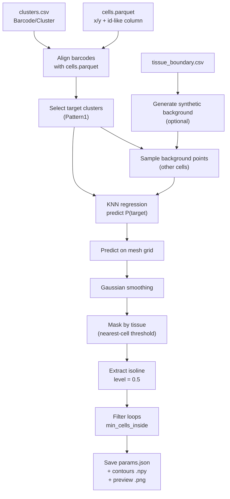

<div align="center">

# HistoSeg

<p align="center">
  <a href="https://pypi.org/project/histoseg/"></a>
  <a href="https://histoseg.readthedocs.io/en/latest/"></a>
  <a href="https://github.com/hutaobo/HistoSeg/actions/workflows/publish.yml"></a>
  <a href="https://polyformproject.org/licenses/noncommercial/1.0.0/"></a>
</p>

</div>

HistoSeg is a Python toolkit for **spatial transcriptomics segmentation / geometry extraction**.

The current focus is **Pattern1 isoline (0.5)** contour generation from cell clusters (e.g., 10x Xenium GraphClust output):

- Pick a set of “target clusters” (Pattern1)
- Fit a KNN regressor to estimate *P(target)* over space
- Smooth the probability field
- Extract a contour (isoline) at **level = 0.5**
- Save contour vertices and a quick preview plot

---

## Quick links

- **Documentation:** https://histoseg.readthedocs.io/en/latest/
- **Source code:** https://github.com/hutaobo/HistoSeg
- **Issue tracker:** https://github.com/hutaobo/HistoSeg/issues

> ⚠️ **License note**
>
> This project is distributed under the **PolyForm Noncommercial 1.0.0** license.
> **Academic and other noncommercial use is permitted.**
> **Any commercial use requires a separate commercial license from SPATHO AB.**
> See `LICENSE` for the full terms.

---

## Installation

### Install from PyPI (recommended)

```bash
pip install -U histoseg
```

### Install from source (for development)

```bash
git clone https://github.com/hutaobo/HistoSeg.git
cd HistoSeg
pip install -U pip
pip install -e .
```

### Dependencies

The Pattern1 isoline workflow uses:

- numpy, pandas
- scipy
- scikit-learn
- matplotlib
- a Parquet engine (**pyarrow is recommended**)

If you run into missing imports, install them explicitly:

```bash
pip install -U numpy pandas pyarrow scipy scikit-learn matplotlib
```

Optional:

- Hugging Face downloader: `pip install -U huggingface_hub`

---

## Tutorial: Pattern1 isoline (0.5)

### What you need (inputs)

The isoline workflow expects the following files:

1. `clusters.csv`
   - Typically from GraphClust: `analysis/clustering/gene_expression_graphclust/clusters.csv`
   - Must contain columns: `Barcode`, `Cluster`

2. `cells.parquet`
   - A cell-level table with spatial coordinates (x/y-like columns)
   - Must contain at least:
     - coordinate columns (e.g. `x`/`y` or `x_centroid`/`y_centroid`)
     - an id column that can be aligned with `clusters.csv:Barcode` (the code tries several common column names)

3. `tissue_boundary.csv` (optional but recommended if you enable synthetic background)
   - Must contain columns `x,y` **or** `X,Y`

### What you get (outputs)

By default, the pipeline writes into `out_dir`:

- `params.json` — all parameters + inferred join columns
- `pattern1_isoline_<level>_<i>.npy` — contour vertices (Nx2 arrays)
- `pattern1_isoline_<level>.png` — quick preview plot

---

## Quickstart

### One-liner (from a Hugging Face dataset repo)

This follows the example notebook in `examples/contour_generation_pattern1_from_hf.ipynb`.

```python
# pip install -U histoseg
# pip install -U huggingface_hub pandas pyarrow numpy scipy scikit-learn matplotlib

from histoseg import run_pattern1_isoline_from_hf

PATTERN1 = (10, 23, 19, 27, 14, 20, 25, 26)

result = run_pattern1_isoline_from_hf(
    repo_id="hutaobo/output-XETG00082_C105",
    revision="main",  # or a commit hash for strict reproducibility
    out_dir="outputs/pattern1_isoline0p5_from_graphclust",
    pattern1_clusters=PATTERN1,

    # Defaults are intentionally exposed for tuning:
    grid_n=1200,
    knn_k=30,
    smooth_sigma=5.0,
    min_cells_inside=10,
)

print("Outputs folder:", result.out_dir)
print("Preview image:", result.preview_png)
print("Contours:", len(result.contours))
```

### Run on local files

```python
from histoseg import Pattern1IsolineConfig, run_pattern1_isoline

PATTERN1 = (10, 23, 19, 27, 14, 20, 25, 26)

cfg = Pattern1IsolineConfig(
    clusters_csv="/path/to/analysis/clustering/gene_expression_graphclust/clusters.csv",
    cells_parquet="/path/to/cells.parquet",
    tissue_boundary_csv="/path/to/tissue_boundary.csv",
    out_dir="outputs/pattern1_isoline0p5",
    pattern1_clusters=PATTERN1,

    # Optional tuning:
    grid_n=1200,
    knn_k=30,
    smooth_sigma=5.0,
    min_cells_inside=10,
)

result = run_pattern1_isoline(cfg)
print(result)
```

---

## How it works (workflow overview)



---

## Troubleshooting & tuning

If no contour is found, try:

- Decrease `min_cells_inside` (e.g. 10 → 3)
- Increase `smooth_sigma` (e.g. 5 → 8)
- Increase `knn_k` (e.g. 30 → 50)
- Reduce `grid_n` to speed up (note: `grid_n=1200` can be heavy)

---

## API reference (high-level)

### Pattern1 isoline

- `Pattern1IsolineConfig`  
  Dataclass holding all parameters and input paths.

- `run_pattern1_isoline(cfg) -> Pattern1IsolineResult`  
  Runs the full pipeline on local files.

- `run_pattern1_isoline_from_hf(repo_id, revision="main", ...) -> Pattern1IsolineResult`  
  Convenience wrapper that downloads required files from a Hugging Face *dataset repo* and then runs the pipeline.

### Hugging Face I/O helpers

- `download_xenium_outs(repo_id, revision="main", clusters_relpath=..., cache_dir=None)`  
  Downloads `cells.parquet`, `tissue_boundary.csv`, and the specified `clusters.csv` from a dataset repo.

### SFPlot utilities (legacy / optional)

This repository contains a small subset of SFPlot-style utilities and re-exports:

- `compute_cophenetic_distances_from_df(df, ...)`
- `plot_cophenetic_heatmap(matrix, ...)`

---

## GUI (experimental)

A GUI entry point is configured as:

```bash
histoseg-gui
```

Notes:

- The current GUI code path is still in flux and may require extra dependencies (e.g., Pillow) and/or an external `sfplot` installation.
- For production workflows, prefer the Python API shown above.

---

## Contributing

Issues and pull requests are welcome.

When reporting a bug, please include:

- OS + Python version
- `histoseg` version
- Minimal reproducible code (or a small input subset)
- Expected vs. actual behavior

---

## License

This project is distributed under the **PolyForm Noncommercial 1.0.0** license.
Noncommercial use (including academic research) is permitted.
Any commercial use requires a separate commercial license from **SPATHO AB**.
See `LICENSE` for details.
