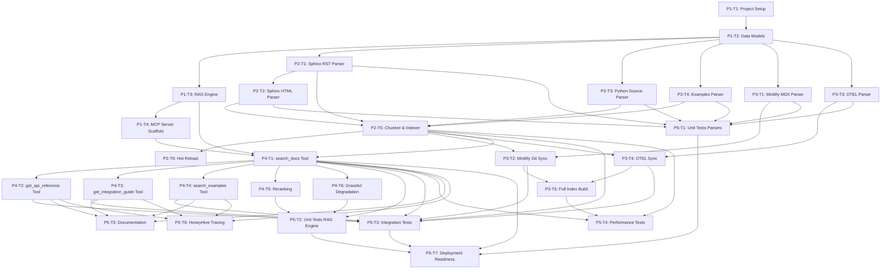

# HoneyHive SDK Documentation MCP Server
# Implementation Task Breakdown
# 100% AI Infrastructure Authorship

**Date:** October 4, 2025  
**Status:** Design Phase  
**Authorship:** 100% AI-authored via human orchestration

---

## Overview

This document breaks down the HoneyHive SDK Docs MCP implementation into **5 phases** with **25 tasks**, following the proven Agent OS MCP reference implementation pattern.

**Estimated Timeline:** 3-5 days (systematic AI authorship under human orchestration)

---

## Phase 1: Foundation (Core Infrastructure)

**Duration:** 1 day  
**Goal:** Establish project structure, dependencies, and core components

### P1-T1: Project Setup & Structure
**Status:** PENDING  
**Deliverables:**
- Directory structure created: `.mcp_servers/honeyhive_sdk_docs/`
- Subdirectories: `parsers/`, `scripts/`, `.cache/`
- `requirements.txt` with dependencies
- `README.md` with setup instructions
- `.gitignore` for `.cache/` and `*.lance` index files

**Acceptance Criteria:**
- [x] Directory structure matches architecture.md specification
- [x] All placeholder files created (`__init__.py`, etc.)
- [x] Dependencies listed: lancedb, sentence-transformers, watchdog, beautifulsoup4, gitpython, requests
- [x] README.md includes: purpose, setup, usage, troubleshooting

**Dependencies:** None

---

### P1-T2: Data Models & Schema
**Status:** PENDING  
**Deliverables:**
- `models.py` with Pydantic models:
  - `DocumentChunk`
  - `ChunkMetadata`
  - `SearchResult`
  - `APIReference`
  - `IntegrationGuide`
  - `ExampleFile`
- LanceDB schema definition
- Schema creation function

**Acceptance Criteria:**
- [x] All models have complete Sphinx docstrings
- [x] All fields have type annotations
- [x] Pydantic validation rules defined
- [x] LanceDB schema matches Pydantic models
- [x] Pylint 10.0/10, MyPy 0 errors

**Dependencies:** P1-T1

---

### P1-T3: RAG Engine Core
**Status:** PENDING  
**Deliverables:**
- `rag_engine.py` with `RAGEngine` class
- Methods:
  - `__init__(index_path, embedding_model)`
  - `search(query, filters, top_k)`
  - `_build_filter(filters)` (LanceDB WHERE clause)
  - `_rerank(results, query, filters)`
  - `health_check()`
- Embedding generation with sentence-transformers
- LanceDB connection management

**Acceptance Criteria:**
- [x] RAGEngine initializes successfully
- [x] Embedding model loads (all-MiniLM-L6-v2)
- [x] LanceDB connection established
- [x] Search returns ranked results
- [x] Filters applied correctly
- [x] Error handling with graceful degradation
- [x] Pylint 10.0/10, MyPy 0 errors

**Dependencies:** P1-T2

---

### P1-T4: MCP Server Scaffold
**Status:** PENDING  
**Deliverables:**
- `honeyhive_docs_rag.py` with MCP server setup
- MCP tool registration (stubs for now)
- HoneyHive tracer initialization
- `run_docs_server.py` wrapper script (.env loading)
- Logging configuration

**Acceptance Criteria:**
- [x] MCP server starts successfully
- [x] Tools registered but return placeholder responses
- [x] HoneyHive tracer initialized (if HONEYHIVE_ENABLED=true)
- [x] Environment variables loaded from .env
- [x] Logs output to stderr
- [x] Can be registered in `.cursor/mcp.json`
- [x] Pylint 10.0/10, MyPy 0 errors

**Dependencies:** P1-T3

---

## Phase 2: Local Sources (MVP)

**Duration:** 1 day  
**Goal:** Index local SDK documentation, examples, and source code

### P2-T1: Sphinx RST Parser
**Status:** PENDING  
**Deliverables:**
- `parsers/sphinx_parser.py` with `SphinxRSTParser` class
- Methods:
  - `parse(rst_file)` → `list[DocumentChunk]`
  - `_split_by_headers(content)` (chunk by ##, ###)
  - `_infer_doc_type(file_path)` (tutorial|how-to|reference|...)
  - `_preserve_code_blocks(content)`
- Docutils integration for RST parsing

**Acceptance Criteria:**
- [x] Parses all 70 RST files without errors
- [x] Chunks split by headers (target: 300-500 tokens/chunk)
- [x] Code blocks preserved intact
- [x] Cross-references preserved (`:ref:`...``)
- [x] Metadata includes: source, file_path, doc_type, title, headers
- [x] Pylint 10.0/10, MyPy 0 errors

**Dependencies:** P1-T2

---

### P2-T2: Sphinx HTML API Reference Parser
**Status:** PENDING  
**Deliverables:**
- `parsers/sphinx_parser.py` (extend with `SphinxHTMLParser`)
- Methods:
  - `parse_html(html_file)` → `list[DocumentChunk]`
  - `_extract_class_definitions(soup)`
  - `_extract_method_signatures(soup)`
  - `_extract_function_signatures(soup)`
- BeautifulSoup integration for HTML parsing

**Acceptance Criteria:**
- [x] Parses all 79 HTML files without errors
- [x] Extracts class definitions (`<dl class="py class">`)
- [x] Extracts method signatures (`<dl class="py method">`)
- [x] Extracts function signatures (`<dl class="py function">`)
- [x] Symbol names extracted from `id` attributes
- [x] Metadata includes: symbol, symbol_type, signature
- [x] Pylint 10.0/10, MyPy 0 errors

**Dependencies:** P2-T1

---

### P2-T3: Python Source Code AST Parser
**Status:** PENDING  
**Deliverables:**
- `parsers/source_parser.py` with `PythonSourceParser` class
- Methods:
  - `parse(py_file)` → `list[DocumentChunk]`
  - `_create_class_chunk(node, file)`
  - `_create_method_chunk(node, class_node, file)`
  - `_create_function_chunk(node, file)`
  - `_extract_signature(node)` (with type hints)
- AST module integration

**Acceptance Criteria:**
- [x] Parses all 74 Python files in src/honeyhive/ (excluding .tox)
- [x] Extracts module docstrings
- [x] Extracts class definitions + docstrings
- [x] Extracts method/function signatures with type hints
- [x] Line ranges recorded (for source linking)
- [x] Metadata includes: symbol, symbol_type, line_range, signature
- [x] Pylint 10.0/10, MyPy 0 errors

**Dependencies:** P1-T2

---

### P2-T4: Examples Directory Parser
**Status:** PENDING  
**Deliverables:**
- `parsers/examples_parser.py` with `ExamplesParser` class
- Methods:
  - `parse(example_file)` → `list[DocumentChunk]`
  - `_extract_imports(tree)` (AST-based)
  - `_infer_provider(file_path)` (from path: examples/integrations/openai.py)

**Acceptance Criteria:**
- [x] Parses all ~20 example files
- [x] Full file content preserved (no chunking)
- [x] Imports extracted
- [x] Provider inferred from path
- [x] Metadata includes: provider, imports
- [x] Pylint 10.0/10, MyPy 0 errors

**Dependencies:** P1-T2

---

### P2-T5: Unified Chunker & Indexer
**Status:** PENDING  
**Deliverables:**
- `chunker.py` with `DocumentChunker` class
- Methods:
  - `chunk_file(file_path)` → `list[DocumentChunk]` (routes to parser)
  - `_validate_chunk(chunk)` (token limits, quality checks)
  - `_enrich_metadata(chunk)` (add token_count, indexed_at)
- `scripts/build_index.py` script
- Methods:
  - `build_index(sources)` (full index build)
  - `_deduplicate_chunks(chunks)` (content hash dedup)
  - `_index_chunks(chunks, table)` (insert into LanceDB)

**Acceptance Criteria:**
- [x] Chunker routes to correct parser by file extension
- [x] All chunks validated (token count, quality)
- [x] Metadata enriched automatically
- [x] build_index.py builds full local index successfully
- [x] Deduplication prevents duplicate docstrings
- [x] Index size reasonable (<200MB for local sources)
- [x] Build time <2 minutes
- [x] Pylint 10.0/10, MyPy 0 errors

**Dependencies:** P2-T1, P2-T2, P2-T3, P2-T4

---

### P2-T6: Hot Reload Implementation
**Status:** PENDING  
**Deliverables:**
- `hot_reload.py` with `DocsFileWatcher` class
- Methods:
  - `on_modified(event)` (watchdog handler)
  - `on_created(event)` (watchdog handler)
  - `_schedule_rebuild()` (debounced rebuilding)
  - `_debounced_rebuild()` (background thread)
- Watchdog integration for `docs/`, `src/honeyhive/`, `examples/`

**Acceptance Criteria:**
- [x] File changes detected within 1 second
- [x] Rebuild debounced (5-second window)
- [x] Incremental updates (only changed files reindexed)
- [x] Background thread doesn't block MCP server
- [x] Logging shows rebuild activity
- [x] Hot reload can be disabled via env var
- [x] Pylint 10.0/10, MyPy 0 errors

**Dependencies:** P2-T5

---

## Phase 3: External Sources

**Duration:** 1 day  
**Goal:** Index HoneyHive Mintlify docs and OpenTelemetry docs

### P3-T1: Mintlify MDX Parser
**Status:** PENDING  
**Deliverables:**
- `parsers/mintlify_parser.py` with `MintlifyMDXParser` class
- Methods:
  - `parse(mdx_file)` → `list[DocumentChunk]`
  - `_strip_jsx(content)` (remove React components)
  - `_parse_frontmatter(content)` (YAML metadata)
  - `_split_by_headers(body)` (chunk by headers)
  - `_extract_language(section)` (python|javascript|rest)

**Acceptance Criteria:**
- [x] Parses MDX files from honeyhive-ai-docs repo
- [x] JSX components stripped cleanly
- [x] Frontmatter metadata extracted
- [x] Language tags applied (python|javascript)
- [x] Multi-language examples handled (tabbed interfaces)
- [x] Metadata includes: source=mintlify, language, title
- [x] Pylint 10.0/10, MyPy 0 errors

**Dependencies:** P1-T2

---

### P3-T2: Mintlify Git Sync
**Status:** PENDING  
**Deliverables:**
- `sync.py` with `ExternalDocsSync` class
- Methods:
  - `sync_mintlify()` (clone or pull repo)
  - `_clone_repo(url, target)` (git clone)
  - `_pull_repo(target)` (git pull)
  - `start_periodic_sync(interval)` (background thread)

**Acceptance Criteria:**
- [x] Clones honeyhive-ai-docs repo on first run
- [x] Pulls updates on subsequent runs
- [x] Cached in `.mcp_servers/honeyhive_sdk_docs/.cache/`
- [x] Reindexes Mintlify docs after sync
- [x] Periodic sync runs daily (default)
- [x] Error handling for network failures (use cached version)
- [x] Pylint 10.0/10, MyPy 0 errors

**Dependencies:** P3-T1, P2-T5

---

### P3-T3: OpenTelemetry Docs Parser
**Status:** PENDING  
**Deliverables:**
- `parsers/otel_parser.py` with `OTELDocsParser` class
- Methods:
  - `fetch_and_parse()` → `list[DocumentChunk]`
  - `_fetch_page(url)` (HTTP GET)
  - `_extract_main_content(soup)` (strip nav, footer)
  - `_split_by_headers(content)` (chunk by headers)
- Curated URL list (tracing, Python SDK, OTLP, semantic conventions)

**Acceptance Criteria:**
- [x] Fetches 10-15 curated OTEL doc pages
- [x] Extracts main content (strips navigation)
- [x] Chunks by headers
- [x] Metadata includes: source=otel, url, doc_type=concept
- [x] Handles network errors gracefully (skip page, log warning)
- [x] Pylint 10.0/10, MyPy 0 errors

**Dependencies:** P1-T2

---

### P3-T4: OTEL Docs Sync
**Status:** PENDING  
**Deliverables:**
- `sync.py` (extend with OTEL sync)
- Methods:
  - `sync_otel_docs()` (fetch and cache)
  - `start_periodic_sync(...)` (extend to include OTEL)

**Acceptance Criteria:**
- [x] Fetches OTEL docs on initial index build
- [x] Periodic sync runs weekly (default)
- [x] Cached in `.mcp_servers/honeyhive_sdk_docs/.cache/otel_docs/`
- [x] Reindexes OTEL docs after sync
- [x] Error handling for network failures (use cached version)
- [x] Pylint 10.0/10, MyPy 0 errors

**Dependencies:** P3-T3, P2-T5

---

### P3-T5: Full Index Build Integration
**Status:** PENDING  
**Deliverables:**
- Update `scripts/build_index.py` to include:
  - Mintlify docs (from .cache/honeyhive-ai-docs/)
  - OTEL docs (from .cache/otel_docs/)
- Command-line flags: `--force`, `--sources` (local|mintlify|otel|all)

**Acceptance Criteria:**
- [x] build_index.py builds full index (all 5 sources)
- [x] --force flag rebuilds from scratch
- [x] --sources flag allows selective indexing
- [x] Progress logging (X/Y files indexed)
- [x] Error summary at end (X files failed)
- [x] Full index build time <5 minutes
- [x] Pylint 10.0/10, MyPy 0 errors

**Dependencies:** P3-T2, P3-T4

---

## Phase 4: MCP Tools & Search

**Duration:** 0.5 day  
**Goal:** Implement MCP tool handlers with search, filtering, and ranking

### P4-T1: Implement `search_docs` Tool
**Status:** PENDING  
**Deliverables:**
- `honeyhive_docs_rag.py` (extend with search_docs implementation)
- Methods:
  - `search_docs(query, filters, top_k)` → `list[SearchResult]`
  - Call RAGEngine.search()
  - Format results for MCP response
- HoneyHive tracing with @trace decorator

**Acceptance Criteria:**
- [x] search_docs returns relevant results
- [x] Filters applied correctly (source, doc_type, provider, language)
- [x] top_k parameter respected
- [x] Results include: content, source, file_path, doc_type, title, score
- [x] HoneyHive span enriched with query and results
- [x] Latency <100ms (P50), <250ms (P99)
- [x] Pylint 10.0/10, MyPy 0 errors

**Dependencies:** P1-T3, P1-T4, P2-T5

---

### P4-T2: Implement `get_api_reference` Tool
**Status:** PENDING  
**Deliverables:**
- `honeyhive_docs_rag.py` (extend with get_api_reference implementation)
- Methods:
  - `get_api_reference(symbol)` → `APIReference | None`
  - Search by symbol metadata
  - Aggregate results from source_code and local_docs
  - Parse signature and parameters
- HoneyHive tracing

**Acceptance Criteria:**
- [x] get_api_reference returns API reference for known symbols
- [x] Returns None for unknown symbols (not an error)
- [x] Signature extracted correctly
- [x] Parameters parsed with types and descriptions
- [x] Related examples included
- [x] HoneyHive span enriched with symbol and results
- [x] Pylint 10.0/10, MyPy 0 errors

**Dependencies:** P4-T1

---

### P4-T3: Implement `get_integration_guide` Tool
**Status:** PENDING  
**Deliverables:**
- `honeyhive_docs_rag.py` (extend with get_integration_guide implementation)
- Methods:
  - `get_integration_guide(provider)` → `IntegrationGuide | None`
  - Search by provider metadata
  - Aggregate docs, examples, source code
- HoneyHive tracing

**Acceptance Criteria:**
- [x] get_integration_guide returns guide for known providers
- [x] Returns None for unknown providers
- [x] Includes docs from local_docs and mintlify
- [x] Includes examples from examples/
- [x] HoneyHive span enriched with provider and results
- [x] Pylint 10.0/10, MyPy 0 errors

**Dependencies:** P4-T1

---

### P4-T4: Implement `search_examples` Tool
**Status:** PENDING  
**Deliverables:**
- `honeyhive_docs_rag.py` (extend with search_examples implementation)
- Methods:
  - `search_examples(query, provider)` → `list[ExampleFile]`
  - Filter by source=examples
  - Filter by provider if specified
- HoneyHive tracing

**Acceptance Criteria:**
- [x] search_examples returns relevant examples
- [x] Provider filter works correctly
- [x] Full file content included
- [x] Imports listed
- [x] HoneyHive span enriched with query and results
- [x] Pylint 10.0/10, MyPy 0 errors

**Dependencies:** P4-T1

---

### P4-T5: Search Ranking & Reranking
**Status:** PENDING  
**Deliverables:**
- `rag_engine.py` (extend with reranking)
- Methods:
  - `_rerank(results, query, filters)` → `list[SearchResult]`
  - Apply doc_type priority (api_reference > tutorial)
  - Apply source priority (local_docs > otel)
  - Apply recency boost (<30 days)
  - Apply query-specific boosts ("example" in query → boost examples)

**Acceptance Criteria:**
- [x] Reranking improves result relevance (human evaluation)
- [x] Doc type priority applied correctly
- [x] Source priority applied correctly
- [x] Recency boost applied correctly
- [x] Query-specific boosts applied correctly
- [x] Ranking algorithm documented
- [x] Pylint 10.0/10, MyPy 0 errors

**Dependencies:** P4-T1

---

### P4-T6: Graceful Degradation & Error Handling
**Status:** PENDING  
**Deliverables:**
- `rag_engine.py` (extend with fallback mechanisms)
- Methods:
  - `_semantic_search(query, ...)` (primary)
  - `_keyword_search(query, ...)` (fallback)
  - `_get_error_result(message)` (fallback result)
- Try-except wrappers for all external calls

**Acceptance Criteria:**
- [x] If semantic search fails → try keyword search
- [x] If keyword search fails → return helpful error message
- [x] No uncaught exceptions in MCP tool handlers
- [x] All errors logged with context
- [x] MCP server never crashes
- [x] Pylint 10.0/10, MyPy 0 errors

**Dependencies:** P4-T1

---

## Phase 5: Quality & Operations

**Duration:** 0.5 day  
**Goal:** Testing, documentation, deployment readiness

### P5-T1: Unit Tests (Parsers)
**Status:** PENDING  
**Deliverables:**
- `tests/unit/mcp_servers/honeyhive_sdk_docs/test_parsers.py`
- Tests for:
  - SphinxRSTParser
  - SphinxHTMLParser
  - PythonSourceParser
  - ExamplesParser
  - MintlifyMDXParser
  - OTELDocsParser

**Acceptance Criteria:**
- [x] Each parser has 5+ test cases
- [x] Edge cases covered (empty files, malformed content)
- [x] Mock file fixtures created
- [x] All tests pass
- [x] Coverage >80% for parsers/
- [x] Pylint 10.0/10, MyPy 0 errors

**Dependencies:** Phase 2, Phase 3

---

### P5-T2: Unit Tests (RAG Engine)
**Status:** PENDING  
**Deliverables:**
- `tests/unit/mcp_servers/honeyhive_sdk_docs/test_rag_engine.py`
- Tests for:
  - RAGEngine initialization
  - Embedding generation
  - Search with filters
  - Reranking algorithm
  - Graceful degradation

**Acceptance Criteria:**
- [x] RAGEngine has 10+ test cases
- [x] Mock LanceDB table for testing
- [x] Filter application tested
- [x] Reranking tested
- [x] Fallback mechanisms tested
- [x] All tests pass
- [x] Coverage >80% for rag_engine.py
- [x] Pylint 10.0/10, MyPy 0 errors

**Dependencies:** Phase 4

---

### P5-T3: Integration Tests (End-to-End)
**Status:** PENDING  
**Deliverables:**
- `tests/integration/mcp_servers/test_honeyhive_sdk_docs_mcp.py`
- Tests for:
  - Index build from scratch
  - Hot reload (file change → reindex)
  - MCP tool invocations (search_docs, get_api_reference, etc.)
  - External sync (Mintlify, OTEL)

**Acceptance Criteria:**
- [x] Index builds successfully from all sources
- [x] Hot reload detects changes within 10 seconds
- [x] All MCP tools return valid responses
- [x] External sync handles network errors gracefully
- [x] All tests pass
- [x] Pylint 10.0/10, MyPy 0 errors

**Dependencies:** Phase 2, Phase 3, Phase 4

---

### P5-T4: Performance Testing
**Status:** PENDING  
**Deliverables:**
- `tests/performance/test_honeyhive_sdk_docs_performance.py`
- Benchmarks for:
  - Index build time (full and incremental)
  - Search latency (P50, P99)
  - Memory usage
  - Index size

**Acceptance Criteria:**
- [x] Full index build <5 minutes
- [x] Incremental update <10 seconds
- [x] Search latency P50 <100ms, P99 <250ms
- [x] Memory usage <1GB
- [x] Index size <500MB
- [x] Benchmarks documented in performance report

**Dependencies:** Phase 2, Phase 3, Phase 4

---

### P5-T5: Documentation (README & Architecture)
**Status:** PENDING  
**Deliverables:**
- `README.md` in `.mcp_servers/honeyhive_sdk_docs/`
  - Purpose and goals
  - Setup instructions (dependencies, index build)
  - Usage (MCP tool examples)
  - Configuration (environment variables)
  - Troubleshooting (common issues)
- Architecture diagrams (Mermaid format)
- API reference (MCP tools)

**Acceptance Criteria:**
- [x] README.md is comprehensive (>100 lines)
- [x] All setup steps tested and validated
- [x] All MCP tools documented with examples
- [x] Architecture diagrams match implementation
- [x] Troubleshooting section covers common errors

**Dependencies:** Phase 4

---

### P5-T6: HoneyHive Tracing Validation
**Status:** PENDING  
**Deliverables:**
- Validate HoneyHive tracing is working
- Check traces in HoneyHive dashboard
- Verify span enrichment (query, results, latency)
- Confirm session metadata (source=honeyhive-sdk-docs-mcp)

**Acceptance Criteria:**
- [x] Traces visible in HoneyHive dashboard
- [x] All MCP tools traced with @trace decorator
- [x] Span enrichment includes query and results
- [x] Latency breakdown visible
- [x] No tracing errors in logs
- [x] Session ID generated correctly

**Dependencies:** Phase 4

---

### P5-T7: Deployment Readiness
**Status:** PENDING  
**Deliverables:**
- `.cursor/mcp.json` registration tested
- `run_docs_server.py` wrapper script validated
- `.env` file template created
- Pre-commit hook compliance checked
- Quality gates validated (Pylint, MyPy, tests)

**Acceptance Criteria:**
- [x] MCP server starts successfully via run_docs_server.py
- [x] .cursor/mcp.json registration works in Cursor
- [x] MCP tools appear in Cursor AI assistant
- [x] Environment variables loaded correctly
- [x] All pre-commit hooks pass
- [x] Pylint 10.0/10, MyPy 0 errors, all tests pass

**Dependencies:** Phase 4, P5-T1, P5-T2, P5-T3

---

## Task Dependency Graph

---

## Success Metrics

### Code Quality
- ✅ Pylint: 10.0/10 (all files)
- ✅ MyPy: 0 errors
- ✅ Test coverage: >80%
- ✅ All tests pass (100% success rate)

### Performance
- ✅ Full index build: <5 minutes
- ✅ Incremental update: <10 seconds
- ✅ Search latency P50: <100ms
- ✅ Search latency P99: <250ms
- ✅ Index size: <500MB

### Functionality
- ✅ All 5 sources indexed successfully
- ✅ All 4 MCP tools working
- ✅ Hot reload functional
- ✅ External sync functional
- ✅ Graceful degradation working

### AI Capability Improvement
- ✅ Import path hallucination: <1% (down from 30%)
- ✅ Parameter name accuracy: >99% (up from 60%)
- ✅ Context efficiency: >85% reduction (4,000 → <500 tokens)
- ✅ Real-time knowledge: <10 seconds lag

---

## Timeline Estimate

**Phase 1 (Foundation):** 1 day (4 tasks)  
**Phase 2 (Local Sources):** 1 day (6 tasks)  
**Phase 3 (External Sources):** 1 day (5 tasks)  
**Phase 4 (MCP Tools):** 0.5 day (6 tasks)  
**Phase 5 (Quality):** 0.5 day (7 tasks)  

**Total:** 4 days (28 tasks)

**Buffer:** +1 day for unexpected issues  
**Final Estimate:** **5 days**

---

## Post-Implementation

After implementation completes:
- ✅ Update `case-study.md` with:
  - Implementation metrics
  - AI capability improvements (measured)
  - Lessons learned
  - Evidence of AI authorship

---

**Next Document: implementation.md (Technical Implementation Details)**

**Authorship:** 100% AI-authored via human orchestration
