# HoneyHive SDK Documentation MCP Server v2
# Implementation Task Breakdown
# Production-Hardened with Concurrency Safety

**Date:** 2025-10-07  
**Status:** Design Phase  
**Version:** 2.0  
**Authorship:** 100% AI-authored via human orchestration

---

## Overview

This document breaks down the HoneyHive SDK Docs MCP v2.1 implementation into **5 phases** with **32 tasks** (7 new tasks for modular architecture), following the agent-os-enhanced modular refactor pattern with production-grade enhancements.

**Estimated Timeline:** 5-6 days (systematic AI authorship under human orchestration)

**🆕 V2.1 Enhancements (agent-os-enhanced lessons):**
- ✅ **Modular architecture** (models/, config/, server/, core/)
- ✅ **Config via JSON + dataclass** (NOT .env)
- ✅ **ServerFactory with dependency injection**
- ✅ **ConfigLoader/ConfigValidator** (graceful fallback)
- ✅ **Selective tool loading** (performance monitoring)
- ✅ **Portable paths** (${workspaceFolder} in mcp.json)
- ✅ **Module execution** (`python -m` pattern)

**🆕 V2 Enhancements:**
- ✅ **3 new concurrency safety tasks** (Phase 1)
- ✅ **Failure mode testing** (Phase 5)
- ✅ **Dependency version pinning** (Phase 1)
- ✅ **Production code checklist** (Phase 5)

---

## Phase 1: Foundation (Core Infrastructure with Modular Architecture) 🆕 V2.1

**Duration:** 2 days (extended from 1.5 days for modular architecture)  
**Goal:** Establish modular project structure, dependencies, type-safe configuration, and dependency injection

### P1-T1: Modular Project Setup & Structure (🆕 V2.1)

**Status:** PENDING  
**Priority:** Critical  
**Estimated Time:** 45 minutes (extended for modular structure)

**Deliverables:**
- **Modular directory structure**: `.mcp_servers/honeyhive_sdk_docs_v2/`
  - `models/` (config.py, docs.py, sources.py)
  - `config/` (loader.py, validator.py)
  - `monitoring/` (watcher.py)
  - `server/` (factory.py, tools/)
  - `core/` (rag_engine.py, parsers/, chunker.py)
  - `utils/` (token_counter.py, deduplication.py, logging_config.py)
  - `scripts/` (build_index.py, health_check.py)
  - `tests/` (unit/, integration/, performance/)
- `requirements.txt` with **🆕 pinned dependencies** (fastmcp, not mcp)
- `README.md` with setup instructions
- `.gitignore` for `.mcp_cache/`, logs, and `*.pyc`
- **NO `.env.example`** (using config.json pattern)

**Acceptance Criteria:**
- [ ] Directory structure matches specs.md Section 8.2 (V2.1 modular)
- [ ] All placeholder `__init__.py` files created (with `__all__` exports)
- [ ] Dependencies pinned with `~=` operator, includes `fastmcp>=1.0.0`
- [ ] Each dependency has justification comment
- [ ] README.md includes: purpose, modular architecture, setup, usage
- [ ] NO .env files (config.json pattern)
- [ ] All files documented as <200 lines target

**Command to Execute:**
```bash
mkdir -p .mcp_servers/honeyhive_sdk_docs_v2/{models,config,monitoring,server/tools,core/parsers,utils,scripts,tests/{unit,integration,performance}}
cd .mcp_servers/honeyhive_sdk_docs_v2
# Create __init__.py files
touch __init__.py models/__init__.py config/__init__.py monitoring/__init__.py
touch server/__init__.py server/tools/__init__.py
touch core/__init__.py core/parsers/__init__.py utils/__init__.py
# Create entry point
touch __main__.py
# Create config files
touch requirements.txt README.md .gitignore
```

**Validation:**
```bash
ls -la .mcp_servers/honeyhive_sdk_docs_v2/
tree .mcp_servers/honeyhive_sdk_docs_v2/ -L 2
grep "fastmcp" .mcp_servers/honeyhive_sdk_docs_v2/requirements.txt
```

**Dependencies:** None

---

### P1-T2: Data Models (Modular) (🆕 V2.1)

**Status:** PENDING  
**Priority:** Critical  
**Estimated Time:** 1.5 hours (extended for modular split)

**Deliverables:**
- `models/config.py` with dataclass models:
  - `KnowledgeSources` (paths and URLs)
  - `DocsConfig` (docs MCP configuration with defaults)
  - `ServerConfig` (complete server configuration)
  - `resolve_paths()` method for relative → absolute path conversion
- `models/docs.py` with Pydantic models:
  - `ChunkMetadata` (13 fields, see specs.md Section 2.5)
  - `DocumentChunk`
  - `SearchResult`
  - `APIReference`
  - `IntegrationGuide`
  - `ExampleFile`
  - `Parameter`
- `models/sources.py` with source-specific models
- LanceDB PyArrow schema definition
- `models/__init__.py` with centralized exports

**Acceptance Criteria:**
- [ ] config.py uses @dataclass (not Pydantic)
- [ ] docs.py uses Pydantic BaseModel for validation
- [ ] All models have complete Sphinx docstrings
- [ ] All fields have type annotations
- [ ] Pydantic validation rules defined
- [ ] LanceDB schema matches Pydantic models
- [ ] Field defaults specified in dataclass
- [ ] Each file <150 lines
- [ ] Pylint 10.0/10, MyPy 0 errors

**Code Pattern:**
```python
from pydantic import BaseModel, Field
from typing import List, Optional
from datetime import datetime

class ChunkMetadata(BaseModel):
    """Metadata for a documentation chunk."""
    source: str  # "local_docs", "mintlify", "source_code", "examples", "otel"
    doc_type: str  # "api_reference", "tutorial", "how_to", "explanation", "example"
    language: str = "python"
    # ... (see specs.md Section 2.5 for complete list)
```

**Validation:**
```python
# Test model creation
metadata = ChunkMetadata(source="local_docs", doc_type="tutorial")
chunk = DocumentChunk(content="...", metadata=metadata)
assert chunk.metadata.source == "local_docs"
```

**Dependencies:** P1-T1

---

### P1-T2a: ConfigLoader & ConfigValidator (🆕 V2.1)

**Status:** PENDING  
**Priority:** Critical  
**Estimated Time:** 1 hour

**Deliverables:**
- `config/loader.py` with ConfigLoader class:
  - `load(project_root, config_filename)` static method
  - `_load_docs_config()` with graceful fallback
  - JSON parsing with error handling
  - Use dataclass defaults as fallback
- `config/validator.py` with ConfigValidator class:
  - `validate(config)` static method returning List[str] errors
  - Path existence validation
  - HoneyHive API key check (if tracing enabled)
  - Clear, actionable error messages
- `config/__init__.py` with exports

**Acceptance Criteria:**
- [ ] ConfigLoader gracefully handles missing config.json (uses defaults)
- [ ] ConfigLoader gracefully handles malformed JSON (logs warning, uses defaults)
- [ ] ConfigValidator returns list of errors (not exceptions)
- [ ] Validator checks all paths in resolve_paths()
- [ ] Index path parent validated (not index itself)
- [ ] loader.py <100 lines
- [ ] validator.py <100 lines
- [ ] Complete docstrings with examples
- [ ] Pylint 10.0/10, MyPy 0 errors

**Code Pattern:**
```python
# config/loader.py
import json
from pathlib import Path
from ..models.config import ServerConfig, DocsConfig

class ConfigLoader:
    @staticmethod
    def load(project_root: Path, config_filename: str = "config.json") -> ServerConfig:
        config_path = project_root / ".agent-os" / config_filename
        docs_config = ConfigLoader._load_docs_config(config_path)
        return ServerConfig(project_root=project_root, docs=docs_config)
    
    @staticmethod
    def _load_docs_config(config_path: Path) -> DocsConfig:
        if not config_path.exists():
            logger.info(f"No {config_path.name} found, using defaults")
            return DocsConfig()
        try:
            with open(config_path, encoding="utf-8") as f:
                data = json.load(f)
            docs_section = data.get("docs_mcp", {})
            return DocsConfig(
                index_path=docs_section.get("index_path", DocsConfig.index_path),
                # ... use dataclass defaults as fallback
            )
        except json.JSONDecodeError as e:
            logger.warning(f"Failed to parse {config_path}: {e}. Using defaults.")
            return DocsConfig()
```

**Validation:**
```python
# Test graceful fallback
config = ConfigLoader.load(Path("/nonexistent"))
assert isinstance(config, ServerConfig)

# Test validation
errors = ConfigValidator.validate(config)
assert isinstance(errors, list)
```

**Dependencies:** P1-T2

---

### P1-T2b: ServerFactory & Entry Point (🆕 V2.1)

**Status:** PENDING  
**Priority:** Critical  
**Estimated Time:** 1.5 hours

**Deliverables:**
- `server/factory.py` with ServerFactory class:
  - `__init__(config)` storing ServerConfig
  - `create_server()` → FastMCP (full DI)
  - `_ensure_directories()` creating cache/logs
  - `_ensure_index()` building if missing
  - `_create_rag_engine()` with injected config
  - `_create_mcp_server()` with tool registration
  - `_start_file_watchers()` (hot reload)
  - `shutdown()` stopping observers
- `server/__init__.py` with exports
- `__main__.py` entry point:
  - `main()` function: load config → validate → create server → run
  - KeyboardInterrupt handling
  - Fatal error logging
  - `if __name__ == "__main__"` guard

**Acceptance Criteria:**
- [ ] ServerFactory receives ServerConfig (not raw paths)
- [ ] All components created via factory methods (DI pattern)
- [ ] RAG engine receives resolved paths from config
- [ ] File watchers started and tracked in self.observers
- [ ] shutdown() stops all observers
- [ ] factory.py <200 lines
- [ ] __main__.py <100 lines
- [ ] Entry point works with `python -m honeyhive_sdk_docs`
- [ ] Pylint 10.0/10, MyPy 0 errors

**Code Pattern:**
```python
# server/factory.py
class ServerFactory:
    def __init__(self, config: ServerConfig):
        self.config = config
        self.paths = config.docs.resolve_paths(config.project_root)
        self.observers = []
    
    def create_server(self) -> FastMCP:
        self._ensure_directories()
        self._ensure_index()
        rag_engine = self._create_rag_engine()
        self._start_file_watchers(rag_engine)
        mcp = self._create_mcp_server(rag_engine)
        return mcp
    
    def _create_rag_engine(self) -> RAGEngine:
        return RAGEngine(
            index_path=self.paths["index_path"],
            embedding_model=self.config.docs.embedding_model
        )

# __main__.py
from .config import ConfigLoader, ConfigValidator
from .server import ServerFactory

def main() -> None:
    try:
        project_root = Path.cwd()
        config = ConfigLoader.load(project_root)
        errors = ConfigValidator.validate(config)
        if errors:
            for error in errors:
                logger.error(f"  {error}")
            sys.exit(1)
        factory = ServerFactory(config)
        mcp = factory.create_server()
        mcp.run(transport='stdio')
    except KeyboardInterrupt:
        logger.info("Server shutdown requested")
    except Exception as e:
        logger.error(f"Server failed: {e}", exc_info=True)
        sys.exit(1)

if __name__ == "__main__":
    main()
```

**Validation:**
```bash
python -m honeyhive_sdk_docs --help  # Should not crash
# Test with missing config
python -m honeyhive_sdk_docs  # Should use defaults gracefully
```

**Dependencies:** P1-T2, P1-T2a

---

### P1-T3: RAG Engine Core (🔒 Concurrency-Safe)

**Status:** PENDING  
**Priority:** Critical  
**Estimated Time:** 2 hours

**Deliverables:**
- `rag_engine.py` with `RAGEngine` class
- **🆕 Concurrency safety primitives:**
  - `self._lock = threading.RLock()`
  - `self._rebuilding = threading.Event()`
- Methods:
  - `__init__(index_path, embedding_model)`
  - `search(query, filters, top_k)` (with lock acquisition)
  - `reload_index(new_chunks)` (with lock + event)
  - `_build_filter(filters)`
  - `_rerank(results, query, filters)`
  - `_keyword_search_fallback(query, filters, top_k)`
  - `health_check()`
- Embedding generation with sentence-transformers
- LanceDB connection management
- **🆕 Clean connection cleanup** (`del self.table; del self.db`)

**Acceptance Criteria:**
- [ ] RAGEngine initializes successfully
- [ ] `threading.RLock()` protects all index access
- [ ] `threading.Event()` signals rebuild state
- [ ] `search()` waits during rebuild (30s timeout)
- [ ] `reload_index()` cleans up old connections
- [ ] Embedding model loads (all-MiniLM-L6-v2)
- [ ] LanceDB connection established
- [ ] Search returns ranked results
- [ ] Filters applied correctly
- [ ] Error handling with graceful degradation
- [ ] Keyword search fallback works
- [ ] Pylint 10.0/10, MyPy 0 errors

**Code Pattern (see specs.md Section 2.2):**
```python
import threading

class RAGEngine:
    """Production-grade RAG engine with concurrency safety."""
    
    def __init__(self, index_path: str, embedding_model: str):
        # 🔒 CRITICAL: Concurrency safety primitives
        self._lock = threading.RLock()
        self._rebuilding = threading.Event()
        
        self.index_path = index_path
        self.embedding_model = SentenceTransformer(embedding_model)
        self.db = lancedb.connect(index_path)
        # ...
    
    def search(self, query: str, filters: Optional[dict] = None, top_k: int = 5):
        """Search with concurrency safety."""
        # Wait if rebuild in progress
        if self._rebuilding.is_set():
            if not self._rebuilding.wait(timeout=30):
                raise TimeoutError("Index rebuild took >30s")
        
        # Acquire lock for read
        with self._lock:
            # ... search logic ...
    
    def reload_index(self, new_chunks: List[dict]):
        """Reload index (thread-safe)."""
        with self._lock:  # Blocks all reads
            self._rebuilding.set()
            try:
                # 🔒 CRITICAL: Clean up old connections
                if hasattr(self, 'table'):
                    del self.table
                if hasattr(self, 'db'):
                    del self.db
                
                # Reconnect and rebuild
                self.db = lancedb.connect(self.index_path)
                # ... rebuild logic ...
            finally:
                self._rebuilding.clear()
```

**Validation:**
```python
# Test initialization
rag = RAGEngine("./.mcp_index", "all-MiniLM-L6-v2")
assert rag._lock is not None
assert rag._rebuilding is not None

# Test search
results = rag.search("test query", top_k=5)
assert isinstance(results, list)
```

**Dependencies:** P1-T2

---

### P1-T4: MCP Server Scaffold

**Status:** PENDING  
**Priority:** Critical  
**Estimated Time:** 1 hour

**Deliverables:**
- `honeyhive_docs_rag.py` with MCP server setup
- MCP tool registration (4 tools, stubs for now)
- **🆕 HoneyHive tracer initialization** (with @trace decorator)
- `run_docs_server.py` wrapper script (.env loading)
- `utils/logging_config.py` (structured JSON logging)

**Acceptance Criteria:**
- [ ] MCP server starts successfully
- [ ] 4 tools registered: search_docs, get_api_reference, get_integration_guide, search_examples
- [ ] Tools return placeholder responses
- [ ] HoneyHive tracer initialized if HONEYHIVE_ENABLED=true
- [ ] @trace decorator on all tool handlers
- [ ] Environment variables loaded from .env
- [ ] Structured logs output to stderr (JSON format)
- [ ] Can be registered in `.cursor/mcp.json`
- [ ] Graceful shutdown on SIGTERM/SIGINT
- [ ] Pylint 10.0/10, MyPy 0 errors

**Code Pattern:**
```python
from mcp import Server, Tool, TextContent
from honeyhive import HoneyHiveTracer, trace
import os

def create_server() -> Server:
    server = Server("honeyhive-sdk-docs-v2")
    
    # Initialize RAG engine
    rag_engine = RAGEngine(...)
    
    # Initialize HoneyHive tracing
    if os.getenv("HONEYHIVE_ENABLED", "false").lower() == "true":
        tracer = HoneyHiveTracer(
            api_key=os.getenv("HH_API_KEY"),
            project=os.getenv("HH_PROJECT", "mcp-servers"),
            session_name="honeyhive-sdk-docs-v2"
        )
    
    @server.list_tools()
    def handle_list_tools():
        return [Tool(name="search_docs", ...)]
    
    @server.call_tool()
    @trace(session_name="mcp-tool-call")
    def handle_call_tool(name: str, arguments: dict):
        if name == "search_docs":
            return search_docs_handler(rag_engine, arguments)
        # ...
    
    return server
```

**Validation:**
```bash
python run_docs_server.py &
sleep 2
ps aux | grep run_docs_server
kill %1
```

**Dependencies:** P1-T3

---

### P1-T5: 🆕 Concurrency Safety Testing Infrastructure

**Status:** PENDING  
**Priority:** Critical (🆕 V2)  
**Estimated Time:** 1 hour

**Deliverables:**
- `tests/unit/test_concurrency.py` with concurrent access tests
- Test: `test_concurrent_queries_during_rebuild`
- Test: `test_query_waits_for_rebuild`
- Test: `test_no_file_corruption`
- Test utilities: `concurrent_query_worker`, `rebuild_worker`

**Acceptance Criteria:**
- [ ] Test spawns 5 query threads + 1 rebuild thread
- [ ] 50 queries executed concurrently with rebuild
- [ ] Zero errors, zero crashes
- [ ] No "file not found" errors
- [ ] All queries return valid results
- [ ] Test passes consistently (run 10 times)
- [ ] Test documented with "🆕 V2: This test caught Agent OS MCP bug" comment

**Code Pattern:**
```python
import threading
import pytest

def test_concurrent_access():
    """
    Test concurrent queries during index rebuild.
    
    🆕 V2: This test caught the Agent OS MCP bug (Oct 2025).
    MUST pass before deployment.
    """
    rag_engine = RAGEngine(...)
    rag_engine.build_index(initial_chunks)
    
    errors = []
    
    def query_worker():
        try:
            for _ in range(50):
                results = rag_engine.search("test query")
                assert len(results) > 0
        except Exception as e:
            errors.append(e)
    
    def rebuild_worker():
        try:
            rag_engine.reload_index(new_chunks)
        except Exception as e:
            errors.append(e)
    
    # Start 5 query threads + 1 rebuild thread
    threads = [threading.Thread(target=query_worker) for _ in range(5)]
    threads.append(threading.Thread(target=rebuild_worker))
    
    for t in threads:
        t.start()
    for t in threads:
        t.join()
    
    assert len(errors) == 0, f"Concurrent access errors: {errors}"
```

**Validation:**
```bash
pytest tests/unit/test_concurrency.py -v
# Should show PASSED
```

**Dependencies:** P1-T3

---

## Phase 2: Local Sources (MVP)

**Duration:** 1 day  
**Goal:** Index local SDK documentation, examples, and source code

### P2-T1: Sphinx RST Parser

**Status:** PENDING  
**Priority:** High  
**Estimated Time:** 1.5 hours

**Deliverables:**
- `parsers/sphinx_parser.py` with `SphinxRSTParser` class
- Methods:
  - `parse(rst_file)` → `list[DocumentChunk]`
  - `_split_by_headers(content)` (chunk by ##, ###)
  - `_infer_doc_type(file_path)` (tutorial|how-to|reference)
  - `_preserve_code_blocks(content)`
- Docutils integration for RST parsing

**Acceptance Criteria:**
- [ ] Parses all 70 RST files without errors
- [ ] Chunks split by headers (target: 300-500 tokens/chunk)
- [ ] Code blocks preserved intact (.. code-block::)
- [ ] Cross-references preserved (:ref:, :doc:)
- [ ] Metadata includes: source, file_path, doc_type, title, headers
- [ ] Handles special RST directives (.. note::, .. warning::)
- [ ] Pylint 10.0/10, MyPy 0 errors

**Code Pattern:**
```python
from docutils.core import publish_doctree

class SphinxRSTParser:
    """Parse Sphinx RST source files."""
    
    def parse(self, file_path: str) -> List[DocumentChunk]:
        with open(file_path, 'r') as f:
            content = f.read()
        
        # Parse RST to doctree
        doctree = publish_doctree(content)
        
        # Split by sections
        chunks = self._split_by_sections(doctree, file_path)
        return chunks
```

**Validation:**
```python
parser = SphinxRSTParser()
chunks = parser.parse("docs/tutorials/quickstart.rst")
assert len(chunks) > 0
assert chunks[0].metadata.source == "local_docs"
assert chunks[0].metadata.doc_type == "tutorial"
```

**Dependencies:** P1-T2

---

### P2-T2: Sphinx HTML API Reference Parser

**Status:** PENDING  
**Priority:** High  
**Estimated Time:** 1.5 hours

**Deliverables:**
- Extend `parsers/sphinx_parser.py` with `SphinxHTMLParser`
- Methods:
  - `parse_html(html_file)` → `list[DocumentChunk]`
  - `_extract_class_definitions(soup)`
  - `_extract_method_signatures(soup)`
  - `_extract_function_signatures(soup)`
- BeautifulSoup integration

**Acceptance Criteria:**
- [ ] Parses all 79 HTML files without errors
- [ ] Extracts class definitions (`<dl class="py class">`)
- [ ] Extracts method signatures (`<dl class="py method">`)
- [ ] Extracts function signatures (`<dl class="py function">`)
- [ ] Symbol names extracted from `id` attributes
- [ ] Parameters and return types parsed
- [ ] Metadata includes: symbol, signature, module
- [ ] Pylint 10.0/10, MyPy 0 errors

**Code Pattern:**
```python
from bs4 import BeautifulSoup

class SphinxHTMLParser:
    """Parse Sphinx HTML API reference."""
    
    def parse_html(self, file_path: str) -> List[DocumentChunk]:
        with open(file_path, 'r') as f:
            soup = BeautifulSoup(f, 'html.parser')
        
        chunks = []
        for element in soup.find_all(['dl'], class_=['class', 'function', 'method']):
            chunk = self._extract_symbol(element)
            chunks.append(chunk)
        
        return chunks
```

**Validation:**
```python
parser = SphinxHTMLParser()
chunks = parser.parse_html("docs/_build/html/reference/api/tracer.html")
assert any(c.metadata.symbol == "HoneyHiveTracer.init" for c in chunks)
```

**Dependencies:** P2-T1

---

### P2-T3: Python Source Code AST Parser

**Status:** PENDING  
**Priority:** High  
**Estimated Time:** 2 hours

**Deliverables:**
- `parsers/source_parser.py` with `PythonSourceParser` class
- Methods:
  - `parse(py_file)` → `list[DocumentChunk]`
  - `_create_class_chunk(node, file)`
  - `_create_method_chunk(node, class_node, file)`
  - `_create_function_chunk(node, file)`
  - `_extract_signature(node)` (with type hints)
  - `_extract_docstring(node)`
- AST module integration

**Acceptance Criteria:**
- [ ] Parses all 74 Python files in src/honeyhive/
- [ ] Extracts module docstrings
- [ ] Extracts class definitions + docstrings
- [ ] Extracts method/function signatures with type hints
- [ ] Line ranges recorded (for source linking)
- [ ] Handles decorators (@trace, etc.)
- [ ] Metadata includes: symbol, line_range, signature
- [ ] Pylint 10.0/10, MyPy 0 errors

**Code Pattern:**
```python
import ast

class PythonSourceParser:
    """Parse Python source code using AST."""
    
    def parse(self, file_path: str) -> List[DocumentChunk]:
        with open(file_path, 'r') as f:
            source = f.read()
        
        tree = ast.parse(source, filename=file_path)
        chunks = []
        
        for node in ast.walk(tree):
            if isinstance(node, (ast.ClassDef, ast.FunctionDef)):
                chunk = self._extract_symbol(node, source, file_path)
                chunks.append(chunk)
        
        return chunks
```

**Validation:**
```python
parser = PythonSourceParser()
chunks = parser.parse("src/honeyhive/tracer/core/tracer.py")
assert any(c.metadata.symbol == "HoneyHiveTracer" for c in chunks)
```

**Dependencies:** P1-T2

---

### P2-T4: Examples Directory Parser

**Status:** PENDING  
**Priority:** High  
**Estimated Time:** 1 hour

**Deliverables:**
- `parsers/examples_parser.py` with `ExamplesParser` class
- Methods:
  - `parse(example_file)` → `list[DocumentChunk]`
  - `_extract_imports(tree)`
  - `_infer_provider(file_path)` (from path or imports)
  - `_extract_description(content)` (from docstring/comments)

**Acceptance Criteria:**
- [ ] Parses all ~20 Python files in examples/
- [ ] Full file content included (examples are small)
- [ ] Provider detected from imports (openai, anthropic, etc.)
- [ ] Description extracted from module docstring
- [ ] Imports list extracted
- [ ] Metadata includes: provider, use_case, file_path
- [ ] Pylint 10.0/10, MyPy 0 errors

**Code Pattern:**
```python
class ExamplesParser:
    """Parse Python example files."""
    
    def parse(self, file_path: str) -> List[DocumentChunk]:
        with open(file_path, 'r') as f:
            content = f.read()
        
        # Detect provider
        provider = self._detect_provider(content)
        
        # Extract description
        description = self._extract_description(content)
        
        return [DocumentChunk(
            content=content,
            metadata=ChunkMetadata(
                source="examples",
                doc_type="example",
                provider=provider,
                file_path=file_path,
                # ...
            )
        )]
```

**Validation:**
```python
parser = ExamplesParser()
chunks = parser.parse("examples/integrations/anthropic.py")
assert chunks[0].metadata.provider == "anthropic"
```

**Dependencies:** P1-T2

---

### P2-T5: Unified Chunker

**Status:** PENDING  
**Priority:** High  
**Estimated Time:** 1 hour

**Deliverables:**
- `chunker.py` with `Chunker` class
- Methods:
  - `chunk_document(file_path, source_type)` → `list[DocumentChunk]`
  - `_get_parser(source_type, file_path)`
  - `_validate_chunk(chunk)` → `bool`
  - `_enrich_metadata(chunk)` → `DocumentChunk`
- Token counting utility (`utils/token_counter.py`)

**Acceptance Criteria:**
- [ ] Routes to correct parser based on source_type
- [ ] Validates chunk content length (>50 chars, <10,000 chars)
- [ ] Validates required metadata fields
- [ ] Enriches with token_count, char_count, indexed_at
- [ ] Enriches with last_updated (from file mtime)
- [ ] Filters out invalid chunks, logs warnings
- [ ] Pylint 10.0/10, MyPy 0 errors

**Code Pattern:**
```python
class Chunker:
    """Unified chunking interface with validation."""
    
    def chunk_document(self, file_path: str, source_type: str) -> List[DocumentChunk]:
        parser = self._get_parser(source_type, file_path)
        chunks = parser.parse(file_path)
        
        validated = []
        for chunk in chunks:
            if self._validate_chunk(chunk):
                enriched = self._enrich_metadata(chunk)
                validated.append(enriched)
        
        return validated
```

**Validation:**
```python
chunker = Chunker()
chunks = chunker.chunk_document("docs/tutorials/quickstart.rst", "local_docs")
assert all(c.metadata.token_count > 0 for c in chunks)
```

**Dependencies:** P2-T1, P2-T2, P2-T3, P2-T4

---

### P2-T6: Hot Reload (🔒 Thread-Safe)

**Status:** PENDING  
**Priority:** High  
**Estimated Time:** 2 hours

**Deliverables:**
- `hot_reload.py` with `HotReloadHandler` class
- Watchdog integration for file monitoring
- Debouncing (5s window to batch changes)
- Incremental index updates
- **🆕 Thread-safe interaction with RAG engine**

**Acceptance Criteria:**
- [ ] Monitors docs/, src/honeyhive/, examples/
- [ ] Detects file modifications (.py, .rst, .md, .html)
- [ ] Debounces changes (5s window)
- [ ] Calls `rag_engine.reload_index()` (RAG handles locking)
- [ ] Incremental updates only (not full rebuild)
- [ ] Exception handling (never crashes)
- [ ] Logs file changes and rebuild status
- [ ] Pylint 10.0/10, MyPy 0 errors

**Code Pattern (see specs.md Section 2.6):**
```python
from watchdog.observers import Observer
from watchdog.events import FileSystemEventHandler

class HotReloadHandler(FileSystemEventHandler):
    def __init__(self, rag_engine: RAGEngine, debounce_seconds: int = 5):
        self.rag_engine = rag_engine
        self.debounce_seconds = debounce_seconds
        self.pending_changes = set()
        self._lock = threading.Lock()
    
    def on_modified(self, event):
        if not self._is_relevant_file(event.src_path):
            return
        
        with self._lock:
            self.pending_changes.add(event.src_path)
            # Reset debounce timer
            # ...
    
    def _process_pending_changes(self):
        # Parse changed files
        # Generate embeddings
        # Call rag_engine.reload_index() (handles locking)
        # ...
```

**Validation:**
```bash
# Manually trigger file change
echo "# Test" >> docs/tutorials/quickstart.rst
sleep 6  # Wait for debounce
# Check logs for "Index updated"
```

**Dependencies:** P1-T3, P2-T5

---

## Phase 3: External Sources

**Duration:** 1 day  
**Goal:** Index Mintlify docs and OpenTelemetry docs

### P3-T1: Mintlify MDX Parser

**Status:** PENDING  
**Priority:** Medium  
**Estimated Time:** 2 hours

**Deliverables:**
- `parsers/mintlify_parser.py` with `MintlifyParser` class
- Methods:
  - `parse(mdx_file)` → `list[DocumentChunk]`
  - `_extract_frontmatter(content)` (title, description, category)
  - `_strip_mdx_components(content)` (remove React/JSX)
  - `_split_by_headers(markdown)`
  - `_extract_code_blocks(content)` (with language tags)

**Acceptance Criteria:**
- [ ] Parses all MDX files in Mintlify repo
- [ ] Frontmatter extracted (title, description, etc.)
- [ ] MDX components stripped (e.g., <Card>, <CodeGroup>)
- [ ] Multi-language code blocks preserved
- [ ] Chunks split by headers
- [ ] Metadata includes: source=mintlify, url (original)
- [ ] Handles parsing errors gracefully
- [ ] Pylint 10.0/10, MyPy 0 errors

**Code Pattern:**
```python
import re
import yaml

class MintlifyParser:
    """Parse Mintlify MDX documentation."""
    
    def parse(self, file_path: str) -> List[DocumentChunk]:
        with open(file_path, 'r') as f:
            content = f.read()
        
        # Extract frontmatter
        frontmatter = self._extract_frontmatter(content)
        
        # Strip MDX components
        markdown = self._strip_mdx_components(content)
        
        # Split by headers
        chunks = self._split_by_headers(markdown)
        
        return chunks
```

**Validation:**
```python
parser = MintlifyParser()
chunks = parser.parse(".mcp_cache/mintlify_docs/introduction.mdx")
assert chunks[0].metadata.source == "mintlify"
```

**Dependencies:** P1-T2

---

### P3-T2: Mintlify Git Sync

**Status:** PENDING  
**Priority:** Medium  
**Estimated Time:** 1 hour

**Deliverables:**
- `sync.py` with `PeriodicSync` class
- Methods:
  - `start()` (background thread)
  - `stop()` (graceful shutdown)
  - `_sync_mintlify()` (git clone/pull)
  - `_sync_otel()` (HTTP fetch)
  - `_should_sync(source)` (check last sync time)
- GitPython integration

**Acceptance Criteria:**
- [ ] Clones Mintlify repo on first run
- [ ] Pulls updates on subsequent runs
- [ ] Runs daily (configurable interval)
- [ ] Graceful degradation on Git errors (use cached)
- [ ] Logs last sync timestamp
- [ ] Background thread (daemon mode)
- [ ] Parses and reindexes after sync
- [ ] Pylint 10.0/10, MyPy 0 errors

**Code Pattern:**
```python
from git import Repo
import time

class PeriodicSync:
    def __init__(self, rag_engine: RAGEngine):
        self.rag_engine = rag_engine
        self.running = False
    
    def _sync_mintlify(self):
        repo_url = os.getenv("MINTLIFY_REPO_URL")
        local_path = "./.mcp_cache/mintlify_docs"
        
        try:
            if not os.path.exists(local_path):
                Repo.clone_from(repo_url, local_path)
            else:
                repo = Repo(local_path)
                repo.remotes.origin.pull()
            
            # Parse and reindex
            # ...
        except Exception as e:
            logger.error(f"Mintlify sync failed: {e}")
            # Use cached version
```

**Validation:**
```bash
# Set MINTLIFY_REPO_URL in .env
python -c "from sync import PeriodicSync; sync = PeriodicSync(...); sync._sync_mintlify()"
ls -la .mcp_cache/mintlify_docs/
```

**Dependencies:** P3-T1

---

### P3-T3: OpenTelemetry Docs Parser

**Status:** PENDING  
**Priority:** Low  
**Estimated Time:** 1.5 hours

**Deliverables:**
- `parsers/otel_parser.py` with `OTELParser` class
- Methods:
  - `parse_url(url)` → `list[DocumentChunk]`
  - `_fetch_html(url)` (with caching)
  - `_extract_main_content(soup)` (remove nav, footer)
  - `_split_by_headers(content)`
- Curated URL list (tracing, Python SDK, OTLP)

**Acceptance Criteria:**
- [ ] Fetches HTML from curated OTEL URLs
- [ ] Caches responses (1 week TTL)
- [ ] Extracts main content (removes navigation)
- [ ] Splits by headers
- [ ] Metadata includes: source=otel, url
- [ ] Handles HTTP errors gracefully (skip URL, log warning)
- [ ] Timeout: 10s per URL
- [ ] Pylint 10.0/10, MyPy 0 errors

**Code Pattern:**
```python
import requests
from bs4 import BeautifulSoup

class OTELParser:
    CURATED_URLS = [
        "https://opentelemetry.io/docs/concepts/signals/traces/",
        "https://opentelemetry.io/docs/languages/python/instrumentation/",
        # ...
    ]
    
    def parse_url(self, url: str) -> List[DocumentChunk]:
        try:
            response = requests.get(url, timeout=10)
            soup = BeautifulSoup(response.content, 'html.parser')
            
            # Extract main content
            main = soup.find('main') or soup.find('article')
            
            # Remove unwanted elements
            for unwanted in main.find_all(['nav', 'footer', 'aside']):
                unwanted.decompose()
            
            # Split by headers
            chunks = self._split_by_headers(main)
            return chunks
        
        except Exception as e:
            logger.error(f"OTEL parse failed for {url}: {e}")
            return []
```

**Validation:**
```python
parser = OTELParser()
chunks = parser.parse_url(parser.CURATED_URLS[0])
assert len(chunks) > 0
```

**Dependencies:** P1-T2

---

### P3-T4: OTEL Docs Periodic Sync

**Status:** PENDING  
**Priority:** Low  
**Estimated Time:** 30 minutes

**Deliverables:**
- Extend `sync.py` with `_sync_otel()` method
- Weekly sync schedule
- HTTP fetching for all curated URLs

**Acceptance Criteria:**
- [ ] Fetches all curated OTEL URLs
- [ ] Runs weekly (configurable interval)
- [ ] Graceful degradation on HTTP errors (skip, use local)
- [ ] Logs sync status
- [ ] Parses and reindexes after sync
- [ ] Pylint 10.0/10, MyPy 0 errors

**Validation:**
```bash
python -c "from sync import PeriodicSync; sync = PeriodicSync(...); sync._sync_otel()"
# Check logs for "OTEL sync complete"
```

**Dependencies:** P3-T3, P3-T2

---

### P3-T5: Full Index Build Integration

**Status:** PENDING  
**Priority:** High  
**Estimated Time:** 2 hours

**Deliverables:**
- `scripts/build_index.py` with `build_index()` function
- Index all 5 sources:
  1. Local SDK docs (docs/)
  2. Python source (src/honeyhive/)
  3. Examples (examples/)
  4. Mintlify (if available)
  5. OTEL (if available)
- Deduplication (`utils/deduplication.py`)
- Embedding generation
- LanceDB index creation

**Acceptance Criteria:**
- [ ] Builds full index from all 5 sources
- [ ] Deduplicates by content hash
- [ ] Generates embeddings for all chunks
- [ ] Creates LanceDB table
- [ ] Progress logging (% complete)
- [ ] Total time <5 minutes
- [ ] Index size <500MB
- [ ] Validates index after build (health check)
- [ ] Pylint 10.0/10, MyPy 0 errors

**Code Pattern:**
```python
def build_index(rag_engine: RAGEngine):
    chunker = Chunker()
    all_chunks = []
    
    # 1. Index local docs
    for rst_file in glob("docs/**/*.rst", recursive=True):
        chunks = chunker.chunk_document(rst_file, "local_docs")
        all_chunks.extend(chunks)
    
    # 2. Index source code
    for py_file in glob("src/honeyhive/**/*.py", recursive=True):
        chunks = chunker.chunk_document(py_file, "source_code")
        all_chunks.extend(chunks)
    
    # ... (3, 4, 5)
    
    # Deduplicate
    deduplicated = deduplicate_chunks(all_chunks)
    
    # Generate embeddings
    for chunk in deduplicated:
        chunk.embedding = rag_engine.embedding_model.encode(chunk.content).tolist()
    
    # Build index
    rag_engine.reload_index(deduplicated)
```

**Validation:**
```bash
python scripts/build_index.py
# Should complete in <5 minutes
# Check index size: du -sh .mcp_index/
```

**Dependencies:** P2-T5, P3-T1, P3-T3

---

## Phase 4: MCP Tools & Search

**Duration:** 0.5 day  
**Goal:** Implement all 4 MCP tools with intelligent ranking

### P4-T1: Implement search_docs Tool

**Status:** PENDING  
**Priority:** Critical  
**Estimated Time:** 1 hour

**Deliverables:**
- `search_docs_handler()` function in `honeyhive_docs_rag.py`
- HoneyHive tracing integration (@trace decorator)
- Response formatting with citations

**Acceptance Criteria:**
- [ ] Accepts query, filters, top_k parameters
- [ ] Calls rag_engine.search()
- [ ] Formats response with content + metadata
- [ ] Includes source citations
- [ ] HoneyHive span enrichment (query, results count, latency)
- [ ] Error handling with user-friendly messages
- [ ] Returns TextContent in MCP format
- [ ] Pylint 10.0/10, MyPy 0 errors

**Code Pattern (see specs.md Section 3.1):**
```python
@trace(session_name="search-docs")
def search_docs_handler(rag_engine: RAGEngine, arguments: dict) -> list[TextContent]:
    query = arguments["query"]
    filters = arguments.get("filters", {})
    top_k = arguments.get("top_k", 5)
    
    try:
        results = rag_engine.search(query, filters, top_k)
        
        response_text = f"Found {len(results)} results for: {query}\n\n"
        for i, result in enumerate(results, 1):
            response_text += f"## Result {i}\n"
            response_text += f"**Source:** {result['source']} ({result['doc_type']})\n"
            response_text += result['content']
            response_text += f"\n\n**Citation:** {result.get('file_path')}\n---\n\n"
        
        return [TextContent(type="text", text=response_text)]
    
    except Exception as e:
        logger.error(f"search_docs failed: {e}")
        return [TextContent(type="text", text=f"Search failed: {str(e)}")]
```

**Validation:**
```python
# Test via MCP
response = search_docs_handler(rag_engine, {"query": "HoneyHiveTracer.init"})
assert "HoneyHiveTracer" in response[0].text
```

**Dependencies:** P1-T3, P3-T5

---

### P4-T2: Implement get_api_reference Tool

**Status:** PENDING  
**Priority:** High  
**Estimated Time:** 45 minutes

**Deliverables:**
- `get_api_reference_handler()` function
- Symbol search with doc_type filter
- Example inclusion (optional)

**Acceptance Criteria:**
- [ ] Accepts symbol_name, include_examples parameters
- [ ] Filters by doc_type=api_reference
- [ ] Returns signature, docstring, parameters
- [ ] Optionally includes examples
- [ ] HoneyHive tracing
- [ ] Error handling for symbol not found
- [ ] Pylint 10.0/10, MyPy 0 errors

**Code Pattern (see specs.md Section 3.2):**
```python
@trace(session_name="get-api-reference")
def get_api_reference_handler(rag_engine: RAGEngine, arguments: dict):
    symbol_name = arguments["symbol_name"]
    include_examples = arguments.get("include_examples", True)
    
    results = rag_engine.search(
        query=symbol_name,
        filters={"doc_type": "api_reference"},
        top_k=3
    )
    
    if not results:
        return [TextContent(type="text", text=f"No API reference found for: {symbol_name}")]
    
    # Format response
    # ...
```

**Validation:**
```python
response = get_api_reference_handler(rag_engine, {"symbol_name": "HoneyHiveTracer.init"})
assert "signature" in response[0].text.lower()
```

**Dependencies:** P4-T1

---

### P4-T3: Implement get_integration_guide Tool

**Status:** PENDING  
**Priority:** Medium  
**Estimated Time:** 30 minutes

**Deliverables:**
- `get_integration_guide_handler()` function
- Provider-specific search

**Acceptance Criteria:**
- [ ] Accepts provider parameter
- [ ] Filters by provider metadata
- [ ] Returns setup steps, examples, best practices
- [ ] HoneyHive tracing
- [ ] Error handling for provider not found
- [ ] Pylint 10.0/10, MyPy 0 errors

**Code Pattern:**
```python
@trace(session_name="get-integration-guide")
def get_integration_guide_handler(rag_engine: RAGEngine, arguments: dict):
    provider = arguments["provider"]
    
    results = rag_engine.search(
        query=f"{provider} integration",
        filters={"provider": provider},
        top_k=5
    )
    
    # Format as integration guide
    # ...
```

**Validation:**
```python
response = get_integration_guide_handler(rag_engine, {"provider": "openai"})
assert "openai" in response[0].text.lower()
```

**Dependencies:** P4-T1

---

### P4-T4: Implement search_examples Tool

**Status:** PENDING  
**Priority:** Medium  
**Estimated Time:** 30 minutes

**Deliverables:**
- `search_examples_handler()` function
- Example file search

**Acceptance Criteria:**
- [ ] Accepts query, optional provider filter
- [ ] Filters by doc_type=example
- [ ] Returns full example code with imports
- [ ] HoneyHive tracing
- [ ] Error handling for no examples found
- [ ] Pylint 10.0/10, MyPy 0 errors

**Code Pattern:**
```python
@trace(session_name="search-examples")
def search_examples_handler(rag_engine: RAGEngine, arguments: dict):
    query = arguments["query"]
    provider = arguments.get("provider")
    
    filters = {"doc_type": "example"}
    if provider:
        filters["provider"] = provider
    
    results = rag_engine.search(query, filters, top_k=3)
    
    # Format as example files
    # ...
```

**Validation:**
```python
response = search_examples_handler(rag_engine, {"query": "streaming", "provider": "anthropic"})
assert "anthropic" in response[0].text.lower()
```

**Dependencies:** P4-T1

---

### P4-T5: Search Ranking & Reranking

**Status:** PENDING  
**Priority:** High  
**Estimated Time:** 1.5 hours

**Deliverables:**
- Implement `_rerank()` method in RAG engine (see specs.md Section 2.2)
- 5-factor ranking algorithm:
  1. Semantic similarity (50% weight)
  2. Doc type priority (20% weight)
  3. Source priority (15% weight)
  4. Recency (10% weight)
  5. Query-specific boosts (5% weight)

**Acceptance Criteria:**
- [ ] Reranking improves result relevance
- [ ] API references ranked higher for signature queries
- [ ] Examples ranked higher for "example" queries
- [ ] Source code boosted for "import" queries
- [ ] Mintlify ranked higher than source_code
- [ ] Recent docs ranked higher (within same score range)
- [ ] Unit tests for ranking logic
- [ ] Pylint 10.0/10, MyPy 0 errors

**Code Pattern (see specs.md Section 2.2):**
```python
def _rerank(self, results: List[dict], query: str, filters: Optional[dict]) -> List[dict]:
    for result in results:
        score = 0.0
        
        # Factor 1: Semantic similarity
        semantic_score = 1.0 / (1.0 + result.get("_distance", 1.0))
        score += semantic_score * 0.5
        
        # Factor 2: Doc type priority
        doc_type = result.get("doc_type", "")
        doc_type_weights = {"api_reference": 1.0, "example": 0.9, "tutorial": 0.8}
        score += doc_type_weights.get(doc_type, 0.5) * 0.2
        
        # ... (factors 3, 4, 5)
        
        result["_final_score"] = score
    
    return sorted(results, key=lambda x: x.get("_final_score", 0), reverse=True)
```

**Validation:**
```python
# Test ranking
results = rag_engine.search("HoneyHiveTracer.init signature")
assert results[0]["doc_type"] == "api_reference"  # API ref should be top
```

**Dependencies:** P4-T1

---

### P4-T6: Graceful Degradation & Error Handling

**Status:** PENDING  
**Priority:** High  
**Estimated Time:** 1 hour

**Deliverables:**
- Implement `_keyword_search_fallback()` in RAG engine
- Error handling wrappers for all external operations
- User-friendly error messages

**Acceptance Criteria:**
- [ ] Semantic search fails → keyword search fallback
- [ ] Keyword search uses grep/regex
- [ ] Index missing → helpful error with rebuild instructions
- [ ] Embedding model fails → keyword search fallback
- [ ] Never crashes, always returns response
- [ ] All errors logged with context
- [ ] User-friendly error messages in MCP responses
- [ ] Pylint 10.0/10, MyPy 0 errors

**Code Pattern:**
```python
def _keyword_search_fallback(self, query: str, filters: Optional[dict], top_k: int) -> List[dict]:
    """Graceful degradation: grep-based keyword search."""
    logger.warning("Falling back to keyword search")
    
    # Grep-based search in index content
    # ...
    return results
```

**Validation:**
```python
# Simulate embedding failure
rag_engine.embedding_model = None
results = rag_engine.search("test query")
assert len(results) > 0  # Should still return results via keyword search
```

**Dependencies:** P4-T5

---

## Phase 5: Quality & Operations

**Duration:** 1 day (extended from 0.5 day)  
**Goal:** Comprehensive testing, documentation, and production readiness

### P5-T1: Unit Tests (Parsers & RAG Engine)

**Status:** PENDING  
**Priority:** Critical  
**Estimated Time:** 2 hours

**Deliverables:**
- `tests/unit/test_parsers.py` (all parsers)
- `tests/unit/test_rag_engine.py` (search, ranking)
- `tests/unit/test_chunker.py` (validation, enrichment)
- `tests/unit/test_deduplication.py` (hash collisions)
- `tests/unit/test_models.py` (Pydantic validation)

**Acceptance Criteria:**
- [ ] >80% code coverage
- [ ] All parsers tested with sample files
- [ ] RAG engine search tested with mock index
- [ ] Ranking algorithm tested with fixtures
- [ ] Deduplication tested with duplicates
- [ ] All tests pass
- [ ] Fast execution (<30s total)
- [ ] pytest-cov reports coverage

**Validation:**
```bash
pytest tests/unit/ -v --cov=. --cov-report=term
# Should show >80% coverage
```

**Dependencies:** All Phase 2, 3, 4 tasks

---

### P5-T2: Integration Tests (End-to-End MCP)

**Status:** PENDING  
**Priority:** High  
**Estimated Time:** 1.5 hours

**Deliverables:**
- `tests/integration/test_mcp_tools.py` (all 4 tools)
- `tests/integration/test_hot_reload.py` (file change → index update)
- `tests/integration/test_end_to_end.py` (full workflow)

**Acceptance Criteria:**
- [ ] All 4 MCP tools tested end-to-end
- [ ] Hot reload tested (modify file, wait, query)
- [ ] Full workflow: build index → query → verify results
- [ ] Tests use real index (not mocks)
- [ ] All tests pass
- [ ] Execution time <2 minutes

**Validation:**
```bash
pytest tests/integration/ -v
# Should show all PASSED
```

**Dependencies:** P5-T1

---

### P5-T3: 🆕 Failure Mode Testing (V2)

**Status:** PENDING  
**Priority:** Critical (🆕 V2)  
**Estimated Time:** 2 hours

**Deliverables:**
- `tests/unit/test_failure_modes.py`
- Tests for all failure scenarios from specs.md Section 6.1:
  - `test_index_corruption_recovery`
  - `test_embedding_failure_fallback`
  - `test_hot_reload_failure`
  - `test_mintlify_sync_failure`
  - `test_otel_fetch_timeout`
  - `test_file_permission_error`
  - `test_memory_constraints`

**Acceptance Criteria:**
- [ ] All 7 failure scenarios tested
- [ ] Each test simulates failure condition
- [ ] Verifies graceful degradation path
- [ ] Verifies appropriate logging
- [ ] All tests pass
- [ ] Tests documented with failure scenario description

**Code Pattern:**
```python
def test_index_corruption_recovery():
    """Test recovery from corrupted index."""
    rag_engine = RAGEngine(...)
    
    # Simulate corruption
    os.remove(rag_engine.index_path + "/docs.lance")
    
    # Query should trigger auto-rebuild
    results = rag_engine.search("test query")
    
    # Verify graceful recovery
    assert len(results) > 0
    assert os.path.exists(rag_engine.index_path + "/docs.lance")

def test_embedding_failure_fallback():
    """Test fallback to keyword search on embedding failure."""
    rag_engine = RAGEngine(...)
    
    # Simulate embedding failure
    rag_engine.embedding_model = None
    
    # Should fallback to keyword search
    results = rag_engine.search("test query")
    
    # Verify keyword search was used
    assert len(results) > 0
    assert "WARNING" in captured_logs  # Should log fallback
```

**Validation:**
```bash
pytest tests/unit/test_failure_modes.py -v
# Should show 7 PASSED tests
```

**Dependencies:** P5-T1

---

### P5-T4: Performance Testing

**Status:** PENDING  
**Priority:** Medium  
**Estimated Time:** 1 hour

**Deliverables:**
- `tests/performance/test_search_latency.py`
- `tests/performance/test_index_build_time.py`
- Benchmarks for P50, P99 latency
- Index build time measurement

**Acceptance Criteria:**
- [ ] Search latency P50 <100ms
- [ ] Search latency P99 <250ms
- [ ] Full index build <5 minutes
- [ ] Incremental update <10 seconds
- [ ] Index size <500MB
- [ ] Performance report generated
- [ ] Baseline established for future comparison

**Code Pattern:**
```python
import time
import pytest

def test_search_latency():
    """Benchmark search latency."""
    rag_engine = RAGEngine(...)
    latencies = []
    
    for _ in range(100):
        start = time.time()
        rag_engine.search("test query")
        latencies.append((time.time() - start) * 1000)  # ms
    
    p50 = sorted(latencies)[50]
    p99 = sorted(latencies)[99]
    
    assert p50 < 100, f"P50 latency: {p50}ms (target: <100ms)"
    assert p99 < 250, f"P99 latency: {p99}ms (target: <250ms)"
```

**Validation:**
```bash
pytest tests/performance/ -v
# Should show latency metrics
```

**Dependencies:** P5-T2

---

### P5-T5: Documentation (README & Setup)

**Status:** PENDING  
**Priority:** High  
**Estimated Time:** 1 hour

**Deliverables:**
- Enhanced `README.md` with:
  - Purpose and features
  - Installation instructions
  - Environment variables
  - Index building
  - Cursor integration
  - Troubleshooting
  - **🆕 V2 enhancements section**
- Code comments and docstrings review

**Acceptance Criteria:**
- [ ] README covers all setup steps
- [ ] .env.example complete with all variables
- [ ] Troubleshooting section for common issues
- [ ] Architecture diagram (Mermaid)
- [ ] Links to specs.md and tasks.md
- [ ] **🆕 V2 section**: Concurrency safety, failure modes, pinned dependencies
- [ ] All public functions have docstrings
- [ ] Pylint docstring checks pass

**Validation:**
```bash
# Follow README instructions on clean machine
# Should complete without errors
```

**Dependencies:** All Phase 1-4 tasks

---

### P5-T6: HoneyHive Tracing Validation

**Status:** PENDING  
**Priority:** High  
**Estimated Time:** 1 hour

**Deliverables:**
- Validate HoneyHive tracing on all MCP tools
- Verify span enrichment (query, results, latency)
- Check HoneyHive dashboard for traces

**Acceptance Criteria:**
- [ ] All 4 MCP tools traced
- [ ] Spans include query text, filters, top_k
- [ ] Spans include results_count, sources
- [ ] Spans include latency breakdown
- [ ] Session name: "honeyhive-sdk-docs-v2"
- [ ] Traces visible in HoneyHive dashboard
- [ ] No tracing errors logged

**Validation:**
```bash
# Set HONEYHIVE_ENABLED=true
# Execute queries
# Check HoneyHive dashboard
```

**Dependencies:** P4-T1, P4-T2, P4-T3, P4-T4

---

### P5-T7: 🆕 Production Code Checklist (V2)

**Status:** PENDING  
**Priority:** Critical (🆕 V2)  
**Estimated Time:** 1 hour

**Deliverables:**
- Document checklist application in `PRODUCTION_CODE_CHECKLIST.md`
- Evidence for each Tier 1 check (see specs.md Section 11)
- Cross-references to code locations

**Acceptance Criteria:**
- [ ] **Shared state concurrency**: Evidence of RLock + Event
- [ ] **Dependency versions**: Evidence of pinned versions with justifications
- [ ] **Failure mode analysis**: Reference to specs.md Section 6.1
- [ ] **Resource lifecycle**: Evidence of connection cleanup
- [ ] **Concurrent access tests**: Evidence of passing tests
- [ ] All Tier 1 checks documented
- [ ] All Tier 2 checks documented

**Deliverable Format:**
```markdown
# Production Code Checklist Evidence

## Tier 1: Critical Checks

### ✅ Shared State Concurrency
**Location:** `rag_engine.py` lines 15-20, 45-60
**Evidence:**
- threading.RLock() initialized in __init__
- All index access wrapped in lock
- threading.Event() signals rebuild state
- Test: `test_concurrent_access()` PASSED

### ✅ Dependency Versions
**Location:** `requirements.txt`
**Evidence:**
- All deps pinned with ~= or >=,<
- Justifications in comments
- lancedb~=0.25.0 (fixes race conditions)

### ✅ Failure Mode Analysis
**Location:** `specs.md` Section 6.1
**Evidence:**
- 7 failure scenarios analyzed
- Degradation paths documented
- Tests: `test_failure_modes.py` 7/7 PASSED

### ✅ Resource Lifecycle
**Location:** `rag_engine.py` lines 75-80
**Evidence:**
- Explicit connection cleanup (del self.table, del self.db)
- Before reconnecting in reload_index()

### ✅ Concurrent Access Tests
**Location:** `tests/unit/test_concurrency.py`
**Evidence:**
- Test spawns 5 query + 1 rebuild threads
- 50 concurrent queries
- 0 errors, 0 crashes
- PASSED consistently (10/10 runs)
```

**Validation:**
```bash
cat PRODUCTION_CODE_CHECKLIST.md
# Should show all checks with evidence
```

**Dependencies:** All tasks

---

### P5-T8: Deployment Readiness

**Status:** PENDING  
**Priority:** Critical  
**Estimated Time:** 30 minutes

**Deliverables:**
- `.cursor/mcp.json` registration verified
- `run_docs_server.py` wrapper tested
- Health check endpoint (`scripts/health_check.py`)
- Logging verified (structured JSON)
- Final smoke test

**Acceptance Criteria:**
- [ ] MCP server registered in Cursor
- [ ] Server starts without errors
- [ ] All 4 tools callable from Cursor
- [ ] Health check returns "healthy"
- [ ] Logs written to configured path
- [ ] Index built and accessible
- [ ] Hot reload working
- [ ] Graceful shutdown on SIGTERM

**Validation:**
```bash
# Start server
python run_docs_server.py &

# Health check
python scripts/health_check.py
# Should show: {"status": "healthy", ...}

# Smoke test
# Open Cursor, invoke MCP tool "search_docs"
# Should return results

# Graceful shutdown
kill -TERM $(pgrep -f run_docs_server)
# Should log "Shutting down gracefully"
```

**Dependencies:** All tasks

---

## Success Metrics

**Code Quality:**
- ✅ Pylint: 10.0/10 (all files)
- ✅ MyPy: 0 errors (strict mode)
- ✅ Test coverage: >80%
- ✅ All tests pass

**Performance:**
- ✅ Search latency: <100ms P50, <250ms P99
- ✅ Full index build: <5 minutes
- ✅ Incremental update: <10 seconds
- ✅ Index size: <500MB

**Functionality:**
- ✅ All 5 knowledge sources indexed
- ✅ All 4 MCP tools working
- ✅ Hot reload operational
- ✅ Periodic sync operational
- ✅ Graceful degradation verified
- ✅ **🆕 V2**: Concurrency safety verified (0 crashes)

**AI Capability Improvement:**
- ✅ Import path hallucination: <1% (target: 30% → <1%)
- ✅ Parameter accuracy: >99% (target: 60% → >99%)
- ✅ Context efficiency: >85% reduction (target: 4K → <500 tokens)
- ✅ Real-time knowledge: <10s lag (target: months → seconds)

---

## Task Dependency Graph

```mermaid
graph TB
    P1T1[P1-T1: Setup] --> P1T2[P1-T2: Models]
    P1T2 --> P1T3[P1-T3: RAG Engine 🔒]
    P1T3 --> P1T4[P1-T4: MCP Server]
    P1T3 --> P1T5[P1-T5: Concurrency Tests 🆕]
    
    P1T2 --> P2T1[P2-T1: RST Parser]
    P2T1 --> P2T2[P2-T2: HTML Parser]
    P1T2 --> P2T3[P2-T3: AST Parser]
    P1T2 --> P2T4[P2-T4: Examples Parser]
    
    P2T1 --> P2T5[P2-T5: Chunker]
    P2T2 --> P2T5
    P2T3 --> P2T5
    P2T4 --> P2T5
    
    P1T3 --> P2T6[P2-T6: Hot Reload 🔒]
    P2T5 --> P2T6
    
    P1T2 --> P3T1[P3-T1: Mintlify Parser]
    P3T1 --> P3T2[P3-T2: Mintlify Sync]
    P1T2 --> P3T3[P3-T3: OTEL Parser]
    P3T3 --> P3T4[P3-T4: OTEL Sync]
    P3T2 --> P3T5[P3-T5: Full Index Build]
    P3T4 --> P3T5
    P2T5 --> P3T5
    
    P1T3 --> P4T1[P4-T1: search_docs]
    P3T5 --> P4T1
    P4T1 --> P4T2[P4-T2: get_api_reference]
    P4T1 --> P4T3[P4-T3: get_integration_guide]
    P4T1 --> P4T4[P4-T4: search_examples]
    P4T1 --> P4T5[P4-T5: Ranking]
    P4T5 --> P4T6[P4-T6: Graceful Degradation]
    
    P4T6 --> P5T1[P5-T1: Unit Tests]
    P5T1 --> P5T2[P5-T2: Integration Tests]
    P5T1 --> P5T3[P5-T3: Failure Mode Tests 🆕]
    P5T2 --> P5T4[P5-T4: Performance Tests]
    P5T4 --> P5T5[P5-T5: Documentation]
    P4T1 --> P5T6[P5-T6: Tracing Validation]
    P5T5 --> P5T7[P5-T7: Checklist Evidence 🆕]
    P5T7 --> P5T8[P5-T8: Deployment]
```



**🆕 V2 Additions:**
- P1-T5: Concurrency safety testing (new task)
- P5-T3: Failure mode testing (new task)
- P5-T7: Production code checklist evidence (new task)
- 🔒 markers: Tasks with concurrency safety requirements

---

## Timeline Summary

| Phase | Duration | Tasks | Key Deliverables |
|-------|----------|-------|------------------|
| **Phase 1** | 1.5 days | 5 tasks (🆕 +1) | Foundation + Concurrency Safety |
| **Phase 2** | 1 day | 6 tasks | Local sources + Hot reload |
| **Phase 3** | 1 day | 5 tasks | External sources + Full index |
| **Phase 4** | 0.5 day | 6 tasks | MCP tools + Ranking |
| **Phase 5** | 1 day (🆕 +0.5) | 8 tasks (🆕 +2) | Testing + Docs + Checklist |
| **TOTAL** | **5 days** | **30 tasks** | Production-ready MCP server |

**🆕 V2 Changes:**
- Phase 1: +0.5 day (concurrency work)
- Phase 5: +0.5 day (failure testing + checklist)
- Total tasks: 25 → 30 tasks (+5 for v2)

---

## Document Metadata

**Authorship:** 100% AI-authored via human orchestration  
**Review Status:** Awaiting human approval  
**Version:** 2.0 (Production-Hardened)  
**Related Documents:**
- Original V1 Tasks: `supporting-docs/tasks.md`
- Architecture: `specs.md`
- Requirements: `srd.md`

**Key V2 Enhancements:**
1. ✅ P1-T5: Concurrency safety testing
2. ✅ P5-T3: Comprehensive failure mode testing
3. ✅ P5-T7: Production code checklist evidence
4. ✅ Extended Phase 1 for concurrency work
5. ✅ Extended Phase 5 for systematic validation

