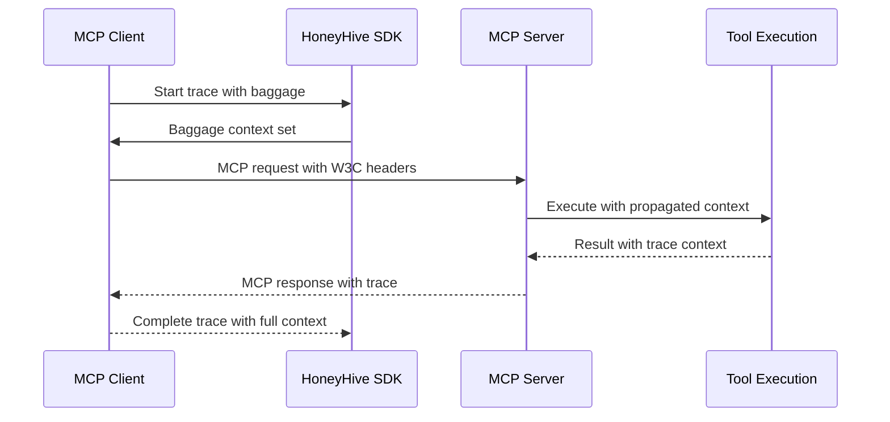

# Technical Specification - OpenInference MCP Instrumentor Integration

**Document Version**: 1.0  
**Date**: 2025-09-03  
**Author**: Agent OS  
**Review Status**: Draft  

## 1. Overview

This document provides the technical specification for integrating the OpenInference Model Context Protocol (MCP) instrumentor into the HoneyHive Python SDK's BYOI (Bring Your Own Instrumentor) architecture.

## 2. Architecture Integration

### 2.1 Current BYOI Architecture

The HoneyHive SDK currently supports instrumentor integration through:

```python
class HoneyHiveTracer:
    def __init__(self, instrumentors: Optional[list] = None, ...):
        # ...
        if instrumentors:
            self._integrate_instrumentors(instrumentors)
    
    def _integrate_instrumentors(self, instrumentors: list) -> None:
        """Automatically integrate with provided instrumentors."""
        for instrumentor in instrumentors:
            try:
                if hasattr(instrumentor, "instrument") and callable(
                    getattr(instrumentor, "instrument")
                ):
                    instrumentor.instrument()
                    # Success logging
                else:
                    # Skip warning
            except Exception as e:
                # Error handling
```

### 2.2 MCP Instrumentor Integration

The MCP instrumentor follows the same OpenInference pattern:

```python
from openinference.instrumentation.mcp import MCPInstrumentor

# Standard integration pattern - no changes needed to core architecture
instrumentor = MCPInstrumentor()
tracer = HoneyHiveTracer.init(
    api_key="key",
    project="project", 
    instrumentors=[instrumentor]  # Existing BYOI pattern
)
```

### 2.3 Integration Validation

The existing integration logic should work without modification because:

1. **Standard Interface**: MCP instrumentor implements standard `instrument()` method
2. **OpenTelemetry Compliance**: Uses standard OTEL span creation patterns
3. **Context Propagation**: Leverages W3C baggage for context passing
4. **Error Handling**: Graceful degradation on integration failures

## 3. Dependency Management

### 3.1 Version Validation Process

**MANDATORY: Package Version Lookup** (completed 2025-09-03):
```bash
# Required validation before specification finalization
python3 -m pip index versions openinference-instrumentation-mcp
# Result: Latest version 1.3.0 (verified 2025-09-03)
# Available versions: 1.3.0, 1.2.1, 1.2.0, 1.1.0
```

### 3.2 Optional Dependency Structure

```toml
# pyproject.toml
[project.optional-dependencies]
mcp = [
    "openinference-instrumentation-mcp>=1.3.0",
]

# Combined installation patterns
all-integrations = [
    "openinference-instrumentation-anthropic>=0.1.0",
    "openinference-instrumentation-google-generativeai>=0.1.0", 
    "openinference-instrumentation-mcp>=0.1.0",
    "openinference-instrumentation-openai>=0.6.0",
]
```

### 3.3 Import Strategy

```python
# Lazy import pattern for optional dependencies
def get_mcp_instrumentor():
    """Get MCP instrumentor if available."""
    try:
        from openinference.instrumentation.mcp import MCPInstrumentor
        return MCPInstrumentor()
    except ImportError:
        raise ImportError(
            "MCP instrumentor not available. Install with: pip install honeyhive[mcp]"
        )
```

## 4. Span Attribute Specification

### 4.1 Expected MCP Span Attributes

Based on OpenInference MCP instrumentor specification:

```python
# MCP Client Spans
{
    "mcp.client.name": "financial-client",
    "mcp.server.name": "financial-analysis-server", 
    "mcp.request.type": "call_tool",
    "mcp.tool.name": "analyze_stock",
    "mcp.request.params": {"ticker": "AAPL", "time_period": "short-term"},
    "mcp.session.id": "session_123",
    "openinference.span.kind": "TOOL"  # OpenInference standard
}

# MCP Server Spans  
{
    "mcp.server.name": "financial-analysis-server",
    "mcp.tool.name": "analyze_stock", 
    "mcp.tool.parameters": {"ticker": "AAPL", "time_period": "short-term"},
    "mcp.response.result": {"analysis": "...", "recommendation": "buy"},
    "openinference.span.kind": "TOOL"
}
```

### 4.2 HoneyHive Attribute Enrichment

HoneyHive's span processor should automatically enrich MCP spans:

```python
# Existing span processor logic applies to MCP spans
def on_start(self, span: "ReadableSpan", parent_context: Optional["Context"] = None):
    # Existing baggage context extraction
    baggage_context = baggage.get_all(parent_context)
    
    # Apply to MCP spans automatically
    if "mcp." in span.name or any("mcp." in key for key in span.attributes.keys()):
        # MCP span detected - apply HoneyHive enrichment
        self._enrich_with_honeyhive_context(span, baggage_context)
```

## 5. Context Propagation

### 5.1 Baggage Propagation Pattern

MCP instrumentor should leverage existing HoneyHive baggage context:

```python
# Existing HoneyHive baggage setup (no changes needed)
def _setup_baggage_context(self) -> None:
    """Set up baggage with session context for OpenInference integration."""
    try:
        ctx = context.set_value(
            "honeyhive.project", self.project,
            context.set_value("honeyhive.source", self.source, context.get_current())
        )
        if self.session_id:
            ctx = context.set_value("honeyhive.session.id", self.session_id, ctx)
        
        # This baggage will automatically propagate to MCP spans
        context.attach(ctx)
    except Exception as e:
        # Existing error handling
```

### 5.2 Cross-Boundary Propagation



## 6. Error Handling Specification

### 6.1 Integration Failure Handling

```python
def _integrate_instrumentors(self, instrumentors: list) -> None:
    """Enhanced error handling for MCP instrumentor."""
    for instrumentor in instrumentors:
        try:
            if hasattr(instrumentor, "instrument"):
                name = instrumentor.__class__.__name__
                
                # MCP-specific validation
                if "MCP" in name:
                    self._validate_mcp_environment()
                
                instrumentor.instrument()
                print(f"✓ {name} integrated.")
            else:
                print(f"⚠️  Skipping object without instrument method: {type(instrumentor)}")
        except ImportError as e:
            if "mcp" in str(e).lower():
                print(f"⚠️  MCP instrumentor requires: pip install honeyhive[mcp]")
            else:
                print(f"⚠️  Failed to integrate instrumentor: {e}")
        except Exception as e:
            print(f"⚠️  Failed to integrate instrumentor {type(instrumentor)}: {e}")

def _validate_mcp_environment(self) -> None:
    """Validate MCP-specific environment requirements."""
    # Check for common MCP dependencies
    try:
        import mcp  # or whatever the core MCP package is
    except ImportError:
        print("ℹ️  MCP instrumentor available but MCP runtime not detected")
```

### 6.2 Runtime Error Handling

```python
# MCP spans should gracefully degrade on errors
def on_start(self, span: "ReadableSpan", parent_context: Optional["Context"] = None):
    try:
        # Existing span processing logic
        self._process_span(span, parent_context)
    except Exception as e:
        # MCP spans continue even if HoneyHive processing fails
        print(f"⚠️  HoneyHive span processing failed: {e}")
        # Span continues with MCP instrumentation only
```

## 7. Performance Considerations

### 7.1 Instrumentation Overhead

Expected performance characteristics:
- **Initialization**: <10ms additional overhead for MCP instrumentor
- **Per-Request**: <1ms overhead per MCP tool call
- **Memory**: <5MB additional memory usage
- **Network**: Minimal additional trace data volume

### 7.2 Optimization Strategies

```python
# Lazy initialization for MCP instrumentor
class HoneyHiveTracer:
    def __init__(self, ...):
        self._mcp_instrumentor = None
        # Only initialize if MCP spans are detected
    
    def _ensure_mcp_instrumentation(self):
        """Initialize MCP instrumentor on first use."""
        if self._mcp_instrumentor is None and self._has_mcp_activity():
            self._initialize_mcp_instrumentor()
```

## 8. Testing Strategy - ZERO-FAILING-TESTS POLICY

**🚨 CRITICAL: All tests must pass 100% before any commit**

### 8.1 Unit Test Requirements - MANDATORY

```python
# tests/test_mcp_integration.py
class TestMCPIntegration:
    def test_mcp_instrumentor_integration(self):
        """Test MCP instrumentor integrates without errors."""
        # Test instrumentor instantiation
        # Test integration with HoneyHive tracer
        # Validate no exceptions during integration
    
    def test_mcp_instrumentor_optional_dependency(self):
        """Test graceful handling when MCP not available."""
        # Mock ImportError for MCP instrumentor
        # Verify graceful degradation
        # Ensure other instrumentors still work
    
    def test_mcp_span_attribute_enrichment(self):
        """Test HoneyHive enriches MCP spans correctly."""
        # Create mock MCP span
        # Verify HoneyHive attributes added
        # Check baggage context propagation
```

### 8.2 Integration Test Requirements - MANDATORY

```python
# tests/test_mcp_context_propagation.py  
class TestMCPContextPropagation:
    @pytest.mark.asyncio
    async def test_mcp_client_server_propagation(self):
        """Test trace context propagates across MCP boundaries."""
        # Setup MCP client with HoneyHive tracing
        # Execute MCP tool call
        # Verify parent-child span relationships
        # Check baggage context preservation
    
    def test_mcp_error_propagation(self):
        """Test error handling in MCP traces."""
        # Simulate MCP tool execution error
        # Verify error spans created correctly
        # Check error context propagation
```

### 8.3 Performance Test Requirements - MANDATORY

```python
# tests/performance/test_mcp_performance.py
class TestMCPPerformance:
    def test_mcp_instrumentation_overhead(self):
        """Measure MCP instrumentation performance impact."""
        # Benchmark with/without MCP instrumentation
        # Verify overhead within acceptable limits
        # Test memory usage impact
    
    def test_mcp_concurrent_operations(self):
        """Test MCP instrumentation under concurrent load."""
        # Multiple concurrent MCP operations
        # Verify trace context isolation
        # Check performance degradation
```

## 9. Documentation Requirements - DIVIO SYSTEM COMPLIANCE

**🎯 Following the [Divio Documentation System](https://docs.divio.com/documentation-system/)**

### 9.1 How-To Guide Structure - PROBLEM-ORIENTED

```rst
# docs/how-to/integrations/mcp.rst
Model Context Protocol (MCP) Integration
========================================

Learn how to integrate HoneyHive with MCP clients and servers.

Prerequisites
-------------
- HoneyHive Python SDK installed
- MCP client/server application
- OpenInference MCP instrumentor

Installation
------------
.. code-block:: bash
   
   pip install honeyhive[mcp]

Quick Start
-----------
[Problem-oriented examples]

Advanced Configuration
----------------------
[Complex scenarios]

Troubleshooting
---------------
[Common issues and solutions]
```

### 9.2 Tutorial Integration Requirements - MANDATORY

**All new LLM instrumentors must be added to tutorial**:

```rst
# docs/tutorials/03-llm-integration.rst
MCP (Model Context Protocol) Integration
-----------------------------------------

MCP enables agents to securely connect to data sources and tools.

**Step 1: Install MCP Instrumentor**

.. code-block:: bash

   pip install honeyhive[mcp]

**Step 2: Set Up MCP Tracing**

.. code-block:: python

   from honeyhive import HoneyHiveTracer, trace
   from honeyhive.models import EventType
   from openinference.instrumentation.mcp import MCPInstrumentor
   
   # Initialize with MCP instrumentor
   tracer = HoneyHiveTracer.init(
       api_key="your-honeyhive-api-key",
       project="mcp-tutorial",
       instrumentors=[MCPInstrumentor()]
   )
   
   @trace(event_type=EventType.tool)
   def mcp_tool_example(query: str) -> str:
       """Example MCP tool execution."""
       # MCP client-server communication automatically traced
       return process_mcp_request(query)
```

### 9.3 Example Requirements - TYPE SAFETY MANDATORY

```python
# examples/mcp_integration.py
"""
Complete example of MCP integration with HoneyHive.

This example demonstrates:
1. MCP instrumentor integration
2. Client-server trace propagation
3. Multi-instrumentor usage
4. Error handling patterns
5. Type-safe EventType usage
"""

import asyncio
from typing import Optional

from honeyhive import HoneyHiveTracer, trace
from honeyhive.models import EventType

# Proper imports with error handling
try:
    from openinference.instrumentation.mcp import MCPInstrumentor
    MCP_AVAILABLE = True
except ImportError:
    MCP_AVAILABLE = False
    print("MCP instrumentor not available. Install with: pip install honeyhive[mcp]")

async def main() -> None:
    """Demonstrate MCP tracing integration."""
    if not MCP_AVAILABLE:
        print("Skipping MCP example - instrumentor not available")
        return
    
    # Initialize tracer with MCP instrumentor
    tracer = HoneyHiveTracer.init(
        api_key="your-honeyhive-api-key",
        project="mcp-demo",
        source="development",
        instrumentors=[MCPInstrumentor()]
    )
    
    # Your MCP application code here
    # (Automatically traced with HoneyHive context)
    
if __name__ == "__main__":
    asyncio.run(main())
```

## 10. Acceptance Criteria - MANDATORY COMPLIANCE

### 10.1 Functional Acceptance - 100% REQUIRED

- [ ] **BYOI Integration**: MCP instrumentor integrates with zero changes to core BYOI architecture
- [ ] **Context Propagation**: Trace context propagates correctly across MCP client-server boundaries
- [ ] **Span Enrichment**: MCP-specific span attributes captured and enriched with HoneyHive context
- [ ] **Error Handling**: Graceful degradation when MCP instrumentor unavailable
- [ ] **Performance Compliance**: Overhead documented and verified <5%
- [ ] **Version Validation**: Latest package version (1.3.0) used and documented

### 10.2 Quality Acceptance - ZERO-FAILING-TESTS POLICY

- [ ] **Unit Tests**: 100% passing (>95% coverage for new code)
- [ ] **Integration Tests**: Real MCP client-server scenarios (100% passing)
- [ ] **Compatibility Matrix**: `tests/compatibility_matrix/test_mcp.py` (100% passing)
- [ ] **Documentation Build**: Sphinx builds without warnings (`tox -e docs`)
- [ ] **Code Quality**: All gates pass (`tox -e format && tox -e lint`)
- [ ] **Type Safety**: All examples use EventType enums, no string literals
- [ ] **Navigation Validation**: All docs pass `python docs/utils/validate_navigation.py --local`
- [ ] **No Regressions**: Existing functionality unaffected (100% passing tests)

### 10.3 User Experience Acceptance - DIVIO COMPLIANCE

- [ ] **Installation**: `pip install honeyhive[mcp]` works correctly
- [ ] **Zero-code Integration**: Existing MCP applications work unchanged
- [ ] **Error Messages**: Clear guidance for installation and configuration issues
- [ ] **Documentation Quality**: Working examples with complete imports and EventType enums
- [ ] **API Consistency**: Patterns match other instrumentors exactly
- [ ] **Tutorial Integration**: MCP section added to `docs/tutorials/03-llm-integration.rst`
- [ ] **Navigation**: Consistent "See Also" sections across all integration docs

## 11. Implementation Timeline

### Week 1: Core Integration
- Days 1-3: Dependency setup and basic integration
- Days 4-5: Documentation and examples

### Week 2: Advanced Features & Testing
- Days 6-8: Context propagation, performance testing
- Days 9-10: Comprehensive testing and quality validation

## 12. Risk Assessment & Mitigation

### Technical Risks
- **MCP Instrumentor Maturity**: Monitor OpenInference MCP package stability
- **Context Propagation Complexity**: Extensive async boundary testing
- **Performance Impact**: Continuous benchmarking and optimization

### Mitigation Strategies
- **Early Integration Testing**: Validate with real MCP applications
- **Community Engagement**: Work with OpenInference maintainers
- **Fallback Handling**: Graceful degradation patterns
- **Performance Monitoring**: Automated performance regression detection

## 13. Future Considerations

### Phase 2 Enhancements
- MCP server-side instrumentation helpers
- Custom MCP span processors for advanced use cases
- MCP-specific evaluation metrics and debugging tools
- Integration with enterprise MCP server patterns

### Long-term Integration
- LangChain MCP integration patterns
- CrewAI MCP support optimization
- Custom MCP tool library instrumentation
- Advanced MCP debugging and profiling tools
