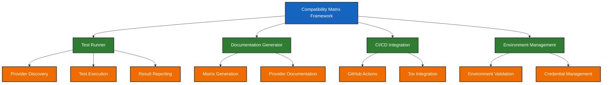

# Compatibility Matrix Framework - HoneyHive Python SDK

**Date**: 2025-09-05  
**Status**: Active  
**Scope**: Testing Infrastructure  
**Priority**: High  

## Problem Statement

The HoneyHive Python SDK supports multiple model providers through OpenInference instrumentors via the "Bring Your Own Instrumentor" (BYOI) architecture. However, the compatibility matrix framework was in a stubbed/incomplete state with several critical issues:

1. **Naming Mismatch**: Test runner expected old file names (`test_openai.py`) but actual files used new naming (`test_openinference_openai.py`)
2. **Environment Variable Drift**: Documentation and tox configuration included unused variables and missed required ones
3. **Missing Python Version Support**: No testing across supported Python versions (3.11, 3.12, 3.13)
4. **Incomplete Integration**: Not integrated with main tox test suite or CI/CD pipeline
5. **Outdated Documentation**: Generated docs didn't match actual implementation

### Impact Assessment

- **Testing Reliability**: Compatibility tests couldn't run due to configuration mismatches
- **Documentation Quality**: Inaccurate environment variable documentation
- **Python Version Coverage**: No validation across supported Python versions
- **Developer Experience**: Confusing setup process with incorrect documentation

## Solution Framework

### Requirements

**REQ-COMPAT-001**: Test Runner Alignment
- Test runner MUST recognize actual file naming patterns
- Environment variables MUST match actual test requirements
- Automatic .env file loading for seamless credential management

**REQ-COMPAT-002**: Python Version Matrix
- MUST test across all HoneyHive SDK supported Python versions (3.11, 3.12, 3.13)
- MUST document instrumentor compatibility per Python version
- MUST provide clear version recommendations

**REQ-COMPAT-003**: Tox Integration
- MUST integrate with main tox test suite
- MUST support version-specific testing environments
- MUST pass environment variables correctly

**REQ-COMPAT-004**: Documentation Accuracy
- Environment variable documentation MUST match actual test requirements
- Generated compatibility matrix MUST reflect actual implementation
- MUST include Python version compatibility information

#### Implementation Components

**COMP-001**: Test Runner (`tests/compatibility_matrix/run_compatibility_tests.py`)
- Load environment variables from `.env` file automatically
- Map test files to provider configurations using actual file names
- Generate detailed reports with Python version information

**COMP-002**: Tox Environments (`tox.ini`)
- `compatibility` - Run tests on current Python version
- `compatibility-py311` - Test on Python 3.11
- `compatibility-py312` - Test on Python 3.12  
- `compatibility-py313` - Test on Python 3.13
- `compatibility-all` - Test across all versions

**COMP-003**: Version Matrix Generator (`tests/compatibility_matrix/generate_version_matrix.py`)
- Generate comprehensive Python version compatibility documentation
- Include instrumentor compatibility per version
- Provide migration guidance and recommendations

**COMP-004**: Environment Configuration
- `tests/compatibility_matrix/env.example` - Complete template with all required variables
- `tests/compatibility_matrix/README.md` - Accurate documentation
- Automatic .env loading in test runner

## Implementation Details

### Test File Naming Convention
**Pattern**: `test_<instrumentor>_<provider>.py`
- `test_openinference_openai.py` - OpenInference + OpenAI
- `test_traceloop_anthropic.py` - Traceloop + Anthropic

### Framework Architecture



## Validation Protocol

### Pre-Implementation Validation

Before implementing compatibility matrix changes, AI assistants MUST:

```bash
# 1. Verify current test files
ls tests/compatibility_matrix/test_*.py

# 2. Check environment variable usage
grep -r "required_env" tests/compatibility_matrix/run_compatibility_tests.py

# 3. Validate tox configuration
grep -A 20 "\[testenv:compatibility\]" tox.ini

# 4. Confirm Python version support
grep "requires-python" pyproject.toml
```

### Implementation Tasks

#### TASK-001: Test Runner Configuration Update

**Objective**: Align test runner with actual file names and environment variables

**Files Modified**:
- `tests/compatibility_matrix/run_compatibility_tests.py`

**Changes Required**:
```python
# Update test_configs to match actual files
"test_openinference_openai.py": {
    "provider": "OpenAI", 
    "instrumentor": "openinference-instrumentation-openai",
    "category": "openinference",
    "required_env": ["OPENAI_API_KEY"]
}
```

**Validation**:
```bash
python tests/compatibility_matrix/run_compatibility_tests.py --test test_openinference_openai.py
```

#### TASK-002: Environment Variable Cleanup

**Objective**: Synchronize environment variable documentation with actual test requirements

**Files Modified**:
- `tests/compatibility_matrix/env.example`
- `tests/compatibility_matrix/README.md`
- `tox.ini`

**Changes Required**:
- Add missing Azure OpenAI variables
- Add Google ADK API key
- Remove unused variables (COHERE, MISTRAL, GROQ, HUGGINGFACE)
- Update documentation to match actual test requirements

**Validation**:
```bash
# Verify all required variables are documented
grep -f <(grep "required_env" tests/compatibility_matrix/run_compatibility_tests.py | grep -o '"[^"]*"') tests/compatibility_matrix/env.example
```

#### TASK-003: Python Version Matrix Implementation

**Objective**: Add comprehensive Python version testing and documentation

**Files Modified**:
- `tox.ini` - Add version-specific environments
- `tests/compatibility_matrix/generate_version_matrix.py` - New file
- Test runner - Add Python version reporting

**Tox Environments Added**:
```ini
[testenv:compatibility-py311]
[testenv:compatibility-py312] 
[testenv:compatibility-py313]
[testenv:compatibility-all]
```

**Validation**:
```bash
tox -e compatibility-py312
python tests/compatibility_matrix/generate_version_matrix.py
```

## Success Criteria

### Functional Requirements

**SUCCESS-001**: Test Execution
- ✅ All 13 implemented test files execute successfully
- ✅ Test runner correctly identifies and runs all provider tests using actual file names
- ✅ Environment variables loaded automatically from `.env` file
- ✅ Tests can be run individually or as complete suite

**SUCCESS-002**: Python Version Compatibility  
- ✅ Framework tests across Python 3.11, 3.12, 3.13
- ✅ Version-specific compatibility matrix generated
- ✅ Clear recommendations provided for each Python version
- ✅ Instrumentor compatibility documented per version

**SUCCESS-003**: Documentation Accuracy
- ✅ Environment variable documentation matches actual test requirements
- ✅ Generated compatibility matrix reflects actual implementation
- ✅ Python version compatibility clearly documented
- ✅ Migration guidance provided for unsupported combinations

**SUCCESS-004**: Integration Quality
- ✅ Tox environments work correctly for all Python versions
- ✅ Environment variables passed correctly through tox
- ✅ Reports generated with proper Python version information
- ✅ Framework integrates seamlessly with existing development workflow

### Quality Gates

**GATE-001**: Zero Configuration Drift
```bash
# All environment variables in tox.ini MUST be used by actual tests
# All required_env in test configs MUST be documented in env.example
# No unused variables in passenv configuration
```

**GATE-002**: Complete Python Version Coverage
```bash
# All HoneyHive SDK supported versions (3.11, 3.12, 3.13) MUST have tox environments
# Version compatibility matrix MUST be generated successfully
# All tests MUST report Python version in output
```

**GATE-003**: Documentation Consistency
```bash
# README.md environment variables MUST match env.example
# Generated matrix MUST reflect actual test file contents
# No references to non-existent test files or providers
```

## Testing Protocol

### Validation Commands

**PRE-VALIDATION**: Before any changes
```bash
# Verify current state
ls tests/compatibility_matrix/test_*.py | wc -l  # Should show 13 files
grep "required_env" tests/compatibility_matrix/run_compatibility_tests.py | wc -l  # Check configs
```

**POST-IMPLEMENTATION**: After changes
```bash
# Test individual provider
python tests/compatibility_matrix/run_compatibility_tests.py --test test_openinference_openai.py

# Test all providers
tox -e compatibility

# Test across Python versions  
tox -e compatibility-py311
tox -e compatibility-py312
tox -e compatibility-py313

# Generate version matrix
python tests/compatibility_matrix/generate_version_matrix.py

# Validate environment variables
grep -f <(grep "required_env" tests/compatibility_matrix/run_compatibility_tests.py | grep -o '"[^"]*"') tests/compatibility_matrix/env.example
```

### Error Handling Requirements

**REQ-ERROR-001**: Graceful Degradation
- Tests MUST pass even if some providers are unavailable
- Clear distinction between skipped (missing credentials) and failed (code errors)
- Detailed error messages for debugging

**REQ-ERROR-002**: Comprehensive Reporting
- Total test count, passed, failed, skipped with clear breakdown
- Python version information in all reports
- Execution time tracking for performance monitoring

## Implementation Status

### ✅ Completed Tasks

1. **Test Runner Fixes** - Updated to match actual file names and load .env automatically
2. **Environment Variable Cleanup** - Synchronized documentation with actual requirements
3. **Python Version Matrix** - Added comprehensive version testing and documentation
4. **Tox Integration** - Added compatibility environments for all Python versions
5. **Documentation Updates** - Accurate environment variable and compatibility documentation

### Current Test Coverage

**Implemented Tests (13 total)**:
- **OpenInference**: OpenAI, Azure OpenAI, Anthropic, Google AI, Google ADK, AWS Bedrock, MCP (7 tests)
- **Traceloop**: OpenAI, Azure OpenAI, Anthropic, Google AI, AWS Bedrock, MCP (6 tests)

**Python Version Support**:
- **3.11**: ✅ Fully Supported (Minimum version)
- **3.12**: ✅ Fully Supported (Recommended)  
- **3.13**: ✅ Fully Supported (Latest)

### Usage Examples

```bash
# Quick test with credentials from .env
tox -e compatibility

# Test specific Python version
tox -e compatibility-py312

# Generate comprehensive version matrix
tox -e compatibility-all
```

## Maintenance Protocol

### Regular Validation
- **Weekly**: Run full compatibility suite across all Python versions
- **Monthly**: Update instrumentor compatibility matrix
- **Per Release**: Validate all environment variables and documentation

### Update Process
1. **New Instrumentor**: Add test file following naming convention
2. **Environment Changes**: Update env.example, README.md, and tox.ini simultaneously  
3. **Python Version Changes**: Update pyproject.toml, tox environments, and version matrix

This specification ensures the compatibility matrix framework provides reliable, comprehensive testing across all HoneyHive SDK supported Python versions while maintaining accurate documentation and seamless developer experience.
