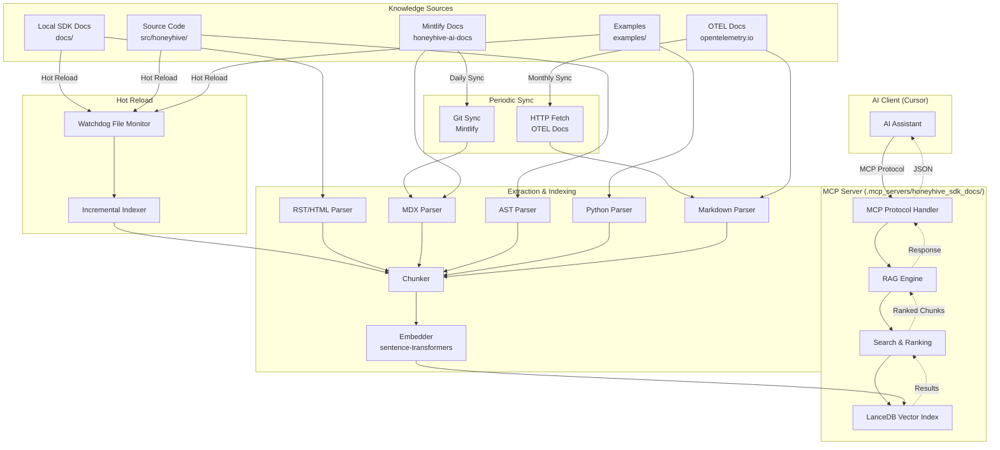
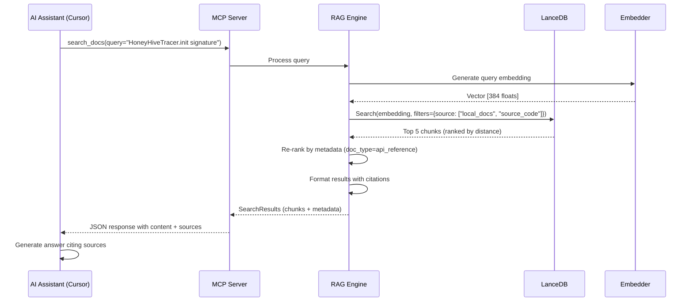

# HoneyHive SDK Documentation MCP Server
# Architecture & Design Document
# 100% AI Infrastructure Authorship

**Date:** October 4, 2025  
**Status:** Design Phase  
**Authorship:** 100% AI-authored via human orchestration

---

## 1. SYSTEM OVERVIEW

### 1.1 High-Level Architecture



### 1.2 Data Flow: Query to Response



---

## 2. COMPONENT BREAKDOWN

### 2.1 MCP Server Core

**File:** `.mcp_servers/honeyhive_sdk_docs/honeyhive_docs_rag.py`

**Responsibilities:**
- Initialize MCP server
- Register MCP tools (search_docs, get_api_reference, etc.)
- Handle tool invocations
- Manage RAG engine lifecycle
- Initialize HoneyHive tracing (dogfooding)

**Key Functions:**
```python
def create_server() -> Server:
    """Create and configure MCP server with all tools."""
    server = Server("honeyhive-sdk-docs")
    
    # Initialize RAG engine
    rag_engine = RAGEngine(...)
    
    # Register tools
    @server.list_tools()
    def handle_list_tools() -> list[Tool]:
        return [
            Tool(name="search_docs", ...),
            Tool(name="get_api_reference", ...),
            Tool(name="get_integration_guide", ...),
            Tool(name="search_examples", ...)
        ]
    
    @server.call_tool()
    @trace(tracer=tracer, event_type=EventType.tool)
    def handle_call_tool(name: str, arguments: dict) -> list[TextContent]:
        if name == "search_docs":
            return search_docs(arguments)
        ...
    
    return server
```

---

### 2.2 RAG Engine

**File:** `.mcp_servers/honeyhive_sdk_docs/rag_engine.py`

**Responsibilities:**
- Semantic search over LanceDB index
- Query embedding generation
- Result ranking and filtering
- Cache management (optional)
- Hybrid search (embedding + keyword fallback)

**Key Classes:**
```python
class RAGEngine:
    def __init__(self, index_path: Path, embedding_model: str):
        self.db = lancedb.connect(index_path)
        self.table = self.db.open_table("honeyhive_docs")
        self.embedder = SentenceTransformer(embedding_model)
    
    def search(
        self, 
        query: str, 
        filters: dict = None, 
        top_k: int = 5
    ) -> list[SearchResult]:
        """
        Semantic search with optional metadata filtering.
        
        Returns:
            List of SearchResult with content, metadata, score
        """
        # Generate query embedding
        query_embedding = self.embedder.encode(query)
        
        # Build filter expression
        filter_expr = self._build_filter(filters)
        
        # Search LanceDB
        results = self.table.search(query_embedding) \
            .where(filter_expr) \
            .limit(top_k) \
            .to_list()
        
        # Re-rank by metadata relevance
        ranked = self._rerank(results, query, filters)
        
        return ranked
    
    def _rerank(self, results, query, filters):
        """
        Re-rank results by:
        1. Semantic distance (LanceDB score)
        2. Doc type priority (api_reference > tutorial)
        3. Source priority (local_docs > otel)
        4. Recency (newer docs ranked higher)
        """
        ...
```

---

### 2.3 Parsers & Extractors

#### 2.3.1 Sphinx RST/HTML Parser

**File:** `.mcp_servers/honeyhive_sdk_docs/parsers/sphinx_parser.py`

**Strategy:**
- Parse RST source for narrative docs (tutorials, how-to, concepts)
- Parse HTML output for API reference (autodoc from source)

**RST Parsing:**
```python
class SphinxRSTParser:
    def parse(self, rst_file: Path) -> list[DocumentChunk]:
        """
        Parse RST file into chunks.
        
        Chunking strategy:
        - Split by headers (##, ###, ####)
        - Keep code blocks intact
        - Preserve cross-references (:ref:`...`)
        - Extract metadata from directives (.. note::, .. warning::)
        """
        with open(rst_file) as f:
            content = f.read()
        
        # Parse with docutils
        document = rst.parse(content)
        
        chunks = []
        for section in document.sections:
            chunk = DocumentChunk(
                content=section.text,
                metadata={
                    "source": "local_docs",
                    "file_path": str(rst_file.relative_to(project_root)),
                    "doc_type": self._infer_doc_type(rst_file),
                    "title": section.title,
                    "headers": section.breadcrumb,
                    "last_updated": rst_file.stat().st_mtime
                }
            )
            chunks.append(chunk)
        
        return chunks
```

**HTML API Reference Parsing:**
```python
class SphinxHTMLParser:
    def parse(self, html_file: Path) -> list[DocumentChunk]:
        """
        Parse Sphinx HTML output for API reference.
        
        Target elements:
        - <dl class="py class"> (class definitions)
        - <dl class="py function"> (function signatures)
        - <dl class="py method"> (method signatures)
        - <dl class="py attribute"> (attributes)
        """
        soup = BeautifulSoup(html_file.read_text(), "html.parser")
        
        chunks = []
        
        # Extract class definitions
        for class_dl in soup.find_all("dl", class_="py class"):
            signature = class_dl.find("dt")
            docstring = class_dl.find("dd")
            
            chunk = DocumentChunk(
                content=f"{signature.text}\n\n{docstring.text}",
                metadata={
                    "source": "local_docs",
                    "file_path": str(html_file.relative_to(project_root)),
                    "doc_type": "api_reference",
                    "symbol": signature.get("id"),  # e.g., "HoneyHiveTracer"
                    "symbol_type": "class"
                }
            )
            chunks.append(chunk)
        
        # Extract methods similarly...
        
        return chunks
```

#### 2.3.2 Mintlify MDX Parser

**File:** `.mcp_servers/honeyhive_sdk_docs/parsers/mintlify_parser.py`

**Strategy:**
- Clone honeyhive-ai-docs repo
- Parse MDX files (markdown with React components)
- Handle tabbed interfaces (multi-language examples)

```python
class MintlifyMDXParser:
    def parse(self, mdx_file: Path) -> list[DocumentChunk]:
        """
        Parse Mintlify MDX file.
        
        Challenges:
        - React components: <Tabs>, <Tab>, <CodeGroup>
        - Multi-language examples (Python, JavaScript)
        - Platform features vs SDK docs
        
        Strategy:
        - Strip React components, extract content
        - Tag Python examples with language=python
        - Infer doc_type from directory structure
        """
        with open(mdx_file) as f:
            content = f.read()
        
        # Remove React components
        content_clean = self._strip_jsx(content)
        
        # Extract frontmatter (YAML)
        frontmatter, body = self._parse_frontmatter(content_clean)
        
        # Split by headers
        sections = self._split_by_headers(body)
        
        chunks = []
        for section in sections:
            chunk = DocumentChunk(
                content=section.text,
                metadata={
                    "source": "mintlify",
                    "file_path": str(mdx_file.relative_to(mintlify_repo)),
                    "doc_type": self._infer_doc_type(mdx_file),
                    "title": section.title,
                    "language": self._extract_language(section),  # python|javascript|rest
                    "last_updated": frontmatter.get("date", mdx_file.stat().st_mtime)
                }
            )
            chunks.append(chunk)
        
        return chunks
```

#### 2.3.3 Python Source Code AST Parser

**File:** `.mcp_servers/honeyhive_sdk_docs/parsers/source_parser.py`

**Strategy:**
- Parse Python files with `ast` module
- Extract docstrings, signatures, type hints

```python
class PythonSourceParser:
    def parse(self, py_file: Path) -> list[DocumentChunk]:
        """
        Parse Python source code into chunks.
        
        Chunk per symbol:
        - Module docstring
        - Class definition + docstring
        - Function/method signature + docstring
        
        Metadata includes:
        - symbol: Full qualified name (e.g., "HoneyHiveTracer.init")
        - line_range: "12:45" (for source linking)
        - signature: "def init(api_key: str, project: str, ...)"
        - type_hints: Extracted from annotations
        """
        with open(py_file) as f:
            tree = ast.parse(f.read())
        
        chunks = []
        
        # Module docstring
        if ast.get_docstring(tree):
            chunks.append(self._create_chunk(
                content=ast.get_docstring(tree),
                symbol=py_file.stem,
                symbol_type="module",
                line_range="1:1"
            ))
        
        # Classes and methods
        for node in ast.walk(tree):
            if isinstance(node, ast.ClassDef):
                chunks.append(self._create_class_chunk(node, py_file))
                for method in node.body:
                    if isinstance(method, ast.FunctionDef):
                        chunks.append(self._create_method_chunk(method, node, py_file))
            
            elif isinstance(node, ast.FunctionDef):
                chunks.append(self._create_function_chunk(node, py_file))
        
        return chunks
    
    def _create_method_chunk(self, node, class_node, py_file):
        """Extract method signature + docstring."""
        signature = self._extract_signature(node)
        docstring = ast.get_docstring(node) or ""
        
        return DocumentChunk(
            content=f"{signature}\n\n{docstring}",
            metadata={
                "source": "source_code",
                "file_path": str(py_file.relative_to(project_root)),
                "doc_type": "api_reference",
                "symbol": f"{class_node.name}.{node.name}",
                "symbol_type": "method",
                "line_range": f"{node.lineno}:{node.end_lineno}",
                "signature": signature
            }
        )
```

#### 2.3.4 Examples Parser

**File:** `.mcp_servers/honeyhive_sdk_docs/parsers/examples_parser.py`

**Strategy:**
- Parse full Python example files
- Extract imports, code, inline comments

```python
class ExamplesParser:
    def parse(self, example_file: Path) -> list[DocumentChunk]:
        """
        Parse example Python file into chunks.
        
        Strategy:
        - One chunk per example file (keep full context)
        - Extract imports (shows dependencies)
        - Preserve inline comments (important explanations)
        - Infer provider from file path (e.g., examples/integrations/openai.py)
        """
        with open(example_file) as f:
            content = f.read()
        
        # Parse imports
        tree = ast.parse(content)
        imports = [node for node in tree.body if isinstance(node, (ast.Import, ast.ImportFrom))]
        import_lines = [ast.unparse(imp) for imp in imports]
        
        # Infer provider
        provider = self._infer_provider(example_file)
        
        chunk = DocumentChunk(
            content=content,
            metadata={
                "source": "examples",
                "file_path": str(example_file.relative_to(project_root)),
                "doc_type": "example",
                "provider": provider,  # e.g., "openai", "anthropic"
                "imports": import_lines,
                "last_updated": example_file.stat().st_mtime
            }
        )
        
        return [chunk]
```

#### 2.3.5 OpenTelemetry Docs Parser

**File:** `.mcp_servers/honeyhive_sdk_docs/parsers/otel_parser.py`

**Strategy:**
- Download curated subset of OTEL docs
- Parse markdown, focus on Python SDK and tracing

```python
class OTELDocsParser:
    CURATED_URLS = [
        "https://opentelemetry.io/docs/concepts/signals/traces/",
        "https://opentelemetry.io/docs/languages/python/instrumentation/",
        "https://opentelemetry.io/docs/specs/otel/trace/api/",
        "https://opentelemetry.io/docs/specs/semconv/general/attributes/"
    ]
    
    def fetch_and_parse(self) -> list[DocumentChunk]:
        """
        Fetch curated OTEL docs and parse.
        
        Strategy:
        - Download HTML pages
        - Extract main content (strip nav, footer)
        - Split by headers
        - Tag with source=otel
        """
        chunks = []
        
        for url in self.CURATED_URLS:
            response = requests.get(url)
            soup = BeautifulSoup(response.text, "html.parser")
            
            # Extract main content
            main = soup.find("main") or soup.find("article")
            
            # Parse markdown-like structure
            sections = self._split_by_headers(main)
            
            for section in sections:
                chunk = DocumentChunk(
                    content=section.text,
                    metadata={
                        "source": "otel",
                        "url": url,
                        "doc_type": "concept",
                        "title": section.title,
                        "last_updated": datetime.now().isoformat()
                    }
                )
                chunks.append(chunk)
        
        return chunks
```

---

### 2.4 Chunker

**File:** `.mcp_servers/honeyhive_sdk_docs/chunker.py`

**Responsibilities:**
- Unified interface for all parsers
- Chunk validation
- Metadata enrichment
- Token counting

```python
class DocumentChunker:
    def __init__(self, max_chunk_tokens: int = 500):
        self.max_chunk_tokens = max_chunk_tokens
        self.parsers = {
            "rst": SphinxRSTParser(),
            "html": SphinxHTMLParser(),
            "mdx": MintlifyMDXParser(),
            "py": PythonSourceParser(),
            "md": MarkdownParser()
        }
    
    def chunk_file(self, file_path: Path) -> list[DocumentChunk]:
        """Route to appropriate parser based on file extension."""
        suffix = file_path.suffix.lstrip(".")
        parser = self.parsers.get(suffix)
        
        if not parser:
            raise ValueError(f"No parser for {suffix} files")
        
        chunks = parser.parse(file_path)
        
        # Validate and enrich
        for chunk in chunks:
            self._validate_chunk(chunk)
            self._enrich_metadata(chunk)
        
        return chunks
    
    def _validate_chunk(self, chunk: DocumentChunk):
        """Ensure chunk meets quality standards."""
        token_count = count_tokens(chunk.content)
        
        if token_count > self.max_chunk_tokens:
            # Split oversized chunk
            pass
        
        if token_count < 10:
            # Skip tiny chunks (likely parsing artifacts)
            pass
    
    def _enrich_metadata(self, chunk: DocumentChunk):
        """Add computed metadata."""
        chunk.metadata["token_count"] = count_tokens(chunk.content)
        chunk.metadata["char_count"] = len(chunk.content)
        chunk.metadata["indexed_at"] = datetime.now().isoformat()
```

---

### 2.5 LanceDB Schema

**File:** `.mcp_servers/honeyhive_sdk_docs/models.py`

**Schema Definition:**
```python
from pydantic import BaseModel
from typing import Literal

class DocumentChunk(BaseModel):
    """Represents a single chunk of documentation."""
    
    id: str  # UUID
    content: str  # The actual text content
    embedding: list[float]  # [384 floats] from sentence-transformers
    
    # Metadata for filtering and ranking
    metadata: ChunkMetadata

class ChunkMetadata(BaseModel):
    """Metadata for filtering, ranking, and citation."""
    
    # Source identification
    source: Literal["local_docs", "mintlify", "source_code", "examples", "otel"]
    file_path: str  # Relative to project root
    url: str | None = None  # For external sources
    
    # Document type
    doc_type: Literal["tutorial", "how-to", "explanation", "api_reference", "example", "concept"]
    
    # Content categorization
    language: Literal["python", "javascript", "rest_api", "general"] = "python"
    provider: str | None = None  # e.g., "openai", "anthropic" (for integrations)
    
    # Symbol information (for source code)
    symbol: str | None = None  # e.g., "HoneyHiveTracer.init"
    symbol_type: Literal["module", "class", "function", "method", "attribute"] | None = None
    line_range: str | None = None  # e.g., "12:45"
    signature: str | None = None  # e.g., "def init(api_key: str, ...)"
    
    # Hierarchy
    title: str  # Section or symbol title
    headers: list[str] = []  # Breadcrumb trail
    
    # Quality metadata
    token_count: int
    char_count: int
    last_updated: str  # ISO 8601 timestamp
    indexed_at: str  # ISO 8601 timestamp
```

**LanceDB Table Creation:**
```python
import lancedb
import pyarrow as pa

def create_table(db: lancedb.DB):
    """Create LanceDB table with schema."""
    
    schema = pa.schema([
        pa.field("id", pa.string()),
        pa.field("content", pa.string()),
        pa.field("embedding", pa.list_(pa.float32(), 384)),  # Fixed size
        
        # Metadata fields (flattened for querying)
        pa.field("source", pa.string()),
        pa.field("file_path", pa.string()),
        pa.field("url", pa.string()),
        pa.field("doc_type", pa.string()),
        pa.field("language", pa.string()),
        pa.field("provider", pa.string()),
        pa.field("symbol", pa.string()),
        pa.field("symbol_type", pa.string()),
        pa.field("line_range", pa.string()),
        pa.field("signature", pa.string()),
        pa.field("title", pa.string()),
        pa.field("headers", pa.list_(pa.string())),
        pa.field("token_count", pa.int32()),
        pa.field("char_count", pa.int32()),
        pa.field("last_updated", pa.string()),
        pa.field("indexed_at", pa.string())
    ])
    
    table = db.create_table("honeyhive_docs", schema=schema)
    
    # Create indexes for fast filtering
    table.create_index("source")
    table.create_index("doc_type")
    table.create_index("symbol")
    
    return table
```

---

### 2.6 Hot Reload Architecture

**File:** `.mcp_servers/honeyhive_sdk_docs/hot_reload.py`

**Strategy:**
- Use `watchdog` to monitor file changes
- Debounce rapid changes (5-second window)
- Incremental index updates (not full rebuild)

```python
from watchdog.observers import Observer
from watchdog.events import FileSystemEventHandler
import time

class DocsFileWatcher(FileSystemEventHandler):
    def __init__(self, index_builder, debounce_seconds=5):
        self.index_builder = index_builder
        self.debounce_seconds = debounce_seconds
        self.pending_files = set()
        self.last_trigger = None
    
    def on_modified(self, event):
        if event.is_directory:
            return
        
        # Filter relevant files
        if self._is_relevant(event.src_path):
            self.pending_files.add(Path(event.src_path))
            self._schedule_rebuild()
    
    def on_created(self, event):
        # Same as on_modified
        self.on_modified(event)
    
    def _is_relevant(self, path: str) -> bool:
        """Check if file should trigger rebuild."""
        relevant_suffixes = {".rst", ".py", ".md", ".mdx"}
        return Path(path).suffix in relevant_suffixes
    
    def _schedule_rebuild(self):
        """Debounce rebuilds (wait for batch of changes)."""
        self.last_trigger = time.time()
        
        # Start background thread if not already running
        if not hasattr(self, "_rebuild_thread") or not self._rebuild_thread.is_alive():
            self._rebuild_thread = threading.Thread(target=self._debounced_rebuild)
            self._rebuild_thread.start()
    
    def _debounced_rebuild(self):
        """Wait for debounce period, then rebuild."""
        while True:
            time.sleep(self.debounce_seconds)
            
            # Check if new changes came in
            if time.time() - self.last_trigger < self.debounce_seconds:
                continue  # Keep waiting
            
            # No new changes, trigger rebuild
            if self.pending_files:
                logger.info(f"Rebuilding index for {len(self.pending_files)} changed files")
                self.index_builder.incremental_update(self.pending_files)
                self.pending_files.clear()
            
            break  # Exit thread

def start_hot_reload(index_builder, watch_paths: list[Path]):
    """Start file watching for hot reload."""
    handler = DocsFileWatcher(index_builder)
    observer = Observer()
    
    for path in watch_paths:
        observer.schedule(handler, str(path), recursive=True)
    
    observer.start()
    logger.info(f"Hot reload enabled, watching: {watch_paths}")
    
    return observer
```

---

### 2.7 Periodic Sync Architecture

**File:** `.mcp_servers/honeyhive_sdk_docs/sync.py`

**Strategy:**
- Git pull for Mintlify repo (daily)
- HTTP fetch for OTEL docs (weekly)
- Track last sync timestamp

```python
class ExternalDocsSync:
    def __init__(self, index_builder):
        self.index_builder = index_builder
        self.mintlify_repo = Path(".mcp_servers/honeyhive_sdk_docs/.cache/honeyhive-ai-docs")
        self.otel_cache = Path(".mcp_servers/honeyhive_sdk_docs/.cache/otel_docs")
    
    def sync_mintlify(self):
        """Clone or pull Mintlify docs repo."""
        if not self.mintlify_repo.exists():
            logger.info("Cloning Mintlify docs repo...")
            subprocess.run([
                "git", "clone",
                "https://github.com/honeyhiveai/honeyhive-ai-docs",
                str(self.mintlify_repo)
            ])
        else:
            logger.info("Pulling latest Mintlify docs...")
            subprocess.run(["git", "pull"], cwd=self.mintlify_repo)
        
        # Reindex Mintlify docs
        self.index_builder.index_mintlify(self.mintlify_repo)
    
    def sync_otel_docs(self):
        """Fetch and cache OTEL docs."""
        logger.info("Fetching OTEL docs...")
        parser = OTELDocsParser()
        chunks = parser.fetch_and_parse()
        
        # Update index
        self.index_builder.index_chunks(chunks, source="otel")
    
    def start_periodic_sync(self, mintlify_interval=86400, otel_interval=604800):
        """
        Start background thread for periodic syncing.
        
        Args:
            mintlify_interval: Seconds between Mintlify syncs (default: 1 day)
            otel_interval: Seconds between OTEL syncs (default: 7 days)
        """
        def sync_loop():
            last_mintlify = 0
            last_otel = 0
            
            while True:
                now = time.time()
                
                # Sync Mintlify if interval elapsed
                if now - last_mintlify > mintlify_interval:
                    try:
                        self.sync_mintlify()
                        last_mintlify = now
                    except Exception as e:
                        logger.error(f"Mintlify sync failed: {e}")
                
                # Sync OTEL if interval elapsed
                if now - last_otel > otel_interval:
                    try:
                        self.sync_otel_docs()
                        last_otel = now
                    except Exception as e:
                        logger.error(f"OTEL sync failed: {e}")
                
                time.sleep(3600)  # Check every hour
        
        thread = threading.Thread(target=sync_loop, daemon=True)
        thread.start()
        logger.info("Periodic sync started (Mintlify: daily, OTEL: weekly)")
```

---

## 3. MCP TOOL SPECIFICATIONS

### 3.1 Tool: `search_docs`

**Purpose:** Unified semantic search across all documentation sources

**Signature:**
```python
def search_docs(
    query: str,
    filters: dict = None,
    top_k: int = 5
) -> list[SearchResult]
```

**Parameters:**
- `query`: Natural language search query
- `filters`: Optional metadata filters
  - `source`: Filter by source(s) (e.g., `["local_docs", "examples"]`)
  - `doc_type`: Filter by type(s) (e.g., `["tutorial", "api_reference"]`)
  - `provider`: Filter by provider (e.g., `"openai"`)
  - `language`: Filter by language (e.g., `"python"`)
- `top_k`: Number of results to return (default: 5)

**Returns:**
```python
@dataclass
class SearchResult:
    content: str              # Chunk content
    source: str               # "local_docs" | "mintlify" | ...
    file_path: str            # Relative path
    doc_type: str             # "tutorial" | "api_reference" | ...
    title: str                # Section or symbol title
    score: float              # Semantic similarity score
    metadata: ChunkMetadata   # Full metadata
```

**Example Usage:**
```python
# AI query: "How do I initialize the tracer?"
results = search_docs(
    query="initialize HoneyHiveTracer with API key",
    filters={"doc_type": ["tutorial", "api_reference"]},
    top_k=5
)

# Returns:
# 1. docs/tutorials/02-basic-tracing.rst (tutorial on init)
# 2. docs/reference/api/tracer.rst (API reference for init)
# 3. examples/basic_usage.py (working example)
# 4. src/honeyhive/tracer/core/tracer.py (source code)
# 5. mintlify/quickstart.mdx (platform docs)
```

---

### 3.2 Tool: `get_api_reference`

**Purpose:** Direct lookup of API symbol documentation

**Signature:**
```python
def get_api_reference(symbol: str) -> APIReference | None
```

**Parameters:**
- `symbol`: Fully qualified symbol name (e.g., `"HoneyHiveTracer.init"`)

**Returns:**
```python
@dataclass
class APIReference:
    symbol: str               # "HoneyHiveTracer.init"
    signature: str            # "def init(api_key: str, project: str, ...)"
    docstring: str            # Full docstring
    parameters: list[Param]   # Parsed parameters with types
    return_type: str          # Return type annotation
    source_file: str          # Path to source code
    line_range: str           # "45:120"
    examples: list[str]       # Related examples
```

**Example Usage:**
```python
# AI query: "What parameters does init accept?"
ref = get_api_reference("HoneyHiveTracer.init")

# Returns:
# symbol: "HoneyHiveTracer.init"
# signature: "def init(api_key: str, project: str, source: str = 'sdk', ...)"
# parameters: [
#   Param(name="api_key", type="str", required=True, description="..."),
#   Param(name="project", type="str", required=True, description="..."),
#   ...
# ]
# examples: ["examples/basic_usage.py", "docs/tutorials/02-basic-tracing.rst"]
```

---

### 3.3 Tool: `get_integration_guide`

**Purpose:** Retrieve complete integration guide for a provider

**Signature:**
```python
def get_integration_guide(provider: str) -> IntegrationGuide | None
```

**Parameters:**
- `provider`: Provider name (e.g., `"openai"`, `"anthropic"`)

**Returns:**
```python
@dataclass
class IntegrationGuide:
    provider: str                  # "openai"
    docs: list[SearchResult]       # Relevant doc sections
    examples: list[str]            # Example file paths
    source_code: list[str]         # Related source files (instrumentors)
    external_links: list[str]      # Provider docs, OTEL docs
```

**Example Usage:**
```python
# AI query: "How do I integrate with Anthropic?"
guide = get_integration_guide("anthropic")

# Returns:
# provider: "anthropic"
# docs: [
#   docs/how-to/integrations/anthropic.rst,
#   mintlify/integrations/anthropic.mdx
# ]
# examples: ["examples/integrations/anthropic.py"]
# source_code: [] (non-instrumentor integration)
# external_links: ["https://docs.anthropic.com/claude/docs"]
```

---

### 3.4 Tool: `search_examples`

**Purpose:** Find code examples by query

**Signature:**
```python
def search_examples(query: str, provider: str = None) -> list[ExampleFile]
```

**Parameters:**
- `query`: Search query (e.g., `"streaming"`, `"error handling"`)
- `provider`: Optional provider filter

**Returns:**
```python
@dataclass
class ExampleFile:
    file_path: str            # "examples/integrations/openai.py"
    content: str              # Full file content
    provider: str             # "openai"
    imports: list[str]        # Import statements
    description: str          # Extracted from comments
```

**Example Usage:**
```python
# AI query: "Show me OpenAI streaming example"
examples = search_examples(
    query="streaming chat completion",
    provider="openai"
)

# Returns:
# [ExampleFile(
#   file_path="examples/integrations/openai.py",
#   content="from openai import OpenAI\n...",
#   provider="openai",
#   imports=["from openai import OpenAI", "from honeyhive import HoneyHiveTracer"]
# )]
```

---

## 4. DEDUPLICATION STRATEGY

**Problem:** SDK docstrings appear in multiple places:
- Source code (AST extraction)
- Sphinx HTML (autodoc)
- Mintlify (if mirrored)

**Solution: Content-Based Deduplication**

```python
def deduplicate_chunks(chunks: list[DocumentChunk]) -> list[DocumentChunk]:
    """
    Deduplicate chunks by content hash.
    
    Priority order:
    1. mintlify (user-facing, likely most polished)
    2. local_docs (Sphinx autodoc)
    3. source_code (raw docstrings)
    """
    seen_hashes = {}
    unique_chunks = []
    
    # Sort by priority
    priority = {"mintlify": 0, "local_docs": 1, "source_code": 2}
    sorted_chunks = sorted(chunks, key=lambda c: priority.get(c.metadata.source, 3))
    
    for chunk in sorted_chunks:
        # Compute content hash (ignore whitespace)
        content_normalized = " ".join(chunk.content.split())
        content_hash = hashlib.sha256(content_normalized.encode()).hexdigest()
        
        if content_hash not in seen_hashes:
            seen_hashes[content_hash] = chunk.metadata.source
            unique_chunks.append(chunk)
        else:
            logger.debug(f"Skipping duplicate chunk from {chunk.metadata.source} "
                        f"(already indexed from {seen_hashes[content_hash]})")
    
    return unique_chunks
```

---

## 5. SEARCH RANKING ALGORITHM

**Ranking factors:**
1. **Semantic distance** (LanceDB score)
2. **Doc type priority** (api_reference > tutorial > concept)
3. **Source priority** (local_docs > mintlify > otel)
4. **Recency** (newer docs preferred)
5. **Query-specific boosts** (e.g., if query mentions "example", boost examples)

```python
def rerank_results(
    results: list[LanceDBResult],
    query: str,
    filters: dict
) -> list[SearchResult]:
    """
    Re-rank results by multiple factors.
    """
    scored_results = []
    
    for result in results:
        score = result.distance  # Semantic similarity (lower is better)
        
        # Doc type priority
        doc_type_weights = {
            "api_reference": 1.2,
            "tutorial": 1.1,
            "how-to": 1.0,
            "example": 1.0,
            "concept": 0.9,
            "explanation": 0.8
        }
        score *= doc_type_weights.get(result.metadata.doc_type, 1.0)
        
        # Source priority
        source_weights = {
            "local_docs": 1.1,
            "examples": 1.1,
            "mintlify": 1.0,
            "source_code": 0.9,
            "otel": 0.8
        }
        score *= source_weights.get(result.metadata.source, 1.0)
        
        # Recency boost (prefer docs updated in last 30 days)
        days_old = (datetime.now() - result.metadata.last_updated).days
        if days_old < 30:
            score *= 1.05
        
        # Query-specific boosts
        if "example" in query.lower() and result.metadata.doc_type == "example":
            score *= 1.3
        
        if "signature" in query.lower() and result.metadata.signature:
            score *= 1.2
        
        scored_results.append((score, result))
    
    # Sort by score (lower is better)
    scored_results.sort(key=lambda x: x[0])
    
    return [result for score, result in scored_results]
```

---

## 6. ERROR HANDLING & GRACEFUL DEGRADATION

**Strategy: Never crash, always provide best-effort results**

```python
class RAGEngineWithFallback:
    def search(self, query: str, **kwargs) -> list[SearchResult]:
        try:
            # Primary: Semantic search
            return self._semantic_search(query, **kwargs)
        except Exception as e:
            logger.error(f"Semantic search failed: {e}")
            
            try:
                # Fallback 1: Keyword search (grep)
                return self._keyword_search(query, **kwargs)
            except Exception as e:
                logger.error(f"Keyword search failed: {e}")
                
                # Fallback 2: Return empty with helpful message
                return [SearchResult(
                    content="Search temporarily unavailable. "
                            "Try rephrasing your query or check server logs.",
                    source="system",
                    doc_type="error",
                    title="Search Error",
                    score=0.0
                )]
    
    def _keyword_search(self, query: str, **kwargs) -> list[SearchResult]:
        """
        Fallback: Simple keyword search using grep.
        
        Less accurate but always works.
        """
        keywords = query.lower().split()
        results = []
        
        for doc_file in self._get_all_doc_files():
            with open(doc_file) as f:
                content = f.read()
                if all(kw in content.lower() for kw in keywords):
                    results.append(SearchResult(
                        content=content[:500],  # Preview
                        source="keyword_search",
                        file_path=str(doc_file),
                        doc_type="fallback",
                        title=doc_file.name,
                        score=1.0
                    ))
        
        return results[:5]  # Top 5
```

---

## 7. OBSERVABILITY (HONEYHIVE TRACING)

**Strategy: Dogfood HoneyHive tracing on all MCP tools**

```python
from honeyhive import HoneyHiveTracer, trace, enrich_span
from honeyhive.models import EventType

# Initialize tracer
tracer = HoneyHiveTracer.init(
    api_key=os.getenv("HH_API_KEY"),
    project=os.getenv("HH_PROJECT"),
    source="honeyhive-sdk-docs-mcp",
    verbose=True
)

@trace(tracer=tracer, event_type=EventType.tool)
def search_docs(query: str, filters: dict = None, top_k: int = 5):
    """MCP tool with full tracing."""
    
    # Enrich span with inputs
    enrich_span({
        "query": query,
        "filters": filters,
        "top_k": top_k
    })
    
    # Perform search
    results = rag_engine.search(query, filters, top_k)
    
    # Enrich span with outputs
    enrich_span({
        "result_count": len(results),
        "sources": [r.source for r in results],
        "avg_score": sum(r.score for r in results) / len(results) if results else 0
    })
    
    return results
```

**Traced Metrics:**
- Query latency (total, embedding, search, ranking)
- Result count by source
- Filter usage patterns
- Cache hit rate
- Error rate by source

---

## 8. DEPLOYMENT ARCHITECTURE

**Directory Structure:**
```
.mcp_servers/honeyhive_sdk_docs/
├── honeyhive_docs_rag.py          # MCP server entry point
├── rag_engine.py                  # RAG search engine
├── chunker.py                     # Unified chunking interface
├── models.py                      # Pydantic models, LanceDB schema
├── hot_reload.py                  # Watchdog file monitoring
├── sync.py                        # External docs syncing
├── parsers/
│   ├── __init__.py
│   ├── sphinx_parser.py           # RST/HTML parsing
│   ├── mintlify_parser.py         # MDX parsing
│   ├── source_parser.py           # Python AST parsing
│   ├── examples_parser.py         # Example files
│   └── otel_parser.py             # OpenTelemetry docs
├── scripts/
│   ├── build_index.py             # Index builder script
│   └── sync_external_docs.py      # Manual sync script
├── .cache/                        # External docs cache
│   ├── honeyhive-ai-docs/         # Cloned Mintlify repo
│   └── otel_docs/                 # Downloaded OTEL docs
├── honeyhive_sdk_docs.lance/      # LanceDB index
├── requirements.txt               # Dependencies
├── run_docs_server.py             # Wrapper script (.env loading)
└── README.md                      # Documentation
```

**`.cursor/mcp.json` Registration:**
```json
{
  "mcpServers": {
    "agent-os-rag": {
      "command": "/path/to/python",
      "args": ["/path/to/.praxis-os/run_mcp_server.py"],
      "env": {"HONEYHIVE_ENABLED": "true"}
    },
    "honeyhive-sdk-docs": {
      "command": "/path/to/python",
      "args": ["/path/to/.mcp_servers/honeyhive_sdk_docs/run_docs_server.py"],
      "env": {"HONEYHIVE_ENABLED": "true"},
      "autoApprove": ["search_docs", "get_api_reference", "search_examples"]
    }
  }
}
```

---

## 9. PERFORMANCE OPTIMIZATIONS

**Optimization 1: Embedding Caching**
- Cache embeddings for common queries
- TTL: 1 hour (queries don't change often)

**Optimization 2: Incremental Indexing**
- Only reindex changed files (LanceDB supports upserts)
- Track file modification times

**Optimization 3: Lazy Loading**
- Don't load all parsers at startup
- Load on-demand when file type encountered

**Optimization 4: Parallel Processing**
- Index multiple files in parallel (ThreadPoolExecutor)
- Parse and embed concurrently

**Optimization 5: Compressed Embeddings**
- Use float16 instead of float32 (50% size reduction)
- Minimal accuracy loss for search

---

## 10. TESTING STRATEGY

**Unit Tests:**
- Parser accuracy (each parser)
- Chunking logic
- Deduplication algorithm
- Search ranking
- Filter application

**Integration Tests:**
- End-to-end search flow
- Hot reload functionality
- External sync
- MCP tool invocations

**Performance Tests:**
- Index build time
- Search latency
- Memory usage

**Quality Tests:**
- Retrieval precision (human-labeled test queries)
- Hallucination reduction (before/after comparison)

---

**Next Document: tasks.md (Implementation Task Breakdown)**

**Authorship:** 100% AI-authored via human orchestration
