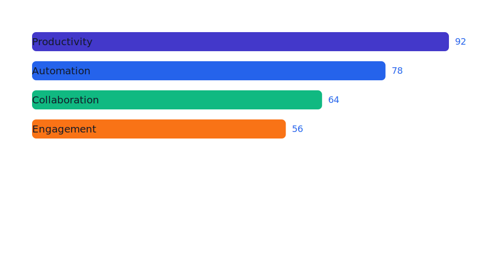
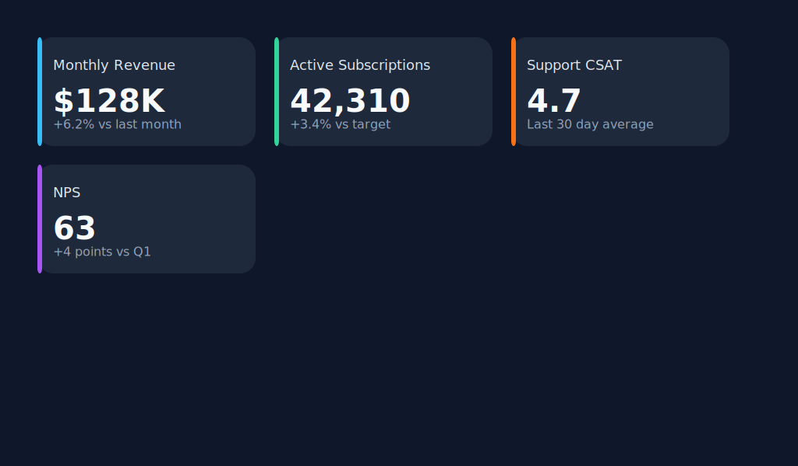
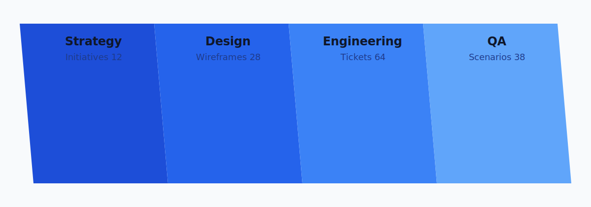
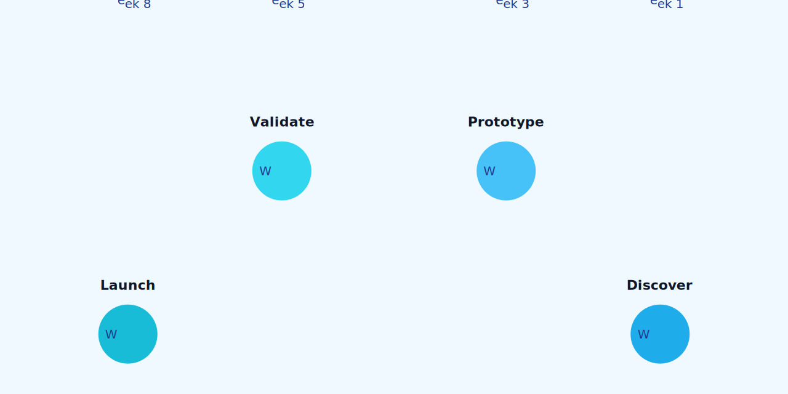
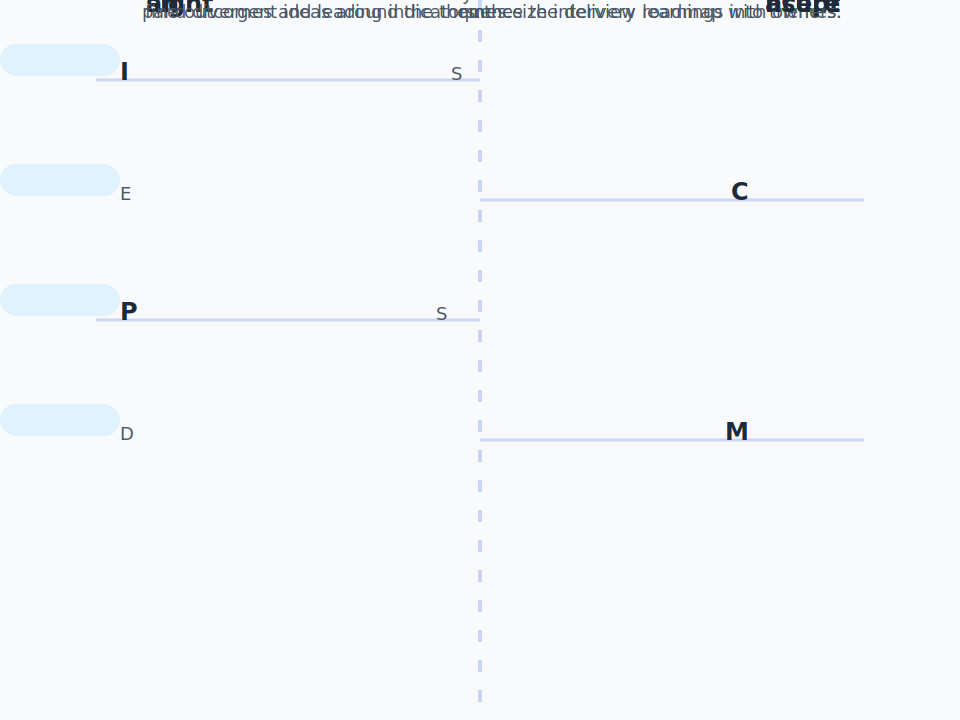
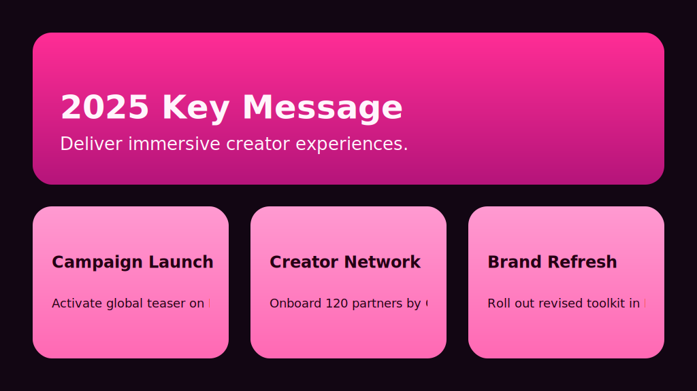

# Infogroove

Infogroove converts declarative template definitions into SVG infographics using
[sympy](https://www.sympy.org/) for formula evaluation and
[svg.py](https://pypi.org/project/svg.py/) for SVG generation.

## Quick Start

Create the virtual environment and install dependencies with uv:

```bash
uv sync
```

Render any of the bundled examples (each lives in its own subdirectory):

```bash
uv run infogroove -f examples/horizontal-bars/def.json -i examples/horizontal-bars/data.json -o examples/horizontal-bars/horizontal-bars.svg
uv run infogroove -f examples/stat-cards/def.json -i examples/stat-cards/data.json -o examples/stat-cards/stat-cards.svg
uv run infogroove -f examples/blue-parallelograms/def.json -i examples/blue-parallelograms/data.json -o examples/blue-parallelograms/blue-parallelograms.svg
uv run infogroove -f examples/arc-circles/def.json -i examples/arc-circles/data.json -o examples/arc-circles/arc-circles.svg
uv run infogroove -f examples/staggered-keywords/def.json -i examples/staggered-keywords/data.json -o examples/staggered-keywords/staggered-keywords.svg
```

Render instantly with uvx (no local install required):

```bash
uvx infogroove -f /path/to/def.json -i /path/to/data.json -o /path/to/output.svg
```

Omit `-o` to print the SVG to stdout:

```bash
uvx infogroove -f /path/to/def.json -i /path/to/data.json > output.svg
```

## Running Tests

Install development dependencies and execute the test suite with pytest:

```bash
uv sync --extra dev
uv run --extra dev pytest
```

To measure coverage locally you can add the ``--cov`` flag:

```bash
uv run --extra dev pytest --cov=infogroove --cov=tests
```

## Example Gallery

| Template | Preview |
| --- | --- |
| Horizontal Bars |  |
| Stat Cards |  |
| Blue Parallelogram Bands |  |
| Arc Circles |  |
| Staggered Keywords |  |
| Key Messages |  |

## Template Overview

A template definition is a JSON document with these top-level keys. The design
aims to keep templates declarative and predictable:

- **Explicit scopes.** Global `properties` establish shared context, while
  element-level `let` blocks create isolated overlays that run after any repeat
  bindings. Values never bleed across scope boundaries unless you intentionally
  rebind them. When `let` bindings reuse a base key, the `let` binding takes
  precedence for dependent expressions.
- **Deterministic evaluation.** Element `let` bindings resolve lazily the first
  time they are referenced. Cycles are detected and reported early, preventing
  runaway recursion and making intent obvious.
- **Composable building blocks.** Elements remain small, nested structures.
  Complex layouts emerge from combining scoped bindings and child trees rather
  than inventing a verbose DSL.

- `properties`: Global assignments evaluated before rendering begins. Provide
  the `canvas` size here (`width`, `height`) along with reusable constants such
  as `palette`, `margin`, or `font_family`. Values are injected into the
  rendering context as-is, so strings like `"Inter, Arial, sans-serif"` remain
  literal.
- `template`: A list of element descriptors. Each descriptor has a `type`,
  optional attribute map, optional `text`, optional `let`, and optional
  `children`. Elements render once unless a `repeat` block is present.
- `schema` (optional): JSON Schema definition for the expected dataset shape.
  Describe the root collection (usually an `array`) as well as nested iterables
  like `values`, `points`, or other custom series so input data can be validated
  before rendering. Templates typically expect the top-level payload to be an
  object (for example `{"items": [...]}`), but you are free to choose any shape
  that satisfies the schema.

Each element may declare its own `let` block. These bindings evaluate against
the current context (including repeat helpers) and the results become available
to the element's attributes and its children.

Evaluation rules for `let` bindings:

- If the string contains `{...}` placeholders, placeholder expansion is used.
- If the string is exactly one placeholder (for example `"{value}"`), the raw
  expression result is returned (number, list, object, etc.).
- Otherwise the string is treated as a full expression and evaluated.
- To force a literal string, wrap it in quotes (for example `"'blue'"`).

The `repeat` block explicitly controls iteration:

```json
{
  "type": "text",
  "repeat": {
    "items": "items",
    "as": "row",
    "let": {
      "row_x": "__index__ * 24"
    }
  },
  "let": {
    "label": "row.label",
    "x": "__index__ * 24"
  },
  "attributes": {"x": "{x}", "y": "40"},
  "text": "{label}"
}
```

- `items` references the collection to iterate (any dotted path resolved via
  the current context, such as `items` or `items[0].points`).
- `as` names the current element. Use the reserved helpers (e.g. `__index__`,
  `__count__`) inside expressions when you need positional data; when the
  iterated item is a mapping, those helpers are also exposed on the alias (for
  example, `row.__index__`).
- `let` inside `repeat` defines per-iteration bindings evaluated before the
  element's own `let` block, allowing shared loop-derived values to be reused.
- Element `let` injects per-iteration bindings scoped to that element.
  Expressions can reference the current item, previously declared loop
  bindings, and globals.

During iteration, Infogroove also injects reserved helpers such as `__index__`,
`__first__`, `__last__`, `__count__`, and `__total__` for convenience.

Placeholder syntax supports both `{path.to.value}` lookups and inline
expressions such as `{__index__ * 10}` or `{canvas.width / 2}`. Attribute and
text values are always strings, so expressions only run inside `{...}`
placeholders. For example, `"width": "1 + 2"` stays literal, while
`"width": "{1 + 2}"` evaluates to `3`.

Expressions are evaluated by `sympy` first and then a restricted AST fallback.
Only a safe subset of Python is permitted; see the template spec for the exact
rules and allowed helpers: [docs/SPEC.md](docs/SPEC.md).

Identifiers are resolved exactly as written. Prefer a consistent casing
convention within datasets and templates to avoid ambiguity.

Randomness is opt-in. To enable random values, provide `random_seed` (or a
custom RNG) under `properties`; expressions can then call `Math.random()` or
`random.random()` for deterministic sequences.

## CLI Options

```
uv run infogroove --help
```

Key flags:

- `-f, --template`: Path to the template definition JSON file (e.g. `def.json`).
- `-i, --input`: JSON file containing an array of data objects.
- `-o, --output`: Destination SVG path or `-` for stdout (default: `-`).

## Programmatic Usage

Infogroove exposes a loader for integrating templates directly into Python
applications:

```python
from infogroove.loader import load

with open("examples/arc-circles/def.json", encoding="utf-8") as fh:
    infographic = load(fh)

data = [{"label": "Alpha", "value": 3}]
svg_markup = infographic.render(data)
```

Prefer `infogroove.loader.load` for file objects and `infogroove.loader.loads`
when the template definition is already in memory as a string. Both helpers
return an `InfogrooveRenderer`, exposing the parsed template via the
`template` property for metadata inspection.

When you already have the JSON structure as a Python mapping, instantiate an
infographic directly with the `Infogroove` factory:

```python
from infogroove import Infogroove

infographic = Infogroove({
    "properties": {
        "canvas": {"width": 200, "height": 40},
        "gap": 10,
    },
    "template": [
        {
            "type": "circle",
            "attributes": {"cx": "{__index__ * gap}", "cy": "20", "r": "5"},
            "repeat": {"items": "data", "as": "item"}
        }
    ],
})

svg_inline = infographic.render([{}] * 10)
```

## Developing Templates

- Keep shared constants (including canvas dimensions) under the top-level
  `properties` block.
- Use `repeat` to make iteration explicit; push derived per-loop values into an
  element's `let` block so they stay scoped to that element.
- Inline expressions handle quick maths (`{__index__ * 10}`) while element
  `let` bindings are ideal for shared or multi-step calculations.
- Let bindings resolve lazily, so the order you declare keys does not matter.
  However, circular definitions (e.g. `total: "max"`, `max: "total"`) will be
  rejected with a clear error. Break cycles by lifting shared calculations into
  a new binding or restructuring the dependency chain.

## Agent Skills (Claude, Codex, Gemini)

This repository includes an Agent Skills package at `skills/create-infogroove` and a
pre-built archive at `skills/create-infogroove.skill`.

Most Agent Skills-compatible assistants (Claude, Codex, Gemini, etc.) support one of
these installation modes:

- **Import the archive**: use the agent's Skills/Extensions UI or CLI to import
  `skills/create-infogroove.skill`.
- **Register the folder**: point the agent's skills path to `./skills` or copy
  `skills/create-infogroove` into the agent's configured skills directory.

After installation, ask the agent to create or update an infographic; it will generate
`def.json`, `data.json`, and a rendered SVG under `./infographics/<name>/` by default.
