# Invar Mermaid Diagrams

These diagrams can be embedded directly in GitHub README (GitHub renders Mermaid natively).

---

## 1. USBV Workflow

```mermaid
flowchart LR
    U[🔍 Understand] --> S[📝 Specify]
    S --> B[🔨 Build]
    B --> V[✓ Validate]

    U -.- u1[Context<br/>Constraints]
    S -.- s1[Contracts<br/>@pre/@post]
    B -.- b1[Implementation<br/>Code]
    V -.- v1[Guard<br/>Verification]
```

---

## 2. Verification Loop (Agent Feedback)

```mermaid
flowchart TD
    A[Agent writes code] --> G[invar guard]
    G --> E{Errors?}
    E -->|Yes| F[Agent fixes]
    F --> G
    E -->|No| D[Done ✓]

    style A fill:#e1f5fe
    style G fill:#fff3e0
    style D fill:#e8f5e9
```



---

## 3. Multi-Layer Verification Pipeline

```mermaid
flowchart LR
    subgraph Static["⚡ Static (~0.5s)"]
        S1[Guard Rules]
    end

    subgraph Runtime["🧪 Runtime (~2s)"]
        R1[Doctests]
    end

    subgraph Property["🎲 Property (~10s)"]
        P1[Hypothesis]
    end

    subgraph Symbolic["🔬 Symbolic (~30s)"]
        SY1[CrossHair]
    end

    S1 --> R1 --> P1 --> SY1

    style Static fill:#e3f2fd
    style Runtime fill:#e8f5e9
    style Property fill:#fff3e0
    style Symbolic fill:#fce4ec
```



---

## 4. Core/Shell Architecture

```mermaid
flowchart TB
    subgraph Shell["🐚 Shell (I/O)"]
        S1[load_config]
        S2[save_result]
        S3[fetch_data]
    end

    subgraph Core["💎 Core (Pure)"]
        C1[parse_config]
        C2[calculate]
        C3[validate]
    end

    Shell --> Core
    Core -.->|Result T,E| Shell

    style Core fill:#e8f5e9
    style Shell fill:#fff3e0
```



---

## 5. Classification Priority

```mermaid
flowchart TD
    F[File] --> P{Pattern Match?}
    P -->|Yes| R1[Classified]
    P -->|No| PA{Path Prefix?}
    PA -->|Yes| R2[Classified]
    PA -->|No| C{Content Analysis?}
    C -->|@pre/@post| CORE[Core]
    C -->|Result type| SHELL[Shell]
    C -->|Neither| UNK[Uncategorized]

    style CORE fill:#e8f5e9
    style SHELL fill:#fff3e0
    style UNK fill:#f5f5f5
```

---

## 6. Skill Routing

```mermaid
flowchart LR
    U[User Message] --> R{Route}
    R -->|"why/explain"| I[/investigate]
    R -->|"compare/should"| P[/propose]
    R -->|"add/fix/implement"| D[/develop]
    D --> V[Guard Check]
    V -->|review_suggested| RV[/review]

    style I fill:#e3f2fd
    style P fill:#fff3e0
    style D fill:#e8f5e9
    style RV fill:#fce4ec
```

---

## 7. Session Protocol

```mermaid
sequenceDiagram
    participant U as User
    participant A as Agent
    participant G as Guard

    U->>A: Task request
    A->>A: ✓ Check-In
    Note right of A: project | branch | status

    A->>A: USBV Workflow
    A->>G: invar guard
    G-->>A: Results

    A->>A: ✓ Final
    Note right of A: guard PASS | 0 errors
    A->>U: Complete
```



---

## 8. Package Architecture

```mermaid
flowchart TB
    subgraph Production["📦 Production"]
        RT[invar-runtime<br/>Apache-2.0]
    end

    subgraph Development["🛠️ Development"]
        TL[invar-tools<br/>GPL-3.0]
    end

    TL -.->|depends on| RT

    subgraph YourProject["Your Project"]
        PP[pyproject.toml]
        PP -->|dependencies| RT
    end

    TL -.->|uvx --from| YourProject

    style Production fill:#e8f5e9
    style Development fill:#fff3e0
    style YourProject fill:#e3f2fd
```



---

## Integration Example

To use in README.md, simply paste the Mermaid code blocks directly:

````markdown
## Workflow


````

GitHub will render this automatically. No images needed!
