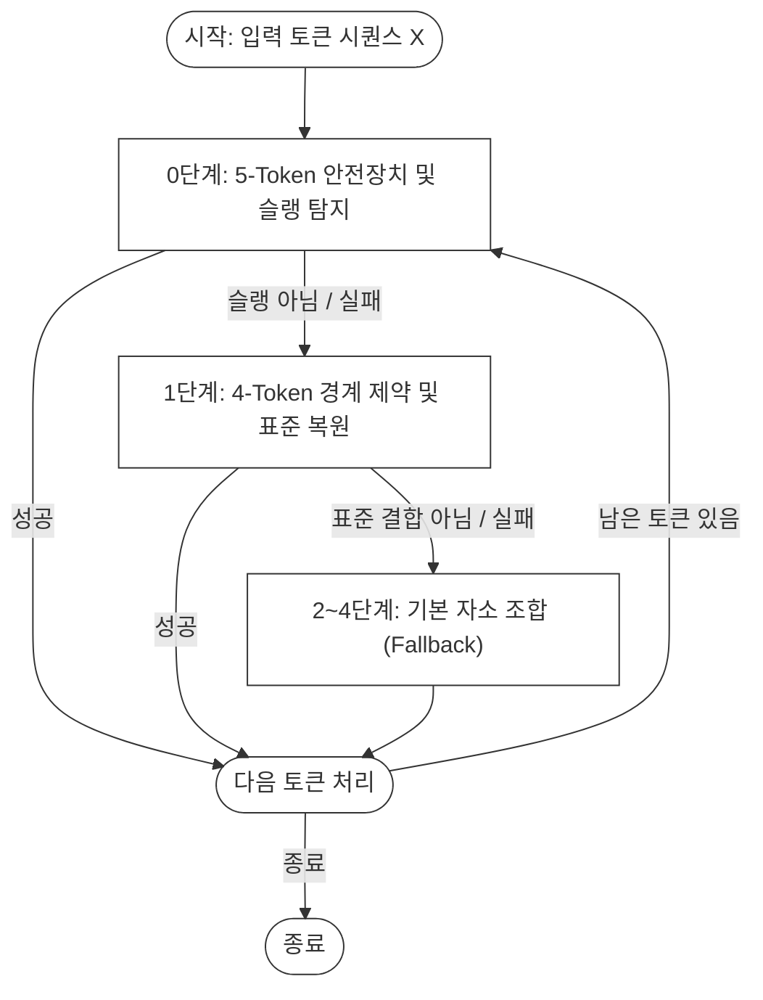
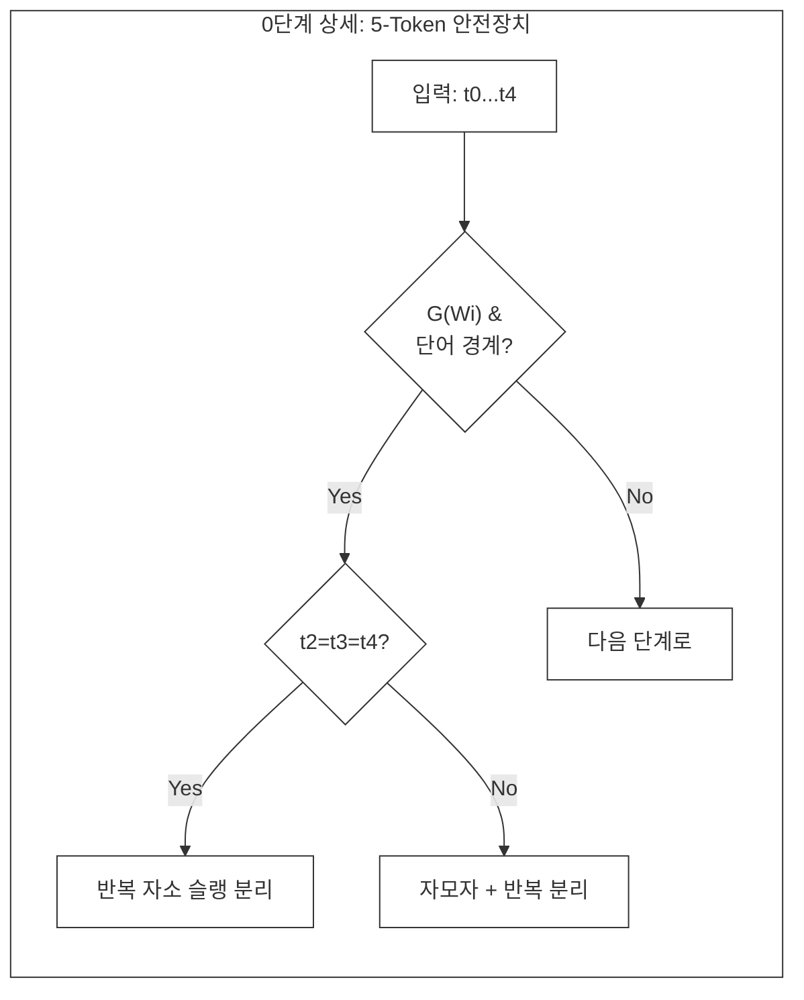
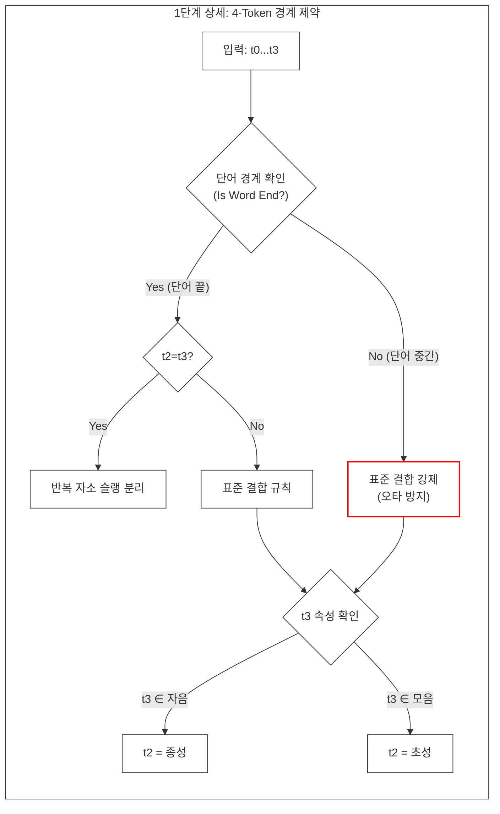

# jaso-jamo

[](https://www.python.org/)
[](https://pypi.org/project/jaso-jamo/)
[](LICENSE)

한글 자소 분리 및 복원 라이브러리 (5단계 Fallback 방식)

## 개요

`jaso-jamo`는 한글을 자소(초성, 중성, 종성)로 분리한 이후 다시 완벽하게 복원하기 위한 Python 라이브러리입니다.
자음과 모음의 특성을 기반으로 한 **5단계 Fallback 방식**을 적용하여 높은 정확도를 제공합니다.

## 특징

- **높은 정확도**: 자음/모음 특성 기반 복원 알고리즘 (100% 정확도)
- **실용적 성능**: O(1) 딕셔너리 조회 최적화
- **간단한 API**: 2개의 메인 함수로 모든 기능 제공
- **의존성 없음**: 순수 Python 구현
- **유니코드 표준**: 완벽한 한글 유니코드 지원
- **반복 자소 슬랭 처리**: "ㅋㅋㅋ", "ㅎㅎㅎ" 등 실제 채팅 언어 대응

## 설치

```bash
pip install jaso-jamo
```

또는 개발 모드로 설치:

```bash
git clone https://github.com/c0z0c/jaso-jamo.git
cd jaso-jamo
pip install -e .
```

### 기본 사용

```python
from jaso_jamo import tokenize, detokenize

# 자소 분리
text = "안녕하세요"
tokens = tokenize(text)
print(tokens)
# ['ㅇ', 'ㅏ', 'ㄴ', 'ㄴ', 'ㅕ', 'ㅇ', 'ㅎ', 'ㅏ', 'ㅅ', 'ㅔ', 'ㅇ', 'ㅛ']

# 자소 복원
restored = detokenize(tokens)
print(restored)  # "안녕하세요"
```

## 사용 예시

### 예시 1: 기본 단어

```python
from jaso_jamo import tokenize, detokenize

text = "한글"
tokens = tokenize(text)      # ['ㅎ', 'ㅏ', 'ㄴ', 'ㄱ', 'ㅡ', 'ㄹ']
restored = detokenize(tokens) # "한글"
```

### 예시 2: 반복 자소 슬랭 처리 (핵심 차별화 기능)

```python
text = "가요ㅋㅋㅋ"
tokens = tokenize(text)      # ['ㄱ', 'ㅏ', 'ㅇ', 'ㅛ', 'ㅋ', 'ㅋ', 'ㅋ']
restored = detokenize(tokens) # "가요ㅋㅋㅋ"
```

### 예시 3: 한영 혼용

```python
text = "Python으로 개발했어요"
tokens = tokenize(text)
restored = detokenize(tokens) # "Python으로 개발했어요"
```

## 동작 원리

### 자소 복원 (Detokenization) - 5단계 Fallback

자음과 모음의 특성을 기반으로 최적의 조합을 찾습니다:

1. **5개 패턴** (자모ㅋㅋㅋ) - 반복 자소 슬랭 처리
2. **4개 패턴** (자모자자) - Lookahead 최적화
3. **3개 패턴** (자모자) - 초중종 조합
4. **2개 패턴** (자모) - 초중 조합
5. **개별 토큰 유지** - 조합 불가능 시

## 성능

### 벤치마크 결과 (27개 샘플)

| 방식 | 정확도 | 에러 수 |
|------|--------|---------|
| **제안 방식 (5단계 Fallback)** | **100.00%** | **0개** |
| Greedy 방식 (기준선) | 48.15% | 14개 |
| unicodedata (표준) | 14.81% | 23개 |

**개선율**: +51.85%p (vs Greedy 방식)

상세 벤치마크 결과는 [`report/`](report/) 폴더를 참조하세요.

---

## 🧪 테스트

### 기본 테스트 실행

```bash
# 기본 기능 테스트
python tests/test_basic.py

# 엣지 케이스 테스트
python tests/test_edge_cases.py

# 벤치마크 실행
python benchmarks/run_benchmark.py
```

### 테스트 결과

- **기본 단어**: 5/5 (100%)
- **종성**: 17/17 (100%)
- **긴 문장**: 6/6 (100%)
- **반복 자소 슬랭**: 8/8 (100%)
- **한영 혼용**: 6/6 (100%)
- **특수문자**: 7/7 (100%)
- **복잡한 종성**: 12/12 (100%)

**전체: 40/40 (100.00%)**

## 프로젝트 구조

```text
jaso-jamo/
├── jaso_jamo/                # 핵심 라이브러리
│   ├── __init__.py          # 패키지 초기화
│   ├── core.py              # 핵심 알고리즘
│   ├── JasoJamoTokenizer.py # 토크나이저
│   └── JasoJamoDecoder.py   # 디코더
├── tests/                    # 테스트 코드
│   ├── test_basic.py        # 기본 기능 테스트
│   ├── test_edge_cases.py   # 엣지 케이스 테스트
│   ├── test_jongseong.py    # 종성 테스트
│   └── test_slang_boundary.py # 슬랭 경계 테스트
├── benchmarks/               # 벤치마크 시스템
│   ├── baseline_libraries.py # 기존 라이브러리 구현
│   └── run_benchmark.py     # 벤치마크 실행
├── report/                   # 벤치마크 리포트
├── article/                  # 논문/문서
├── pyproject.toml           # 패키지 설정 (PEP 621)
├── MANIFEST.in              # 패키지 파일 목록
├── LICENSE                  # MIT 라이센스
└── README.md                # 이 문서
```

## 자모 복원 알고리즘 흐름도



**Figure 1.** 제안하는 다중 토큰 선행 탐색 알고리즘의 결정 흐름도 (Decision Flowchart of the Proposed Multi-Token Lookahead Algorithm). 0단계는 5-token 안전장치를 통해 반복 자소 슬랭을 우선 처리하고, 1단계는 단어 경계 제약을 적용하여 표준 결합 또는 슬랭 분리를 결정하며, 2~4단계는 기본 자소 조합 규칙을 순차적으로 적용하는 Fallback 구조를 나타낸다.



**Figure 2.** 0단계 안전장치의 상세 처리 흐름 (Detailed Processing Flow of Step 0 Safety Guard). 안전장치 함수 $G(W_i)$와 단어 경계 조건을 만족할 경우, $t_2, t_3, t_4$의 동일성 여부에 따라 반복 자소 슬랭 분리 또는 자모자 조합 후 반복 분리를 수행한다.



## API 문서

### 함수

#### `tokenize(text: str) -> List[str]`

한글 텍스트를 자소로 분리합니다.

```python
>>> from jaso_jamo import tokenize
>>> tokenize("한글")
['ㅎ', 'ㅏ', 'ㄴ', 'ㄱ', 'ㅡ', 'ㄹ']
```

#### `detokenize(tokens: List[str]) -> str`

자소 토큰을 한글 텍스트로 복원합니다.

```python
>>> from jaso_jamo import detokenize
>>> detokenize(['ㅎ', 'ㅏ', 'ㄴ', 'ㄱ', 'ㅡ', 'ㄹ'])
'한글'
```

## 기여

이슈와 풀 리퀘스트는 언제나 환영합니다!

### 기여 방법

1. 저장소를 Fork합니다
2. Feature 브랜치를 생성합니다 (`git checkout -b feature/AmazingFeature`)
3. 변경사항을 커밋합니다 (`git commit -m 'Add some AmazingFeature'`)
4. 브랜치에 Push합니다 (`git push origin feature/AmazingFeature`)
5. Pull Request를 생성합니다

### 기여 가이드라인

- 코드 스타일: PEP 8 준수 (Black, isort 사용)
- 테스트: 새 기능에는 테스트 추가
- 문서: 변경사항은 README에 반영
- 커밋 메시지: 명확하고 간결하게 작성

---

## 📝 라이센스

### 코드 라이센스

MIT License - 본 프로젝트의 코드는 자유롭게 사용하실 수 있습니다.

### 데이터 라이센스

본 프로젝트에서 사용된 벤치마크 및 테스트 데이터는 **AI허브 - 일상생활 및 구체어 말뭉치 데이터**를 활용하였습니다.

- **제공기관**: 한국지능정보사회진흥원 (NIA)
- **출처**: [AI허브 (aihub.or.kr)](https://www.aihub.or.kr/)
- **이용약관**: AI허브 이용약관 준수 필요

```text
본 프로젝트는 과학기술정보통신부 및 한국지능정보사회진흥원의
'AI허브 - 일상생활 및 구체어 말뭉치 데이터'를 활용하였습니다.
```

자세한 데이터 라이센스 정보는 [DATA_LICENSE.md](DATA_LICENSE.md)를 참조하세요.

## 개발 배경

한글을 자소 분리한 이후 다시 복원하기 위한 로직입니다.
많은 사람들이 편하게 사용하였으면 좋겠습니다.
자음과 모음의 원리를 적용하여 개발하였습니다.

개발일: 2025년 10월 17일

## 참고 자료

- [한글 유니코드 표준](https://www.unicode.org/charts/PDF/UAC00.pdf)
- [한글 자모 이해하기](https://ko.wikipedia.org/wiki/한글_자모)
- [벤치마크 리포트](report/)

