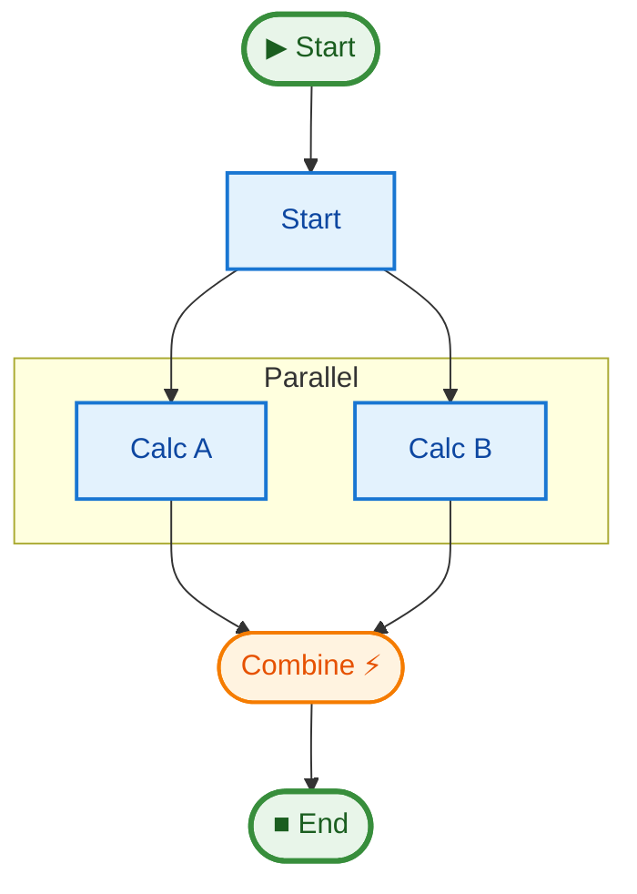

# 02 Parallel DAG (Static Fan-out/Fan-in)

This example demonstrates how to execute multiple steps in parallel and synchronize them using an implicit barrier.

## Key Concepts

1.  **Static Fan-out**: Defining multiple `to` targets in a step (`to=["step_a", "step_b"]`).
2.  **Implicit Barrier Synchronization**: A step that is targeted by multiple preceding steps (like `combine`) will wait for all of them to complete before executing.
3.  **Shared State**: Both parallel branches can safely modify the state (if using different fields) or read from it.

## How to Run

```bash
uv run python examples/02_parallel_dag/main.py
```

## Expected Output

```text
Starting parallel calculations for input: 10
Branch A finished: 20
Branch B finished: 32
Combined result: 52
>>> Result: 52
Graph saved to .../pipeline.mmd
```

## Pipeline Graph


