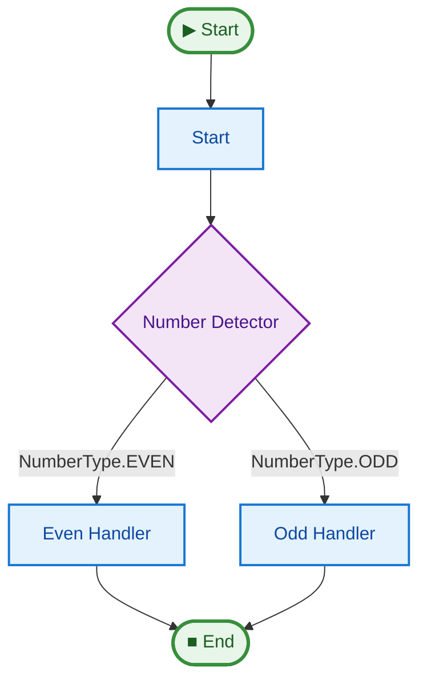

# 04 Dynamic Routing (Switch)

This example demonstrates how to use the `@pipe.switch` decorator to route execution based on the return value of a step.

## Key Concepts

1.  **Declarative Routing**: Use `@pipe.switch` to map return values to step names (or functions).
2.  **`routes` parameter**: A dictionary mapping values (e.g., `EVEN`/`ODD`, strings, bools, enums) to target steps.
3.  **Callable Routes**: You can also pass a function to `routes` for more complex logic (`routes=lambda x: ...`).
4.  **Branching**: Creating multiple paths in your graph that are only executed under certain conditions.

## How to Run

```bash
uv run python examples/04_dynamic_routing/main.py
```

## Expected Output

```text
--- Running with Even Value (10) ---
Checking value: 10
Routing to: even_handler
Final Value: 20
Message: Value was even, so we doubled it.

--- Running with Odd Value (7) ---
Checking value: 7
Routing to: odd_handler
Final Value: 8
Message: Value was odd, so we incremented it.
```

## Pipeline Graph

